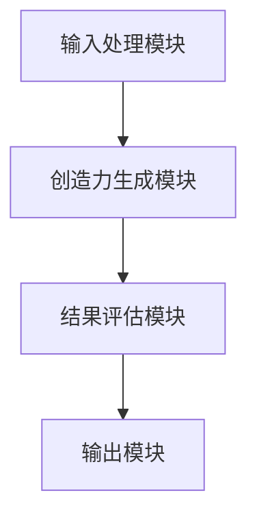

                 


# 构建具有创造力的AI Agent

## 关键词：AI Agent, 创造力, 人工智能, 系统架构, 算法设计

## 摘要：本文深入探讨了如何构建具有创造力的AI Agent，从基础概念到系统架构，再到实际项目案例，全面解析了创造力在AI Agent中的实现方法。

---

# 第1章 引言

## 1.1 AI Agent的基本概念

### 1.1.1 什么是AI Agent？
AI Agent（智能体）是能够感知环境并采取行动以实现目标的实体。它可以是一个软件程序，也可以是物理机器人。

### 1.1.2 AI Agent的分类
- **简单反射型**：基于当前输入做出反应，如自动门。
- **基于模型的反应型**：使用内部模型来处理输入，如自动驾驶汽车。
- **目标驱动型**：根据目标选择行动，如任务执行机器人。
- **效用驱动型**：追求效用函数的最大化，如智能助手。

## 1.2 创造力的重要性

### 1.2.1 创造力的定义
创造力是指产生新颖且有用的想法或解决方案的能力。

### 1.2.2 创造力在AI Agent中的应用
- 创意写作助手生成独特的故事。
- 程序生成器创造新的代码结构。
- 设计工具生成独特的视觉内容。

## 1.3 AI Agent的发展趋势
- **从工具性AI到创造性AI**：AI Agent不仅执行任务，还能创新。
- **人机协作**：AI Agent与人类协同工作，提升整体创造力。

---

# 第2章 AI Agent的核心原理

## 2.1 知识表示与推理

### 2.1.1 知识表示方法
- **符号逻辑**：使用规则和逻辑表达式表示知识。
- **语义网络**：通过节点和边表示概念及其关系。

### 2.1.2 推理机制
- **逻辑推理**：从前提中推导结论。
- **概率推理**：处理不确定性，如贝叶斯网络。

## 2.2 行为决策与规划

### 2.2.1 行为决策
- **基于条件的决策**：根据当前状态选择行动。
- **基于目标的决策**：规划行动以实现目标。

### 2.2.2 规划算法
- **贪心算法**：逐步选择最优局部解。
- **A*算法**：通过优先队列搜索最短路径。

## 2.3 创造力的实现机制

### 2.3.1 创造力层次模型
- **输入处理层**：接收外界信息。
- **生成层**：产生创意。
- **评估层**：优化和筛选创意。

### 2.3.2 创造性思维模拟
- **联想思维**：产生关联想法。
- **逆向思维**：从结果推导原因。

---

# 第3章 创造力模型与算法

## 3.1 创造力模型的分类

### 3.1.1 基于生成模型
- **生成对抗网络（GAN）**：生成器和判别器相互对抗生成创意内容。
- **变体自编码器（VAE）**：通过重构损失生成多样化的数据。

### 3.1.2 基于搜索算法
- **启发式搜索**：如A*算法，使用启发函数指导搜索方向。

## 3.2 基于生成模型的创造力

### 3.2.1 生成模型的原理
- **GPT模型**：通过大量数据学习语言模型，生成创意文本。
- **Diffusion模型**：逐步生成高质量图像，通过扩散过程引入噪声并逐步去除。

## 3.3 基于搜索算法的创造力

### 3.3.1 搜索算法的原理
- **A*算法**：使用优先队列搜索，优先探索最有希望的节点。

---

# 第4章 系统架构与设计

## 4.1 系统模块划分

### 4.1.1 输入处理模块
- **数据接收**：接收外界输入，如用户指令或环境数据。
- **数据预处理**：清洗和转换数据，确保系统理解。

### 4.1.2 创造力生成模块
- **模型调用**：调用生成模型或搜索算法生成创意。
- **结果处理**：处理模型输出，确保符合预期格式。

### 4.1.3 结果评估模块
- **质量评估**：评估创意的有用性和新颖性。
- **优化调整**：根据评估结果优化生成过程。

## 4.2 系统架构设计

### 4.2.1 系统架构图


---

# 第5章 项目实战

## 5.1 环境搭建

### 5.1.1 安装依赖
- **Python**：3.8+
- **深度学习框架**：如TensorFlow或PyTorch
- **自然语言处理库**：如Hugging Face的库

## 5.2 核心实现

### 5.2.1 生成模型实现
```python
import torch
from torch import nn

class Generator(nn.Module):
    def __init__(self, z_dim, hidden_dim):
        super().__init__()
        self.fc = nn.Linear(z_dim, hidden_dim)
        self.act = nn.ReLU()

    def forward(self, z):
        return self.act(self.fc(z))
```

### 5.2.2 搜索算法实现
```python
import heapq

def a_star_search(start, goal, h):
    open_set = set([start])
    came_from = {}
    g_score = {start:0}
    f_score = {start: h(start, goal)}
    
    while open_set:
        current = heapq.heappop(open_set, key=lambda x: f_score[x])
        if current == goal:
            break
        for neighbor in neighbors(current):
            tentative_g_score = g_score[current] + cost(current, neighbor)
            if neighbor not in g_score or tentative_g_score < g_score[neighbor]:
                came_from[neighbor] = current
                g_score[neighbor] = tentative_g_score
                f_score[neighbor] = g_score[neighbor] + h(neighbor, goal)
                heapq.heappush(open_set, neighbor)
    return came_from
```

---

# 第6章 总结与展望

## 6.1 总结
- 本文详细探讨了如何构建具有创造力的AI Agent，从理论到实践，提供了全面的指导。
- 创造力模型与算法、系统架构设计是实现的关键。

## 6.2 展望
- **多模态创造力**：结合视觉、听觉等多种感知方式，提升创造力的多样性。
- **实时创造力**：提高创造力生成的实时性，适用于更多应用场景。

---

# 作者：AI天才研究院 & 禅与计算机程序设计艺术

---

通过以上目录大纲，我将确保文章内容详实，结构清晰，涵盖从理论到实践的各个方面，帮助读者系统地理解如何构建具有创造力的AI Agent。

