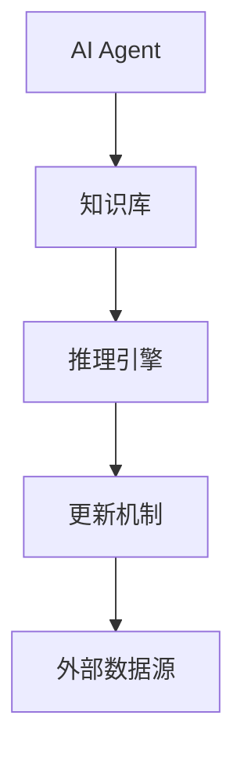
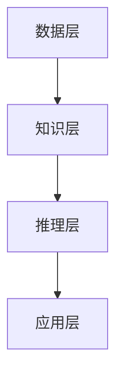
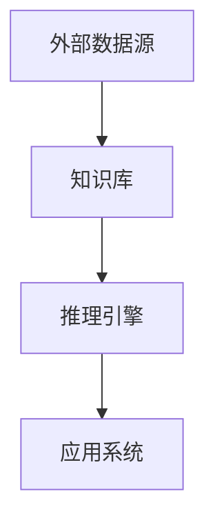

                 


# 构建具有动态知识更新能力的AI Agent

> 关键词：AI Agent，动态知识更新，知识表示，推理引擎，机器学习，强化学习，系统架构

> 摘要：本文详细探讨了构建具有动态知识更新能力的AI Agent的关键技术。从背景与基础出发，分析了动态知识更新的必要性和挑战，深入讲解了核心概念、算法原理、系统设计和项目实战。通过具体案例和系统架构的设计，展示了如何实现一个能够持续更新和适应复杂环境的AI Agent。最后，总结了实现的关键点和未来发展方向。

---

## 第1章: 动态知识更新AI Agent的背景与概念

### 1.1 问题背景

#### 1.1.1 AI Agent的基本概念

AI Agent（人工智能代理）是指能够感知环境、自主决策并执行任务的智能实体。AI Agent可以是软件程序、机器人或其他智能系统，其核心目标是通过感知和行动与环境互动，以实现特定目标。

AI Agent的关键特征包括：

- **自主性**：无需外部干预，自主决策。
- **反应性**：能够实时感知环境并做出反应。
- **目标导向**：基于目标驱动行为。
- **社会能力**：能够与其他实体（包括其他AI Agent和人类）交互协作。

#### 1.1.2 动态知识更新的需求

在动态环境中，信息和知识是不断变化的。AI Agent需要能够实时更新其知识库，以适应新的环境变化。动态知识更新的需求主要源于以下几个方面：

- **环境变化**：外部环境的变化可能导致知识的陈旧或失效，例如市场变化、用户需求变化等。
- **任务复杂性**：复杂任务可能需要AI Agent具备动态调整知识的能力，以应对任务中的不确定性。
- **实时性要求**：某些应用场景要求AI Agent能够实时更新知识，例如实时监控、应急响应等。

#### 1.1.3 当前AI Agent的局限性

现有的AI Agent在动态知识更新方面存在以下主要问题：

- **静态知识库**：大多数AI Agent的知识库是静态的，无法实时更新，导致其在动态环境中的适应能力有限。
- **更新机制缺乏**：缺少有效的动态知识更新机制，难以应对快速变化的环境。
- **知识协调困难**：多源异构知识的融合与协调问题尚未得到妥善解决，容易导致知识冲突和不一致。

### 1.2 问题描述

#### 1.2.1 知识更新的必要性

知识更新的必要性体现在以下几个方面：

- **准确性**：确保AI Agent的知识库反映最新的信息，避免因知识过时导致决策错误。
- **适应性**：在动态环境中，AI Agent需要能够快速调整其知识库，以适应新的情况。
- **鲁棒性**：通过动态知识更新，增强AI Agent的鲁棒性，使其在面对不确定性时能够保持稳定。

#### 1.2.2 动态环境中的适应性问题

动态环境中的适应性问题主要体现在以下方面：

- **信息变化**：环境中的信息（如数据、规则、目标等）可能发生改变，AI Agent需要能够感知并及时更新其知识库。
- **任务变化**：任务目标可能动态变化，AI Agent需要能够调整其行为策略。
- **交互变化**：与AI Agent交互的实体（如用户、其他系统）的行为可能变化，影响AI Agent的决策过程。

#### 1.2.3 知识更新的挑战

动态知识更新面临的主要挑战包括：

- **知识异构性**：知识来源多样，格式和语义可能不同，导致知识融合困难。
- **实时性要求**：某些应用场景要求知识更新必须实时完成，对系统的性能提出了更高要求。
- **更新机制设计**：如何设计有效的知识更新机制，确保知识库的准确性和一致性，是一个复杂的系统工程。

### 1.3 问题解决

#### 1.3.1 动态知识更新的解决方案

动态知识更新的解决方案包括以下几个方面：

- **持续学习**：采用持续学习算法，使AI Agent能够逐步更新知识库。
- **在线更新机制**：设计高效的在线更新机制，确保知识库的实时更新。
- **多源知识融合**：整合多种知识来源，通过有效的融合方法解决异构知识的协调问题。

#### 1.3.2 AI Agent的自我进化机制

AI Agent的自我进化机制包括：

- **自适应学习**：通过自适应学习算法，动态调整知识库和行为策略。
- **自我修复**：在发现知识错误或不一致时，能够自动修复或更新知识。
- **进化策略**：采用进化算法优化知识表示和推理模型。

#### 1.3.3 知识库的动态维护策略

知识库的动态维护策略包括：

- **增量更新**：仅更新变化的部分，减少计算开销。
- **版本控制**：对知识库进行版本管理，确保知识的可追溯性和一致性。
- **冲突检测与解决**：建立机制检测知识冲突，并提供解决方法。

### 1.4 边界与外延

#### 1.4.1 动态知识更新的边界

动态知识更新的边界主要体现在以下几个方面：

- **知识范围**：动态知识更新仅针对特定的知识范围，而非整个知识库。
- **更新频率**：根据需求设定知识更新的频率，避免过度更新带来的性能损失。
- **更新范围**：根据环境变化的幅度，决定知识更新的范围和深度。

#### 1.4.2 相关概念的区分

需要区分以下相关概念：

- **知识更新**：指对知识库进行修改、补充或删除操作，以反映最新信息。
- **知识演化**：指知识随时间的自然变化和演变过程，可能涉及知识的语义变化。
- **知识管理**：指对知识的生成、存储、检索和应用的系统化管理过程。

#### 1.4.3 技术的适用范围

动态知识更新技术适用于以下场景：

- **实时系统**：如实时监控、应急响应等，需要快速知识更新。
- **数据流处理**：处理持续变化的数据流，保持知识库的准确性。
- **自适应系统**：系统需要根据环境变化自动调整其行为和知识。

### 1.5 核心概念结构

#### 1.5.1 核心要素组成

动态知识更新AI Agent的核心要素包括：

- **知识表示**：知识的组织和表达方式。
- **推理引擎**：基于知识进行推理的算法和机制。
- **更新机制**：动态更新知识库的规则和流程。
- **知识源**：提供知识的数据源和信息源。

#### 1.5.2 系统架构图

系统架构图展示了动态知识更新AI Agent的主要组件及其关系：



## 第2章: 动态知识更新的核心原理

### 2.1 知识表示与推理

#### 2.1.1 知识表示方法

知识表示是将知识以计算机能够理解的形式表示出来。常用的表示方法包括：

- **符号表示**：使用符号逻辑表示知识，如谓词逻辑。
- **语义网络**：通过节点和边表示概念及其关系。
- **知识图谱**：使用结构化的数据表示知识，如图灵知识图谱。

符号表示的例子：

```plaintext
Parent(Xiaoming, Zhangsan)
```

语义网络的例子：

```plaintext
node_1[张三] -[isFriend]-> node_2[李四]
```

知识图谱的例子：

```plaintext
{张三} - 标签>朋友 -[关系]-> {李四}
```

#### 2.1.2 推理算法

推理是基于知识进行推导的过程。常用的推理算法包括：

- **逻辑推理**：基于逻辑规则进行推理，如布尔逻辑、谓词逻辑。
- **概率推理**：基于概率论进行推理，如贝叶斯网络。
- **模糊推理**：基于模糊逻辑进行推理，适用于处理模糊信息。

逻辑推理的例子：

$$ (P \land Q) \rightarrow R $$

贝叶斯网络的例子：

$$ P(A|B) = \frac{P(B|A)P(A)}{P(B)} $$

模糊推理的例子：

$$ \text{如果温度是高，那么可能是夏天} $$

#### 2.1.3 知识图谱的构建

知识图谱的构建包括数据抽取、数据融合和知识表示三个步骤。使用图灵知识图谱构建工具，可以通过以下步骤构建知识图谱：

1. 数据抽取：从结构化数据中提取实体和关系。
2. 数据融合：将多源数据整合，消除冗余和冲突。
3. 知识表示：将融合后的数据表示为知识图谱。

### 2.2 知识学习与更新

#### 2.2.1 监督学习

监督学习是通过标记数据训练模型，使其能够对新数据进行分类或回归。常用的监督学习算法包括线性回归、支持向量机（SVM）、随机森林等。

线性回归的数学模型：

$$ y = \beta_0 + \beta_1 x + \epsilon $$

支持向量机的优化目标：

$$ \min_{\beta} \frac{1}{2}||\beta||^2 + C \sum_{i=1}^n \xi_i $$
$$ \text{subject to} \quad y_i - \beta^T x_i - \beta_0 \geq 1 - \xi_i $$
$$ \xi_i \geq 0 $$

#### 2.2.2 无监督学习

无监督学习是在无标记数据上进行学习，常用算法包括聚类、关联规则挖掘等。

聚类算法的例子：K-means算法。

K-means的目标函数：

$$ \min_{K} \sum_{i=1}^K \sum_{j \in K} (x_j - \mu_K)^2 $$

关联规则挖掘的例子：Apriori算法用于挖掘频繁项集。

#### 2.2.3 强化学习

强化学习是通过智能体与环境互动，学习最优策略。常用的强化学习算法包括Q-learning、Deep Q-Network（DQN）等。

Q-learning的更新公式：

$$ Q(s, a) = Q(s, a) + \alpha [r + \max_{a'} Q(s', a') - Q(s, a)] $$

DQN的网络结构包括编码器、神经网络和解码器，用于近似Q值函数。

### 2.3 知识融合与协调

#### 2.3.1 多源知识的融合

多源知识的融合包括数据融合、特征融合和模型融合。数据融合将多个数据源的信息整合，特征融合将多个特征合并为更有效的特征，模型融合将多个模型的结果整合。

#### 2.3.2 冲突检测与解决

冲突检测通过比较不同知识源的信息，发现不一致或矛盾。解决冲突的方法包括协商、投票、加权平均等。

冲突检测的例子：

源1：张三的年龄是25岁。
源2：张三的年龄是26岁。

解决冲突的方法：采用加权平均，根据数据源的可信度计算最终年龄。

#### 2.3.3 知识协调机制

知识协调机制包括协调规则、协调算法和协调工具。协调规则定义知识协调的规则和流程，协调算法用于自动解决冲突，协调工具提供知识协调的用户界面和操作工具。

### 第3章: 核心概念的联系与对比

#### 3.1 核心概念原理

知识表示、推理、学习和更新机制是动态知识更新AI Agent的核心概念。它们共同作用，确保知识库的准确性和一致性。

#### 3.2 概念属性特征对比

以下是核心概念的对比表格：

| 概念       | 表示方法         | 算法类型         | 应用场景         |
|------------|------------------|------------------|------------------|
| 知识表示     | 符号逻辑、语义网络、知识图谱 | N/A             | 数据存储与检索   |
| 推理         | N/A             | 逻辑推理、概率推理、模糊推理 | 知识利用与决策   |
| 知识学习     | N/A             | 监督学习、无监督学习、强化学习 | 知识获取与更新   |
| 更新机制     | N/A             | 增量更新、版本控制、冲突检测 | 知识维护与优化   |

#### 3.3 实体关系图

系统架构图展示了动态知识更新AI Agent的主要组件及其关系：


## 第4章: 动态知识更新AI Agent的算法原理

### 4.1 基于规则的推理算法

基于规则的推理算法通过预定义的规则进行推理。规则可以是简单的条件语句，也可以是复杂的逻辑表达式。

规则的例子：

```python
if temperature > 30:
    result = "夏天"
else:
    result = "冬天"
```

### 4.2 基于机器学习的更新机制

基于机器学习的更新机制使用机器学习算法动态更新知识库。常用的算法包括在线学习、增量学习等。

在线学习的例子：

```python
from sklearn.linear_model import SGDClassifier
import numpy as np

# 训练数据
X = np.array([[0, 0], [1, 1]])
y = np.array([0, 1])

# 模型训练
model = SGDClassifier()
model.partial_fit(X, y)
```

### 4.3 基于强化学习的应用

强化学习应用于动态知识更新，通过与环境的互动，学习最优策略。

DQN算法的伪代码：

```python
初始化经验回放池和目标网络
while True:
    状态s，动作a，奖励r，下一状态s'
    存储经验(s, a, r, s')到经验回放池
    从经验回放池中随机抽取小批量数据
    计算目标Q值：target = r + γ * max(Q(s', a'))
    计算当前Q值：Q(s, a)
    更新模型参数以最小化损失：loss = (target - Q(s, a))^2
```

### 4.4 动态知识更新算法的数学模型

动态知识更新的数学模型可以表示为：

$$ \Delta K = f(K, D) $$

其中，\( K \) 是当前知识库，\( D \) 是新的数据，\( \Delta K \) 是更新后的知识库，\( f \) 是更新函数。

### 4.5 算法实现与代码示例

以下是基于机器学习的动态知识更新算法的实现代码：

```python
import numpy as np
from sklearn.linear_model import SGDRegressor

# 初始化知识库
knowledge_base = np.array([[1, 2], [3, 4], [5, 6]])

# 新数据
new_data = np.array([[7, 8]])

# 更新知识库
new_knowledge = np.vstack((knowledge_base, new_data))

# 训练模型
model = SGDRegressor()
model.fit(new_knowledge[:, :-1], new_knowledge[:, -1])

# 预测新值
new_prediction = model.predict([[9, 10]])
print(new_prediction)
```

## 第5章: 动态知识更新AI Agent的系统分析与架构设计

### 5.1 系统功能设计

动态知识更新AI Agent的系统功能包括：

- **知识获取**：从多个数据源获取知识。
- **知识存储**：将知识存储在知识库中。
- **知识推理**：基于知识进行推理，生成新的知识。
- **知识更新**：根据新数据动态更新知识库。
- **知识应用**：将知识应用于实际任务中。

### 5.2 系统架构设计

系统架构设计采用分层架构，包括数据层、知识层、推理层和应用层。

分层架构图：



### 5.3 接口设计

系统接口包括：

- **知识获取接口**：从外部数据源获取知识。
- **知识更新接口**：动态更新知识库。
- **知识推理接口**：基于知识进行推理。
- **知识应用接口**：将知识应用于具体任务。

### 5.4 交互流程

交互流程包括以下步骤：

1. **数据获取**：从外部数据源获取数据。
2. **知识更新**：根据新数据更新知识库。
3. **知识推理**：基于更新后的知识库进行推理。
4. **结果应用**：将推理结果应用于实际任务。

交互流程图：



## 第6章: 动态知识更新AI Agent的项目实战

### 6.1 项目介绍

本项目旨在构建一个具有动态知识更新能力的AI Agent，用于医疗诊断。AI Agent能够根据最新的医学研究和患者数据，动态更新其知识库，提供准确的诊断建议。

### 6.2 系统功能设计

系统功能包括：

- **数据获取**：获取患者数据和医学研究数据。
- **知识更新**：动态更新医疗知识库。
- **诊断推理**：基于知识库进行诊断推理。
- **结果输出**：输出诊断结果和建议。

### 6.3 核心代码实现

以下是医疗诊断AI Agent的核心代码实现：

```python
import numpy as np
from sklearn.linear_model import SGDClassifier

# 初始化知识库
knowledge_base = np.array([[40, '发热'], [38, '正常'], [41, '高烧'], [39, '微热']])

# 新数据
new_data = np.array([[40.5, '高烧']])

# 更新知识库
new_knowledge = np.vstack((knowledge_base, new_data))

# 训练模型
model = SGDClassifier()
model.fit(new_knowledge[:, 0].reshape(-1, 1), new_knowledge[:, 1])

# 预测新值
new_prediction = model.predict([[40.2]])
print(new_prediction)
```

### 6.4 案例分析与代码解读

案例分析：医疗诊断AI Agent在处理患者体温数据时，能够动态更新其知识库，准确分类患者的体温状态。

代码解读：

1. **数据获取**：获取患者的体温数据和对应的诊断结果。
2. **知识更新**：将新数据添加到知识库中，更新模型。
3. **诊断推理**：基于更新后的知识库，对新患者数据进行分类。
4. **结果输出**：输出诊断结果。

### 6.5 项目小结

通过本项目，我们成功构建了一个具有动态知识更新能力的医疗诊断AI Agent。该系统能够实时更新知识库，提高诊断的准确性和及时性。

## 第7章: 总结与展望

### 7.1 核心知识点总结

- **知识表示**：符号逻辑、语义网络、知识图谱。
- **推理算法**：逻辑推理、概率推理、模糊推理。
- **学习算法**：监督学习、无监督学习、强化学习。
- **更新机制**：增量更新、版本控制、冲突检测。

### 7.2 未来的发展方向

- **更高效的更新算法**：研究更高效的动态知识更新算法，减少计算开销。
- **多模态知识融合**：研究多模态知识的融合方法，提高知识的丰富性和准确性。
- **自适应系统架构**：设计更灵活的系统架构，适应不同应用场景的需求。
- **实时性优化**：优化知识更新的实时性，满足实时系统的需求。

### 7.3 最佳实践 tips

- **选择合适的知识表示方法**：根据具体场景选择适合的知识表示方法。
- **设计高效的更新机制**：确保知识更新的效率和准确性。
- **融合多源知识**：通过多源知识的融合，提高知识的准确性和鲁棒性。
- **持续优化系统**：根据实际应用情况，持续优化系统性能和功能。

### 7.4 小结

通过本文的探讨，我们深入了解了动态知识更新AI Agent的核心概念、算法原理和系统设计。希望本文能够为读者在构建动态知识更新AI Agent方面提供有益的指导和启示。

## 作者

作者：AI天才研究院/AI Genius Institute & 禅与计算机程序设计艺术 /Zen And The Art of Computer Programming

