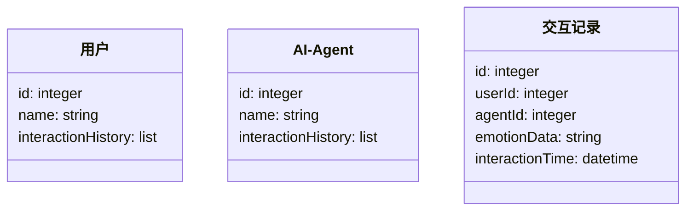

                 


# 构建具有同理心的AI Agent交互系统

> 关键词：AI Agent，同理心交互，情感计算，共情机制，系统架构

> 摘要：本文深入探讨了构建具有同理心的AI Agent交互系统的核心概念、算法原理、系统架构和实现方法。通过分析情感计算和共情生成的算法，结合系统的模块设计与交互流程，展示了如何在实际项目中实现具有同理心的AI交互体验。

---

## 第1章: AI Agent与同理心交互的背景与概念

### 1.1 AI Agent的基本概念

#### 1.1.1 AI Agent的定义与特点
AI Agent（人工智能代理）是指能够感知环境、自主决策并执行任务的智能实体。它具备以下特点：
- **自主性**：无需外部干预，自主完成任务。
- **反应性**：能够实时感知环境并做出反应。
- **目标导向**：基于目标驱动行为。
- **学习能力**：通过数据和经验不断优化性能。

#### 1.1.2 交互系统的核心要素
交互系统是AI Agent与用户进行信息交换的平台，核心要素包括：
- **用户模型**：理解用户需求、情感和行为模式。
- **对话管理**：协调交互流程，确保逻辑连贯。
- **自然语言处理**：实现语言理解与生成。
- **情感计算**：识别和回应用户情感。

#### 1.1.3 同理心在AI交互中的重要性
同理心（Empathy）是理解并分享他人情感的能力，在AI交互中，它能让系统更贴近人类的沟通方式，提升用户体验。

---

### 1.2 同理心交互的背景与问题背景

#### 1.2.1 当前AI交互的局限性
现有的AI交互系统往往过于机械化，缺乏对用户情感的理解和回应，导致用户体验欠佳。

#### 1.2.2 同理心交互的需求场景
- **医疗咨询**：患者需要情感支持。
- **心理健康支持**：用户需要情绪疏导。
- **教育辅助**：学生需要情感关怀。

#### 1.2.3 问题解决的必要性
通过引入同理心，AI Agent可以更好地满足用户的情感需求，提升交互的亲和力和效果。

---

### 1.3 同理心交互的核心概念

#### 1.3.1 同理心的定义与特征
- **定义**：理解并回应用户情感的能力。
- **特征**：
  - 情感识别：准确感知用户情绪。
  - 情感回应：生成具有共情的反馈。

#### 1.3.2 情感计算与共情机制
- **情感计算**：通过算法分析用户情感状态。
- **共情机制**：基于情感计算生成情感化的回应。

#### 1.3.3 交互中的边界与外延
- **边界**：仅限于情感相关的交互，不涉及隐私或敏感信息。
- **外延**：扩展至个性化服务和情境理解。

---

## 第2章: 同理心交互的核心概念体系

### 2.1 同理心交互的核心要素

#### 2.1.1 情感识别与理解
- **情感识别**：通过自然语言处理技术，识别用户的情感倾向。
- **情感强度**：量化情感的强烈程度。

#### 2.1.2 共情生成机制
- **共情生成**：基于用户情感，生成具有共情的回应。
- **个性化策略**：根据用户背景和偏好，调整回应方式。

#### 2.1.3 个性化交互策略
- **动态调整**：根据实时交互情况，动态优化回应策略。
- **反馈机制**：收集用户反馈，持续改进交互体验。

---

### 2.2 同理心与传统交互的对比

#### 2.2.1 传统交互的特点
- **机械性**：基于规则的固定回应。
- **缺乏情感**：无法理解用户情绪。

#### 2.2.2 同理心交互的创新点
- **情感驱动**：基于情感生成回应。
- **个性化服务**：提供定制化的交互体验。

#### 2.2.3 两者的核心差异对比
| 对比维度 | 传统交互 | 同理心交互 |
|----------|----------|------------|
| 基础     | 预定义规则 | 用户情感 |
| 灵活性   | 低       | 高         |
| 体验     | 机械     | 情感化     |

---

### 2.3 同理心交互的ER实体关系图

```mermaid
er
actor: 用户
agent: AI Agent
interaction: 交互记录
emotion: 情感数据
rule: 共情规则
```

---

## 第3章: 情感计算与共情生成算法

### 3.1 情感计算的基本原理

#### 3.1.1 情感识别的常用算法
- **情感词典**：基于词典的情感分类。
- **机器学习模型**：如支持向量机（SVM）和随机森林（RF）。
- **深度学习模型**：如卷积神经网络（CNN）和循环神经网络（RNN）。

#### 3.1.2 情感强度的计算方法
- **情感强度**：通过情感词汇的权重计算情感值。
- **情感分类**：将情感分为正面、负面和中性。

#### 3.1.3 情感分类的数学模型
- **贝叶斯模型**：基于概率的分类方法。
$$ P(y|x) = \frac{P(x|y)P(y)}{P(x)} $$

---

### 3.2 共情生成的算法实现

#### 3.2.1 基于规则的共情生成
- **规则驱动**：根据情感类型生成固定回应。
- **优点**：简单易实现，但灵活性有限。

#### 3.2.2 基于机器学习的共情生成
- **模型训练**：使用情感数据训练生成模型。
- **生成方式**：通过深度学习模型生成情感化回应。

#### 3.2.3 混合式共情生成方法
- **混合策略**：结合规则和机器学习的生成方法。
- **优势**：兼顾灵活性和准确性。

---

### 3.3 情感计算的数学模型

#### 3.3.1 情感分类的贝叶斯模型
$$ P(y|x) = \frac{P(x|y)P(y)}{P(x)} $$

#### 3.3.2 情感强度的回归模型
$$ y = \beta_0 + \beta_1x + \epsilon $$

---

## 第4章: 同理心AI Agent的系统架构与设计

### 4.1 问题场景介绍

#### 4.1.1 用户需求分析
- **需求背景**：用户希望与AI Agent进行情感化的交互。
- **目标设定**：构建具有同理心的交互系统。

#### 4.1.2 系统目标设定
- **核心目标**：实现情感识别和共情生成。
- **附加目标**：优化交互体验，提升用户满意度。

#### 4.1.3 约束条件与边界条件
- **约束条件**：性能优化，数据隐私。
- **边界条件**：仅限于情感相关交互。

---

### 4.2 系统功能设计

#### 4.2.1 领域模型设计


---

## 第5章: 项目实战——医疗咨询中的同理心交互

### 5.1 项目介绍
- **项目背景**：医疗咨询中的情感支持需求。
- **项目目标**：构建具有同理心的医疗咨询AI Agent。

### 5.2 系统核心实现

#### 5.2.1 环境安装
- **Python版本**：Python 3.8+
- **依赖库**：spaCy, PyTorch, Transformers

#### 5.2.2 核心代码实现
```python
import torch
from transformers import AutoTokenizer, AutoModelForSequenceClassification

class EmotionClassifier:
    def __init__(self):
        self.tokenizer = AutoTokenizer.from_pretrained('bert-base-uncased')
        self.model = AutoModelForSequenceClassification.from_pretrained('your-emotion-model')

    def classify_emotion(self, text):
        inputs = self.tokenizer(text, return_tensors='pt')
        outputs = self.model(**inputs)
        logits = outputs.logits
        predicted = torch.argmax(logits, dim=1).item()
        return self.model.config.id2label[predicted]
```

#### 5.2.3 代码解读与分析
- **模型加载**：使用预训练的情感分类模型。
- **文本处理**：将用户输入转换为模型可处理的格式。
- **情感分类**：输出用户情感类别。

---

## 第6章: 最佳实践与注意事项

### 6.1 最佳实践
- **数据多样性**：确保训练数据覆盖多种情感场景。
- **模型优化**：持续优化情感分类模型的准确率。
- **用户体验**：保持交互的自然性和流畅性。

### 6.2 小结
通过本文的介绍，我们详细探讨了构建具有同理心的AI Agent交互系统的各个方面，从理论到实践，为实现更人性化的AI交互提供了参考。

### 6.3 注意事项
- **隐私保护**：确保用户数据的安全性。
- **边界控制**：避免情感交互超出系统能力范围。
- **持续优化**：根据用户反馈不断改进系统。

---

## 第7章: 拓展阅读与深入学习

### 7.1 拓展阅读
- **推荐书籍**：《情感计算入门》、《深度学习与自然语言处理》。
- **技术博客**：关注AI领域的前沿技术博客。

### 7.2 深入学习
- **研究领域**：探索更复杂的情感计算模型。
- **实践项目**：尝试将同理心交互应用到更多场景中。

---

## 作者：AI天才研究院 & 禅与计算机程序设计艺术

感谢您的阅读，希望本文能为您提供有价值的技术见解和实践指导。

