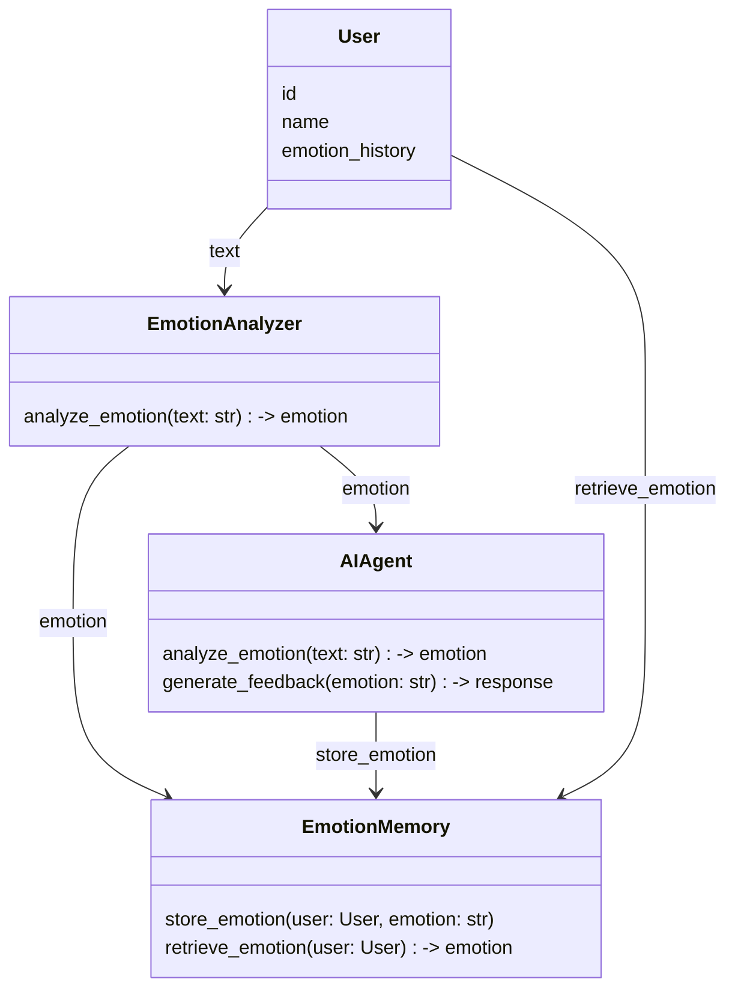
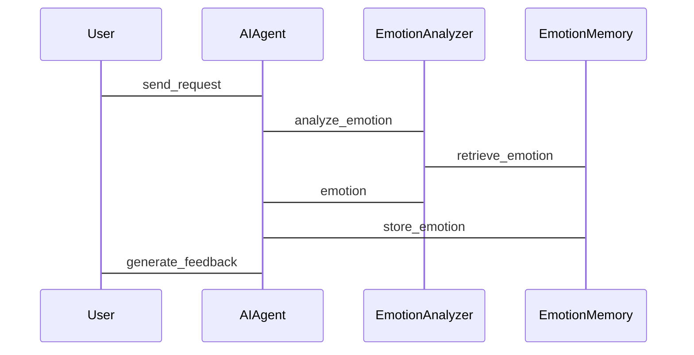

                 


# 构建具有同理心的AI Agent咨询系统

> 关键词：AI Agent, 同理心, 情感计算, 共情理解, 意图识别, 人机交互, 联网咨询系统

> 摘要：本文将详细探讨如何构建一个具有同理心的AI Agent咨询系统，涵盖从核心概念到算法实现的全过程。通过分析情感计算、共情理解和意图识别等关键技术，结合实际应用场景，提供系统设计与实现的详细指导。本文旨在为开发者和研究人员提供理论与实践相结合的深度解析。

---

# 第一部分: 构建具有同理心的AI Agent咨询系统概述

## 第1章: AI Agent与同理心概述

### 1.1 AI Agent的基本概念

#### 1.1.1 AI Agent的定义
AI Agent（人工智能代理）是指能够感知环境、自主决策并执行任务的智能体。它具备以下核心特征：
- **自主性**：能够独立决策。
- **反应性**：能够实时感知并响应环境变化。
- **目标导向**：基于目标驱动行为。
- **学习能力**：能够通过经验改进性能。

#### 1.1.2 AI Agent的核心特征
AI Agent的核心特征可以分为三类：
1. **知识表示**：通过知识库表示领域知识。
2. **推理机制**：基于知识库进行逻辑推理。
3. **行动计划**：根据推理结果执行具体操作。

#### 1.1.3 同理心在AI Agent中的作用
同理心（Empathy）是指理解并共享他人情感的能力。在AI Agent中，同理心的作用体现在：
- 提供更人性化的交互体验。
- 理解用户情感需求，提升服务质量。
- 建立更深层次的用户信任关系。

### 1.2 同理心的定义与实现

#### 1.2.1 同理心的定义
同理心是指理解并分享他人情感状态的能力。在AI Agent中，同理心通常表现为：
1. 情感理解：识别用户的情感状态。
2. 情感记忆：记录用户的情感变化。
3. 情感反馈：根据情感状态调整交互策略。

#### 1.2.2 同理心在人机交互中的重要性
- 提升用户体验：通过情感共鸣增强用户满意度。
- 增强交互效率：通过情感分析优化问题解决流程。
- 建立长期信任：通过情感记忆加深用户信任。

#### 1.2.3 同理心的实现挑战
实现具有同理心的AI Agent面临以下挑战：
1. **情感识别的准确性**：如何准确识别用户的情感状态。
2. **情感记忆的存储与检索**：如何高效存储和检索情感记忆。
3. **情感反馈的实时性**：如何快速生成情感反馈。

### 1.3 AI Agent咨询系统的应用场景

#### 1.3.1 在客户支持中的应用
AI Agent可以通过同理心理解客户情绪，提供更贴心的解决方案，提升客户满意度。

#### 1.3.2 在医疗咨询中的应用
AI Agent可以理解患者情感状态，提供更人性化的医疗建议，缓解患者焦虑情绪。

#### 1.3.3 在教育领域的应用
AI Agent可以根据学生情感状态，提供个性化的学习建议，提升学习效果。

### 1.4 本章小结
本章介绍了AI Agent的基本概念和同理心的重要作用，为后续章节的深入探讨奠定了基础。

---

# 第二部分: 同理心AI Agent的核心概念与联系

## 第2章: 同理心AI Agent的核心概念

### 2.1 情感计算

#### 2.1.1 情感计算的定义
情感计算（Affective Computing）是指通过计算机技术分析、识别和处理人类情感信息的过程。

#### 2.1.2 情感计算的关键技术
1. **情感识别**：通过自然语言处理技术识别用户情感状态。
2. **情感分析**：对用户情感进行分类（如正面、负面、中性）。
3. **情感记忆**：记录用户情感变化，以便后续分析。

#### 2.1.3 情感计算与同理心的关系
情感计算是实现同理心的基础技术，通过情感计算可以实现对用户情感状态的理解和记忆。

### 2.2 共情理解

#### 2.2.1 共情的理解层次
共情理解可以分为以下层次：
1. **情感共鸣**：理解用户的情感状态。
2. **认知共情**：理解用户的思考方式。
3. **行为共情**：预测用户的下一步行为。

#### 2.2.2 共情在对话中的应用
在对话中，共情理解可以帮助AI Agent更好地理解用户需求，提供更贴切的回复。

#### 2.2.3 共情与用户需求的匹配
通过共情理解，AI Agent可以更好地匹配用户需求，提供个性化服务。

### 2.3 意图识别

#### 2.3.1 意图识别的定义
意图识别是指通过分析用户输入，识别用户的潜在意图。

#### 2.3.2 意图识别的关键技术
1. **关键词匹配**：通过关键词匹配识别用户意图。
2. **上下文理解**：基于上下文理解用户意图。
3. **机器学习模型**：通过机器学习模型识别用户意图。

#### 2.3.3 意图识别与同理心的关系
意图识别是实现同理心的基础，通过理解用户意图，AI Agent可以更好地提供情感化的服务。

## 第3章: 同理心AI Agent的核心要素

### 3.1 用户情感分析

#### 3.1.1 情感分析的实现方法
1. **基于规则的方法**：通过预定义规则进行情感分析。
2. **基于统计的方法**：通过统计模型分析用户情感。
3. **基于深度学习的方法**：通过神经网络模型进行情感分析。

#### 3.1.2 基于深度学习的情感分析模型
常用的深度学习模型包括LSTM、BERT等。

#### 3.1.3 情感分析的优化策略
1. **数据增强**：通过数据增强提升模型泛化能力。
2. **模型调优**：通过超参数调优提升模型性能。
3. **情感记忆**：通过情感记忆优化情感分析结果。

### 3.2 情感记忆与关联

#### 3.2.1 情感记忆的定义
情感记忆是指对用户情感状态的记录和存储。

#### 3.2.2 情感记忆的存储与检索
1. **数据库存储**：将用户情感记忆存储在数据库中。
2. **检索算法**：通过检索算法快速获取用户情感记忆。

#### 3.2.3 情感记忆在对话中的应用
通过情感记忆，AI Agent可以在后续对话中回顾用户情感状态，提供更贴切的服务。

### 3.3 情感反馈与优化

#### 3.3.1 情感反馈的定义
情感反馈是指AI Agent根据用户情感状态生成的反馈信息。

#### 3.3.2 情感反馈的实现方法
1. **实时反馈**：根据用户当前情感状态生成反馈。
2. **延迟反馈**：在适当的时间点生成反馈。

#### 3.3.3 情感反馈的优化策略
1. **反馈频率**：根据用户需求调整反馈频率。
2. **反馈内容**：根据用户情感状态调整反馈内容。
3. **反馈语气**：根据用户情感状态调整反馈语气。

---

# 第三部分: 同理心AI Agent的算法原理

## 第4章: 情感计算算法

### 4.1 情感计算的数学模型

#### 4.1.1 基于统计的情感计算模型
常用的基于统计的情感计算模型包括朴素贝叶斯、支持向量机等。

#### 4.1.2 基于深度学习的情感计算模型
常用的基于深度学习的情感计算模型包括LSTM、BERT等。

#### 4.1.3 情感计算模型的优化方法
1. **数据增强**：通过数据增强提升模型泛化能力。
2. **模型调优**：通过超参数调优提升模型性能。
3. **情感记忆**：通过情感记忆优化情感计算结果。

### 4.2 情感计算的实现流程

#### 4.2.1 情感计算的实现步骤
1. **数据预处理**：对用户输入进行预处理。
2. **情感识别**：通过情感计算模型识别用户情感状态。
3. **情感分析**：对用户情感进行分类。
4. **情感记忆**：记录用户情感状态。
5. **情感反馈**：根据情感状态生成反馈信息。

#### 4.2.2 情感计算的代码实现
```python
import numpy as np
from sklearn.feature_extraction.text import TfidfVectorizer
from sklearn.naive_bayes import MultinomialNB

# 数据预处理
vectorizer = TfidfVectorizer()
X = vectorizer.fit_transform(corpus)

# 情感识别
model = MultinomialNB()
model.fit(X, y)

# 情感分析
new_X = vectorizer.transform([text])
predicted_emotion = model.predict(new_X)[0]
```

---

# 第四部分: 系统分析与架构设计方案

## 第5章: 同理心AI Agent咨询系统设计

### 5.1 项目介绍

#### 5.1.1 项目背景
本项目旨在构建一个具有同理心的AI Agent咨询系统，提供更人性化的交互体验。

#### 5.1.2 项目目标
1. 实现情感计算功能。
2. 实现共情理解功能。
3. 实现意图识别功能。

### 5.2 系统功能设计

#### 5.2.1 领域模型设计


#### 5.2.2 系统架构设计
```mermaid
rectangle Database {
    User Emotion History
}
class AIAgent {
    analyze_emotion
    generate_feedback
}
class User {
    send_request
    receive_feedback
}
AIAgent --> Database: retrieve emotion history
AIAgent --> Database: store emotion history
User --> AIAgent: send_request
AIAgent --> User: generate_feedback
```

### 5.3 系统接口设计

#### 5.3.1 系统接口描述
1. `analyze_emotion(text: str) -> emotion`
2. `generate_feedback(emotion: str) -> response`
3. `retrieve_emotion(user_id: int) -> emotion`
4. `store_emotion(user_id: int, emotion: str)`

#### 5.3.2 系统交互设计


---

# 第五部分: 项目实战

## 第6章: 同理心AI Agent咨询系统实现

### 6.1 环境安装

#### 6.1.1 Python环境安装
安装Python 3.x 及以上版本。

#### 6.1.2 依赖库安装
安装以下依赖库：
```bash
pip install numpy scikit-learn nltk
```

### 6.2 系统核心实现源代码

#### 6.2.1 情感分析实现
```python
from sklearn.feature_extraction.text import TfidfVectorizer
from sklearn.naive_bayes import MultinomialNB

class EmotionAnalyzer:
    def __init__(self):
        self.vectorizer = TfidfVectorizer()
        self.model = MultinomialNB()

    def train(self, corpus, y):
        self.vectorizer.fit(corpus)
        X = self.vectorizer.transform(corpus)
        self.model.fit(X, y)

    def analyze_emotion(self, text):
        X = self.vectorizer.transform([text])
        return self.model.predict(X)[0]
```

#### 6.2.2 情感记忆实现
```python
class EmotionMemory:
    def __init__(self):
        self.memory = {}

    def store_emotion(self, user_id, emotion):
        self.memory[user_id] = emotion

    def retrieve_emotion(self, user_id):
        return self.memory.get(user_id, "neutral")
```

#### 6.2.3 AI Agent实现
```python
class AIAgent:
    def __init__(self, emotion_analyzer, emotion_memory):
        self.emotion_analyzer = emotion_analyzer
        self.emotion_memory = emotion_memory

    def handle_request(self, user_id, text):
        emotion = self.emotion_analyzer.analyze_emotion(text)
        self.emotion_memory.store_emotion(user_id, emotion)
        return self.generate_feedback(emotion)

    def generate_feedback(self, emotion):
        feedback = {
            "happy": "非常高兴为您服务！",
            "sad": "非常抱歉给您带来不愉快的体验。",
            "neutral": "感谢您的咨询！"
        }
        return feedback.get(emotion, "感谢您的咨询！")
```

### 6.3 代码应用解读与分析

#### 6.3.1 情感分析模块
情感分析模块通过TF-IDF向量化方法将文本转化为向量，然后使用Naive Bayes模型进行情感分类。

#### 6.3.2 情感记忆模块
情感记忆模块通过字典存储用户情感状态，支持情感状态的存储和检索。

#### 6.3.3 AI Agent模块
AI Agent模块整合情感分析和情感记忆模块，实现情感计算和情感反馈功能。

### 6.4 实际案例分析

#### 6.4.1 医疗咨询系统实现
```python
# 初始化模块
emotion_analyzer = EmotionAnalyzer()
emotion_memory = EmotionMemory()
aiagent = AIAgent(emotion_analyzer, emotion_memory)

# 训练情感分析模型
corpus = ["I feel very sad", "I am happy", "I am neutral"]
y = ["sad", "happy", "neutral"]
emotion_analyzer.train(corpus, y)

# 处理用户请求
user_id = 1
text = "I feel unwell"
response = aiagent.handle_request(user_id, text)
print(response)  # 输出：非常抱歉给您带来不愉快的体验。
```

### 6.5 项目小结
本章通过实际案例分析，展示了如何实现一个具有同理心的AI Agent咨询系统，重点讲解了情感分析、情感记忆和情感反馈的实现过程。

---

# 第六部分: 最佳实践与总结

## 第7章: 同理心AI Agent咨询系统的最佳实践

### 7.1 最佳实践 tips

#### 7.1.1 数据质量
确保训练数据的质量，避免偏差。

#### 7.1.2 情感记忆
定期清理和更新情感记忆，避免内存泄漏。

#### 7.1.3 用户隐私
严格保护用户隐私，遵守数据保护法规。

### 7.2 小结
通过本文的深入探讨，我们了解了如何构建一个具有同理心的AI Agent咨询系统，掌握了情感计算、共情理解和意图识别的核心技术。

### 7.3 注意事项
1. **数据隐私**：严格保护用户数据隐私。
2. **系统稳定性**：确保系统运行稳定可靠。
3. **用户体验**：持续优化用户体验，提升用户满意度。

### 7.4 拓展阅读
1. **情感计算**：深入研究情感计算领域的最新研究成果。
2. **深度学习模型**：探索更先进的深度学习模型在情感计算中的应用。
3. **人机交互**：研究更自然的人机交互方式，提升用户体验。

---

# 结语

通过本文的系统介绍，我们深入探讨了如何构建一个具有同理心的AI Agent咨询系统。从核心概念到算法实现，从系统设计到项目实战，我们为读者提供了全面的指导。希望本文能为相关领域的开发者和研究人员提供有价值的参考。

---

# 作者

作者：AI天才研究院/AI Genius Institute & 禅与计算机程序设计艺术 /Zen And The Art of Computer Programming

