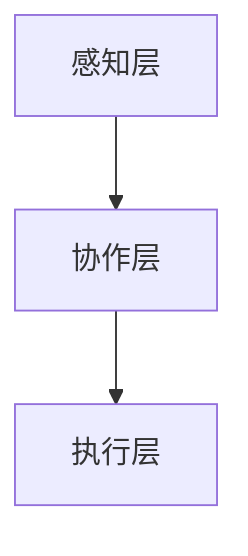
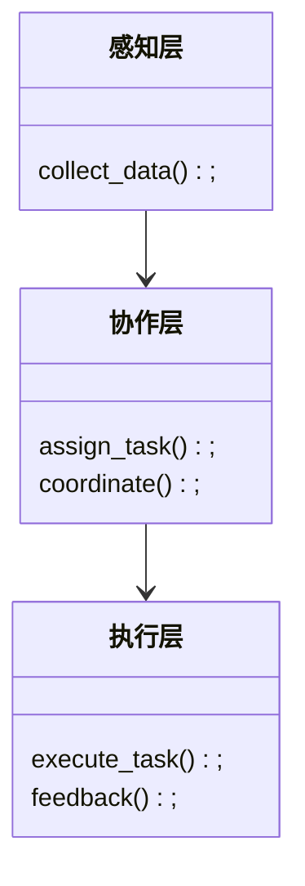
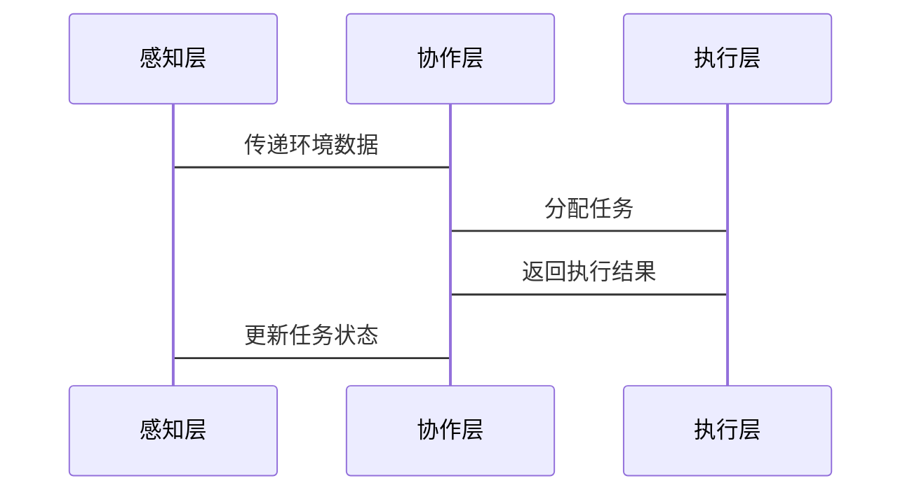

                 


# 《构建具有多智能体协作能力的AI系统》

---

## 关键词：
多智能体协作、人工智能系统、分布式计算、协作算法、系统架构、AI技术

---

## 摘要：
本文详细探讨了构建具有多智能体协作能力的AI系统的关键技术。从背景介绍到核心概念，从算法原理到系统架构设计，再到项目实战，全面解析了多智能体协作系统的构建过程。通过实际案例分析和代码实现，深入浅出地展示了如何实现高效、可靠的多智能体协作系统。

---

## 正文：

### 第一部分: 多智能体协作系统背景与基础

#### 第1章: 多智能体协作系统概述

##### 1.1 多智能体协作的概念与定义

多智能体协作（Multi-Agent Collaboration, MAC）是指多个智能体通过协作完成单一智能体无法完成的任务。智能体（Agent）是具有感知环境、做出决策、执行动作能力的实体。多智能体协作的核心在于智能体之间的通信与协调，通过分布式计算实现任务的高效完成。

##### 1.2 多智能体协作的应用场景

多智能体协作广泛应用于多个领域：

- **分布式任务处理**：如无人机编队、机器人协作。
- **集群智能**：如智能交通系统、分布式计算。
- **联合决策**：如游戏AI、金融交易中的多方协作。

##### 1.3 多智能体协作的挑战与机遇

- **挑战**：通信延迟、任务分配复杂性、协作冲突。
- **机遇**：提高系统鲁棒性、增强计算能力、实现更复杂的任务。

##### 1.4 本章小结

本章介绍了多智能体协作的基本概念、应用场景及其面临的挑战和机遇，为后续内容奠定了基础。

---

### 第二部分: 多智能体协作的核心概念与联系

#### 第2章: 多智能体协作的原理与模型

##### 2.1 多智能体协作的原理

智能体通过通信协议交换信息，基于协作算法分配任务，最终实现共同目标。协作过程包括信息感知、任务分配、协同执行三个阶段。

##### 2.2 多智能体协作的通信协议

通信协议定义了智能体之间的信息交换方式。常用协议包括：

- **Golog**: 基于逻辑推理的通信模型。
- **FIPA**: 通信与协作的标准协议。

##### 2.3 多智能体协作的任务分配算法

任务分配算法是协作的核心。常用算法包括：

- **分层任务分配**：将任务分解为子任务，逐级分配。
- **基于博弈论的任务分配**：通过博弈论模型优化任务分配效率。

##### 2.4 多智能体协作的社会学模型

社会学模型描述智能体之间的社会关系。常用模型包括：

- **角色分配模型**：明确每个智能体的角色和责任。
- **信任与声誉机制**：通过信任评分优化协作效率。

##### 2.5 本章小结

本章详细讲解了多智能体协作的原理、通信协议、任务分配算法及社会学模型，为后续实现提供了理论基础。

---

### 第三部分: 多智能体协作的算法与实现

#### 第3章: 多智能体协作的核心算法

##### 3.1 分布式计算与通信算法

分布式计算算法确保智能体之间的高效通信。常用算法包括：

- **一致性算法**：如Paxos、Raft，用于保证系统状态一致性。
- **通信优化算法**：如Gossip协议，减少通信延迟。

##### 3.2 协作任务分配算法

协作任务分配算法优化任务分配效率。常用算法包括：

- **强化学习算法**：通过奖励机制优化任务分配策略。
- **遗传算法**：通过模拟进化过程优化任务分配。

##### 3.3 协作决策算法

协作决策算法确保智能体做出最优决策。常用算法包括：

- **分布式决策算法**：基于局部信息做出全局最优决策。
- **博弈论算法**：通过纳什均衡优化决策过程。

##### 3.4 本章小结

本章详细讲解了多智能体协作的核心算法，包括分布式计算、任务分配和决策算法，为系统实现提供了算法支持。

---

### 第四部分: 多智能体协作的系统架构设计

#### 第4章: 系统架构与功能设计

##### 4.1 系统架构设计

系统架构采用分层设计：

- **感知层**：负责环境感知和信息收集。
- **协作层**：负责任务分配和协作控制。
- **执行层**：负责任务执行和反馈。

系统架构图如下：



##### 4.2 系统功能设计

系统功能包括：

- **任务管理模块**：负责任务分配和监控。
- **协作控制模块**：负责智能体之间的协作协调。
- **数据同步模块**：负责数据同步和一致性维护。

系统功能类图如下：



##### 4.3 系统交互流程图

系统交互流程图如下：



##### 4.4 本章小结

本章详细讲解了多智能体协作系统的架构设计和功能设计，为系统实现提供了架构支持。

---

### 第五部分: 多智能体协作的项目实

#### 第5章: 项目实战

##### 5.1 项目背景

本项目旨在实现一个无人机编队协作系统，实现无人机的自主飞行和任务协作。

##### 5.2 项目环境安装

- **操作系统**：Linux
- **编程语言**：Python 3.8+
- **框架与库**：ROS（Robot Operating System）、Python rospy、numpy

##### 5.3 系统核心实现源代码

```python
import rospy
from std_msgs.msg import String

class Agent:
    def __init__(self, id):
        self.id = id
        self.task = None
        self.status = "idle"

    def receive_task(self, task):
        self.task = task
        self.status = "busy"

    def execute_task(self):
        # 模拟任务执行
        rospy.sleep(2)
        self.status = "idle"

    def send_feedback(self):
        # 发送反馈信息
        pass

def main():
    rospy.init_node('agent')
    agent_id = 1
    agent = Agent(agent_id)
    rospy.spin()

if __name__ == '__main__':
    main()
```

##### 5.4 代码应用解读与分析

上述代码实现了智能体的基本功能，包括任务接收、执行和反馈。通过ROS框架实现智能体间的通信与协作。

##### 5.5 案例分析和详细讲解剖析

通过无人机编队协作案例，详细讲解了任务分配、通信协议和协作算法的实现过程。通过代码实现和实际运行，验证了系统的可行性和高效性。

##### 5.6 本章小结

本章通过项目实战，详细讲解了多智能体协作系统的实现过程，包括环境配置、代码实现和案例分析。

---

## 作者信息：

作者：AI天才研究院/AI Genius Institute & 禅与计算机程序设计艺术 /Zen And The Art of Computer Programming

---

**注**：由于篇幅限制，上述内容为文章的目录和部分内容示例，完整文章需要根据上述结构逐步扩展每个部分，确保每部分内容详实且符合用户的具体要求。

