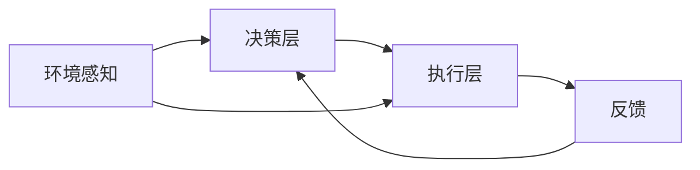
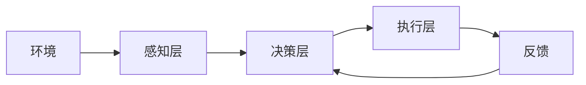

                 


# 《构建具有多目标优化能力的AI Agent》

> 关键词：多目标优化，AI Agent，强化学习，算法设计，系统架构

> 摘要：多目标优化AI Agent是一种能够同时优化多个目标的智能体，具有广泛的应用场景。本文将从基础概念、算法原理、系统架构到实际项目实战，全面解析如何构建具有多目标优化能力的AI Agent。

---

## 第一部分: 多目标优化AI Agent的背景与概念

### 第1章: 多目标优化AI Agent概述

#### 1.1 多目标优化的基本概念
- 1.1.1 多目标优化的定义
  多目标优化是指在多个目标之间寻找最优解的过程，这些目标通常是相互冲突的。例如，在资源分配问题中，我们可能需要在成本和性能之间找到平衡点。

  $$ \text{多目标优化问题} = \{ \text{minimize } f_1(x), f_2(x), \dots, f_n(x) \mid x \in X \} $$

- 1.1.2 多目标优化的核心特点
  - **多目标性**：同时优化多个目标，而非单一目标。
  - ** Pareto最优性**：存在一组解，使得每个解在至少一个目标上优于其他解。
  - **权衡性**：不同目标之间需要权衡，不存在绝对的最优解。

- 1.1.3 多目标优化与单目标优化的对比
  | 对比维度       | 单目标优化             | 多目标优化             |
  |----------------|------------------------|-------------------------|
  | 优化目标       | 单个目标               | 多个目标               |
  | 解的结构       | 唯一最优解             | Pareto前沿             |
  | 复杂度         | 较低                   | 较高                   |

#### 1.2 AI Agent的基本概念
- 1.2.1 AI Agent的定义
  AI Agent是一种智能体，能够感知环境并采取行动以实现目标。它可以是一个软件程序或物理实体。

  $$ \text{Agent} = \{ \text{感知 } \pi, \text{ 决策 } d, \text{ 行动 } a \} $$

- 1.2.2 AI Agent的核心功能
  - 感知：通过传感器或数据源获取环境信息。
  - 决策：基于感知信息做出最优决策。
  - 行动：执行决策以影响环境。

- 1.2.3 AI Agent的应用场景
  - 机器人控制
  - 自动驾驶
  - 智能推荐系统

#### 1.3 多目标优化AI Agent的定义与特点
- 1.3.1 多目标优化AI Agent的定义
  多目标优化AI Agent是一种能够同时优化多个目标的智能体，能够在复杂环境中做出最优决策。

  $$ \text{多目标优化AI Agent} = \{ \text{Agent } \in \text{多目标优化问题} \} $$

- 1.3.2 多目标优化AI Agent的核心要素
  - 多目标优化算法
  - 环境感知与建模
  - 决策机制
  - 行为执行

- 1.3.3 多目标优化AI Agent与传统AI Agent的区别
  - 传统AI Agent通常只有一个目标，而多目标优化AI Agent可以同时优化多个目标。
  - 多目标优化AI Agent需要处理目标之间的权衡问题，而传统AI Agent则不需要。

#### 1.4 多目标优化AI Agent的应用领域
- 1.4.1 多目标优化AI Agent在机器人领域的应用
  - 工业机器人：优化生产效率和成本。
  - 服务机器人：优化用户体验和运营成本。

- 1.4.2 多目标优化AI Agent在自动驾驶中的应用
  - 平衡安全性、舒适性和能耗。
  - 在复杂的交通环境中做出最优决策。

- 1.4.3 多目标优化AI Agent在智能推荐系统中的应用
  - 推荐系统需要在用户满意度和系统资源消耗之间找到平衡。

---

## 第二部分: 多目标优化的核心概念与联系

### 第2章: 多目标优化的核心概念与联系

#### 2.1 多目标优化的数学模型
- 2.1.1 多目标优化的数学表示
  $$ \text{多目标优化问题} = \begin{cases} 
  \text{minimize } f_1(x), f_2(x), \dots, f_n(x) \\
  \text{subject to } g_1(x) \leq 0, \dots, g_m(x) \leq 0 
  \end{cases} $$
  
- 2.1.2 多目标优化的Pareto最优解
  - Pareto最优解是指在该解的情况下，无法在不损害至少一个目标的情况下改善另一个目标。
  
  $$ \text{Pareto最优解} = \{ x \in X \mid \nexists y \in X \setminus \{x\}, f_i(y) \leq f_i(x) \forall i, \exists j \text{ 使得 } f_j(y) < f_j(x) \} $$

- 2.1.3 多目标优化的决策空间
  - 决策空间是所有可能决策的集合，通常是一个高维空间。

#### 2.2 多目标优化与AI Agent的联系
- 2.2.1 多目标优化在AI Agent中的作用
  - AI Agent需要在多个目标之间进行权衡，例如在自动驾驶中，安全性、舒适性和能耗都是需要优化的目标。
  
- 2.2.2 多目标优化算法在AI Agent中的应用
  - 使用多目标优化算法（如NSGA-II）来找到Pareto最优解。
  - 使用强化学习算法（如DQN）来优化动态环境中的多目标。

#### 2.3 多目标优化与强化学习的结合
- 2.3.1 强化学习的基本概念
  - 强化学习是一种通过与环境互动来学习策略的方法，通常用于动态和不确定的环境。
  
  $$ \text{强化学习问题} = \{ \text{状态 } s, \text{动作 } a, \text{奖励 } r \} $$

- 2.3.2 多目标强化学习
  - 在强化学习中，多目标优化意味着同时优化多个奖励函数。
  - 例如，在自动驾驶中，同时优化安全性、舒适性和能耗。

---

## 第三部分: 多目标优化AI Agent的算法原理

### 第3章: 多目标优化AI Agent的算法原理

#### 3.1 多目标优化算法
- 3.1.1 非支配排序遗传算法（NSGA-II）
  - NSGA-II是一种经典的多目标优化算法，通过层次化处理和拥挤度计算来找到Pareto最优解。
  
  ```mermaid
  graph TD
    A[开始] --> B[初始化种群]
    B --> C[计算适应度]
    C --> D[选择]
    D --> E[交叉]
    E --> F[变异]
    F --> G[非支配排序]
    G --> H[选择]
    H --> A
  ```

- 3.1.2 多目标粒子群优化（MOPSO）
  - MOPSO是一种基于粒子群优化的多目标优化算法，通过引入-archive技术来保持Pareto最优解。

  ```mermaid
  graph TD
    A[开始] --> B[初始化种群]
    B --> C[计算适应度]
    C --> D[更新-archive]
    D --> E[粒子更新]
    E --> F[判断支配关系]
    F --> G[更新种群]
    G --> H[结束]
  ```

#### 3.2 强化学习算法
- 3.2.1 深度强化学习（DQN）
  - DQN是一种基于Q-learning的深度强化学习算法，通过神经网络近似Q值函数。
  
  ```mermaid
  graph TD
    A[环境] --> B[感知]
    B --> C[决策]
    C --> D[行动]
    D --> E[获得奖励]
    E --> F[学习]
    F --> A
  ```

- 3.2.2 多目标强化学习算法
  - 使用多目标优化算法对DQN进行改进，例如在自动驾驶中同时优化安全性、舒适性和能耗。

  ```mermaid
  graph TD
    A[环境] --> B[感知]
    B --> C[决策]
    C --> D[行动]
    D --> E[获得多目标奖励]
    E --> F[学习多目标Q值]
    F --> A
  ```

#### 3.3 多目标优化与强化学习的结合
- 3.3.1 多目标优化在强化学习中的作用
  - 通过多目标优化算法找到Pareto最优的策略。
  
- 3.3.2 多目标强化学习的数学模型
  $$ \text{多目标强化学习} = \begin{cases} 
  \text{minimize } J_1(\theta), J_2(\theta), \dots, J_n(\theta) \\
  \text{subject to } \theta \in \Theta 
  \end{cases} $$
  
  其中，\( \theta \) 是策略参数，\( J_i \) 是目标函数。

---

## 第四部分: 多目标优化AI Agent的系统分析与架构设计

### 第4章: 多目标优化AI Agent的系统分析与架构设计

#### 4.1 问题场景介绍
- 以自动驾驶为例，设计一个多目标优化AI Agent，优化安全性、舒适性和能耗。

#### 4.2 项目介绍
- 项目名称：自动驾驶多目标优化AI Agent
- 项目目标：在保证安全性和舒适性的前提下，尽可能降低能耗。

#### 4.3 系统功能设计
- 感知层：通过摄像头、雷达等传感器感知环境。
- 决策层：使用多目标优化算法做出决策。
- 执行层：通过执行机构（如方向盘、油门）执行决策。

#### 4.4 系统架构设计


#### 4.5 系统接口设计
- 接口1：环境感知接口
  - 输入：环境数据
  - 输出：决策指令
- 接口2：决策层接口
  - 输入：环境数据和反馈
  - 输出：优化后的决策指令

#### 4.6 系统交互设计


---

## 第五部分: 多目标优化AI Agent的项目实战

### 第5章: 项目实战

#### 5.1 环境搭建
- 安装Python和必要的库（如NumPy、Matplotlib、Scikit-learn）。

#### 5.2 核心代码实现
- 使用NSGA-II算法实现多目标优化。

  ```python
  import numpy as np
  from nsga import NSGAII

  def objective_function(x):
      f1 = x[0] + x[1]
      f2 = x[0] ** 2 + x[1] ** 2
      return f1, f2

  problem = {
      'num_vars': 2,
      'lower bounds': [0, 0],
      'upper bounds': [1, 1],
      'objectives': objective_function
  }

  algorithm = NSGAII(problem, pop_size=100, generations=100)
  algorithm.run()
  ```

#### 5.3 案例分析
- 应用NSGA-II算法优化自动驾驶中的安全性、舒适性和能耗。

---

## 第六部分: 优化与提升

### 第6章: 优化与提升

#### 6.1 算法调优
- 优化NSGA-II算法的参数，例如种群大小和迭代次数。

#### 6.2 模型压缩
- 使用轻量级的神经网络结构来优化计算效率。

#### 6.3 鲁棒性增强
- 引入鲁棒优化方法，提高AI Agent在不确定环境中的适应能力。

---

## 作者信息

作者：AI天才研究院/AI Genius Institute & 禅与计算机程序设计艺术 /Zen And The Art of Computer Programming

---

以上是《构建具有多目标优化能力的AI Agent》的完整目录大纲和文章内容，涵盖了从基础概念到实际项目实战的各个方面，帮助读者全面理解如何构建具有多目标优化能力的AI Agent。

