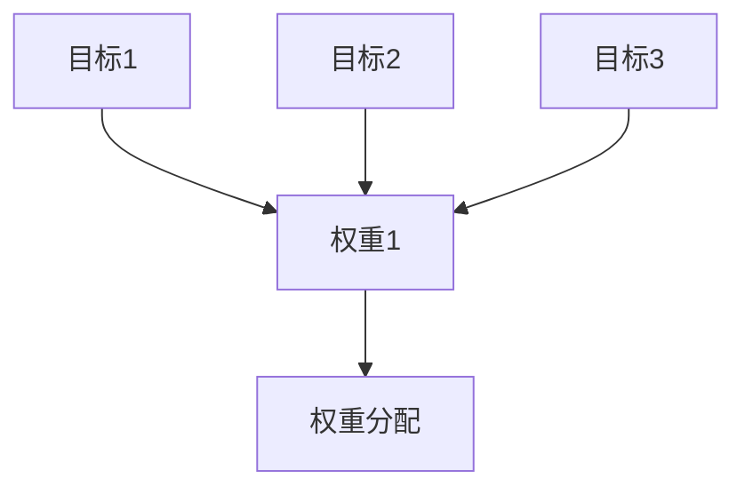
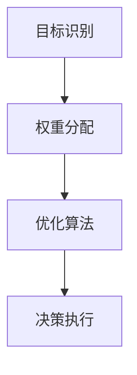

                 


```markdown
# 构建具有多目标平衡能力的AI Agent

## 关键词：AI Agent、多目标平衡、人工智能、优化算法、系统架构

## 摘要：
本文将详细介绍如何构建一个具有多目标平衡能力的AI Agent。首先，我们从AI Agent的基本概念和多目标平衡的核心问题入手，逐步深入探讨多目标优化的数学模型和算法原理。接着，我们将分析多目标平衡能力在系统架构设计中的应用，包括功能模块划分、系统架构设计和接口设计。最后，通过一个具体的项目实战，展示如何实现一个多目标平衡的AI Agent，并对实现过程中的关键点进行详细解读。本文将为读者提供从理论到实践的全面指导，帮助他们掌握构建多目标平衡AI Agent的核心技术。

---

# 第1章: AI Agent概述

## 1.1 AI Agent的基本概念
### 1.1.1 AI Agent的定义与特点
AI Agent是一种能够感知环境、自主决策并执行任务的智能体。它具备自主性、反应性、目标导向性和社会性等特点。

### 1.1.2 多目标平衡能力的内涵
多目标平衡能力是指AI Agent在面对多个相互冲突的目标时，能够找到最优或次优的平衡点，以实现整体目标的最优解。

### 1.1.3 AI Agent的分类与应用场景
AI Agent可以分为简单反射型、基于模型的反应型、目标驱动型和效用驱动型等类型。其应用场景包括智能推荐、自动驾驶、机器人控制等领域。

## 1.2 多目标平衡的背景与问题
### 1.2.1 多目标优化的背景
随着AI技术的发展，许多实际问题需要同时优化多个目标，例如在自动驾驶中，既要保证安全又要提高效率。

### 1.2.2 多目标平衡的核心问题
多目标平衡的核心问题是如何在多个目标之间找到最优的平衡点，避免某一方目标过度优化而忽略其他目标。

### 1.2.3 多目标平衡的挑战与意义
多目标平衡的挑战在于如何处理目标之间的冲突和权衡。其意义在于能够提高AI Agent的智能性和适应性。

## 1.3 多目标平衡能力的数学模型
### 1.3.1 多目标优化的基本概念
多目标优化是指在多个目标函数下寻找最优解的过程。

### 1.3.2 多目标优化的数学表达
$$\text{目标函数: } f(x) = (f_1(x), f_2(x), ..., f_n(x))$$

### 1.3.3 Pareto最优解的概念
Pareto最优解是指在不损害某个目标的情况下，无法进一步优化其他目标的解。

### 1.3.4 多目标优化的算法选择
选择合适的算法是实现多目标平衡的关键，常见的算法包括遗传算法、粒子群优化等。

## 1.4 本章小结

---

# 第2章: 多目标平衡能力的核心概念

## 2.1 多目标平衡的核心原理
### 2.1.1 多目标平衡的权重分配
权重分配是通过给每个目标分配不同的权重，来实现目标之间的平衡。

### 2.1.2 目标冲突的识别与解决
目标冲突是多目标优化中的常见问题，需要通过优先级排序或权衡分析来解决。

### 2.1.3 多目标平衡的动态调整机制
动态调整机制是指在运行过程中根据环境变化实时调整目标的权重或优先级。

## 2.2 多目标平衡的数学模型与算法
### 2.2.1 多目标优化的数学模型
$$\text{目标函数: } \min f(x) = (f_1(x), f_2(x), ..., f_n(x))$$

### 2.2.2 常见的多目标优化算法
- 非支配排序遗传算法（NSGA）
- 多目标粒子群优化（MOPSO）
- 多目标进化算法（MOEA）

### 2.2.3 算法选择的依据
算法选择需要考虑问题的规模、目标函数的复杂性以及计算资源的限制。

## 2.3 多目标平衡能力的实体关系图


## 2.4 本章小结

---

# 第3章: 多目标平衡能力的算法原理

## 3.1 多目标优化算法概述
### 3.1.1 确定目标函数与约束条件
目标函数和约束条件是多目标优化问题的基础。

### 3.1.2 算法选择与比较
不同的算法适用于不同的问题场景，需要根据具体需求选择合适的算法。

### 3.1.3 算法的收敛性分析
收敛性是评价多目标优化算法性能的重要指标。

## 3.2 基于权重分配的多目标优化
### 3.2.1 权重分配的基本原理
通过给每个目标分配不同的权重，实现目标之间的平衡。

### 3.2.2 权重分配的实现步骤
1. 确定目标函数
2. 给每个目标分配权重
3. 根据权重计算综合目标函数
4. 求解优化问题

### 3.2.3 权重分配的优缺点对比
- 优点：简单易实现
- 缺点：目标权重可能不准确，难以适应动态变化

## 3.3 基于Pareto前沿的多目标优化
### 3.3.1 Pareto前沿的基本概念
Pareto前沿是指在多目标优化中，无法进一步优化某个目标而不损害其他目标的解集。

### 3.3.2 Pareto前沿的计算方法
通过遗传算法或粒子群优化等算法生成Pareto前沿。

### 3.3.3 Pareto前沿在AI Agent中的应用
在AI Agent中，Pareto前沿可以用于生成多个平衡解，供决策者选择。

## 3.4 基于动态调整的多目标优化
### 3.4.1 动态调整的机制
根据环境变化实时调整目标权重或优先级。

### 3.4.2 动态调整的实现步骤
1. 监测环境变化
2. 评估目标权重的影响
3. 调整目标权重或优先级
4. 重新优化目标函数

### 3.4.3 动态调整的案例分析
例如，在自动驾驶中，动态调整安全性和效率的权重，以适应不同的驾驶场景。

## 3.5 本章小结

---

# 第4章: 多目标平衡能力的系统架构设计

## 4.1 系统功能设计
### 4.1.1 系统功能模块划分
- 目标识别模块
- 权重分配模块
- 优化算法模块
- 决策执行模块

### 4.1.2 模块之间的关系
目标识别模块负责识别环境中的目标，权重分配模块根据目标的重要性分配权重，优化算法模块基于权重求解最优解，决策执行模块根据最优解执行决策。

### 4.1.3 系统功能的实现步骤
1. 识别环境中的目标
2. 根据目标的重要性分配权重
3. 基于权重求解优化问题
4. 执行最优决策

## 4.2 系统架构设计
### 4.2.1 系统架构的总体设计
系统架构采用分层设计，包括感知层、决策层和执行层。

### 4.2.2 模块之间的交互流程
感知层负责收集环境信息，决策层根据信息进行决策，执行层根据决策执行操作。

### 4.2.3 系统架构的优缺点对比
- 优点：模块化设计，便于维护和扩展
- 缺点：模块之间的耦合性较高

## 4.3 系统接口设计
### 4.3.1 系统接口的定义
- 目标识别接口
- 权重分配接口
- 优化算法接口
- 决策执行接口

### 4.3.2 接口之间的交互关系
目标识别接口提供环境信息，权重分配接口根据目标的重要性分配权重，优化算法接口基于权重求解最优解，决策执行接口根据最优解执行操作。

### 4.3.3 接口设计的注意事项
接口设计需要考虑兼容性和扩展性。

## 4.4 系统交互设计
### 4.4.1 系统交互流程
1. 系统启动，初始化环境
2. 感知层收集环境信息
3. 决策层根据信息进行决策
4. 执行层根据决策执行操作

### 4.4.2 系统交互的案例分析
例如，在智能推荐系统中，感知层收集用户的行为数据，决策层根据数据进行推荐，执行层根据推荐结果执行推荐操作。

## 4.5 本章小结

---

# 第5章: 项目实战——构建一个多目标平衡的AI Agent

## 5.1 项目介绍
### 5.1.1 项目背景
在自动驾驶中，AI Agent需要在安全性和效率之间找到平衡。

### 5.1.2 项目目标
实现一个能够在不同驾驶场景下平衡安全性和效率的AI Agent。

## 5.2 环境安装
### 5.2.1 安装Python
安装Python 3.8及以上版本。

### 5.2.2 安装依赖库
安装numpy、scipy、pymoo等库。

## 5.3 核心实现
### 5.3.1 多目标优化算法的实现
```python
import numpy as np
from pymoo.algorithms.nsga2 import NSGA2
from pymoo.factory import Problem, genetic
from pymoo.visualization.scatter import Scatter

class MultiObjectiveProblem(Problem):
    def __init__(self, n_var=2, n_obj=2, bounds=[(0,10), (0,10)]):
        super().__init__(n_var=n_var, n_obj=n_obj, bounds=bounds)

    def evaluate(self, x):
        f1 = x[:, 0] + x[:, 1]
        f2 = x[:, 0] * x[:, 1]
        return np.column_stack((f1, f2))

problem = MultiObjectiveProblem()
algorithm = NSGA2(pop_size=100, sampling=genetic)
algorithm.run(problem, 20)
```

### 5.3.2 系统架构的实现


## 5.4 实际案例分析
### 5.4.1 案例背景
在自动驾驶中，AI Agent需要在安全性和效率之间找到平衡。

### 5.4.2 案例实现
通过NSGA2算法优化自动驾驶的决策过程，实现安全性和效率的平衡。

## 5.4.3 代码解读与分析
对上述代码进行详细解读，分析每一步的功能和实现细节。

## 5.5 项目小结

---

# 第6章: 总结与展望

## 6.1 本章总结
本文详细介绍了如何构建一个多目标平衡的AI Agent，包括核心概念、算法原理和系统架构设计。

## 6.2 未来展望
未来的研究方向包括动态目标权重调整、多目标优化算法的改进以及多目标平衡能力在更广泛领域的应用。

## 6.3 最佳实践 tips
- 在实际应用中，需要根据具体需求选择合适的算法和权重分配方法。
- 系统设计时，要注意模块的耦合性和扩展性。

## 6.4 本章小结

---

# 附录

## 附录A: 术语表
- AI Agent：人工智能代理
- 多目标优化：multi-objective optimization
- Pareto最优解：Pareto optimal solution
- 权重分配：weight allocation

## 附录B: 工具安装指南
如何安装和配置Python和相关库。

## 附录C: 参考文献
列出本文参考的相关文献和资料。

---

# 作者：AI天才研究院/AI Genius Institute & 禅与计算机程序设计艺术 /Zen And The Art of Computer Programming
```

