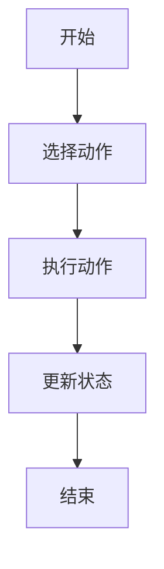
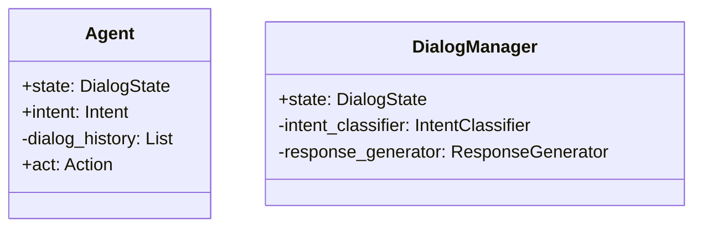
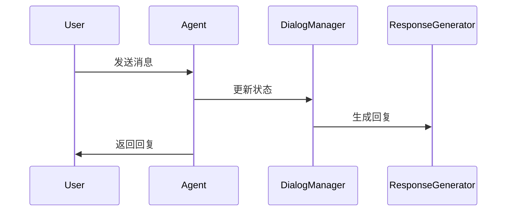

                 


# 构建具有对话管理能力的AI Agent

> 关键词：AI Agent，对话管理，自然语言处理，马尔可夫决策过程，系统架构设计

> 摘要：本文将详细介绍如何构建具有对话管理能力的AI Agent。通过分析对话管理的核心概念、算法原理、系统架构设计以及实际项目实现，帮助读者全面理解并掌握构建此类AI Agent的能力。文章内容涵盖从基础理论到实际应用的全过程，适合技术开发者和研究人员阅读。

---

# 第一部分: 构建具有对话管理能力的AI Agent背景介绍

## 第1章: 问题背景与概念结构

### 1.1 问题背景
#### 1.1.1 当前对话系统的发展现状
随着自然语言处理（NLP）技术的快速发展，对话系统已经从简单的关键词匹配逐步发展为基于深度学习的复杂模型。然而，现有的对话系统在对话管理和上下文理解方面仍然存在诸多挑战。

#### 1.1.2 对话管理在AI Agent中的重要性
对话管理是AI Agent实现人机交互的核心能力，它决定了AI Agent能否理解和响应用户的意图。良好的对话管理能力可以使AI Agent更加智能化和实用化。

#### 1.1.3 传统对话系统与现代对话系统的区别
传统对话系统通常基于规则或关键词匹配，而现代对话系统则广泛采用深度学习模型，如Transformer和BERT，能够处理更复杂的上下文信息。

### 1.2 问题描述
#### 1.2.1 对话管理的核心问题
对话管理的核心问题是如何在对话过程中理解和跟踪用户意图，同时根据对话上下文生成合适的回复。

#### 1.2.2 AI Agent在对话中的角色定位
AI Agent在对话中的角色是理解用户需求并提供相应的服务，同时通过对话管理保持对话的连贯性和有效性。

#### 1.2.3 对话管理的挑战与难点
对话管理的挑战包括对话状态的表示、意图识别的准确性以及对话策略的优化等问题。

## 第2章: 对话管理的核心概念与联系

### 2.1 核心概念原理
#### 2.1.1 对话状态表示
对话状态表示是对话管理的基础，通常包括当前对话的上下文信息，如用户意图、对话历史等。

#### 2.1.2 对话动作
对话动作是对用户输入的响应，通常基于当前对话状态生成。

#### 2.1.3 对话策略
对话策略是根据当前对话状态和目标生成最优对话动作的过程。

### 2.2 概念属性特征对比表格
```plaintext
| 概念         | 属性         | 特征描述                                   |
|--------------|--------------|------------------------------------------|
| 对话状态      | 表示方式      | 使用状态变量表示当前对话的上下文信息     |
| 对话动作      | 执行方式      | 根据当前状态选择合适的回复或操作         |
| 对话策略      | 决策机制      | 基于当前状态和目标选择最优动作           |
```

### 2.3 ER实体关系图
```mermaid
er
actor(Agent, User)
role(Agent, "管理对话")
role(User, "发起对话")
```

---

# 第二部分: 对话管理的算法原理

## 第3章: 对话管理的算法原理

### 3.1 马尔可夫决策过程
#### 3.1.1 状态空间的定义与表示
对话状态可以表示为一个马尔可夫决策过程（MDP）的状态空间，其中每个状态表示当前对话的上下文信息。

#### 3.1.2 动作空间的设计与实现
动作空间包括所有可能的对话动作，如回复、确认、拒绝等。

#### 3.1.3 奖励函数的构建与优化
奖励函数用于衡量对话策略的好坏，通常基于对话的连贯性和用户满意度来设计。

### 3.2 对话策略优化算法


#### 3.2.1 基于马尔可夫决策过程的对话策略优化
对话策略优化可以通过强化学习算法实现，如Q-learning或策略梯度方法。

#### 3.2.2 对话策略的数学模型
对话策略的优化可以通过以下数学模型表示：
$$ Q(s, a) = r + \gamma \max_{a'} Q(s', a') $$
其中，$Q(s, a)$ 表示状态$s$和动作$a$的Q值，$r$是奖励，$\gamma$是折扣因子。

---

## 第4章: 对话管理的系统架构设计

### 4.1 问题场景介绍
对话管理系统的场景通常包括用户与AI Agent之间的交互，例如智能客服、智能助手等。

### 4.2 系统功能设计


### 4.3 系统架构设计


### 4.4 系统接口设计
对话管理系统的接口通常包括：
1. 获取当前对话状态
2. 更新对话状态
3. 生成对话回复
4. 识别用户意图

### 4.5 系统交互流程


---

## 第5章: 对话管理的项目实战

### 5.1 环境安装与配置
#### 5.1.1 安装Python和必要的库
```bash
pip install numpy pandas tensorflow
```

#### 5.1.2 安装NLP工具
```bash
pip install transformers
```

### 5.2 核心代码实现

#### 5.2.1 对话状态表示
```python
class DialogState:
    def __init__(self, user_id, current_intent=None, dialog_history=[]):
        self.user_id = user_id
        self.current_intent = current_intent
        self.dialog_history = dialog_history
```

#### 5.2.2 对话策略优化
```python
def q_learning(state, action, next_state, reward):
    learning_rate = 0.1
    discount_factor = 0.9
    Q[state][action] = Q[state][action] + learning_rate * (reward + discount_factor * max(Q[next_state].values()) - Q[state][action])
```

### 5.3 案例分析与实现
#### 5.3.1 案例背景
假设我们正在开发一个智能客服系统，用户会提出各种问题，AI Agent需要理解用户意图并生成合适的回复。

#### 5.3.2 代码实现
```python
from transformers import pipeline

intent_classifier = pipeline("text-classification", model="bert-base-uncased")

def generate_response(state, action):
    response = "您好，我已收到您的请求，请稍等片刻。"
    return response
```

### 5.4 项目小结
通过实际项目实现，我们能够更好地理解对话管理的实现过程，并掌握相关技术和工具的使用方法。

---

## 第6章: 总结与展望

### 6.1 最佳实践 tips
1. 在对话管理中，对话状态的表示和更新是关键。
2. 对话策略的优化需要结合具体场景和数据进行调整。
3. 使用预训练的语言模型（如BERT）可以提高对话系统的性能。

### 6.2 小结
通过本文的介绍和分析，我们全面了解了如何构建具有对话管理能力的AI Agent，包括核心概念、算法原理、系统架构设计以及实际项目实现。

### 6.3 注意事项
1. 对话系统的安全性需要特别注意，防止滥用和误用。
2. 对话系统的可解释性是用户体验的重要组成部分。

### 6.4 拓展阅读
1. 《Deep Learning for Dialogue Systems》
2.《Reinforcement Learning for Dialogue Management》

---

作者：AI天才研究院/AI Genius Institute & 禅与计算机程序设计艺术 /Zen And The Art of Computer Programming

