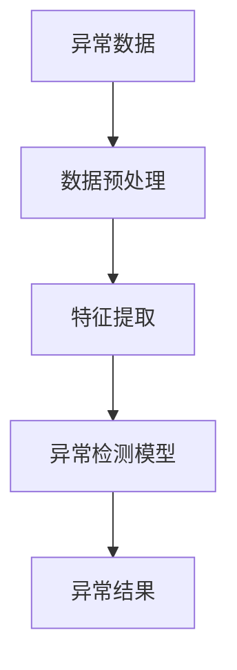
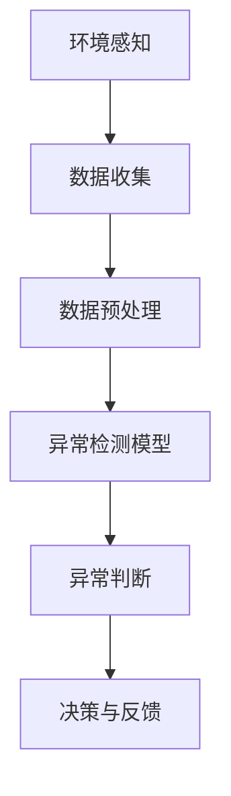
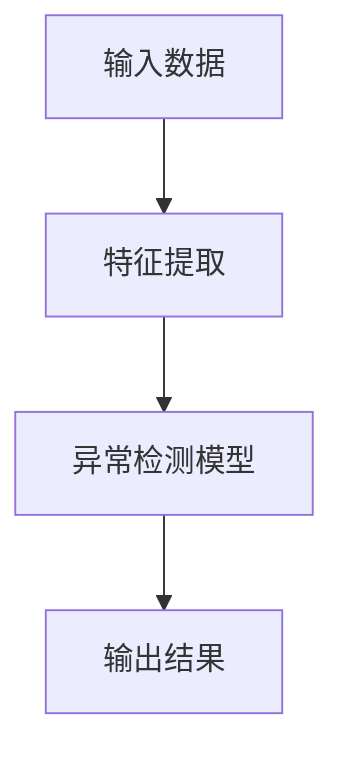
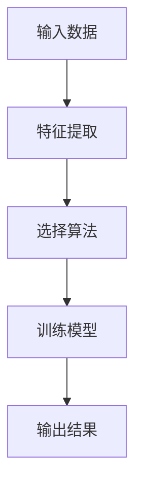
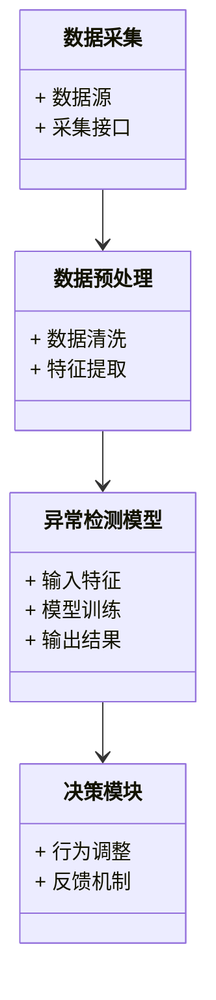
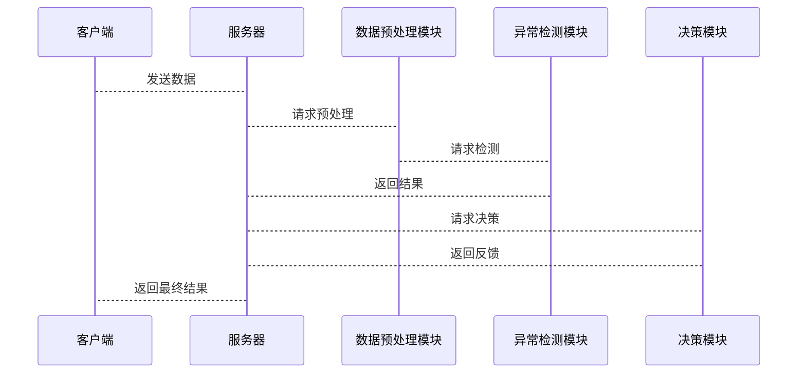

                 


# 构建具有异常检测能力的AI Agent

## 关键词：AI Agent，异常检测，机器学习，深度学习，数学模型

## 摘要：本文详细探讨了如何构建具有异常检测能力的AI Agent。首先介绍了异常检测的基本概念和AI Agent的核心特征，分析了异常检测在AI Agent中的作用。接着，深入讲解了异常检测的算法原理，包括基于统计、机器学习和深度学习的方法，并给出了具体的数学模型和Python实现。然后，从系统架构设计的角度，分析了AI Agent的结构和接口设计，提出了异常检测的系统实现方案。最后，通过实际项目案例，展示了如何实现具有异常检测能力的AI Agent，并总结了相关经验。

---

# 第一部分：异常检测与AI Agent概述

## 第1章：异常检测与AI Agent的背景介绍

### 1.1 异常检测的定义与背景

#### 1.1.1 异常检测的定义
异常检测（Anomaly Detection）是指识别数据中不符合预期模式或偏离正常行为的观察值。这些异常值可能代表错误、欺诈行为或潜在的问题，及时检测这些异常可以帮助系统采取适当的措施。

#### 1.1.2 异常检测的应用场景
- **网络安全**：检测网络攻击和入侵行为。
- **金融领域**：识别欺诈交易和异常资金流动。
- **医疗领域**：监测患者健康状况，发现异常症状。
- **工业领域**：检测设备故障和异常生产过程。
- **交通领域**：识别交通异常，优化交通流量。

#### 1.1.3 异常检测的挑战与意义
- **挑战**：异常样本数量少，难以训练；正常数据分布复杂；计算资源限制。
- **意义**：提高系统鲁棒性，降低潜在风险，提升决策效率。

### 1.2 AI Agent的基本概念

#### 1.2.1 AI Agent的定义
AI Agent（人工智能代理）是一种智能实体，能够感知环境、自主决策并执行任务。它可以是一个软件程序、机器人或其他智能系统，具备学习、推理和自适应能力。

#### 1.2.2 AI Agent的核心特征
- **自主性**：无需外部干预，自主完成任务。
- **反应性**：能够感知环境并实时响应。
- **主动性**：主动采取行动以实现目标。
- **社会性**：能够与其他Agent或人类交互协作。

#### 1.2.3 AI Agent与传统程序的区别
| 特性 | AI Agent | 传统程序 |
|------|----------|----------|
| 智能性 | 高       | 低       |
| 学习能力 | 高       | 低       |
| 自主性 | 高       | 低       |
| 适应性 | 高       | 低       |

### 1.3 异常检测在AI Agent中的作用

#### 1.3.1 异常检测在AI Agent中的应用场景
- **故障检测**：在工业自动化中，检测设备异常。
- **行为分析**：在智能客服中，识别用户异常行为。
- **风险管理**：在金融交易中，检测异常交易行为。

#### 1.3.2 异常检测对AI Agent性能的影响
- **提高准确性**：及时发现异常，避免错误决策。
- **增强鲁棒性**：减少异常对系统的影响。
- **提升效率**：通过异常检测优化资源分配。

#### 1.3.3 异常检测在AI Agent中的实现挑战
- **数据稀疏性**：异常样本少，难以训练。
- **动态环境**：环境变化快，模型需动态更新。
- **计算复杂性**：高维数据计算量大，资源消耗高。

### 1.4 本章小结
本章介绍了异常检测的基本概念和应用场景，并对比了AI Agent与传统程序的区别，强调了异常检测在AI Agent中的重要性。

---

## 第2章：异常检测与AI Agent的核心概念

### 2.1 异常检测的核心原理

#### 2.1.1 异常检测的分类
- **基于统计的方法**：利用概率分布模型，如正态分布，识别异常。
- **基于机器学习的方法**：使用监督或无监督学习算法，如支持向量机（SVM）。
- **基于深度学习的方法**：利用神经网络模型，如自编码器（AE）。

#### 2.1.2 异常检测的关键特征对比（表格）
| 方法         | 优点                          | 缺点                          |
|--------------|-------------------------------|-------------------------------|
| 统计方法     | 实现简单，计算高效             | 依赖分布假设，适用范围有限     |
| 机器学习方法 | 模型复杂度高，适用性广          | 需要大量标记数据，训练耗时     |
| 深度学习方法 | 表达能力强，适合高维数据        | 需要大量数据，计算资源消耗高    |

#### 2.1.3 异常检测的实体关系图（Mermaid）


### 2.2 AI Agent的异常检测机制

#### 2.2.1 AI Agent中的异常检测流程


#### 2.2.2 异常检测在AI Agent中的实现方式
- **实时检测**：在线处理数据，即时反馈。
- **离线分析**：批量处理历史数据，提供事后分析。

#### 2.2.3 异常检测对AI Agent决策的影响
- **实时反馈**：帮助AI Agent快速响应异常。
- **优化决策**：基于异常分析，优化未来行为。

### 2.3 异常检测与AI Agent的结合模型

#### 2.3.1 异常检测与AI Agent的协同工作原理
- AI Agent通过异常检测模型识别异常，调整自身行为。

#### 2.3.2 异常检测在AI Agent中的数学模型（Mermaid）


### 2.4 本章小结
本章详细探讨了异常检测的核心原理，并分析了其在AI Agent中的实现方式和影响。

---

## 第3章：异常检测算法原理与实现

### 3.1 异常检测算法概述

#### 3.1.1 常见的异常检测算法分类
- **基于统计**：Z-score，LOF。
- **基于机器学习**：SVM，Isolation Forest。
- **基于深度学习**：AE，VAE。

#### 3.1.2 异常检测算法的优缺点对比（表格）
| 方法         | 优点                          | 缺点                          |
|--------------|-------------------------------|-------------------------------|
| Z-score      | 实现简单，计算高效             | 仅适用于正态分布，鲁棒性差     |
| LOF          | 适用于高维数据，无需标记数据     | 计算复杂，对小样本数据效果差     |
| SVM           | 分类能力强，适用性广            | 需要标记数据，训练耗时          |
| Isolation Forest | 无需标记数据，适合高维数据      | 对异常样本数量敏感              |
| AE            | 表达能力强，适合复杂数据        | 需要大量数据，计算资源消耗高     |

#### 3.1.3 异常检测算法的流程图（Mermaid）


### 3.2 基于统计的异常检测算法

#### 3.2.1 基于统计的异常检测原理
- 假设数据服从某种分布（如正态分布），计算每个数据点的Z-score，超出阈值则为异常。

#### 3.2.2 基于统计的异常检测算法实现（Python代码）
```python
import numpy as np
from scipy import stats

def z_score_outlier_detection(data, threshold=3):
    z_scores = np.abs(stats.zscore(data))
    return np.where(z_scores > threshold)[0]

# 示例数据
data = np.random.normal(0, 1, 1000)
outliers = z_score_outlier_detection(data)
print("异常点索引:", outliers)
```

#### 3.2.3 基于统计的异常检测数学模型（公式）
$$ Z = \frac{X - \mu}{\sigma} $$
其中，$X$是数据点，$\mu$是均值，$\sigma$是标准差。

### 3.3 基于机器学习的异常检测算法

#### 3.3.1 基于机器学习的异常检测原理
- 使用无监督学习算法（如Isolation Forest）识别数据中的异常点。

#### 3.3.2 基于机器学习的异常检测算法实现（Python代码）
```python
from sklearn.ensemble import IsolationForest

def isolation_forest_outlier_detection(data, contamination=0.05):
    model = IsolationForest(contamination=contamination)
    model.fit(data)
    return model.predict(data)

# 示例数据
data = np.random.rand(1000, 2)
outliers = isolation_forest_outlier_detection(data)
print("异常点标记:", outliers)
```

#### 3.3.3 基于机器学习的异常检测数学模型（公式）
$$ y = f(X) $$
其中，$X$是输入特征，$f$是学习模型。

### 3.4 基于深度学习的异常检测算法

#### 3.4.1 基于深度学习的异常检测原理
- 使用自编码器（Autoencoder）重构数据，重构误差大的数据点为异常。

#### 3.4.2 基于深度学习的异常检测算法实现（Python代码）
```python
import tensorflow as tf
from tensorflow.keras import layers

def autoencoder_outlier_detection(data, encoding_dim=32):
    input_layer = layers.Input(shape=(data.shape[1],))
    encoder = layers.Dense(encoding_dim, activation='relu')(input_layer)
    decoder = layers.Dense(data.shape[1], activation='sigmoid')(encoder)
    autoencoder = tf.keras.Model(inputs=input_layer, outputs=decoder)
    autoencoder.compile(optimizer='adam', loss='binary_crossentropy')
    autoencoder.fit(data, data, epochs=100, batch_size=32)
    # 预测异常
    reconstructed = autoencoder.predict(data)
    reconstruction_error = tf.keras.losses.binary_crossentropy(data, reconstructed)
    return reconstruction_error.numpy()

# 示例数据
data = np.random.rand(1000, 10)
reconstruction_error = autoencoder_outlier_detection(data)
print("重构误差:", reconstruction_error)
```

#### 3.4.3 基于深度学习的异常检测数学模型（公式）
$$ \hat{x} = f(x) $$
其中，$x$是输入数据，$\hat{x}$是重构数据，$f$是深度学习模型。

### 3.5 本章小结
本章详细讲解了异常检测的三种主要算法：基于统计、机器学习和深度学习的方法，并给出了具体的Python实现和数学模型。

---

## 第4章：异常检测的数学模型与公式

### 4.1 统计学异常检测模型

#### 4.1.1 基于概率分布的异常检测（公式）
$$ P(X) = \frac{1}{\sqrt{2\pi\sigma^2}} e^{-\frac{(x-\mu)^2}{2\sigma^2}} $$
其中，$\mu$是均值，$\sigma$是标准差。

#### 4.1.2 基于距离度量的异常检测（公式）
$$ d(x, y) = \sqrt{\sum_{i=1}^n (x_i - y_i)^2} $$
其中，$x$和$y$是两个数据点。

#### 4.1.3 基于密度的异常检测（公式）
$$ LOF(x) = \frac{density(x)}{density_{knn}(x)} $$
其中，$density(x)$是$x$点的密度，$density_{knn}(x)$是$x$点的k近邻密度。

### 4.2 机器学习异常检测模型

#### 4.2.1 基于支持向量机的异常检测（公式）
$$ y = \text{sign}(\sum_{i=1}^n \alpha_i y_i x_i \cdot x + b) $$
其中，$\alpha_i$是拉格朗日乘子，$y_i$是标记，$x_i$是支持向量。

#### 4.2.2 基于Isolation Forest的异常检测（公式）
$$ score(x) = \text{路径长度}(x) $$
其中，路径长度是数据点在树中的平均路径长度。

### 4.3 深度学习异常检测模型

#### 4.3.1 基于自编码器的异常检测（公式）
$$ \hat{x} = f(x) $$
其中，$f$是深度学习模型，$\hat{x}$是重构数据。

#### 4.3.2 基于变分自编码器的异常检测（公式）
$$ q(z|x) = \mathcal{N}(\mu_x, \sigma_x^2) $$
$$ p(x|z) = \mathcal{N}(\mu_z, \sigma_z^2) $$
其中，$q(z|x)$是后验分布，$p(x|z)$是生成分布。

### 4.4 本章小结
本章详细分析了异常检测的数学模型，包括统计学、机器学习和深度学习方法的公式推导。

---

## 第5章：系统分析与架构设计

### 5.1 问题场景介绍

#### 5.1.1 异常检测场景
- 在AI Agent中，实时监测系统运行状态，识别异常行为。

#### 5.1.2 系统需求
- 实时处理数据，快速检测异常。
- 支持多种数据类型和格式。
- 提供可视化界面，便于用户分析。

### 5.2 系统功能设计

#### 5.2.1 领域模型（Mermaid类图）


#### 5.2.2 系统架构设计（Mermaid架构图）


#### 5.2.3 系统接口设计
- 数据采集接口：接收数据，格式为JSON或CSV。
- 异常检测接口：提供API，返回异常结果。
- 反馈接口：发送反馈信息，优化模型。

#### 5.2.4 系统交互（Mermaid序列图）


### 5.3 本章小结
本章从系统设计的角度，分析了异常检测在AI Agent中的实现方式，包括功能设计和架构设计。

---

## 第6章：项目实战

### 6.1 环境安装

#### 6.1.1 安装Python环境
- 安装Python 3.8或更高版本。
- 安装Jupyter Notebook或其他IDE。

#### 6.1.2 安装依赖库
- 使用pip安装必要的库：
  ```bash
  pip install numpy scikit-learn tensorflow pandas matplotlib
  ```

### 6.2 系统核心实现

#### 6.2.1 数据采集模块
- 读取数据文件，解析数据。
- 示例代码：
  ```python
  import pandas as pd

  def load_data(file_path):
      data = pd.read_csv(file_path)
      return data
  ```

#### 6.2.2 数据预处理模块
- 清洗数据，提取特征。
- 示例代码：
  ```python
  def preprocess_data(data):
      # 假设数据中包含缺失值和异常值
      data = data.dropna()
      # 假设需要标准化处理
      from sklearn.preprocessing import StandardScaler
      scaler = StandardScaler()
      data_scaled = scaler.fit_transform(data)
      return data_scaled
  ```

#### 6.2.3 异常检测模块
- 选择合适的算法，训练模型。
- 示例代码：
  ```python
  def train_anomaly_detector(data, model_type='AE'):
      if model_type == 'AE':
          # 使用自编码器
          from tensorflow.keras import layers
          input_layer = layers.Input(shape=(data.shape[1],))
          encoder = layers.Dense(32, activation='relu')(input_layer)
          decoder = layers.Dense(data.shape[1], activation='sigmoid')(encoder)
          autoencoder = tf.keras.Model(inputs=input_layer, outputs=decoder)
          autoencoder.compile(optimizer='adam', loss='binary_crossentropy')
          autoencoder.fit(data, data, epochs=100, batch_size=32)
          return autoencoder
      elif model_type == 'IsolationForest':
          from sklearn.ensemble import IsolationForest
          model = IsolationForest(contamination=0.05)
          model.fit(data)
          return model
  ```

#### 6.2.4 决策模块
- 根据异常检测结果，调整行为。
- 示例代码：
  ```python
  def decision_making(outliers):
      # 假设outliers是异常点的索引
      if len(outliers) > 0:
          print("检测到异常点，采取措施！")
      else:
          print("未检测到异常点，继续正常运行。")
  ```

### 6.3 实际案例分析

#### 6.3.1 案例背景
- 在金融交易中，实时监测交易行为，检测异常交易。

#### 6.3.2 数据准备
- 下载交易数据，包含时间、金额、用户ID等特征。

#### 6.3.3 数据预处理
- 清洗数据，处理缺失值和异常值。

#### 6.3.4 模型训练
- 使用Isolation Forest算法训练异常检测模型。

#### 6.3.5 模型评估
- 使用测试数据评估模型的准确率、召回率等指标。

#### 6.3.6 模型部署
- 将模型部署到生产环境，实时监测交易行为。

### 6.4 项目总结
通过实际案例分析，展示了如何将异常检测算法应用于AI Agent中，提升了系统的异常处理能力。

---

## 第7章：最佳实践与经验总结

### 7.1 最佳实践

#### 7.1.1 数据预处理的重要性
- 数据清洗和特征提取直接影响模型性能。

#### 7.1.2 模型选择的策略
- 根据数据类型和场景选择合适的异常检测算法。

#### 7.1.3 模型调优的技巧
- 使用网格搜索优化模型参数。
- 定期更新模型，适应环境变化。

#### 7.1.4 系统架构的设计原则
- 分模块设计，便于维护和扩展。
- 采用分布式架构，提高系统的可扩展性。

### 7.2 小结

#### 7.2.1 异常检测的关键点
- 理解业务需求，选择合适的算法。
- 数据预处理是模型性能的基础。
- 模型部署需要考虑实时性和资源限制。

#### 7.2.2 AI Agent的未来发展
- 结合边缘计算，提升实时性。
- 利用联邦学习，保护数据隐私。
- 增强模型的自适应能力，应对动态环境。

### 7.3 注意事项

#### 7.3.1 数据隐私与安全
- 确保数据处理符合隐私保护法规。
- 避免数据泄露，保护用户隐私。

#### 7.3.2 模型的可解释性
- 提供可解释的异常检测结果，便于用户理解和信任。

#### 7.3.3 系统的可扩展性
- 设计灵活的架构，便于后续功能扩展。
- 支持多种数据源和数据格式。

### 7.4 拓展阅读

#### 7.4.1 异常检测的最新研究
- 基于图神经网络的异常检测。
- 基于强化学习的异常检测。

#### 7.4.2 AI Agent领域的研究进展
- 多智能体协作。
- 增量学习与在线学习。

---

## 作者：AI天才研究院/AI Genius Institute & 禅与计算机程序设计艺术 /Zen And The Art of Computer Programming

---

通过以上结构，您可以逐步完成《构建具有异常检测能力的AI Agent》这篇文章。每个章节都详细展开了相关主题，并提供了具体的代码示例和图表，确保文章内容的丰富性和专业性。

