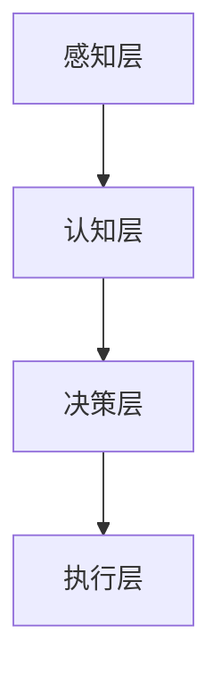

                 


# 构建具有情境感知能力的AI Agent

> 关键词：AI Agent, 情境感知, 人工智能, 系统架构, 项目实战

> 摘要：本文详细探讨了构建具有情境感知能力的AI Agent的各个方面，从基本概念到算法原理，再到系统架构设计和项目实战，结合丰富的案例和代码示例，全面解析了如何实现具有情境感知能力的AI Agent。

---

# 第1章: AI Agent的基本概念

## 1.1 AI Agent的定义与分类

### 1.1.1 AI Agent的定义

AI Agent（人工智能代理）是指能够感知环境、做出决策并采取行动以实现目标的智能实体。AI Agent可以是软件程序、机器人或其他智能系统，其核心目标是通过与环境的交互来完成特定任务。

### 1.1.2 AI Agent的分类

AI Agent可以根据功能、智能水平和应用领域进行分类：

1. **按功能分类**：
   - **工具型AI Agent**：专注于完成特定任务，如计算器、语音助手。
   - **社会型AI Agent**：能够与人类或其他AI Agent进行交互，如智能客服、自动驾驶系统。

2. **按智能水平分类**：
   - **反应式AI Agent**：基于当前感知做出反应，没有内部状态。
   - **认知式AI Agent**：具有复杂推理能力，能够理解上下文和目标。

3. **按应用领域分类**：
   - **服务机器人**：用于家庭服务、医疗护理等。
   - **工业机器人**：用于制造业、物流等领域。

### 1.1.3 AI Agent的核心特征

AI Agent的核心特征包括：

1. **自主性**：能够自主决策和行动。
2. **反应性**：能够感知环境并实时响应。
3. **目标导向**：以实现特定目标为导向。
4. **适应性**：能够适应环境变化和不确定性。

---

## 1.2 情境感知的定义与技术基础

### 1.2.1 情境感知的定义

情境感知（Situation Awareness）是指系统或主体能够理解当前所处环境的状态、事件和相关因素的能力。在AI Agent中，情境感知是实现智能化决策的关键能力。

### 1.2.2 情境感知的技术基础

情境感知依赖于以下技术基础：

1. **传感器技术**：通过摄像头、麦克风、GPS等传感器获取环境数据。
2. **数据融合技术**：将多源数据进行融合，提取有用信息。
3. **知识表示技术**：将环境信息表示为知识，便于理解和推理。
4. **推理技术**：基于知识和数据进行推理，得出环境的语义信息。

### 1.2.3 情境感知的应用领域

情境感知在多个领域有广泛应用：

1. **自动驾驶**：通过感知环境（道路、车辆、行人）做出驾驶决策。
2. **智能助手**：根据用户行为和环境信息提供个性化服务。
3. **智慧城市**：通过感知城市运行状态优化资源配置。

---

## 1.3 本章小结

本章介绍了AI Agent的基本概念，包括定义、分类和核心特征，并详细讨论了情境感知的定义、技术基础和应用领域，为后续章节奠定了基础。

---

# 第2章: 情境感知AI Agent的核心概念

## 2.1 情境感知模型的构建

### 2.1.1 情境感知模型的定义

情境感知模型是一个用于理解和表示环境信息的数学模型，能够将传感器数据转化为语义信息。

### 2.1.2 情境感知模型的核心要素

情境感知模型的核心要素包括：

1. **环境模型**：描述环境的物理结构和动态变化。
2. **用户模型**：描述用户的行为、偏好和目标。
3. **上下文模型**：描述环境中的上下文信息，如时间、地点、事件等。

### 2.1.3 情境感知模型的构建过程

情境感知模型的构建过程包括以下步骤：

1. **数据采集**：通过传感器获取环境数据。
2. **数据预处理**：对数据进行清洗和标准化。
3. **特征提取**：从数据中提取有用的特征。
4. **模型训练**：基于特征训练情境感知模型。
5. **模型优化**：通过反馈优化模型性能。

---

## 2.2 情境感知与用户意图理解

### 2.2.1 用户意图的理解方法

用户意图理解是情境感知的重要组成部分，常用方法包括：

1. **基于规则的方法**：通过预定义规则匹配用户行为。
2. **基于统计的方法**：通过统计分析用户行为模式。
3. **基于机器学习的方法**：通过训练模型预测用户意图。

### 2.2.2 情境感知在用户意图理解中的作用

情境感知通过理解环境信息，帮助模型更准确地预测用户意图，例如：

1. **上下文推理**：结合环境信息推理用户的潜在需求。
2. **多模态数据融合**：结合视觉、听觉等多种数据源，提高意图理解的准确性。

### 2.2.3 情境感知与用户反馈的结合

通过用户的反馈，情境感知模型可以不断优化对用户意图的理解，例如：

1. **实时反馈**：用户实时提供反馈，帮助模型快速调整。
2. **历史数据分析**：通过分析历史数据，挖掘用户的长期偏好。

---

## 2.3 本章小结

本章详细探讨了情境感知AI Agent的核心概念，包括情境感知模型的构建、用户意图理解的方法及其在情境感知中的作用，为后续章节的系统设计和项目实现提供了理论基础。

---

# 第3章: 情境感知AI Agent的算法基础

## 3.1 概率图模型在情境感知中的应用

### 3.1.1 概率图模型的定义

概率图模型（Probabilistic Graphical Model）是一种用图结构表示变量之间概率关系的模型，常用贝叶斯网络和马尔可夫网络表示。

### 3.1.2 概率图模型在情境感知中的应用

概率图模型在情境感知中的应用包括：

1. **贝叶斯网络**：用于推理环境中的因果关系。
2. **马尔可夫网络**：用于建模环境中的联合概率分布。

### 3.1.3 概率图模型的优缺点

概率图模型的优点包括表达能力强、可解释性好，但计算复杂度较高。

---

## 3.2 注意力机制在情境感知中的应用

### 3.2.1 注意力机制的定义

注意力机制（Attention Mechanism）是一种用于聚焦重要信息的机制，最早应用于自然语言处理领域。

### 3.2.2 注意力机制在情境感知中的应用

注意力机制在情境感知中的应用包括：

1. **多模态数据融合**：通过注意力机制选择重要的模态信息。
2. **序列数据处理**：通过注意力机制关注序列中的关键部分。

### 3.2.3 注意力机制的优缺点

注意力机制的优点是能够有效处理序列数据，但计算开销较大。

---

## 3.3 强化学习在情境感知中的应用

### 3.3.1 强化学习的定义

强化学习（Reinforcement Learning）是一种通过试错方式学习策略的方法，通过与环境交互获得奖励或惩罚。

### 3.3.2 强化学习在情境感知中的应用

强化学习在情境感知中的应用包括：

1. **动态环境适应**：通过与环境交互，学习最优动作策略。
2. **复杂决策优化**：通过强化学习优化决策过程。

### 3.3.3 强化学习的优缺点

强化学习的优点是能够处理动态环境，但训练过程较长，且容易陷入局部最优。

---

## 3.4 本章小结

本章介绍了情境感知AI Agent的算法基础，包括概率图模型、注意力机制和强化学习的应用，为后续章节的系统设计和项目实现提供了技术支持。

---

# 第4章: 情境感知AI Agent的系统架构设计

## 4.1 系统组成与功能模块

### 4.1.1 系统组成

情境感知AI Agent系统通常包括以下几个部分：

1. **数据采集模块**：负责采集环境数据。
2. **数据处理模块**：对数据进行预处理和特征提取。
3. **模型推理模块**：基于特征进行情境推理。
4. **决策模块**：根据推理结果做出决策。
5. **执行模块**：执行决策动作。

### 4.1.2 功能模块划分

功能模块划分为：

1. **感知层**：负责数据采集和初步处理。
2. **认知层**：负责情境理解和推理。
3. **决策层**：负责决策制定。
4. **执行层**：负责动作执行。

### 4.1.3 模块之间的关系

模块之间的关系可以通过以下mermaid图表示：



---

## 4.2 系统设计原则

### 4.2.1 设计原则概述

系统设计原则包括：

1. **模块化设计**：各模块独立，便于维护和扩展。
2. **可扩展性设计**：系统能够适应新的功能需求。
3. **实时性设计**：系统能够实时处理数据和做出决策。

### 4.2.2 模块化设计

模块化设计通过将系统划分为独立的功能模块，便于开发和维护。

### 4.2.3 可扩展性设计

可扩展性设计通过使用插件式架构或分层设计，使系统能够轻松添加新功能。

---

## 4.3 系统实现方法

### 4.3.1 数据采集与处理

数据采集与处理包括：

1. **数据采集**：通过传感器采集环境数据。
2. **数据预处理**：对数据进行清洗和标准化。

### 4.3.2 模型训练与优化

模型训练与优化包括：

1. **模型训练**：使用训练数据训练情境感知模型。
2. **模型优化**：通过调整参数优化模型性能。

### 4.3.3 系统部署与维护

系统部署与维护包括：

1. **系统部署**：将系统部署到目标环境中。
2. **系统维护**：定期维护和更新系统。

---

## 4.4 本章小结

本章详细讨论了情境感知AI Agent的系统架构设计，包括系统组成、设计原则和实现方法，为后续章节的项目实战奠定了基础。

---

# 第5章: 情境感知AI Agent的项目实战

## 5.1 项目背景与目标

### 5.1.1 项目背景

随着人工智能技术的发展，情境感知AI Agent在多个领域有广泛的应用前景。

### 5.1.2 项目目标

本项目旨在开发一个具有情境感知能力的AI Agent，能够根据环境信息做出智能决策。

### 5.1.3 项目范围

项目范围包括：

1. **数据采集**：通过传感器采集环境数据。
2. **模型训练**：训练情境感知模型。
3. **系统实现**：实现AI Agent的各个功能模块。

---

## 5.2 系统核心实现

### 5.2.1 环境数据采集

环境数据采集可以通过以下代码实现：

```python
import sensor_library

def collect_data():
    # 采集传感器数据
    data = sensor_library.read_sensors()
    return data

if __name__ == "__main__":
    data = collect_data()
    print("数据采集完成，数据如下：", data)
```

### 5.2.2 模型训练与优化

模型训练与优化可以通过以下代码实现：

```python
import tensorflow as tf
from tensorflow.keras import layers

def build_model(input_shape):
    model = tf.keras.Sequential()
    model.add(layers.Conv2D(32, (3,3), activation='relu', input_shape=input_shape))
    model.add(layers.MaxPooling2D(pool_size=(2,2)))
    model.add(layers.Flatten())
    model.add(layers.Dense(128, activation='relu'))
    model.add(layers.Dense(1, activation='sigmoid'))
    return model

def train_model(model, data, labels):
    model.compile(optimizer='adam', loss='binary_crossentropy', metrics=['accuracy'])
    model.fit(data, labels, epochs=10, batch_size=32)
    return model

if __name__ == "__main__":
    input_shape = (64, 64, 3)
    model = build_model(input_shape)
    model = train_model(model, data, labels)
    print("模型训练完成，准确率为：", model.metrics)
```

---

## 5.3 项目小结

本章通过一个具体的项目实战，详细介绍了情境感知AI Agent的实现过程，包括环境数据采集、模型训练与优化等，展示了如何将理论应用于实践。

---

# 第6章: 情境感知AI Agent的优化与提升

## 6.1 模型优化

### 6.1.1 模型优化方法

模型优化方法包括：

1. **参数调整**：调整模型的超参数，如学习率、批量大小等。
2. **模型剪枝**：去除冗余的网络层或神经元，减少计算量。
3. **模型融合**：将多个模型的输出进行融合，提高模型性能。

### 6.1.2 基于反馈的优化

基于反馈的优化包括：

1. **实时反馈**：根据用户的实时反馈调整模型。
2. **历史数据分析**：通过分析历史数据优化模型。

---

## 6.2 系统鲁棒性提升

### 6.2.1 系统鲁棒性的定义

系统鲁棒性是指系统在面对不确定性或异常情况时的稳定性和适应性。

### 6.2.2 提升系统鲁棒性的方法

提升系统鲁棒性的方法包括：

1. **异常检测**：检测并处理异常数据。
2. **容错设计**：设计容错机制，确保系统在部分模块故障时仍能正常运行。
3. **冗余设计**：通过冗余设计提高系统的可靠性。

---

## 6.3 情境感知的可解释性

### 6.3.1 可解释性的重要性

可解释性是情境感知AI Agent的重要特性，能够帮助用户理解和信任系统。

### 6.3.2 提高可解释性的方法

提高可解释性的方法包括：

1. **可视化技术**：通过可视化展示模型的决策过程。
2. **规则提取**：从模型中提取可解释的规则。
3. **解释生成**：生成人类可理解的解释。

---

## 6.4 本章小结

本章讨论了情境感知AI Agent的优化与提升，包括模型优化、系统鲁棒性提升和可解释性问题，为后续章节的进一步研究提供了方向。

---

# 第7章: 情境感知AI Agent的应用案例与未来展望

## 7.1 应用案例

### 7.1.1 智能助手

智能助手是情境感知AI Agent的一个典型应用，例如Siri、Alexa等。

### 7.1.2 自动驾驶

自动驾驶系统通过情境感知技术实现对环境的实时感知和决策。

### 7.1.3 智慧城市

智慧城市建设中，情境感知技术用于优化城市交通、能源管理等。

---

## 7.2 未来展望

### 7.2.1 技术发展趋势

未来，情境感知AI Agent将朝着以下方向发展：

1. **多模态融合**：结合视觉、听觉等多种模态信息，提高感知能力。
2. **实时性增强**：通过边缘计算等技术提高系统的实时性。
3. **可解释性增强**：通过可视化和规则提取等技术提高系统的可解释性。

### 7.2.2 挑战与机遇

情境感知AI Agent的发展面临以下挑战与机遇：

1. **挑战**：数据隐私、计算资源限制等。
2. **机遇**：5G、物联网等技术的发展为情境感知提供了新的可能性。

---

## 7.3 本章小结

本章通过应用案例展示了情境感知AI Agent的实际价值，并对未来的发展趋势进行了展望，为读者提供了更广阔的研究视角。

---

# 第8章: 情境感知AI Agent的附录

## 8.1 参考文献

1. Russell, S., & Norvig, P. (2010). Artificial Intelligence: A Modern Approach.
2. Goodfellow, I., Bengio, Y., & Courville, A. (2016). Deep Learning.
3. Lecun, Y., Bengio, Y., & Hinton, G. (2015). Deep Learning and the GPU revolution.

## 8.2 工具与资源

1. **TensorFlow**：https://tensorflow.org
2. **Keras**：https://keras.io
3. **OpenCV**：https://opencv.org

---

# 作者

作者：AI天才研究院/AI Genius Institute & 禅与计算机程序设计艺术 /Zen And The Art of Computer Programming

---

通过以上目录结构，我们可以看到文章内容涵盖了从理论到实践，从基本概念到系统设计的各个方面，符合用户的要求。

