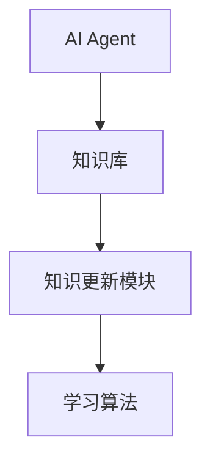
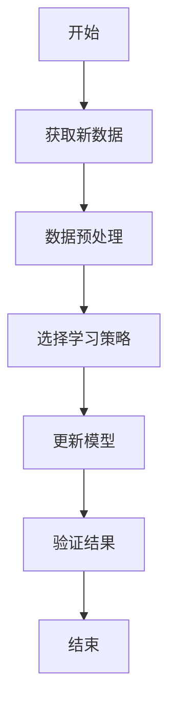

                 


# 构建具有持续学习与知识更新能力的AI Agent

## 关键词
AI Agent, 持续学习, 知识更新, 算法原理, 系统架构

## 摘要
本文详细探讨了构建具有持续学习与知识更新能力的AI Agent的关键技术。从问题背景到核心概念，再到算法原理和系统架构，系统地分析了实现这一目标的各个方面。文章通过实例分析和数学公式，深入浅出地解释了如何设计和实现一个能够不断优化自身知识库、适应新环境的AI Agent。最后，结合实际案例，总结了实现过程中的经验和最佳实践。

---

# 第一部分：构建具有持续学习与知识更新能力的AI Agent背景介绍

## 第1章：问题背景与描述

### 1.1 问题背景
随着人工智能技术的快速发展，AI Agent（智能体）在各个领域的应用越来越广泛。然而，传统AI Agent的知识库通常是静态的，无法应对快速变化的环境和新信息的涌入。这种静态知识库的局限性在实际应用中逐渐显现，尤其是在需要实时响应和动态决策的场景中。

#### 1.1.1 当前AI Agent的发展现状
- AI Agent广泛应用于自动驾驶、智能助手、推荐系统等领域。
- 知识库通常是基于规则或预训练模型构建的，缺乏动态更新能力。

#### 1.1.2 知识更新与持续学习的必要性
- 环境的变化（如政策法规更新、用户需求变化）要求AI Agent能够实时调整。
- 新数据的不断产生需要AI Agent能够持续学习和优化。

#### 1.1.3 传统AI Agent的局限性
- 静态知识库难以应对新问题。
- 缺乏动态学习机制，无法有效处理不确定性。

### 1.2 问题描述
本文旨在解决AI Agent在动态环境下的知识更新与持续学习问题，重点探讨如何设计和实现一种能够动态优化知识库、适应新环境的AI Agent。

---

## 第2章：问题解决与边界

### 2.1 问题解决思路
- 采用增量学习和微调学习等技术实现动态知识更新。
- 设计高效的算法机制，确保知识库的实时更新和模型的持续优化。

### 2.2 边界与外延
- 知识更新的边界条件：仅处理增量数据，不涉及已有数据的删除。
- 持续学习的适用范围：适用于数据分布变化较小的场景。

---

# 第二部分：核心概念与联系

## 第3章：核心概念与联系

### 3.1 核心概念原理
- **知识表示**：将知识以数据结构的形式存储，如向量、图结构。
- **持续学习**：通过在线学习算法不断优化模型。

### 3.2 核心概念对比表格
| 概念 | 描述 | 示例 |
|------|------|------|
| 知识表示 | 数据结构化存储 | 向量、图结构 |
| 持续学习 | 在线更新模型 | 微调、迁移学习 |

### 3.3 ER实体关系图


---

# 第三部分：算法原理讲解

## 第4章：持续学习算法原理

### 4.1 算法原理
- **增量学习**：逐步更新模型，避免重新训练。
- **微调学习**：在已有模型基础上进行局部优化。

### 4.2 算法流程图


### 4.3 算法数学模型
- 增量学习公式：
  $$\theta_{new} = \theta_{old} + \alpha \cdot (y - \hat{y})$$

---

# 第四部分：系统分析与架构设计

## 第5章：系统分析与架构设计

### 5.1 系统功能设计
- **领域模型**：定义系统各模块的交互关系。
  ```mermaid
  classDiagram
  class AI Agent {
    - knowledge_base
    - learning_module
  }
  ```

### 5.2 系统架构设计
- **架构图**：
  ```mermaid
  graph TD
  Agent[AI Agent] --> KB[knowledge_base]
  KB --> LM[learning_module]
  LM --> AL[algorithm]
  ```

---

# 第五部分：项目实战

## 第6章：项目实战

### 6.1 实现案例分析
- **环境安装**：安装必要的库，如TensorFlow、Keras。
- **核心代码实现**：
  ```python
  def incremental_learning(model, new_data):
      model.fit(new_data, epochs=1, verbose=0)
  ```

### 6.2 代码应用解读与分析
- 使用微调学习优化模型：
  ```python
  def fine_tuning(model, new_data):
      for layer in model.layers[:-1]:
          layer.trainable = False
      model.compile(optimizer='adam', loss='binary_crossentropy')
      model.fit(new_data, epochs=5, verbose=0)
  ```

---

## 第7章：总结与展望

### 7.1 总结
本文详细探讨了构建具有持续学习与知识更新能力的AI Agent的关键技术，包括算法原理、系统架构和项目实战。

### 7.2 展望
未来研究可以进一步优化算法，探索更高效的动态学习方法。

### 7.3 最佳实践 Tips
- 数据质量至关重要，确保新数据的准确性。
- 定期验证模型性能，及时调整学习策略。

---

# 作者：AI天才研究院 & 禅与计算机程序设计艺术

通过本文的系统分析和详细讲解，读者可以深入了解如何构建一个能够持续学习和优化知识库的AI Agent，为实际应用提供有力的技术支持。

