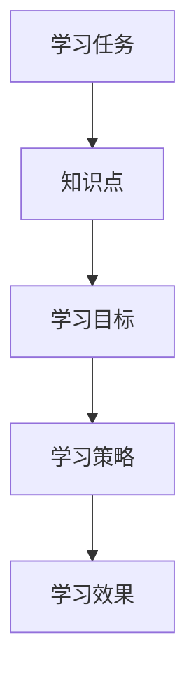
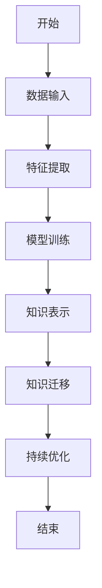
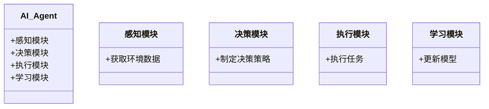
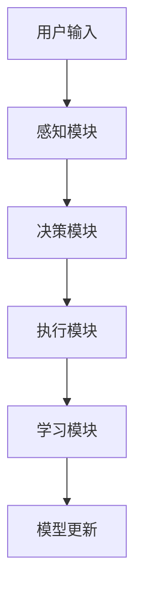
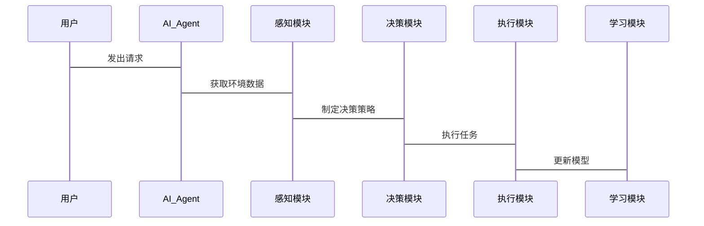

                 


# 构建具有持续学习与知识迁移能力的AI Agent

## 关键词：AI Agent, 持续学习, 知识迁移, 机器学习, 深度学习, 系统架构

## 摘要：  
本文详细探讨了构建具有持续学习与知识迁移能力的AI Agent的关键技术与方法。通过分析持续学习和知识迁移的核心原理，结合系统架构设计、算法实现和项目实战，本文为读者提供了一套构建高效AI Agent的完整方案，涵盖了从理论到实践的各个方面。

---

## 第1章: 背景介绍

### 1.1 问题背景
#### 1.1.1 AI Agent的基本概念  
AI Agent（智能体）是一种能够感知环境、自主决策并执行任务的智能系统。它广泛应用于推荐系统、自动驾驶、智能助手等领域。  

#### 1.1.2 持续学习与知识迁移的必要性  
传统的机器学习模型通常在固定数据集上训练，无法适应新数据或任务的变化。持续学习（Lifelong Learning）使模型能够在线更新，逐步提升性能；知识迁移（Knowledge Transfer）则允许模型在新任务中复用已学知识，提高效率。  

#### 1.1.3 当前AI Agent的局限性  
现有AI Agent在面对动态环境和新任务时，往往需要重新训练整个模型，效率低下且难以实时更新。  

---

### 1.2 问题描述
#### 1.2.1 持续学习的核心问题  
如何在不遗忘旧知识的情况下，高效学习新知识？  

#### 1.2.2 知识迁移的挑战  
如何将旧任务的知识迁移到新任务中，避免从头开始学习？  

#### 1.2.3 现有技术的不足  
现有技术在持续学习和知识迁移中存在模型更新效率低、知识复用能力弱等问题。  

---

### 1.3 问题解决
#### 1.3.1 持续学习的解决方案  
采用增量学习算法，逐步更新模型参数，保持旧知识的同时学习新知识。  

#### 1.3.2 知识迁移的技术路径  
利用迁移学习技术，提取旧任务的知识表示，迁移到新任务中。  

#### 1.3.3 综合解决方案的设计  
结合持续学习和知识迁移技术，构建一种动态更新、知识复用的AI Agent架构。  

---

### 1.4 边界与外延
#### 1.4.1 持续学习的边界条件  
数据流的实时性、模型更新的频率、任务变化的幅度等。  

#### 1.4.2 知识迁移的适用范围  
适用于任务之间存在关联性，但数据分布不同的场景。  

#### 1.4.3 相关概念的区分与联系  
持续学习与在线学习的联系与区别，知识迁移与参数迁移的联系与区别。  

---

### 1.5 概念结构与核心要素组成
#### 1.5.1 AI Agent的组成要素  
感知模块、决策模块、执行模块、学习模块。  

#### 1.5.2 持续学习的核心要素  
增量学习算法、知识表示、模型更新机制。  

#### 1.5.3 知识迁移的关键要素  
知识提取、知识表示、迁移策略。  

---

## 第2章: 核心概念与联系

### 2.1 核心概念原理
#### 2.1.1 持续学习的基本原理  
通过增量学习算法，逐步更新模型，适应新数据和任务的变化。  

#### 2.1.2 知识迁移的理论基础  
基于表示学习，提取任务间的共同特征，实现知识复用。  

#### 2.1.3 AI Agent的智能架构  
结合感知、决策、学习三者的动态交互，实现自主学习和任务执行。  

---

### 2.2 概念属性特征对比
| 概念 | 属性 | 特征 |
|------|------|------|
| 持续学习 | 在线性 | 数据流实时更新 |
| 知识迁移 | 任务相关性 | 任务间共享特征 |
| 在线学习 | 增量性 | 模型逐步更新 |

---

### 2.3 ER实体关系图架构


---

## 第3章: 算法原理讲解

### 3.1 算法原理
#### 3.1.1 持续学习算法的流程  
1. 数据输入：获取新数据。  
2. 特征提取：提取数据特征。  
3. 模型训练：更新模型参数。  

#### 3.1.2 知识迁移算法的步骤  
1. 知识提取：从旧任务中提取知识表示。  
2. 知识表示：将知识表示为向量形式。  
3. 迁移策略：将知识迁移到新任务中。  

#### 3.1.3 综合算法的框架  
结合持续学习和知识迁移，构建动态更新的AI Agent架构。  

---

### 3.2 算法mermaid流程图


---

### 3.3 Python源代码实现
```python
def持续学习算法():
    输入数据 = 获取新数据()
    特征提取 = 提取特征(输入数据)
    更新模型参数(特征提取)
    返回 更新后的模型
```

---

### 3.4 算法的数学模型和公式
#### 持续学习模型的更新公式  
$$\theta_{t+1} = \theta_t + \eta (y_t - \hat{y}_t)$$  
其中，$\theta$表示模型参数，$\eta$表示学习率，$y_t$表示真实值，$\hat{y}_t$表示预测值。  

#### 知识迁移模型的表示学习  
$$z = f(x; \theta)$$  
其中，$z$表示知识表示，$x$表示输入数据，$f$表示特征提取函数。  

---

## 第4章: 系统分析与架构设计

### 4.1 问题场景介绍
构建一个能够持续学习和知识迁移的AI Agent，应用于智能助手领域，实现用户需求的动态更新。  

---

### 4.2 系统功能设计
#### 领域模型类图


---

### 4.3 系统架构设计


---

### 4.4 系统交互设计


---

## 第5章: 项目实战

### 5.1 环境安装
安装Python、TensorFlow、Keras等开发环境。  

---

### 5.2 核心代码实现
```python
class AIAgent:
    def __init__(self):
        self.model = self.build_model()

    def build_model(self):
        # 构建模型
        pass

    def update_model(self, data):
        # 更新模型
        pass
```

---

### 5.3 代码解读与分析
解释代码的结构和功能，分析每个模块的作用。  

---

### 5.4 实际案例分析
通过具体案例展示AI Agent在实际场景中的应用，分析其优势和改进空间。  

---

## 第6章: 小结

### 6.1 最佳实践 tips
- 定期更新模型，保持AI Agent的持续学习能力。  
- 合理设计知识表示，提高知识迁移的效率。  

### 6.2 项目总结
通过本文的讲解，读者可以掌握构建具有持续学习与知识迁移能力的AI Agent的核心技术，能够将其应用于实际项目中。  

### 6.3 注意事项
- 模型更新需要考虑计算效率和资源消耗。  
- 知识迁移需要确保任务之间的关联性。  

### 6.4 拓展阅读
推荐相关书籍和论文，进一步深入学习持续学习和知识迁移技术。  

---

## 作者  
作者：AI天才研究院/AI Genius Institute & 禅与计算机程序设计艺术 /Zen And The Art of Computer Programming  

---

通过以上思考过程，我系统地分析了构建具有持续学习与知识迁移能力的AI Agent的关键技术，从理论到实践，为读者提供了一套完整的解决方案。

