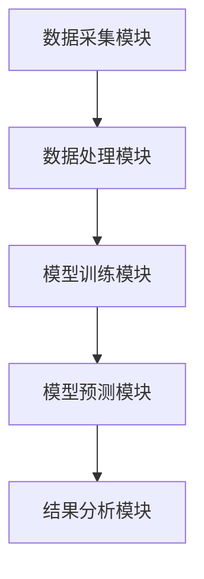
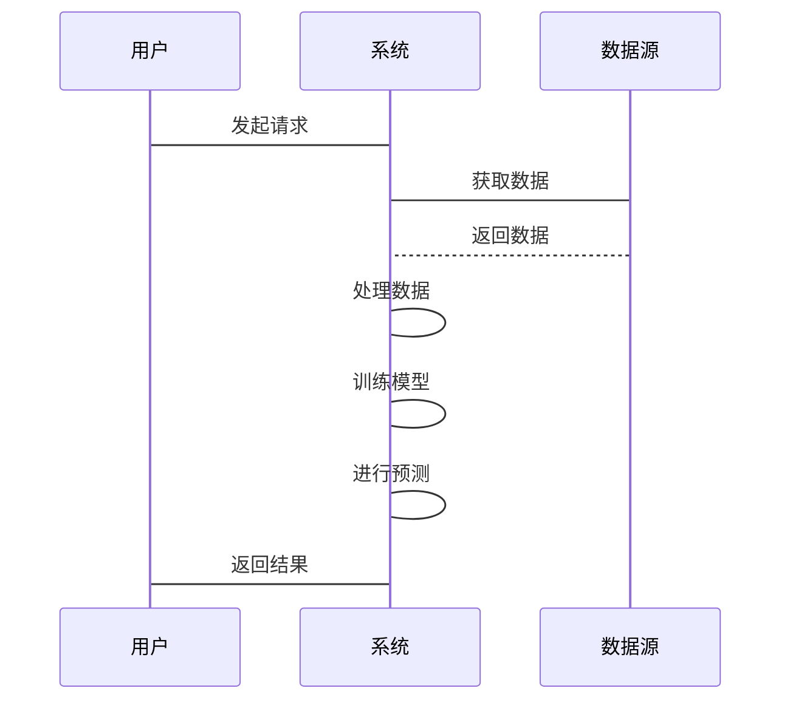

                 

# 构建具有时间序列分析能力的AI Agent

## 关键词
时间序列分析, AI Agent, 机器学习, 深度学习, 时间序列预测

## 摘要
本文详细探讨了如何构建具有时间序列分析能力的AI Agent。文章首先介绍了时间序列分析的基本概念和AI Agent的核心功能，然后深入分析了时间序列分析的核心算法及其在AI Agent中的应用。接着，文章详细讲解了AI Agent的系统架构设计，包括功能模块划分、系统架构图和交互流程。最后，通过一个具体的项目实战案例，展示了如何将理论应用于实践，帮助读者掌握构建具有时间序列分析能力的AI Agent的全过程。

---

# 第1章: 时间序列分析与AI Agent的背景

## 1.1 时间序列分析的定义与特点
### 1.1.1 时间序列的定义
时间序列是指按时间顺序排列的数据点组成的序列，例如股票价格、天气温度、用户行为数据等。时间序列分析是对这些数据进行建模和预测的过程。

### 1.1.2 时间序列的核心特点
- **有序性**：数据按时间顺序排列，具有时间依赖性。
- **趋势性**：数据可能呈现长期上升或下降的趋势。
- **周期性**：数据可能受到季节性或周期性因素的影响。
- **随机性**：数据中可能包含不可预测的随机波动。

### 1.1.3 时间序列的分类与应用场景
时间序列可以分为平稳序列和非平稳序列。平稳序列具有恒定的均值和方差，而非平稳序列则表现出趋势或周期性变化。时间序列分析广泛应用于金融、气象、医疗和交通等领域。

---

## 1.2 AI Agent的基本概念
### 1.2.1 AI Agent的定义
AI Agent是一种智能体，能够感知环境、自主决策并执行任务。它能够根据输入的数据和目标，做出合理的决策和行动。

### 1.2.2 AI Agent的核心功能
- **感知环境**：通过传感器或其他数据源获取信息。
- **数据处理**：对获取的数据进行清洗、转换和分析。
- **决策制定**：基于分析结果，做出决策。
- **执行行动**：根据决策执行相应的操作。

### 1.2.3 AI Agent与传统软件的区别
AI Agent具有自主性、反应性和目标性，能够根据环境变化动态调整行为，而传统软件通常是静态的，缺乏自主决策能力。

---

## 1.3 时间序列分析在AI Agent中的重要性
### 1.3.1 时间序列分析对AI Agent的意义
时间序列分析使AI Agent能够理解数据的时间依赖性，从而做出更准确的预测和决策。

### 1.3.2 时间序列分析在AI Agent中的应用场景
- **金融领域**：股票价格预测、风险管理。
- **气象领域**：天气预测、气候模型。
- **医疗领域**：患者健康监测、疾病预测。

### 1.3.3 时间序列分析对AI Agent能力的提升
通过时间序列分析，AI Agent能够更好地处理具有时间依赖性的数据，提高预测的准确性和决策的及时性。

---

# 第2章: 时间序列分析与AI Agent的核心概念

## 2.1 时间序列分析的核心原理
### 2.1.1 时间序列分析的基本步骤
1. **数据收集**：获取时间序列数据。
2. **数据预处理**：清洗数据，处理缺失值和异常值。
3. **模型选择**：根据数据特点选择合适的分析模型。
4. **模型训练**：基于训练数据拟合模型。
5. **模型预测**：使用模型进行未来值的预测。

### 2.1.2 时间序列分析的关键指标
- **均值**：数据的平均值。
- **方差**：数据的离散程度。
- **自相关性**：数据点之间的相关性。

### 2.1.3 时间序列分析的数学模型
时间序列分析可以使用ARIMA模型，其数学公式为：
$$ ARIMA(p, d, q) $$
其中，$p$是自回归阶数，$d$是差分阶数，$q$是移动平均阶数。

---

## 2.2 AI Agent的核心功能与模块
### 2.2.1 数据采集模块
AI Agent通过传感器或API获取实时数据。

### 2.2.2 数据处理模块
对获取的数据进行清洗、转换和标准化处理。

### 2.2.3 模型训练模块
使用时间序列算法对数据进行建模和训练。

### 2.2.4 模型预测模块
基于训练好的模型进行未来值的预测。

### 2.2.5 结果分析与反馈模块
对预测结果进行分析，并根据反馈调整模型参数。

---

## 2.3 时间序列分析与AI Agent的结合
### 2.3.1 时间序列分析在AI Agent中的应用流程
1. **数据采集**：获取时间序列数据。
2. **数据处理**：清洗和预处理数据。
3. **模型训练**：选择合适的算法训练模型。
4. **模型预测**：基于模型进行预测。
5. **结果分析**：分析预测结果并反馈。

### 2.3.2 时间序列分析与AI Agent的交互机制
AI Agent通过时间序列分析模块与外部环境交互，实时感知环境变化并做出决策。

### 2.3.3 时间序列分析对AI Agent决策能力的提升
通过时间序列分析，AI Agent能够更好地理解数据的时间依赖性，提高预测和决策的准确性。

---

# 第3章: 时间序列分析的核心算法与实现

## 3.1 时间序列分析的经典算法
### 3.1.1 ARIMA模型
ARIMA模型是一种广泛应用于时间序列分析的统计模型，其数学公式为：
$$ ARIMA(p, d, q) $$
其中，$p$是自回归阶数，$d$是差分阶数，$q$是移动平均阶数。

### 3.1.2 LSTM网络
LSTM（长短期记忆网络）是一种基于深度学习的时间序列分析算法，具有处理长序列数据的能力。

### 3.1.3 Prophet模型
Prophet模型是由Facebook开源的时间序列预测工具，适用于具有较强周期性的数据。

### 3.1.4 其他时间序列分析算法
包括指数平滑法（ES）、自回归移动平均模型（ARMA）等。

---

## 3.2 时间序列分析算法的优缺点对比

| 算法名称 | 优点 | 缺点 |
|----------|------|------|
| ARIMA    | 统计基础，易于解释 | 对异常值敏感，需要选择合适的阶数 |
| LSTM     | 处理长序列，捕捉复杂模式 | 需要大量数据，计算复杂 |
| Prophet   | 易于使用，适合业务数据 | 对异常值敏感，需要调整参数 |

---

# 第4章: AI Agent的系统架构设计

## 4.1 系统功能设计
AI Agent的系统功能模块包括数据采集、数据处理、模型训练、模型预测和结果分析。

### 4.1.1 数据采集模块
- **数据源**：传感器、数据库、API接口。
- **数据格式**：结构化数据、非结构化数据。

### 4.1.2 数据处理模块
- **数据清洗**：处理缺失值、异常值。
- **数据转换**：数据归一化、特征提取。

### 4.1.3 模型训练模块
- **算法选择**：根据数据特点选择合适的算法。
- **模型训练**：使用训练数据拟合模型。

### 4.1.4 模型预测模块
- **预测过程**：基于训练好的模型进行预测。
- **预测结果**：输出预测值和置信区间。

### 4.1.5 结果分析模块
- **结果评估**：计算预测误差，如均方误差（MSE）。
- **反馈机制**：根据反馈调整模型参数。

---

## 4.2 系统架构设计
### 4.2.1 系统架构图

### 4.2.2 系统接口设计
- **输入接口**：接收外部数据和指令。
- **输出接口**：输出预测结果和反馈信息。

### 4.2.3 系统交互流程

---

## 4.3 项目实战

### 4.3.1 环境安装
安装所需的Python库，如pandas、numpy、sklearn、keras等。

### 4.3.2 数据准备
获取时间序列数据，例如股票价格数据。

### 4.3.3 模型训练
选择合适的算法进行训练，例如使用LSTM网络。

### 4.3.4 模型预测
基于训练好的模型进行预测，并输出结果。

### 4.3.5 结果分析
评估预测结果的准确性，并根据反馈调整模型参数。

---

# 第5章: 总结与展望

## 5.1 总结
本文详细介绍了如何构建具有时间序列分析能力的AI Agent，涵盖了时间序列分析的基本概念、核心算法、系统架构设计以及项目实战等内容。

## 5.2 未来展望
未来，随着深度学习技术的不断发展，时间序列分析在AI Agent中的应用将更加广泛和深入。可以通过集成多种算法、优化模型结构等方式，进一步提高预测的准确性和效率。

## 5.3 最佳实践 tips
- 在选择算法时，需根据数据特点和应用场景进行综合考虑。
- 数据预处理是关键步骤，需仔细清洗和转换数据。
- 模型调优是提高预测准确性的有效方法。

---

作者：AI天才研究院/AI Genius Institute & 禅与计算机程序设计艺术 /Zen And The Art of Computer Programming

