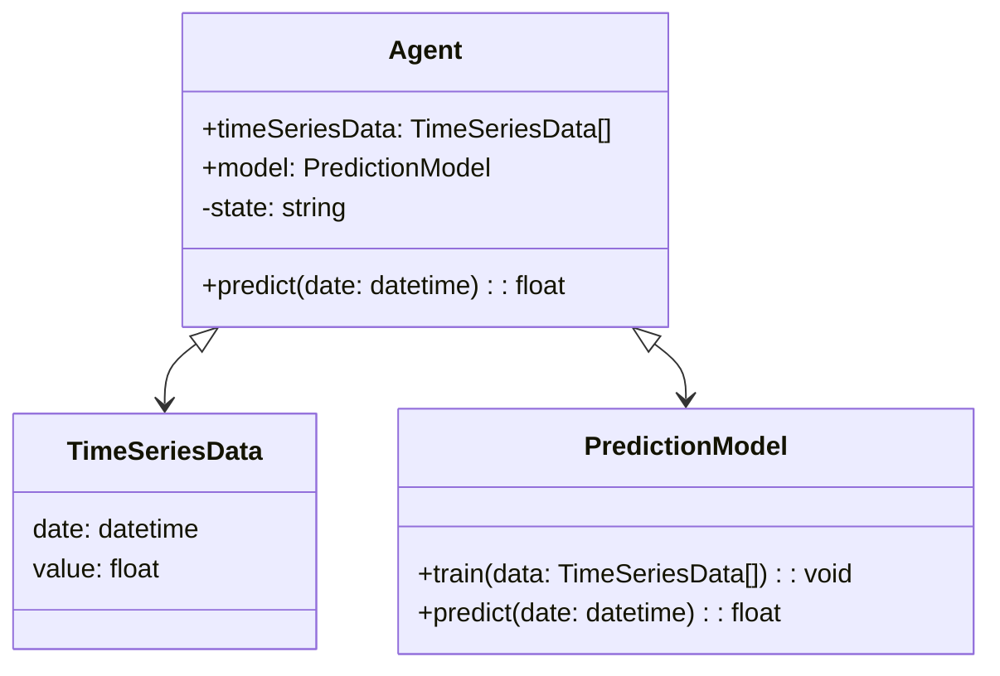
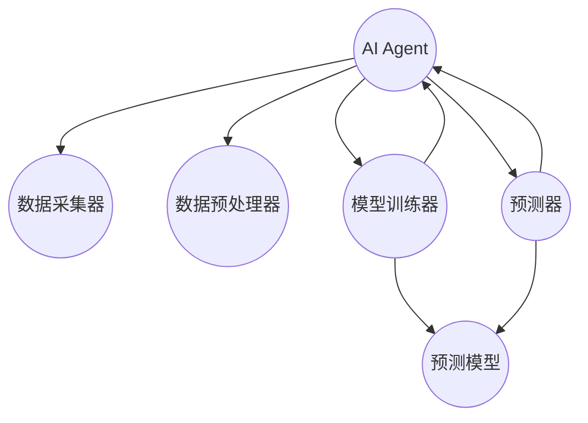
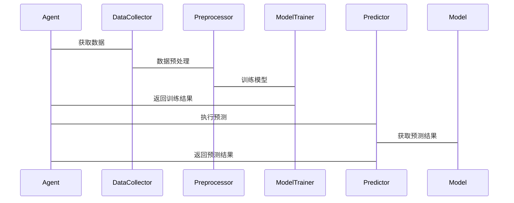

                 

# 构建具有时间序列预测能力的AI Agent

> 关键词：时间序列预测，AI Agent，ARIMA，LSTM，Prophet，系统架构设计

> 摘要：本文深入探讨了如何构建具有时间序列预测能力的AI Agent，从时间序列预测的基本概念到经典算法的数学模型，再到系统架构设计和项目实战，为读者提供了全面的指导。通过详细分析ARIMA、LSTM和Prophet等算法的原理和应用场景，结合系统的功能设计、架构设计和交互流程，最终实现了一个基于时间序列预测的AI Agent系统。

---

## 第1章: 时间序列预测的基本概念

### 1.1 时间序列预测的定义与特点

时间序列预测是一种利用历史数据预测未来趋势的技术，其核心是分析数据中的时间依赖性。时间序列预测的定义可以简单理解为：基于过去观测到的数据，预测系统未来状态的方法。时间序列预测具有以下特点：

- **连续性**：数据按时间顺序排列，每个时间点的值与前后时间点密切相关。
- **时序性**：依赖于时间的顺序，数据的内在关系随着时间变化而变化。
- **预测性**：通过模型捕捉数据中的模式，预测未来的值。

时间序列预测的应用场景非常广泛，如股票价格预测、天气预报、销售预测、设备故障预测等。这些场景都需要利用历史数据，预测未来的变化趋势。

### 1.2 AI Agent的基本概念

AI Agent（智能体）是指在计算系统中代表某个利益相关者行事的智能实体。它能够感知环境、自主决策，并采取行动以实现目标。AI Agent的核心功能包括：

- **感知环境**：通过传感器或数据输入获取环境信息。
- **决策制定**：基于获取的信息，分析并制定决策。
- **行动执行**：根据决策结果，执行相应的操作。

AI Agent的应用领域非常广泛，如智能助手（Siri、Alexa）、自动驾驶汽车、推荐系统、工业自动化等。这些应用都需要AI Agent具备强大的数据处理和决策能力。

### 1.3 时间序列预测在AI Agent中的作用

时间序列预测在AI Agent中扮演着重要角色。通过时间序列预测，AI Agent可以基于历史数据预测未来的趋势，从而做出更智能的决策。例如，在股票交易中，AI Agent可以通过时间序列预测模型预测股票价格的未来走势，从而制定买卖策略。

时间序列预测对AI Agent的能力提升主要体现在以下几个方面：

- **增强决策能力**：通过预测未来趋势，AI Agent可以提前做出优化决策。
- **提高系统效率**：通过预测资源需求，AI Agent可以优化资源配置，提高系统效率。
- **增强用户体验**：通过预测用户行为，AI Agent可以提供更个性化的服务，提升用户体验。

---

## 第2章: 时间序列预测的核心概念与联系

### 2.1 时间序列预测的核心原理

时间序列预测的核心原理是通过数学模型捕捉数据中的时间依赖性。常见的模型包括ARIMA、LSTM和Prophet等。这些模型的核心思想是通过分析数据的模式，预测未来的趋势。

时间序列预测的主要方法可以分为两类：

1. **传统统计方法**：如ARIMA模型，基于假设数据的平稳性，通过差分等方法消除趋势和季节性。
2. **机器学习方法**：如LSTM和Prophet模型，利用深度学习技术捕捉数据中的复杂模式。

### 2.2 时间序列预测与AI Agent的关系

时间序列预测与AI Agent的关系可以分为以下几个方面：

1. **数据输入**：AI Agent可以通过时间序列预测模型，将历史数据作为输入，预测未来的趋势。
2. **决策支持**：AI Agent可以利用时间序列预测结果，优化决策过程。
3. **实时反馈**：AI Agent可以通过实时更新的时间序列预测结果，动态调整其行为。

时间序列预测与AI Agent的结合，使得AI Agent能够更好地适应动态变化的环境，提高其智能性和实用性。

### 2.3 时间序列预测的核心要素

时间序列预测的核心要素包括：

1. **数据特征**：数据的平稳性、趋势、季节性等特征直接影响模型的选择和性能。
2. **模型选择**：不同的模型适用于不同的数据特征，选择合适的模型是时间序列预测的关键。
3. **性能评估**：通过均方误差（MSE）、平均绝对误差（MAE）等指标，评估模型的预测性能。

---

## 第3章: 时间序列预测的经典算法

### 3.1 ARIMA模型

ARIMA（自回归积分滑动平均模型）是一种广泛应用于时间序列预测的传统统计模型。ARIMA模型的定义如下：

$$ ARIMA(p, d, q) $$

其中，p为自回归阶数，d为差分阶数，q为滑动平均阶数。

ARIMA模型的核心思想是通过差分消除数据中的趋势和季节性，然后利用自回归和滑动平均模型捕捉数据的依赖性。ARIMA模型的工作流程如下：

1. **数据预处理**：对数据进行差分，使数据平稳化。
2. **模型选择**：通过参数估计确定p、d、q的值。
3. **模型训练**：利用历史数据训练模型，估计模型参数。
4. **预测**：利用训练好的模型，预测未来的时间序列值。

ARIMA模型的优缺点如下：

- **优点**：适用于平稳时间序列数据，模型简单，易于解释。
- **缺点**：对非平稳数据和复杂模式的捕捉能力有限。

### 3.2 LSTM网络

LSTM（长短期记忆网络）是一种基于深度学习的时间序列预测模型。LSTM网络的基本结构如下：

$$ f_t = \sigma(g_t) $$

$$ i_t = \sigma(W_i x_t + U_i h_{t-1}) $$

$$ o_t = \sigma(W_o x_t + U_o h_{t-1}) $$

$$ h_t = f_t \cdot c_t $$

$$ c_t = i_t \cdot c_{t-1} + f_t \cdot g_t $$

其中，$x_t$是输入数据，$h_t$是隐藏状态，$c_t$是细胞状态，$f_t$是遗忘门，$i_t$是输入门，$o_t$是输出门，$\sigma$是sigmoid函数。

LSTM网络的核心思想是通过门控机制，解决传统RNN模型在处理长序列数据时的梯度消失问题。LSTM网络的工作流程如下：

1. **输入数据**：将时间序列数据输入LSTM网络。
2. **门控计算**：计算遗忘门、输入门和输出门。
3. **细胞状态更新**：根据门控结果更新细胞状态。
4. **隐藏状态更新**：根据细胞状态和输出门计算隐藏状态。
5. **输出预测**：根据隐藏状态输出预测结果。

LSTM网络的优缺点如下：

- **优点**：适用于复杂时间序列数据，能够捕捉长距离依赖性。
- **缺点**：模型复杂，训练时间较长，参数较多。

### 3.3 Prophet模型

Prophet模型是由Facebook开源的一种时间序列预测模型。Prophet模型的核心组件包括：

1. **趋势曲线**：捕捉数据中的长期趋势。
2. **周期性组件**：捕捉数据中的季节性波动。
3. **噪声项**：捕捉数据中的随机波动。

Prophet模型的工作流程如下：

1. **数据预处理**：将时间序列数据格式化为日期和数值格式。
2. **模型训练**：利用历史数据训练Prophet模型。
3. **模型预测**：利用训练好的模型，预测未来的时间序列值。

Prophet模型的优缺点如下：

- **优点**：模型简单，易于使用，适用于非平稳时间序列数据。
- **缺点**：对异常值的鲁棒性较差，模型解释性较弱。

---

## 第4章: 时间序列预测的数学模型与公式

### 4.1 ARIMA模型的数学公式

ARIMA模型的数学公式如下：

$$ (1 - L)^d (1 - L)^p y_t = \theta(B) a_t $$

其中，$L$是延迟算子，$d$是差分阶数，$p$是自回归阶数，$\theta(B)$是多项式系数，$a_t$是白噪声。

ARIMA模型的预测公式如下：

$$ \hat{y}_{t+k} = \frac{1}{2\pi} \int_{-\pi}^{\pi} \phi(\lambda)^k e^{i\lambda t} d\lambda $$

### 4.2 LSTM网络的数学公式

LSTM网络的数学公式如下：

$$ f_t = \sigma(W_f x_t + U_f h_{t-1} + b_f) $$

$$ i_t = \sigma(W_i x_t + U_i h_{t-1} + b_i) $$

$$ o_t = \sigma(W_o x_t + U_o h_{t-1} + b_o) $$

$$ c_t = f_t c_{t-1} + i_t g_t $$

$$ h_t = o_t \tanh(c_t) $$

其中，$W$、$U$、$b$分别是权重矩阵、递归矩阵和偏置项，$\sigma$是sigmoid函数，$g_t$是候选细胞状态。

### 4.3 Prophet模型的数学公式

Prophet模型的数学公式如下：

$$ y_t = g(t) + s_t + \epsilon_t $$

其中，$g(t)$是趋势曲线，$s_t$是周期性组件，$\epsilon_t$是噪声项。

---

## 第5章: 时间序列预测在AI Agent中的系统分析与架构设计

### 5.1 系统功能设计

AI Agent的时间序列预测系统需要具备以下功能：

1. **数据采集**：从外部数据源获取时间序列数据。
2. **数据预处理**：对数据进行清洗、格式化和标准化处理。
3. **模型训练**：利用预处理后的数据训练时间序列预测模型。
4. **模型预测**：根据训练好的模型，预测未来的时间序列值。
5. **结果输出**：将预测结果输出给AI Agent的其他模块或用户。

系统功能设计的领域模型如下：

### 5.2 系统架构设计

AI Agent的时间序列预测系统架构如下：

### 5.3 接口设计与交互流程

系统接口设计的交互流程如下：

---

## 第6章: 项目实战: 基于时间序列预测的AI Agent实现

### 6.1 项目背景与目标

本项目的目标是基于时间序列预测，构建一个能够预测股票价格的AI Agent。项目背景如下：

- **项目目标**：实现一个能够预测股票价格的AI Agent，帮助投资者做出投资决策。
- **技术选型**：选择LSTM模型作为时间序列预测算法，结合K线图数据进行预测。
- **数据来源**：使用某股票的历史交易数据，包括开盘价、收盘价、最高价、最低价和成交量。

### 6.2 环境配置与数据准备

项目环境配置如下：

- **开发工具**：Python 3.8、Jupyter Notebook
- **库依赖**：TensorFlow 2.5、Keras 2.5、Pandas 1.3、Matplotlib 3.3

数据准备步骤如下：

1. **数据下载**：从Yahoo Finance下载股票的历史交易数据。
2. **数据预处理**：将数据格式化为K线图数据，并进行归一化处理。
3. **数据分割**：将数据分为训练集和测试集。

### 6.3 模型实现与优化

模型实现步骤如下：

1. **模型定义**：定义LSTM网络模型，包括输入层、LSTM层和输出层。
2. **模型训练**：利用训练集数据训练模型，调整模型参数。
3. **模型优化**：通过网格搜索优化模型超参数，如学习率、批量大小等。

### 6.4 系统实现与测试

系统实现步骤如下：

1. **数据采集**：从Yahoo Finance获取实时股票数据。
2. **数据预处理**：将数据格式化为模型输入格式。
3. **模型预测**：利用训练好的模型，预测股票价格。
4. **结果分析**：将预测结果与实际价格进行对比，评估模型性能。

### 6.5 项目总结与经验分享

项目总结如下：

- **项目成果**：成功构建了一个能够预测股票价格的AI Agent系统。
- **经验分享**：
  - 数据预处理是关键，尤其是数据的归一化和格式化。
  - 模型选择和超参数优化对预测性能有重要影响。
  - 系统架构设计需要考虑数据流和模块之间的交互。

---

## 第7章: 最佳实践与未来展望

### 7.1 最佳实践 tips

- **数据预处理**：确保数据的完整性和准确性，进行适当的数据清洗和特征工程。
- **模型选择**：根据数据特征选择合适的模型，进行模型对比和调优。
- **系统架构**：设计清晰的系统架构，确保模块之间的松耦合和可扩展性。

### 7.2 小结

时间序列预测是构建具有智能决策能力的AI Agent的重要技术。通过本文的探讨，读者可以深入了解时间序列预测的核心概念、算法原理和系统架构设计，并通过项目实战掌握时间序列预测的实现方法。

### 7.3 注意事项

- **数据质量问题**：确保数据的准确性和完整性，避免异常值对模型的影响。
- **模型选择**：根据具体场景选择合适的模型，避免盲目追求复杂模型。
- **系统优化**：关注模型的训练效率和预测性能，进行适当的优化。

### 7.4 拓展阅读

- **书籍推荐**：
  - 《Deep Learning》（Ian Goodfellow 等著）
  - 《Time Series Analysis and Its Applications》（Shumway & Stoffer 著）
- **在线资源**：
  - TensorFlow官方文档（https://tensorflow.org）
  - Keras官方文档（https://keras.io）

---

作者：AI天才研究院/AI Genius Institute & 禅与计算机程序设计艺术 /Zen And The Art of Computer Programming

