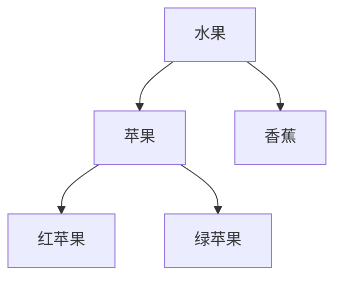
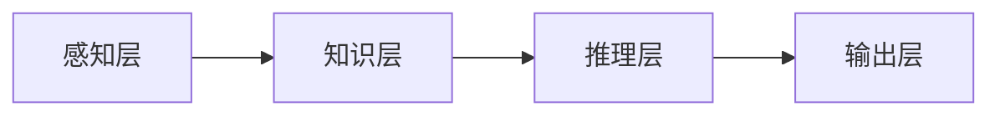

                 


# 构建具有概念学习能力的AI Agent

> **关键词**：概念学习、AI Agent、知识图谱、概念网络、机器学习、深度学习、知识表示  
> **摘要**：概念学习是AI Agent的核心能力之一，本文从背景、原理、算法、系统架构到实战案例，全面解析如何构建具有概念学习能力的AI Agent，帮助读者掌握从理论到实践的完整流程。

---

## 第一部分: 概念学习与AI Agent的背景

### 第1章: 概念学习的背景与问题描述

#### 1.1 什么是概念学习
概念学习是一种通过归纳推理从实例中提取抽象概念的能力。与传统的分类任务不同，概念学习不仅关注具体的分类结果，更关注概念的表示、关联和推理。例如，从“狗”、“猫”、“鸟”等实例中，提取出“动物”这一更高层次的概念。

#### 1.2 AI Agent的基本概念
AI Agent（智能体）是一种能够感知环境、自主决策并执行任务的实体。AI Agent可以是软件程序、机器人或其他智能系统。概念学习能力是AI Agent实现复杂任务（如问题解决、知识推理）的关键能力。

#### 1.3 概念学习的挑战与机遇
- **挑战**：概念学习需要处理数据的不确定性、语义的模糊性以及概念的动态变化。
- **机遇**：概念学习能够提升AI Agent的可解释性和泛化能力，使其在教育、医疗、金融等领域有更广泛的应用。

---

## 第二部分: 概念学习的核心概念与联系

### 第2章: 概念网络与概念关联

#### 2.1 概念网络的构建原理
概念网络是一种用于表示概念及其关系的图结构。节点代表概念，边表示概念之间的关系（如“属于”、“部分”）。例如，概念“水果”可以包含“苹果”、“香蕉”等子概念。



#### 2.2 概念与实例的关系
- **概念与实例的关系**：概念是对实例的抽象，实例是概念的具象化。
- **例子**：概念“鸟”可以包含实例“鸽子”、“燕子”。

#### 2.3 概念之间的关联与推理
- **关联类型**：包含、并列、因果等。
- **推理规则**：基于概念之间的关系进行推理，例如“如果A是B的子概念，那么A的所有实例都属于B”。

---

### 第3章: 概念学习的核心要素与属性对比

#### 3.1 概念学习的核心要素
- **层次性**：概念可以嵌套，形成层级结构。
- **可解释性**：概念需要能够被人类理解和解释。
- **动态更新**：概念网络需要根据新数据进行动态调整。

#### 3.2 概念与知识图谱的对比
| 属性 | 概念网络 | 知识图谱 |
|------|----------|----------|
| 表示形式 | 图结构，注重概念间关系 | 图结构，注重实体间关系 |
| 数据来源 | 实例化数据 | 结构化知识库 |
| 应用场景 | 概念推理、分类 | 实体链接、语义搜索 |

---

## 第三部分: 概念学习的算法原理

### 第4章: 概念提取与概念网络构建算法

#### 4.1 概念提取算法
- **基于统计的文本挖掘方法**：利用词频、TF-IDF等方法提取关键词。
- **基于深度学习的概念提取模型**：如BERT、GPT等预训练模型，通过上下文理解提取概念。

#### 4.2 概念网络构建算法
- **层次聚类**：将相似的概念聚类，形成层级结构。
- **关联规则学习**：挖掘概念之间的关联规则。

---

### 第5章: 概念网络的优化与推理算法

#### 5.1 概念网络的优化算法
- **基于规则的优化**：通过人工规则消除概念网络中的冗余。
- **基于度量的优化**：利用信息论度量（如互信息）优化概念网络结构。

#### 5.2 概念推理算法
- **基于规则的推理**：根据概念之间的关系进行推理。
- **基于逻辑的推理**：使用一阶逻辑进行形式推理。

---

## 第四部分: 系统分析与架构设计

### 第6章: 概念学习AI Agent的系统架构

#### 6.1 系统功能设计
- **感知层**：接收输入数据并进行预处理。
- **知识层**：存储和管理概念网络。
- **推理层**：基于概念网络进行推理和决策。

#### 6.2 系统架构图



---

## 第五部分: 项目实战

### 第7章: 构建一个简单的概念学习AI Agent

#### 7.1 环境安装
```bash
pip install numpy
pip install networkx
pip install matplotlib
```

#### 7.2 核心代码实现
```python
import networkx as nx
import matplotlib.pyplot as plt

# 创建概念网络
G = nx.DiGraph()
G.add_edge("动物", "狗")
G.add_edge("狗", "哈士奇")
G.add_edge("动物", "鸟")
G.add_edge("鸟", "鸽子")

# 可视化概念网络
nx.draw(G, with_labels=True, edge_dir="forward")
plt.show()
```

#### 7.3 案例分析与解读
以“动物”概念为例，通过概念网络构建，AI Agent能够识别“狗”是“动物”的子概念，并进一步识别“哈士奇”是“狗”的子概念。

---

## 第六部分: 总结与展望

### 第8章: 总结与最佳实践

#### 8.1 总结
概念学习是构建智能AI Agent的核心能力之一。通过概念网络和推理算法，AI Agent能够实现知识的表示、推理和动态更新。

#### 8.2 最佳实践
- **数据质量**：确保训练数据的多样性和代表性。
- **算法选择**：根据任务需求选择合适的概念提取和推理算法。
- **可解释性**：注重概念网络的可解释性，避免“黑箱”模型。

#### 8.3 拓展阅读
- 《Conceptual Spaces: The Geometry of Human Conceptualization》
- 《Knowledge Graphs and Conceptual Networks: A Unified Framework》

---

## 作者信息

作者：AI天才研究院 & 禅与计算机程序设计艺术

