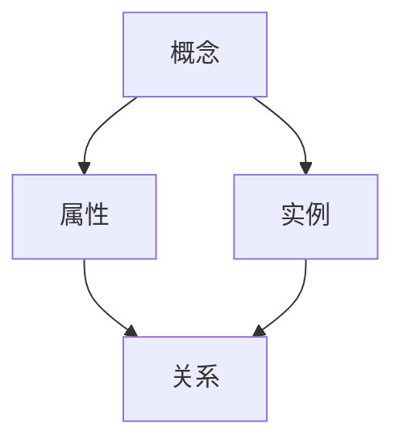
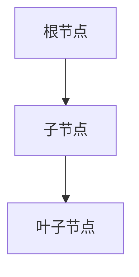
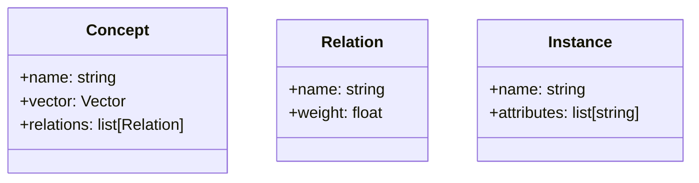
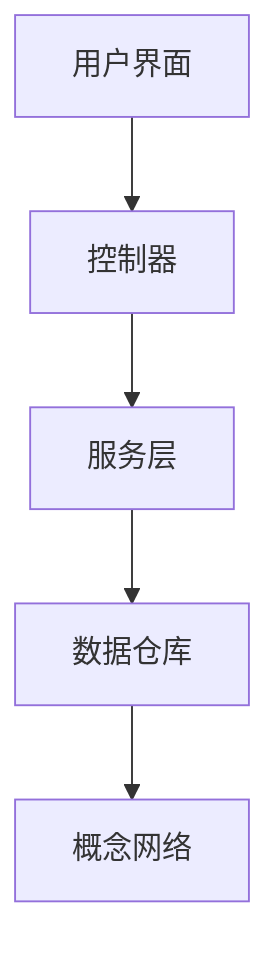
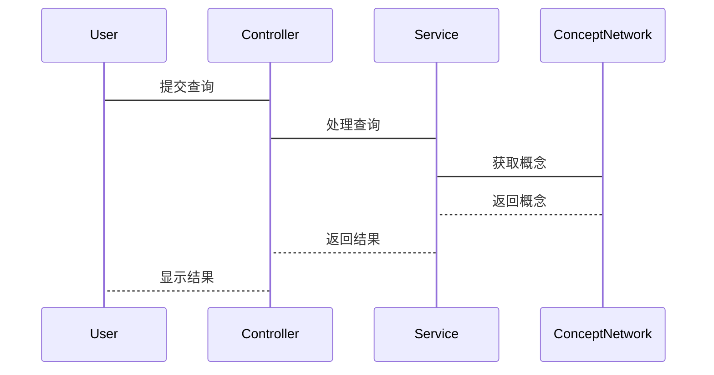

                 


# 构建具有概念学习能力的AI Agent

## 关键词：概念学习, AI Agent, 知识图谱, 概念网络, 概念表示

## 摘要：  
本文旨在探讨如何构建具有概念学习能力的AI Agent，通过详细分析概念学习的核心原理、算法实现、系统架构及实际应用案例，帮助读者理解概念学习在AI Agent中的重要性，并掌握其实现方法。

---

# 第1章：概念学习与AI Agent的背景介绍

## 1.1 概念学习的背景与问题背景

### 1.1.1 从传统AI到概念学习的演进  
传统AI主要依赖于规则和数据驱动的模型，而概念学习的引入为AI Agent带来了更高级的推理和理解能力。通过概念学习，AI Agent能够从数据中提取出更高层次的知识，从而更好地理解和处理复杂的现实问题。

### 1.1.2 概念学习的核心问题与挑战  
概念学习的核心问题在于如何从数据中提取出抽象的概念，并建立概念之间的关联关系。这一过程涉及复杂的知识表示、推理和学习算法，是当前AI研究中的重要方向。

### 1.1.3 概念学习在AI Agent中的重要性  
概念学习能够提升AI Agent的理解能力、推理能力和适应能力，使其能够更好地与人类交互并处理复杂任务。

## 1.2 概念学习的定义与问题描述

### 1.2.1 概念学习的定义  
概念学习是一种通过从数据中提取和建立概念网络，实现对知识的表示和推理的学习方法。

### 1.2.2 概念学习的核心问题  
概念学习的核心问题是如何从数据中构建概念网络，并通过网络中的概念关联进行推理和学习。

### 1.2.3 概念学习的边界与外延  
概念学习的边界在于如何从具体数据中提取抽象概念，而外延则涉及如何将概念网络应用于实际问题中。

## 1.3 概念学习的核心要素与组成

### 1.3.1 概念网络的构建  
概念网络的构建是概念学习的核心任务，包括概念的识别、提取和关联。

### 1.3.2 概念表示与关联  
概念表示是通过符号或向量的方式对概念进行描述，概念关联则是指概念之间的关系建模。

### 1.3.3 概念学习的核心模型  
概念学习的核心模型包括向量空间模型、概念网络模型和知识图谱模型。

---

# 第2章：概念学习的核心概念与联系

## 2.1 概念学习的原理与机制

### 2.1.1 概念网络的构建原理  
概念网络的构建基于数据中的概念实例和属性，通过层次化或分布式的方法建立概念之间的关联。

### 2.1.2 概念表示的数学模型  
概念表示的数学模型通常采用向量空间模型，其中每个概念对应一个向量，向量的维度表示概念的属性特征。

### 2.1.3 概念学习的算法框架  
概念学习的算法框架包括概念识别、概念提取和概念关联三个主要步骤。

## 2.2 概念学习的核心概念对比

### 2.2.1 概念与知识图谱的对比  
概念是知识图谱中的基本单元，知识图谱为概念提供了语义关联和上下文信息。

### 2.2.2 概念网络与传统机器学习模型的对比  
概念网络是一种符号化知识表示方法，而传统机器学习模型基于统计学习方法。

### 2.2.3 概念学习与符号推理的对比  
概念学习通过数据驱动的方式提取概念，符号推理则是基于规则的推理方法。

## 2.3 概念学习的ER实体关系图



---

# 第3章：概念学习的算法原理与实现

## 3.1 向量空间模型与概念表示

### 3.1.1 向量空间模型的数学公式  
$$v_i = \sum_{j=1}^{n} w_{ij} \cdot v_j$$  
其中，$v_i$ 是第 $i$ 个概念的向量表示，$w_{ij}$ 是第 $i$ 个概念与第 $j$ 个概念之间的关联权重。

### 3.1.2 概念表示的实现方法  
通过Word2Vec或GloVe等词向量模型，将概念表示为高维向量。

### 3.1.3 概念网络的构建算法  
基于层次聚类或分布式表示的方法，构建概念网络。

## 3.2 概念网络构建的算法实现

### 3.2.1 基于层次分析法的网络构建  


### 3.2.2 概念网络的层次  
概念网络的层次包括根节点、子节点和叶子节点，分别对应抽象概念、中间概念和具体实例。

---

# 第4章：概念学习的系统分析与架构设计

## 4.1 系统功能设计

### 4.1.1 领域模型设计  


### 4.1.2 系统架构设计  


### 4.1.3 系统接口设计  
系统接口包括概念提取接口、概念关联接口和概念推理接口。

## 4.2 系统交互设计



---

# 第5章：概念学习的项目实战

## 5.1 环境安装与配置

### 5.1.1 环境安装  
安装Python、TensorFlow、Gensim等依赖库。

### 5.1.2 数据集准备  
准备用于概念学习的数据集，例如文本数据或知识图谱数据。

## 5.2 核心代码实现

### 5.2.1 概念提取代码  
```python
def extract_concepts(text):
    # 实现概念提取算法
    pass
```

### 5.2.2 概念网络构建代码  
```python
def build_concept_network(concepts):
    # 实现概念网络构建算法
    pass
```

## 5.3 案例分析与实际应用

### 5.3.1 案例分析  
通过具体案例分析，展示概念学习在实际问题中的应用效果。

### 5.3.2 实际应用  
将概念学习应用于实际场景中，例如自然语言处理或知识推理。

## 5.4 项目小结

### 5.4.1 项目总结  
总结项目实施过程中的经验与教训。

### 5.4.2 项目成果  
展示项目成果，包括概念网络的构建和应用效果。

---

# 第6章：概念学习的总结与展望

## 6.1 核心内容总结  
总结本文的核心内容，包括概念学习的背景、原理、算法实现和系统架构。

## 6.2 未来研究方向  
展望未来的研究方向，包括更高效的算法、更广泛的应用场景和更复杂的概念网络构建。

## 6.3 最佳实践 tips  
提供一些实际操作中的建议和注意事项，帮助读者更好地实施概念学习。

---

# 作者：AI天才研究院/AI Genius Institute & 禅与计算机程序设计艺术 /Zen And The Art of Computer Programming

