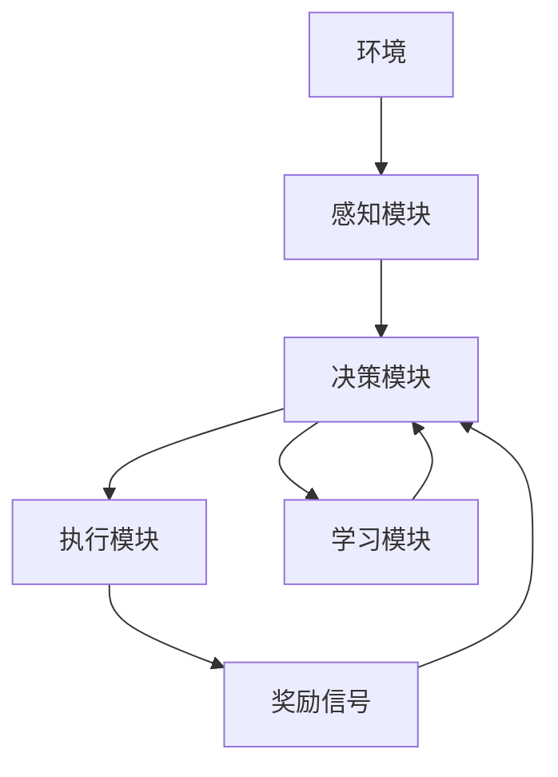
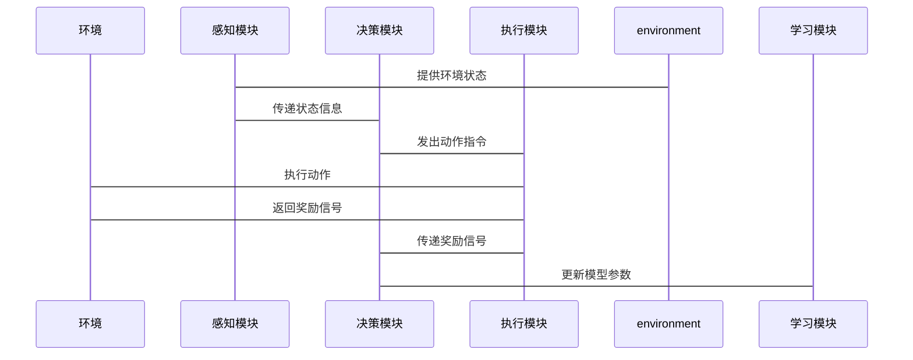

                 


# 构建具有深度强化学习能力的AI Agent

## 关键词：深度强化学习、AI Agent、强化学习、机器学习、人工智能

## 摘要：  
本文详细讲解如何构建具有深度强化学习能力的AI Agent。从强化学习和深度强化学习的基本概念出发，深入分析AI Agent的核心原理和设计方法，结合实际案例，逐步解析深度强化学习算法的实现过程，并探讨系统架构设计与优化策略。通过本文的学习，读者将能够掌握构建高性能AI Agent的关键技术与实践方法。

---

# 第一章：强化学习与深度强化学习概述

## 1.1 强化学习的基本概念

### 1.1.1 强化学习的定义
强化学习（Reinforcement Learning，RL）是一种机器学习范式，其中智能体（Agent）通过与环境交互来学习如何采取行动，以最大化某种累积的奖励。与监督学习不同，强化学习不需要明确的标注数据，而是通过试错机制学习最优策略。

### 1.1.2 强化学习的核心要素
- **状态（State）**：智能体所处的环境状态。
- **动作（Action）**：智能体在特定状态下采取的行为。
- **奖励（Reward）**：智能体采取动作后获得的反馈，用于指导学习。
- **策略（Policy）**：智能体在不同状态下选择动作的规则。
- **值函数（Value Function）**：预测从当前状态开始的预期累积奖励。

### 1.1.3 强化学习与监督学习的区别
| 特性       | 监督学习                              | 强化学习                              |
|------------|--------------------------------------|--------------------------------------|
| 数据类型     | 标签数据（输入-输出对）               | 状态-动作-奖励序列                    |
| 目标         | 最小化预测误差                       | 最大化累积奖励                        |
| 反馈机制     | 立即反馈（损失函数）                | 延时反馈（奖励信号）                  |
| 适用场景     | 分类、回归等问题                    | 自动驾驶、游戏AI等需要决策的问题      |

---

## 1.2 深度强化学习的演进

### 1.2.1 从浅层强化学习到深度强化学习
浅层强化学习（如Q-learning）依赖于线性函数近似，难以处理高维复杂状态空间。深度强化学习通过引入深度神经网络，能够自动提取特征，处理复杂任务。

### 1.2.2 深度强化学习的优势
- **处理高维状态空间**：深度神经网络能够自动提取高维状态的特征。
- **离线数据学习**：深度强化学习可以利用大量历史数据进行训练。
- **动态环境适应**：能够处理非静态环境，实时调整策略。

### 1.2.3 深度强化学习的应用场景
- 游戏AI（如AlphaGo、Dota AI）
- 机器人控制
- 自动驾驶
- 财经交易策略

---

# 第二章：AI Agent的基本概念与分类

## 2.1 AI Agent的定义

### 2.1.1 AI Agent的定义与特征
AI Agent是一个能够感知环境、自主决策并采取行动的智能实体。其核心特征包括：
- **自主性**：无需外部干预，自主决策。
- **反应性**：能够实时感知环境并做出反应。
- **目标导向性**：基于目标采取行动。
- **学习能力**：通过经验优化自身行为。

### 2.1.2 AI Agent的核心功能
- **感知环境**：通过传感器获取环境信息。
- **决策制定**：基于当前状态和历史经验，选择最优动作。
- **执行动作**：将决策转化为实际操作。

---

## 2.2 AI Agent的分类

### 2.2.1 简单反射型Agent
- **定义**：基于当前状态直接映射到动作，无记忆。
- **特点**：简单、快速，适用于低复杂度任务。
- **示例**：自动门禁系统。

### 2.2.2 基于模型的反射型Agent
- **定义**：利用环境模型进行决策，具备记忆能力。
- **特点**：适用于复杂环境，能够预测未来状态。
- **示例**：自动驾驶系统。

### 2.2.3 目标驱动型Agent
- **定义**：基于明确目标，采取最优动作。
- **特点**：目标明确，能够权衡不同选择。
- **示例**：智能音箱的语音识别系统。

### 2.2.4 学习驱动型Agent
- **定义**：通过学习优化决策策略。
- **特点**：具备自适应能力，能够提升性能。
- **示例**：AlphaGo、Dota AI。

---

# 第三章：深度强化学习在AI Agent中的应用

## 3.1 深度强化学习的核心优势

### 3.1.1 处理高维状态空间的能力
深度强化学习通过神经网络自动提取高维状态的特征，简化了特征工程的过程。

### 3.1.2 离线数据的学习能力
深度强化学习可以利用大量历史数据进行训练，无需实时与环境交互。

### 3.1.3 动态环境的适应能力
通过在线学习和策略更新，深度强化学习能够适应动态变化的环境。

---

## 3.2 AI Agent中的深度强化学习框架

### 3.2.1 基于Q-learning的深度强化学习
- **基本原理**：通过Q-learning算法，利用神经网络近似Q值函数。
- **数学模型**：
  $$ Q(s, a) = Q(s, a) + \alpha (r + \gamma \max Q(s', a') - Q(s, a)) $$
- **优缺点**：适用于离散动作空间，但对连续动作空间处理能力有限。

### 3.2.2 基于策略梯度的深度强化学习
- **基本原理**：直接优化策略，通过梯度上升方法最大化累积奖励。
- **数学模型**：
  $$ \nabla \theta = \frac{\partial}{\partial \theta} \left( \mathbb{E}[\log \pi(a|s)] \cdot R \right) $$
- **优缺点**：适用于连续动作空间，但收敛速度较慢。

### 3.2.3 基于Actor-Critic架构的深度强化学习
- **基本原理**：同时学习策略（Actor）和价值函数（Critic），通过Actor调整策略，Critic评估状态价值。
- **数学模型**：
  $$ V(s) = V(s) + \alpha (r + \gamma V(s') - V(s)) $$
  $$ \pi(a|s) = \text{softmax}(Q(s,a)) $$

---

# 第四章：AI Agent的系统架构与设计

## 4.1 系统架构设计

### 4.1.1 系统功能设计
- **环境感知模块**：负责收集环境信息。
- **决策模块**：基于感知信息，通过深度强化学习算法生成动作。
- **执行模块**：将决策转化为实际操作。
- **学习模块**：根据奖励信号更新模型参数。

### 4.1.2 系统架构图


---

## 4.2 系统接口设计

### 4.2.1 系统接口设计
- **输入接口**：接收环境状态和传感器数据。
- **输出接口**：发送决策指令和动作信号。
- **反馈接口**：接收奖励信号，用于更新模型。

---

## 4.3 系统交互流程

### 4.3.1 交互流程图


---

# 第五章：项目实战与高级主题

## 5.1 项目实战：构建一个简单的游戏AI

### 5.1.1 环境搭建
- **工具选择**：使用Python和TensorFlow框架。
- **环境选择**：选择一个简单的游戏环境，如OpenAI Gym的CartPole环境。

### 5.1.2 核心实现
```python
import gym
import numpy as np
import tensorflow as tf

# 定义DQN网络
class DQN:
    def __init__(self, state_space, action_space, hidden_size=64):
        self.state_space = state_space
        self.action_space = action_space
        self.hidden_size = hidden_size
        self.model = self.build_model()
        self.target_model = self.build_model()

    def build_model(self):
        model = tf.keras.Sequential([
            tf.keras.layers.Dense(self.hidden_size, activation='relu', input_shape=(self.state_space,)),
            tf.keras.layers.Dense(self.action_space, activation='linear')
        ])
        return model

    def update_target(self):
        self.target_model.set_weights(self.model.get_weights())

    def act(self, state):
        q_values = self.model.predict(state)
        return np.argmax(q_values[0])

    def remember(self, state, action, reward, next_state):
        # 实现记忆库功能，记录经验
        pass

    def replay(self, batch_size):
        # 实现经验回放，更新模型参数
        pass
```

---

## 5.2 高级主题

### 5.2.1 多智能体协作
- **挑战**：多个AI Agent协作，需要解决通信和协调问题。
- **解决方案**：采用多智能体强化学习算法，如VPG、MADDPG。

### 5.2.2 模型压缩与轻量化
- **挑战**：模型过大，难以部署在资源受限的设备上。
- **解决方案**：采用模型剪枝、知识蒸馏等技术进行模型压缩。

---

# 小结

通过本文的学习，读者可以系统地掌握构建具有深度强化学习能力的AI Agent的关键技术与实践方法。从基础的强化学习概念，到深度强化学习算法的实现，再到系统的架构设计，层层深入，最终通过实际案例巩固所学内容。未来，随着深度强化学习技术的不断发展，AI Agent将在更多领域展现出强大的应用潜力。

---

# 作者

作者：AI天才研究院/AI Genius Institute  
& 禅与计算机程序设计艺术 /Zen And The Art of Computer Programming

