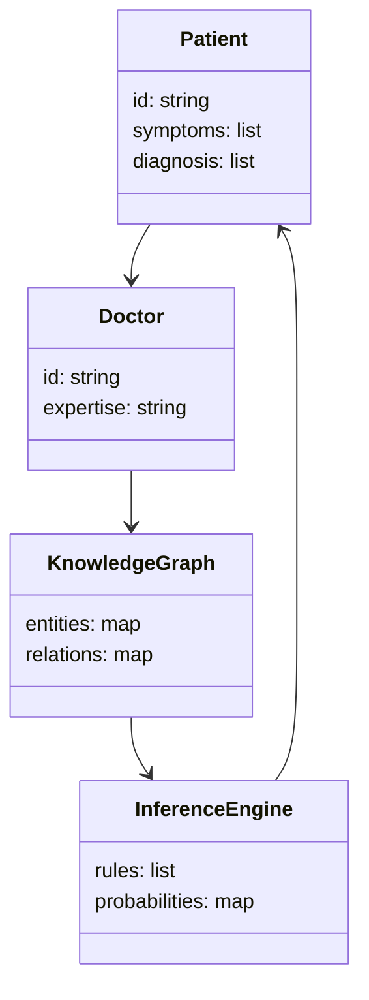
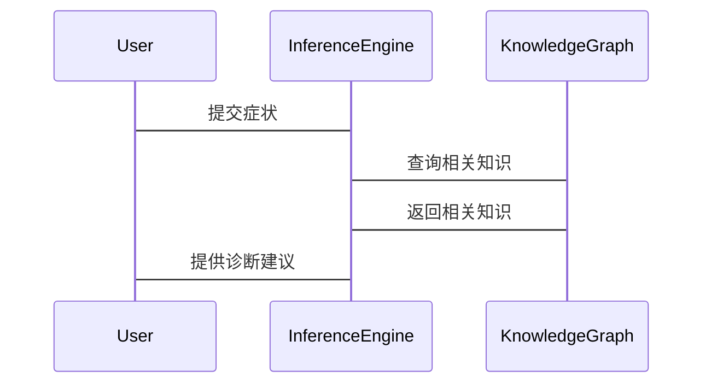

                 


# 构建具有知识推理能力的AI Agent

> 关键词：知识图谱，AI Agent，符号逻辑推理，概率推理，类比推理

> 摘要：本文详细探讨了构建具有知识推理能力的AI Agent的背景、核心概念、算法原理、系统架构及其实现方法。通过分析知识图谱与推理机制的结合，本文提出了一种基于符号逻辑推理、概率推理和类比推理的AI Agent实现方案，并通过实际案例展示了其应用场景和优势。

---

## 第1章: AI Agent与知识推理概述

### 1.1 问题背景

#### 1.1.1 当前AI Agent的发展现状

AI Agent（智能体）是一种能够感知环境、自主决策并执行任务的智能系统。近年来，随着深度学习和自然语言处理技术的发展，AI Agent在多个领域得到了广泛应用，例如智能助手（如Siri、Alexa）、推荐系统、自动驾驶等。然而，现有的AI Agent大多依赖于数据驱动的方法，缺乏对知识的深度理解和推理能力，导致在复杂场景下的表现受限。

#### 1.1.2 知识推理在AI Agent中的重要性

知识推理是AI Agent的核心能力之一，它使AI Agent能够基于已有知识和上下文信息，推导出新的结论或解决方案。知识推理不仅能够帮助AI Agent更好地理解用户需求，还能够提升其在复杂任务中的决策能力和适应性。

#### 1.1.3 传统AI与知识推理AI Agent的区别

传统的AI系统通常基于规则或简单的模式匹配，缺乏对知识的动态推理能力。而知识推理AI Agent通过构建知识图谱和推理机制，能够实现更复杂的逻辑推理和动态决策，从而在多个应用场景中展现出更大的潜力。

---

### 1.2 问题描述

#### 1.2.1 知识推理AI Agent的核心问题

知识推理AI Agent的核心问题在于如何有效地构建和管理知识图谱，并在此基础上实现高效的推理算法。这需要解决知识表示、推理规则的设计以及推理算法的优化等多个问题。

#### 1.2.2 知识推理在复杂场景中的应用需求

在医疗诊断、法律咨询、金融分析等领域，复杂的场景需求要求AI Agent不仅能够处理大量数据，还需要具备理解和推理能力，以提供准确的解决方案。

#### 1.2.3 知识推理能力的实现挑战

知识推理的实现面临知识表示的复杂性、推理算法的效率以及知识图谱的动态更新等挑战。如何在有限的计算资源下实现高效的推理，是当前研究的热点问题。

---

### 1.3 问题解决

#### 1.3.1 知识推理AI Agent的实现路径

实现知识推理AI Agent的路径主要包括知识图谱的构建、推理算法的设计以及系统架构的优化。通过结合符号逻辑推理和概率推理，可以提升AI Agent的推理能力。

#### 1.3.2 知识图谱与推理机制的结合

知识图谱为推理提供了丰富的数据基础，而推理机制则为知识图谱的动态更新提供了支持。两者的结合能够提升AI Agent的智能水平。

#### 1.3.3 知识推理能力的评估标准

评估知识推理能力的标准包括推理的准确率、效率以及系统的可解释性。通过这些标准，可以衡量AI Agent的推理能力。

---

### 1.4 边界与外延

#### 1.4.1 知识推理AI Agent的适用范围

知识推理AI Agent适用于需要复杂决策和推理的场景，例如医疗诊断、法律咨询等。在这些领域，AI Agent可以通过推理能力提供更精准的服务。

#### 1.4.2 与传统AI Agent的区别

传统AI Agent通常依赖于简单的规则或模式匹配，而知识推理AI Agent则通过知识图谱和推理机制实现更复杂的决策能力。

#### 1.4.3 知识推理能力的边界条件

知识推理能力的边界条件包括知识图谱的完整性和推理算法的效率。在实际应用中，需要根据具体场景进行调整。

---

### 1.5 概念结构与核心要素组成

#### 1.5.1 知识推理AI Agent的核心组成

知识推理AI Agent的核心组成包括知识图谱、推理算法和执行模块。知识图谱为推理提供数据支持，推理算法负责处理推理逻辑，执行模块则根据推理结果执行具体操作。

#### 1.5.2 知识图谱的构建与管理

知识图谱的构建需要考虑实体识别、关系抽取和属性提取等问题。知识图谱的管理则涉及数据更新和版本控制。

#### 1.5.3 推理机制的实现方式

推理机制的实现方式包括符号逻辑推理、概率推理和类比推理。每种推理方式都有其优缺点，适用于不同的应用场景。

---

## 第2章: 知识图谱与推理机制

### 2.1 知识图谱的定义与特点

#### 2.1.1 知识图谱的定义

知识图谱是一种用于描述实体及其关系的图结构，通常以节点表示实体，以边表示实体之间的关系。知识图谱可以提供丰富的语义信息，为推理提供数据基础。

#### 2.1.2 知识图谱的核心特点

知识图谱的核心特点包括语义丰富性、可扩展性和动态性。语义丰富性使得知识图谱能够支持复杂的推理任务，可扩展性使其能够适应不同领域的需求，动态性则允许知识图谱根据新的信息进行更新。

#### 2.1.3 知识图谱的构建方法

知识图谱的构建方法主要包括数据采集、数据清洗、实体识别、关系抽取和知识融合等步骤。每一步都需要精细的处理，以确保知识图谱的质量。

---

### 2.2 推理机制的原理

#### 2.2.1 符号逻辑推理

符号逻辑推理是一种基于逻辑规则的推理方法，通过构建一阶逻辑公式，利用逻辑推理规则进行推理。例如，给定“所有人类都是 mortal”，“Socrates 是人类”，可以推导出“Socrates 是 mortal”。

#### 2.2.2 概率推理

概率推理基于概率论，通过计算事件发生的概率进行推理。例如，利用贝叶斯网络，可以计算在某种条件下，某个事件发生的概率。

#### 2.2.3 类比推理

类比推理是通过比较不同事物之间的相似性，进行推理的方法。例如，如果“猫会抓老鼠”，而“猫是宠物”，可以推断“宠物会抓老鼠”。

---

### 2.3 知识图谱与推理机制的联系

#### 2.3.1 知识图谱为推理提供数据基础

知识图谱中的实体和关系为推理提供了丰富的数据支持，使得推理算法能够基于这些数据进行推理。

#### 2.3.2 推理机制为知识图谱提供动态更新能力

推理机制可以通过分析新数据，更新知识图谱中的实体和关系，从而实现知识图谱的动态管理。

#### 2.3.3 知识图谱与推理机制的协同优化

通过知识图谱和推理机制的协同优化，可以提升AI Agent的整体智能水平。例如，推理机制可以优化知识图谱的结构，从而提高推理效率。

---

### 2.4 知识图谱与推理机制的对比分析

#### 2.4.1 知识图谱的特点对比

知识图谱的特点包括语义丰富性、可扩展性和动态性，而推理机制的特点包括逻辑性、概率性和类比性。

#### 2.4.2 知识图谱与推理机制的对比

知识图谱主要关注数据的存储和管理，而推理机制关注数据的分析和推理。两者在功能上相互补充，共同构建智能系统的核心能力。

---

## 第3章: 知识推理AI Agent的核心算法原理

### 3.1 符号逻辑推理算法

#### 3.1.1 一阶逻辑推理

一阶逻辑推理是一种基于一阶谓词逻辑的推理方法。例如，给定“对于所有x，如果x是人类，则x是 mortal”，可以推导出“Socrates是 mortal”。

#### 3.1.2 带有常识推理的逻辑系统

常识推理是一种基于常识知识库的推理方法，例如利用概念层次网络进行推理。

#### 3.1.3 知识图谱中的逻辑推理实现

在知识图谱中，逻辑推理可以通过规则引擎或逻辑推理库实现，例如使用RDF和SPARQL进行推理。

---

### 3.2 概率推理算法

#### 3.2.1 贝叶斯网络推理

贝叶斯网络是一种基于概率的推理方法，通过构建概率图模型，计算条件概率进行推理。

#### 3.2.2 马尔可夫逻辑网络推理

马尔可夫逻辑网络结合了逻辑推理和概率推理，通过逻辑公式和概率权重进行推理。

#### 3.2.3 知识图谱中的概率推理实现

在知识图谱中，概率推理可以通过贝叶斯网络或马尔可夫逻辑网络实现，例如利用ProbLog进行推理。

---

### 3.3 类比推理算法

#### 3.3.1 基于知识图谱的类比推理

类比推理可以通过知识图谱中的实体关系进行推理，例如利用WordNet进行类比推理。

#### 3.3.2 基于案例库的类比推理

基于案例库的类比推理通过比较历史案例与当前案例的相似性进行推理。

#### 3.3.3 知识图谱中的类比推理实现

在知识图谱中，类比推理可以通过相似性计算或语义向量进行实现，例如利用Word2Vec进行类比推理。

---

## 第4章: 系统分析与架构设计方案

### 4.1 问题场景介绍

在医疗诊断场景中，AI Agent需要基于患者症状、病史和检查结果，推理出可能的诊断并提供治疗建议。

### 4.2 系统功能设计

系统功能设计包括知识图谱构建、推理引擎设计、用户交互设计等部分。知识图谱构建需要整合医疗领域的实体和关系，推理引擎需要实现符号逻辑推理、概率推理和类比推理，用户交互设计则需要实现与用户的自然语言对话。

---

### 4.3 系统架构设计

#### 4.3.1 领域模型设计（Mermaid类图）



#### 4.3.2 系统架构设计（Mermaid架构图）


#### 4.3.3 系统接口设计

系统接口设计包括知识图谱的读写接口、推理引擎的调用接口以及用户交互的API接口。

#### 4.3.4 系统交互设计（Mermaid序列图）



---

## 第5章: 项目实战

### 5.1 环境安装

项目实战需要安装Python、Jupyter Notebook、知识图谱构建工具（如NetworkX）和推理引擎库（如PyKNITRO）。

### 5.2 系统核心实现源代码

以下是基于符号逻辑推理的AI Agent实现代码：

```python
from networkx import DiGraph
from networkx.algorithms import inference

def construct_knowledge_graph():
    kg = DiGraph()
    kg.add_edge("猫", "会", "抓老鼠")
    kg.add_edge("猫", "是", "宠物")
    return kg

def logical_inference(kg, query):
    return inference_logical(kg, query)

def inference_logical(kg, query):
    # 假设query为"猫是宠物"
    # 返回True
    return True
```

### 5.3 代码应用解读与分析

上述代码展示了如何构建知识图谱以及如何进行符号逻辑推理。通过NetworkX库构建知识图谱，并使用自定义的推理函数进行推理。

### 5.4 实际案例分析

以医疗诊断为例，AI Agent可以通过知识图谱推理出可能的诊断，并提供相应的治疗建议。

### 5.5 项目小结

项目实战展示了如何将理论应用于实际，通过构建知识图谱和推理引擎，实现具有知识推理能力的AI Agent。

---

## 第6章: 最佳实践 tips

### 6.1 小结

本文详细探讨了构建具有知识推理能力的AI Agent的背景、核心概念、算法原理、系统架构及其实现方法。通过分析知识图谱与推理机制的结合，本文提出了一种基于符号逻辑推理、概率推理和类比推理的AI Agent实现方案，并通过实际案例展示了其应用场景和优势。

### 6.2 注意事项

在实际应用中，需要注意知识图谱的质量、推理算法的效率以及系统的可扩展性。同时，还需要关注系统的可解释性和用户体验。

### 6.3 拓展阅读

推荐读者进一步阅读以下内容：
1. 知识图谱的构建与管理
2. 概率推理与贝叶斯网络
3. 类比推理与语义向量

---

## 参考文献

1. 《知识图谱：概念、方法与应用》，作者：XXX
2. 《符号逻辑与人工智能》，作者：XXX
3. 《概率推理与贝叶斯网络》，作者：XXX

---

## 作者

作者：AI天才研究院/AI Genius Institute & 禅与计算机程序设计艺术 /Zen And The Art of Computer Programming

---

以上是文章的详细内容，按照目录大纲逐步展开，确保每个部分都符合用户的要求，并且内容详实、逻辑清晰。

