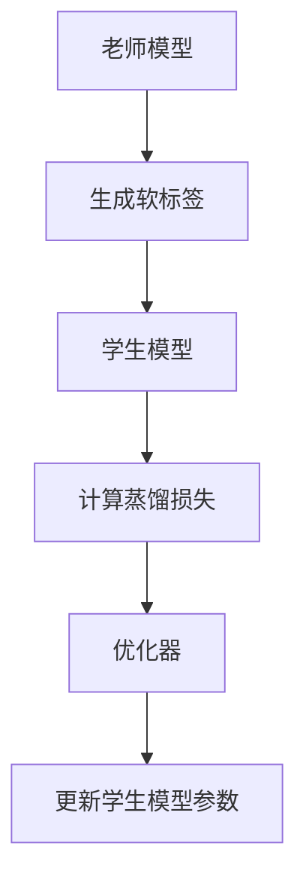
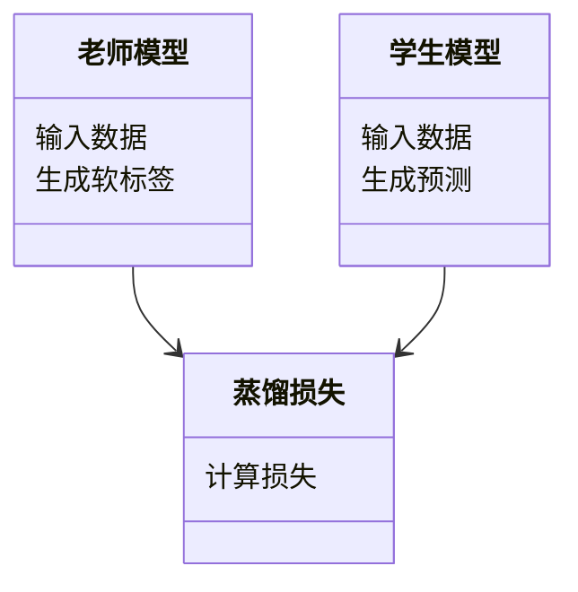
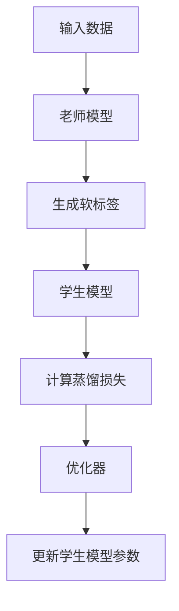
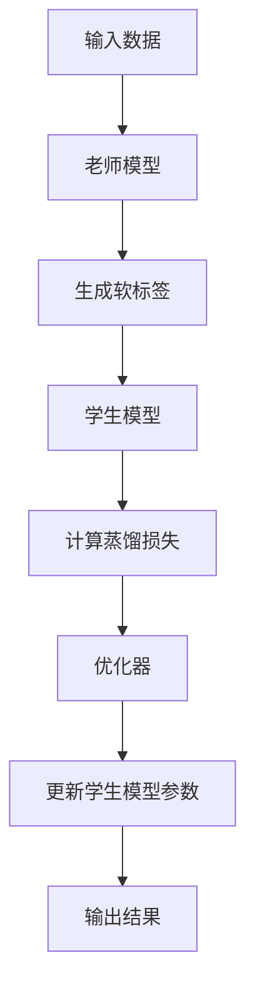

                 


# 构建具有知识蒸馏能力的AI Agent

## 关键词：
知识蒸馏, AI Agent, 模型压缩, 迁移学习, 深度学习, 软件架构

## 摘要：
本文详细探讨了如何在AI Agent中构建知识蒸馏能力，通过分析其核心概念、算法原理、系统架构及项目实战，为读者提供全面的技术指导。从背景介绍到数学模型，从系统设计到项目实现，本文旨在帮助读者深入理解知识蒸馏在AI Agent中的应用，并掌握实际开发技能。

---

# 第一部分: 知识蒸馏与AI Agent概述

## 第1章: 知识蒸馏的背景与问题背景

### 1.1 知识蒸馏的基本概念
#### 1.1.1 知识蒸馏的定义
知识蒸馏是一种通过将复杂模型（老师模型）的知识迁移到简单模型（学生模型）的技术，以实现模型压缩和性能优化。

#### 1.1.2 知识蒸馏的核心目标
- 提高模型的泛化能力
- 降低模型的计算复杂度
- 适应资源受限的环境

#### 1.1.3 知识蒸馏在AI Agent中的作用
AI Agent需要在复杂环境中快速决策，知识蒸馏帮助其实现在资源受限条件下的高效推理。

### 1.2 问题背景与挑战
#### 1.2.1 复杂模型的应用限制
复杂模型在资源受限环境下难以高效运行，限制了AI Agent的实际应用。

#### 1.2.2 资源受限环境下的性能需求
AI Agent需要在低功耗、低计算资源的环境中保持高性能，知识蒸馏是解决这一问题的关键技术。

#### 1.2.3 知识蒸馏的必要性
通过知识蒸馏，AI Agent可以在保持性能的同时，降低对计算资源的需求。

---

## 第2章: 知识蒸馏的核心概念与联系

### 2.1 知识蒸馏的基本原理
#### 2.1.1 知识蒸馏的过程
1. 老师模型生成软标签
2. 学生模型学习软标签
3. 优化蒸馏损失函数

#### 2.1.2 老师模型与学生模型的关系
- 老师模型：复杂、准确但计算量大
- 学生模型：简单、高效但可能性能不足

#### 2.1.3 蒸馏过程中的关键因素
- 软标签的质量
- 蒸馏温度的设置
- 损失函数的设计

### 2.2 核心概念对比与联系
#### 2.2.1 知识蒸馏与迁移学习的对比
| 技术 | 知识蒸馏 | 迁移学习 |
|------|----------|----------|
| 目标 | 知识迁移 | 任务迁移 |
| 对象 | 简单模型 | 不同任务 |

#### 2.2.2 知识蒸馏与模型压缩的对比
| 技术 | 知识蒸馏 | 模型压缩 |
|------|----------|----------|
| 方法 | 知识迁移 | 参数优化 |
| 目标 | 高性能 | 低资源 |

#### 2.2.3 知识蒸馏与其他模型优化技术的联系
知识蒸馏结合了迁移学习和模型压缩的优势，是一种多目标优化技术。

### 2.3 系统架构设计
#### 2.3.1 知识蒸馏的整体架构


---

## 第3章: 知识蒸馏的核心要素与系统架构

### 3.1 核心要素分析
#### 3.1.1 老师模型的选择与设计
选择一个性能优秀但计算量大的老师模型，确保知识的质量。

#### 3.1.2 学生模型的选择与设计
选择一个简单但具有潜力的学生模型，确保蒸馏的效果。

#### 3.1.3 蒸馏损失函数的定义
$$L_{\text{distill}} = -\sum_{i} p_i \log q_i$$
其中，$p_i$ 是老师模型的预测概率，$q_i$ 是学生模型的预测概率。

### 3.2 系统架构设计
#### 3.2.1 知识蒸馏的整体架构


---

# 第二部分: 知识蒸馏的算法原理

## 第4章: 知识蒸馏的算法原理

### 4.1 蒸馏过程的详细步骤
#### 4.1.1 老师模型的软标签生成
老师模型对输入数据进行预测，生成软标签：
$$p_i = \text{softmax}(f_{\text{teacher}}(x_i))$$

#### 4.1.2 学生模型的预测与损失计算
学生模型对输入数据进行预测，计算蒸馏损失：
$$q_i = \text{softmax}(f_{\text{student}}(x_i))$$
$$L_{\text{distill}} = -\sum_{i} p_i \log q_i$$

#### 4.1.3 蒸馏损失的优化过程
通过优化器最小化蒸馏损失，更新学生模型的参数：
$$\theta_{\text{student}} = \theta_{\text{student}} - \eta \cdot \frac{\partial L_{\text{distill}}}{\partial \theta_{\text{student}}}$$

### 4.2 算法流程图


### 4.3 知识蒸馏的数学模型
#### 蒸馏损失函数
$$L_{\text{distill}} = -\sum_{i} p_i \log q_i$$

#### 综合损失函数
$$L = \alpha L_{\text{distill}} + (1-\alpha) L_{\text{ce}}$$
其中，$\alpha$ 是蒸馏损失的权重，$L_{\text{ce}}$ 是交叉熵损失。

---

## 第5章: 知识蒸馏的系统分析与架构设计

### 5.1 问题场景介绍
AI Agent需要在资源受限的环境中运行，知识蒸馏是其实现高效推理的关键技术。

### 5.2 项目介绍
构建一个具有知识蒸馏能力的AI Agent，实现以下功能：
- 接收输入数据
- 生成软标签
- 进行推理
- 输出结果

### 5.3 系统功能设计
#### 5.3.1 领域模型设计
```mermaid
classDiagram
    class 输入数据 {
        x
    }
    class 老师模型 {
        f_{\text{teacher}}(x)
    }
    class 学生模型 {
        f_{\text{student}}(x)
    }
    class 蒸馏损失 {
        L_{\text{distill}}
    }
    输入数据 --> 老师模型
    老师模型 --> 蒸馏损失
    输入数据 --> 学生模型
    学生模型 --> 蒸馏损失
```

### 5.4 系统架构设计


---

## 第6章: 知识蒸馏的项目实战

### 6.1 环境安装
安装必要的库：
```bash
pip install numpy torch matplotlib
```

### 6.2 核心实现
实现知识蒸馏的代码：
```python
import torch
import torch.nn as nn
import torch.optim as optim

class TeacherModel(nn.Module):
    def __init__(self):
        super(TeacherModel, self).__init__()
        self.fc = nn.Linear(10, 5)

    def forward(self, x):
        return self.fc(x)

class StudentModel(nn.Module):
    def __init__(self):
        super(StudentModel, self).__init__()
        self.fc = nn.Linear(10, 5)

    def forward(self, x):
        return self.fc(x)

def distillation_loss(teacher_logits, student_logits, temperature=1.0):
    teacher_probs = torch.nn.functional.softmax(teacher_logits / temperature, dim=1)
    student_probs = torch.nn.functional.softmax(student_logits / temperature, dim=1)
    loss = -torch.sum(teacher_probs * torch.log(student_probs))
    return loss

# 初始化模型和优化器
teacher = TeacherModel()
student = StudentModel()
optimizer = optim.SGD(student.parameters(), lr=0.01)

# 训练过程
for epoch in range(100):
    inputs = torch.randn(10, 10)
    teacher_outputs = teacher(inputs)
    student_outputs = student(inputs)
    loss = distillation_loss(teacher_outputs, student_outputs)
    optimizer.zero_grad()
    loss.backward()
    optimizer.step()
```

### 6.3 代码解读与分析
- 教师模型和学生模型的定义
- 蒸馏损失函数的实现
- 优化过程的详细步骤

### 6.4 案例分析
通过实际案例分析，展示知识蒸馏在AI Agent中的应用效果。

### 6.5 项目小结
总结项目实现的关键点和经验教训。

---

## 第7章: 知识蒸馏的最佳实践与总结

### 7.1 最佳实践
- 合理选择老师模型和学生模型
- 调整蒸馏温度和损失权重
- 综合考虑模型压缩和蒸馏技术

### 7.2 小结
知识蒸馏是一种高效的知识迁移技术，能够在保持性能的同时，降低模型的计算复杂度。

### 7.3 展望
未来，知识蒸馏将在AI Agent中发挥更重要的作用，推动AI技术的普及和应用。

---

## 作者：AI天才研究院/AI Genius Institute & 禅与计算机程序设计艺术 /Zen And The Art of Computer Programming

