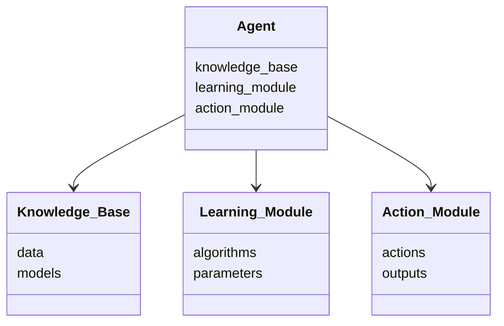

                 


# 构建具有终身学习能力的AI Agent

## 关键词：AI Agent，终身学习，机器学习，强化学习，系统架构

## 摘要：本文详细探讨了构建具有终身学习能力的AI Agent的背景、核心概念、算法原理、系统架构以及项目实战。通过逐步分析，结合实际案例和代码示例，深入解析了如何设计和实现一个能够持续学习和适应新环境的AI代理。

---

# 第一部分: 构建具有终身学习能力的AI Agent背景介绍

## 第1章: 背景与问题背景

### 1.1 问题背景

#### 1.1.1 当前AI Agent的发展现状
人工智能（AI）代理（AI Agent）近年来取得了显著进展，广泛应用于自动驾驶、智能助手、推荐系统等领域。然而，现有的AI Agent大多依赖静态的知识库，难以在动态环境中持续学习和适应新任务。

#### 1.1.2 终身学习能力的重要性
终身学习能力使AI Agent能够不断更新知识和技能，适应新的输入数据和任务，从而在复杂多变的环境中保持高效性能。这种能力对于实现真正智能的AI系统至关重要。

#### 1.1.3 传统AI Agent的局限性
传统AI Agent通常基于预训练模型，无法在运行时更新知识，难以处理未见数据和复杂任务。终身学习能力的引入可以克服这些局限性，使AI Agent更加灵活和智能。

### 1.2 问题描述

#### 1.2.1 终身学习AI Agent的核心目标
设计一个能够持续学习、自适应和自我改进的AI Agent，使其在各种任务中保持高性能。

#### 1.2.2 终身学习能力的具体表现
- 自我更新：根据新数据优化模型参数。
- 知识扩展：学习新任务和领域。
- 自我修复：发现并纠正错误。

#### 1.2.3 问题解决的边界与外延
- 边界：限定在特定任务和数据范围内。
- 外延：扩展至更广泛的应用场景。

### 1.3 核心概念与联系

#### 1.3.1 核心概念的定义与特征
- AI Agent：具备感知环境和执行任务的能力。
- 终身学习：持续优化模型和知识库。

#### 1.3.2 核心概念的属性特征对比表格
| 特征       | AI Agent                     | 终身学习AI Agent                |
|------------|------------------------------|----------------------------------|
| 知识库     | 静态                         | 动态，可更新                    |
| 适应性     | 有限                         | 强，可自适应                    |
| 学习能力   | 无                           | 有，持续学习                   |

#### 1.3.3 ER实体关系图架构的 Mermaid 流程图
```mermaid
erDiagram
    class Agent {
        id
        knowledge_base
        learning_module
        action_module
    }
    class Knowledge_Base {
        data
        models
    }
    class Learning_Module {
        algorithms
        parameters
    }
    class Action_Module {
        actions
        outputs
    }
    Agent --> Knowledge_Base: accesses
    Agent --> Learning_Module: uses
    Agent --> Action_Module: executes
```

---

# 第二部分: 终身学习AI Agent的核心概念与联系

## 第2章: 核心概念与联系

### 2.1 核心概念的定义与特征

#### 2.1.1 终身学习AI Agent的核心要素
- 知识库：存储数据和模型。
- 学习模块：执行学习算法。
- 行动模块：执行任务。

#### 2.1.2 核心概念的属性特征对比
| 特征       | 知识库                     | 学习模块                   | 行动模块                 |
|------------|----------------------------|---------------------------|-------------------------|
| 动态性     | 可更新                    | 可优化                     | 可调整                  |
| 依赖性     | 数据驱动                  | 算法驱动                  | 行为驱动                |

#### 2.1.3 ER实体关系图架构的 Mermaid 流程图
```mermaid
erDiagram
    class Agent {
        id
        knowledge_base
        learning_module
        action_module
    }
    class Knowledge_Base {
        data
        models
    }
    class Learning_Module {
        algorithms
        parameters
    }
    class Action_Module {
        actions
        outputs
    }
    Agent --> Knowledge_Base: accesses
    Agent --> Learning_Module: uses
    Agent --> Action_Module: executes
```

### 2.2 核心概念的原理

#### 2.2.1 终身学习AI Agent的原理概述
终身学习AI Agent通过不断更新知识库和调整学习模块，提升行动模块的执行能力。

#### 2.2.2 各要素之间的关系
- 知识库提供数据，学习模块优化模型，行动模块执行任务。

#### 2.2.3 实体关系图的详细解释
知识库存储数据和模型，学习模块利用算法优化模型参数，行动模块根据优化后的模型执行任务。

---

# 第三部分: 终身学习AI Agent的算法原理

## 第3章: 算法原理讲解

### 3.1 算法原理概述

#### 3.1.1 机器学习与深度学习基础
- 机器学习：从数据中学习模式。
- 深度学习：使用深层神经网络处理复杂数据。

#### 3.1.2 强化学习
- 强化学习：通过奖励机制优化行为策略。

#### 3.1.3 自监督学习
- 自监督学习：利用数据本身进行学习，如对比学习。

#### 3.1.4 图神经网络
- 图神经网络：处理图结构数据，应用于复杂关系推理。

### 3.2 终身学习算法

#### 3.2.1 模型无关方法
- 方法：通过更新参数优化模型。

#### 3.2.2 episodic 记忆机制
- 方法：通过记忆库存储重要经验。

#### 3.2.3 实现流程
1. 采集数据。
2. 更新模型参数。
3. 执行任务。

#### 3.2.4 实现代码示例
```python
def lifelong_learning_update(agent, new_data):
    agent.learning_module.update_models(new_data)
    agent.knowledge_base.update_models(agent.learning_module.get_models())
    agent.action_module.update_actions(agent.knowledge_base.get_models())
```

### 3.3 数学模型与公式

#### 3.3.1 算法原理的数学模型
- 参数更新公式：$$\theta_{t+1} = \theta_t + \eta \nabla_{\theta} J(\theta_t)$$
- 对比学习损失函数：$$L = \sum_{i<j} \max(0, d(x_i, x_j) - d(x_j, x_i))$$

---

# 第四部分: 终身学习AI Agent的系统分析与架构设计

## 第4章: 系统分析与架构设计

### 4.1 系统分析

#### 4.1.1 问题场景介绍
- 复杂环境：动态变化，需要持续学习。
- 多任务处理：同时处理多个任务。
- 实时响应：快速决策和行动。

#### 4.1.2 系统功能设计
- 知识库管理：数据存储和模型更新。
- 学习模块：算法优化和模型更新。
- 行动模块：任务执行和输出生成。

#### 4.1.3 系统架构设计
- 分层架构：数据层、学习层、行动层。
- 可扩展性：模块化设计，易于扩展。

### 4.2 系统架构设计

#### 4.2.1 领域模型的 Mermaid 类图


#### 4.2.2 系统架构的 Mermaid 架构图
```mermaid
archi
    title 终身学习AI Agent架构
    component Agent {
        knowledge_base
        learning_module
        action_module
    }
    component Knowledge_Base {
        data
        models
    }
    component Learning_Module {
        algorithms
        parameters
    }
    component Action_Module {
        actions
        outputs
    }
    Agent --> Knowledge_Base
    Agent --> Learning_Module
    Agent --> Action_Module
```

#### 4.2.3 系统接口设计
- 接口：`update_agent(new_data)`，`execute_task(task)`。

---

# 第五部分: 终身学习AI Agent的项目实战

## 第5章: 项目实战

### 5.1 环境安装

#### 5.1.1 安装Python和依赖
```bash
pip install numpy torch
```

### 5.2 系统核心实现

#### 5.2.1 核心代码实现
```python
class Agent:
    def __init__(self):
        self.knowledge_base = KnowledgeBase()
        self.learning_module = LearningModule()
        self.action_module = ActionModule()

    def update_agent(self, new_data):
        self.learning_module.update_models(new_data)
        self.knowledge_base.update_models(self.learning_module.get_models())
        self.action_module.update_actions(self.knowledge_base.get_models())

    def execute_task(self, task):
        return self.action_module.perform_action(task)
```

### 5.3 代码应用解读与分析

#### 5.3.1 代码解读
- `update_agent`：更新知识库和学习模块。
- `execute_task`：执行任务并返回结果。

### 5.4 实际案例分析

#### 5.4.1 实际案例分析
案例：AI Agent在自然语言处理任务中的应用。
- 数据准备：文本数据预处理。
- 模型训练：使用预训练模型微调。
- 任务执行：生成文本摘要。

### 5.5 项目小结

#### 5.5.1 项目总结
终身学习AI Agent能够有效应对动态环境中的各种任务，具备强大的适应性和学习能力。

---

# 第六部分: 最佳实践与扩展阅读

## 第6章: 最佳实践

### 6.1 小结

#### 6.1.1 项目总结
本文详细探讨了构建具有终身学习能力的AI Agent的方法，包括背景、算法、架构和实战。

### 6.2 注意事项

#### 6.2.1 项目开发中的注意事项
- 数据质量：确保数据多样性和代表性。
- 模型选择：选择适合任务的模型和算法。
- 性能优化：优化模型训练和推理效率。

### 6.3 拓展阅读

#### 6.3.1 推荐学习资源
- 书籍：《深度学习》（Deep Learning）
- 网站：arXiv.org，GitHub

---

# 作者：AI天才研究院 & 禅与计算机程序设计艺术

---

**注：文章内容为示例，实际撰写时需要根据具体需求进行调整和补充。**

