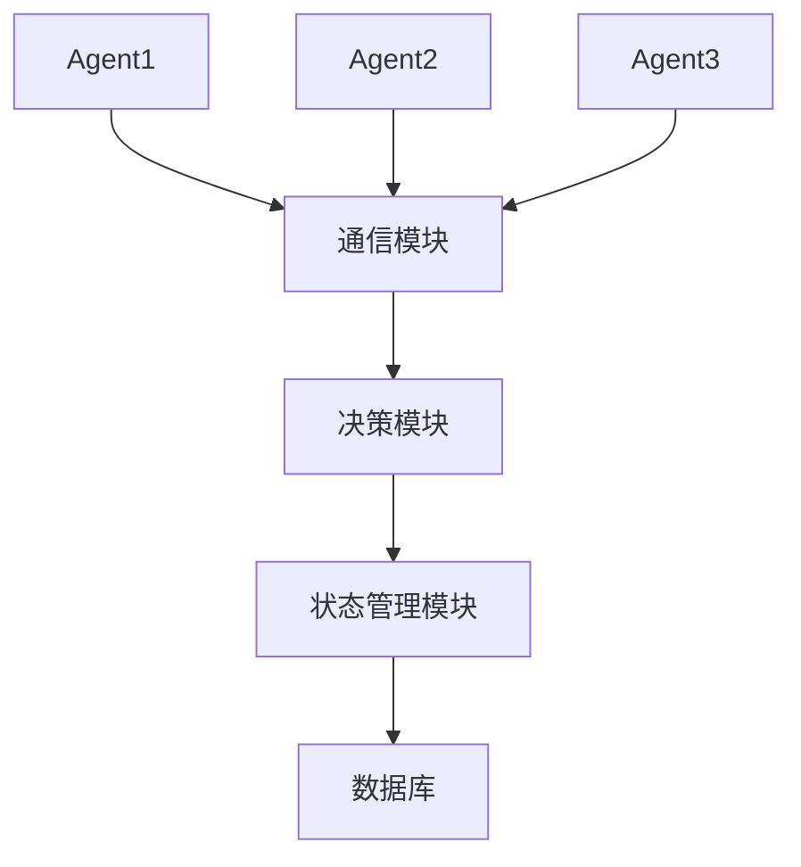
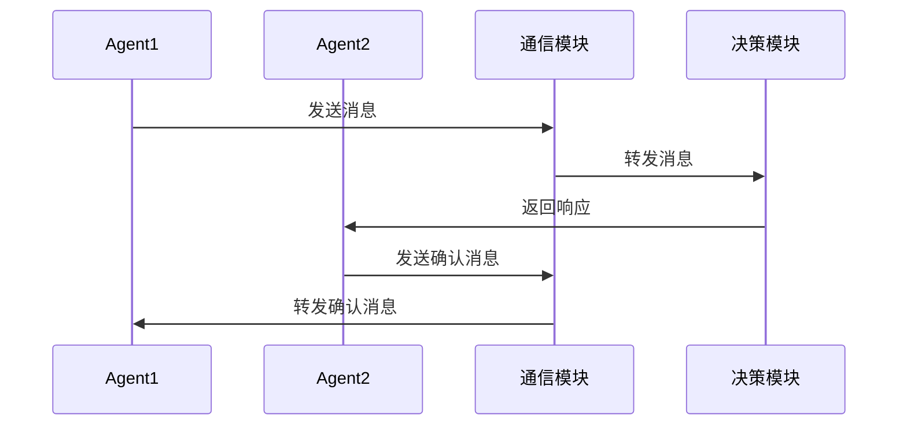

                 


# 构建具有群体智能决策能力的多Agent系统

## 关键词：多Agent系统，群体智能，分布式计算，共识算法，群体决策，系统架构，数学模型

## 摘要：  
本文深入探讨了构建具有群体智能决策能力的多Agent系统的各个方面，从基础概念到算法原理，再到系统架构和实际应用。文章首先介绍了多Agent系统的基本概念和群体智能的核心原理，然后详细分析了多Agent系统中的分布式计算算法和群体决策算法。接着，文章通过实际案例展示了如何设计和实现一个多Agent系统，并讨论了系统架构、功能设计和接口设计的关键点。最后，文章总结了构建群体智能决策系统的最佳实践和未来发展方向，为读者提供了全面的指导。

---

# 第一部分: 多Agent系统与群体智能决策概述

## 第1章: 多Agent系统基础

### 1.1 多Agent系统的基本概念

#### 1.1.1 什么是多Agent系统
多Agent系统（Multi-Agent System, MAS）是由多个智能体（Agent）组成的分布式系统，这些智能体能够通过协作完成复杂任务。每个Agent都是一个独立的实体，具有自主性、反应性和社会性。

#### 1.1.2 多Agent系统的特点
多Agent系统具有以下特点：
- **自主性**：每个Agent能够独立决策和行动。
- **反应性**：Agent能够感知环境并做出实时反应。
- **分布式性**：系统中的Agent分布在网络的不同节点上，通过通信进行协作。
- **社会性**：Agent之间通过通信和协作完成任务。

#### 1.1.3 多Agent系统中的Agent分类
多Agent系统中的Agent可以根据功能、智能水平和交互方式分类：
- **功能型Agent**：专注于完成特定任务，如传感器节点。
- **智能型Agent**：具有复杂的学习和推理能力，如推荐系统中的Agent。
- **社会型Agent**：专注于与其它Agent或人类进行交互，如聊天机器人。

### 1.2 群体智能与多Agent系统的关系

#### 1.2.1 群体智能的定义
群体智能（Swarm Intelligence）是指通过多个简单个体的协作，实现复杂问题解决的智能形式。群体智能的核心在于个体之间的局部交互，通过简单的规则实现全局的复杂行为。

#### 1.2.2 群体智能与多Agent系统的关系
群体智能是多Agent系统的一种实现方式，通过多个Agent的协作实现群体智能。多Agent系统为群体智能提供了分布式计算和通信的基础架构，而群体智能则为多Agent系统提供了协作和决策的算法支持。

#### 1.2.3 群体智能的应用场景
群体智能在多个领域有广泛应用，如：
- **机器人协作**：多个机器人通过群体智能完成任务。
- **交通管理**：通过群体智能优化交通流量。
- **分布式计算**：利用群体智能提高计算效率。

---

## 第2章: 多Agent系统的核心概念

### 2.1 Agent的基本属性

#### 2.1.1 知识表示
知识表示是Agent的核心能力之一，决定了Agent如何理解和处理信息。常用的表示方法包括：
- **逻辑表示**：使用逻辑规则表示知识。
- **语义网络**：通过语义关系表示知识。
- **概率表示**：通过概率模型表示不确定性知识。

#### 2.1.2 行为规划
行为规划是Agent根据当前状态和目标，制定行动计划的过程。常用的行为规划方法包括：
- **基于规则的规划**：通过预定义的规则进行决策。
- **基于模型的规划**：通过环境模型进行推理和规划。
- **基于效用的规划**：通过效用函数优化决策。

#### 2.1.3 通信机制
通信机制是Agent之间进行信息交换的方式，常用的通信机制包括：
- **发布-订阅模式**：Agent发布信息，其他Agent订阅感兴趣的信息。
- **点对点通信**：Agent之间直接进行信息交换。
- **代理中间件**：通过中间件实现Agent之间的通信。

### 2.2 多Agent系统中的角色关系

#### 2.2.1 对称关系
对称关系是指系统中的所有Agent地位平等，每个Agent都可以发起和响应请求。

#### 2.2.2 层次关系
层次关系将系统中的Agent分为不同的层次，高层Agent负责协调和决策，低层Agent负责具体执行。

#### 2.2.3 网络关系
网络关系是基于网络拓扑结构的Agent关系，如树形结构、网状结构等。

### 2.3 多Agent系统的核心原理

#### 2.3.1 分布式计算
分布式计算是多Agent系统的核心原理之一，通过将任务分发到不同的Agent上，实现并行计算和资源优化。

#### 2.3.2 共识机制
共识机制是多Agent系统中确保所有Agent达成一致的重要机制，常用的共识算法包括Paxos、Raft等。

#### 2.3.3 群体决策
群体决策是多Agent系统中通过多个Agent的协作，实现集体决策的过程，常用的决策方法包括投票法、加权法和博弈论方法。

---

## 第三部分: 多Agent系统的算法与数学模型

## 第3章: 多Agent系统中的分布式计算算法

### 3.1 分布式计算的基本原理

#### 3.1.1 分布式系统的特点
分布式系统的特点包括：
- **去中心化**：没有单一的控制中心。
- **并行性**：任务可以并行执行。
- **容错性**：系统能够容忍部分节点故障。

#### 3.1.2 分布式计算的挑战
分布式计算的挑战包括：
- **一致性问题**：如何保证系统中所有节点的数据一致。
- **通信延迟**：网络延迟可能影响系统的实时性。
- **安全性问题**：如何防止数据被篡改或泄露。

### 3.2 共识算法

#### 3.2.1 拜占庭容错
拜占庭容错是分布式系统中的一种容错机制，用于防止节点被恶意攻击。常用的拜占庭容错算法包括：
- **实用拜占庭共识（PRACTICALLY Byzantine Fault Tolerance, PBFT）**：一种基于投票的共识算法，适用于性能要求较高的场景。
- **Raft一致性算法**：一种适用于分布式系统的一致性算法，通过选举 leader 节点来实现数据一致性。

#### 3.2.2 一致性算法
一致性算法是确保分布式系统中所有节点的数据一致性的算法。常用的算法包括：
- **Paxos算法**：一种经典的分布式一致性算法，适用于大规模分布式系统。
- **Raft算法**：一种更易理解和实现的分布式一致性算法。

### 3.3 分布式算法的数学模型

#### 3.3.1 分布式系统中的状态转移方程
在分布式系统中，状态转移方程可以表示为：
$$
S_{t+1} = f(S_t, A_t)
$$
其中，\( S_t \) 表示系统在时间 \( t \) 的状态，\( A_t \) 表示在时间 \( t \) 的动作，\( f \) 表示状态转移函数。

#### 3.3.2 共识算法的收敛性分析
共识算法的收敛性是指算法在有限时间内达到一致性的能力。常用的收敛性分析方法包括：
- **概率收敛**：算法在一定概率下收敛。
- **确定性收敛**：算法在有限时间内一定收敛。

## 第4章: 群体决策算法

### 4.1 群体决策的基本原理

#### 4.1.1 基于规则的决策
基于规则的决策是通过预定义的规则进行决策，适用于规则明确的场景。例如，交通信号灯的控制规则。

#### 4.1.2 基于模型的决策
基于模型的决策是通过建立环境模型，利用模型进行推理和决策。例如，自动驾驶中的路径规划。

#### 4.1.3 基于价值的决策
基于价值的决策是通过优化目标函数进行决策，例如，多Agent系统中的资源分配问题。

### 4.2 群体决策的数学模型

#### 4.2.1 基于投票的决策模型
基于投票的决策模型可以通过以下公式表示：
$$
f(x_1, x_2, \dots, x_n) = \text{多数投票}
$$
其中，\( x_i \) 表示每个Agent的决策，多数投票表示取所有 \( x_i \) 中的多数值。

#### 4.2.2 基于加权的决策模型
基于加权的决策模型可以通过以下公式表示：
$$
f(x_1, x_2, \dots, x_n) = \sum_{i=1}^{n} w_i x_i
$$
其中，\( w_i \) 表示第 \( i \) 个Agent的权重。

#### 4.2.3 基于博弈论的决策模型
基于博弈论的决策模型可以通过纳什均衡进行决策。纳什均衡的定义是：
$$
\text{对于所有 } i, f_i(x_1, x_2, \dots, x_n) = x_i
$$
其中，\( f_i \) 表示第 \( i \) 个Agent的策略函数，\( x_i \) 表示第 \( i \) 个Agent的决策。

---

## 第四部分: 多Agent系统的系统分析与架构设计

## 第5章: 多Agent系统的系统架构设计

### 5.1 系统架构概述

#### 5.1.1 分层架构
分层架构将系统划分为多个层次，如数据层、逻辑层和应用层。每个层次负责不同的功能，通过接口进行交互。

#### 5.1.2 分布式架构
分布式架构将系统中的功能分布在不同的节点上，通过通信模块进行交互。常用的分布式架构包括：
- **对等网络架构（P2P）**：所有节点地位平等，通过直接通信进行协作。
- **客户-服务器架构（C/S）**：系统中有一个或多个服务器，负责处理客户端的请求。

#### 5.1.3 混合架构
混合架构结合了分层架构和分布式架构的特点，适用于复杂场景。

### 5.2 系统功能设计

#### 5.2.1 Agent通信模块
Agent通信模块负责Agent之间的信息交换，常用的通信方式包括：
- **发布-订阅模式**：通过消息中间件实现异步通信。
- **点对点通信**：Agent之间直接进行同步通信。

#### 5.2.2 群体决策模块
群体决策模块负责多个Agent的决策过程，常用的决策方法包括：
- **投票法**：通过多数投票进行决策。
- **加权法**：根据Agent的权重进行加权决策。
- **博弈论法**：通过纳什均衡进行决策。

#### 5.2.3 状态管理模块
状态管理模块负责系统的状态维护，包括数据一致性、状态同步等功能。

### 5.3 系统架构的Mermaid图
以下是一个多Agent系统的架构图，展示了系统的各个模块及其交互关系：



---

## 第六部分: 项目实战

## 第6章: 多Agent系统项目实战

### 6.1 项目介绍

#### 6.1.1 项目背景
本项目旨在构建一个多Agent系统，用于模拟城市交通管理。系统中的多个Agent分别模拟交通信号灯、车辆和行人，通过协作实现交通流量的优化。

### 6.2 环境安装

#### 6.2.1 安装Python
需要安装Python 3.8及以上版本。

#### 6.2.2 安装依赖库
安装以下依赖库：
- **pymongo**：用于MongoDB数据库的连接。
- **flask**：用于构建Web接口。
- **numpy**：用于数学计算。

### 6.3 系统核心实现

#### 6.3.1 Agent通信模块
以下是一个基于WebSocket的Agent通信模块的代码示例：

```python
import websockets
import asyncio

async def agent_communication():
    async with websockets.connect('ws://localhost:8000') as websocket:
        while True:
            try:
                # 发送消息
                message = input("请输入消息：")
                await websocket.send(message)
                # 接收消息
                response = await websocket.recv()
                print(f"收到消息：{response}")
            except Exception as e:
                print(f"连接断开：{e}")
                break

asyncio.get_event_loop().run_until_complete(agent_communication())
```

#### 6.3.2 群体决策模块
以下是一个基于投票法的群体决策模块的代码示例：

```python
def majority_vote(votes):
    # 统计每个选项的票数
    vote_counts = {}
    for vote in votes:
        if vote in vote_counts:
            vote_counts[vote] += 1
        else:
            vote_counts[vote] = 1
    # 找出票数最多的选项
    max_count = max(vote_counts.values())
    candidates = [vote for vote, count in vote_counts.items() if count == max_count]
    return candidates[0] if len(candidates) == 1 else candidates
```

#### 6.3.3 系统交互流程
以下是系统交互的Mermaid序列图：



### 6.4 案例分析

#### 6.4.1 系统性能分析
通过实验可以发现，基于WebSocket的通信模块能够实现高效的Agent间通信，但在大规模场景下可能会出现性能瓶颈。

#### 6.4.2 系统扩展性分析
系统采用模块化设计，具有较好的扩展性。通过增加新的Agent类型，可以轻松扩展系统的功能。

### 6.5 项目小结

#### 6.5.1 知识点回顾
- **Agent通信模块**：基于WebSocket实现Agent之间的实时通信。
- **群体决策模块**：基于投票法实现群体决策。
- **系统架构设计**：采用分层架构，实现系统的模块化管理。

#### 6.5.2 经验总结
- **性能优化**：在大规模场景下，需要优化通信模块和决策算法。
- **系统安全性**：需要加强系统的安全防护，防止恶意攻击。
- **可扩展性**：系统设计时需要考虑未来的扩展需求。

---

## 第七部分: 总结与展望

## 第7章: 总结与展望

### 7.1 系统总结

#### 7.1.1 系统优势
多Agent系统的优势包括：
- **高可用性**：通过分布式架构实现系统的高可用性。
- **灵活性**：通过模块化设计实现系统的灵活性。
- **扩展性**：通过分层架构实现系统的扩展性。

#### 7.1.2 系统劣势
多Agent系统的劣势包括：
- **复杂性**：系统的复杂性较高，需要较高的开发和维护成本。
- **安全性**：系统的安全性较难保证，容易受到恶意攻击。
- **一致性问题**：在分布式系统中，一致性问题是一个长期的挑战。

### 7.2 未来展望

#### 7.2.1 技术发展趋势
多Agent系统的技术发展趋势包括：
- **智能化**：通过人工智能技术提升Agent的智能水平。
- **自适应性**：通过自适应算法实现系统的动态调整。
- **安全性**：通过加密技术和区块链技术提升系统的安全性。

#### 7.2.2 应用场景扩展
多Agent系统的应用场景将更加广泛，包括：
- **智慧城市**：通过多Agent系统实现城市交通、能源等的智能化管理。
- **智能制造**：通过多Agent系统实现生产过程的智能化控制。
- **医疗健康**：通过多Agent系统实现医疗资源的优化配置。

### 7.3 注意事项

#### 7.3.1 系统设计
在系统设计时，需要注意以下几点：
- **模块化设计**：通过模块化设计实现系统的可维护性和可扩展性。
- **安全性设计**：通过加密技术和访问控制实现系统的安全性。
- **一致性设计**：通过一致性算法实现系统的数据一致性。

#### 7.3.2 项目实施
在项目实施时，需要注意以下几点：
- **团队协作**：通过团队协作实现系统的开发和维护。
- **测试优化**：通过测试优化实现系统的性能和稳定性。
- **文档管理**：通过文档管理实现系统的可追溯性和可维护性。

---

## 参考文献

1. 《分布式系统：概念与设计》
2. 《多Agent系统：理论与应用》
3. 《群体智能：算法与应用》

---

## 作者信息

作者：AI天才研究院/AI Genius Institute  
联系邮箱：contact@aignitius.com  
GitHub：https://github.com/aignitius

---

以上是《构建具有群体智能决策能力的多Agent系统》的完整目录和内容示例，涵盖了从基础概念到算法实现再到实际应用的各个方面。

