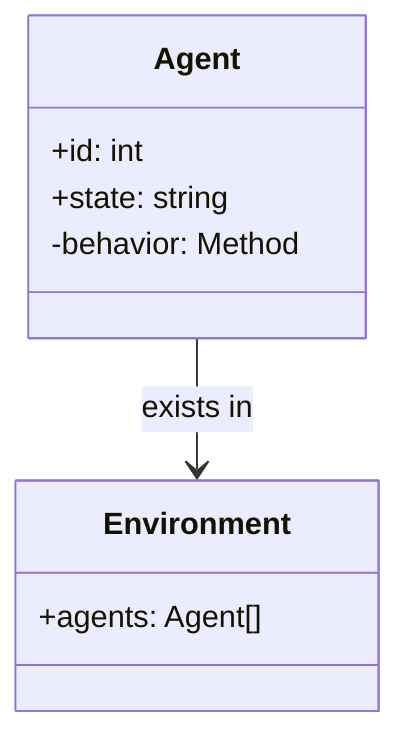
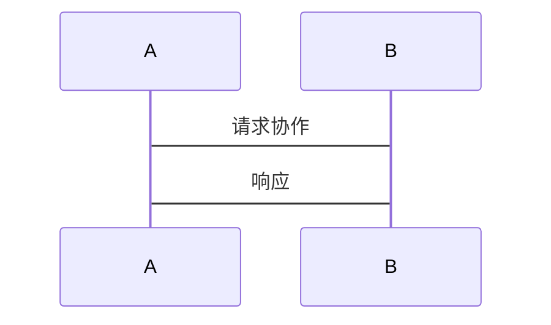

                 


# 构建具有群体智能的多Agent协作系统

## 关键词：多Agent系统，群体智能，协作算法，分布式系统，系统架构

## 摘要：  
本文详细探讨了构建具有群体智能的多Agent协作系统的各个方面，从基本概念到高级算法，再到实际应用。文章首先介绍了多Agent协作系统和群体智能的定义及其应用场景，随后深入分析了多Agent协作的核心概念和算法原理，包括协商算法和一致性算法。接着，通过系统架构设计和项目实战，展示了如何将理论应用于实际项目中。最后，总结了关键点并展望了未来的发展方向。

---

## 第一部分: 多Agent协作系统概述

### 第1章: 多Agent协作系统与群体智能概述

#### 1.1 多Agent系统的基本概念
多Agent系统（Multi-Agent System, MAS）由多个智能体（Agent）组成，这些智能体通过协作完成特定任务。与传统分布式系统不同，多Agent系统强调智能体的自主性、反应性和协作性。

**1.1.1 多Agent系统的定义**  
多Agent系统由多个智能体组成，每个智能体能够感知环境、自主决策并与其他智能体协作。智能体之间通过通信和协商完成任务。

**1.1.2 多Agent系统的特点**  
- **自主性**：智能体能够自主决策。
- **反应性**：能够感知环境并实时响应。
- **协作性**：多个智能体协同完成任务。
- **分布性**：智能体分布在网络中，不依赖中央控制。

**1.1.3 多Agent系统与传统分布式系统的主要区别**  
| 特性        | 分布式系统          | 多Agent系统          |
|-------------|--------------------|----------------------|
| 结构        | 分散计算资源       | 分散智能体           |
| 任务分配    | 静态任务分配       | 动态任务协商         |
| 智能性      | 无智能             | 具有智能             |

#### 1.2 群体智能的定义与特点
群体智能（Swarm Intelligence, SI）是多个简单智能体通过局部交互表现出的整体智能行为。

**1.2.1 群体智能的定义**  
群体智能研究多个简单智能体通过局部交互涌现出复杂行为的现象。

**1.2.2 群体智能的核心特征**  
- **去中心化**：无中央控制。
- **自组织性**：智能体自发组织。
- **涌现性**：整体智能涌现。

**1.2.3 群体智能与个体智能的关系**  
群体智能依赖个体智能，但整体表现超越个体。

#### 1.3 多Agent协作系统与群体智能的联系
多Agent协作系统通过群体智能实现复杂任务。

**1.3.1 多Agent协作系统的概念**  
多个智能体协作完成复杂任务。

**1.3.2 群体智能在多Agent协作中的应用**  
智能体通过群体智能算法协作，完成任务。

**1.3.3 多Agent协作系统与群体智能的区别与联系**  
| 方面        | 多Agent协作系统      | 群体智能             |
|-------------|----------------------|----------------------|
| 结构        | 明确的协作结构        | 去中心化             |
| 智能性      | 强调协作              | 强调涌现             |

---

## 第二部分: 多Agent协作系统的核心概念与原理

### 第2章: 多Agent协作系统的核心概念

#### 2.1 多Agent系统中的Agent
**2.1.1 Agent的定义与分类**  
Agent是能够感知环境并采取行动的实体，分为简单和复杂两类。

**2.1.2 Agent的智能性与自主性**  
智能性：推理和决策能力；自主性：无需外部干预。

**2.1.3 Agent的通信与协作机制**  
通过消息传递协作，如请求、响应。

#### 2.2 群体智能的核心原理
**2.2.1 群体智能的基本原理**  
简单规则导致复杂行为。

**2.2.2 群体智能中的信息传递与决策机制**  
基于局部信息做出决策，如蚂蚁算法。

**2.2.3 群体智能的自组织与涌现特性**  
系统自组织，整体智能涌现。

#### 2.3 多Agent协作中的关键问题
**2.3.1 协作问题**  
任务分配和协调。

**2.3.2 通信问题**  
信息传递和同步。

---

## 第三部分: 多Agent协作系统的算法原理

### 第3章: 多Agent协作系统的算法原理

#### 3.1 分布式协商算法
**3.1.1 分布式协商算法的定义**  
智能体通过协商达成一致。

**3.1.2 分布式协商算法的步骤**  
1. 初始化：智能体提出请求。
2. 协商：通过消息传递达成一致。
3. 执行：执行协商结果。

**3.1.3 分布式协商算法的数学模型**  
$$ \text{协商结果} = \argmax_{x} \sum_{i=1}^{n} f_i(x) $$

#### 3.2 一致性算法
**3.2.1 一致性算法的定义**  
确保系统中所有智能体状态一致。

**3.2.2 一致性算法的步骤**  
1. 初始化：智能体初始化状态。
2. 传播：状态在智能体间传播。
3. 同步：达成一致。

**3.2.3 一致性算法的数学模型**  
$$ \text{同步后状态} = \frac{\sum_{i=1}^{n} x_i}{n} $$

#### 3.3 其他协作算法
**3.3.1 蚁群算法**  
模拟蚂蚁觅食路径优化。

**3.3.2 遗传算法**  
模拟自然选择优化任务分配。

---

## 第四部分: 多Agent协作系统的系统分析与架构设计

### 第4章: 多Agent协作系统的系统分析与架构设计

#### 4.1 系统功能设计
**4.1.1 领域模型**  
用Mermaid类图展示系统组件及其关系。



#### 4.2 系统架构设计
**4.2.1 架构图**  
用Mermaid展示分层架构。


#### 4.3 系统接口设计
**4.3.1 接口定义**  
RESTful API：`POST /agents` 创建智能体。

#### 4.4 系统交互设计
**4.4.1 交互流程**  
用Mermaid序列图展示协作流程。



---

## 第五部分: 多Agent协作系统的项目实战

### 第5章: 多Agent协作系统的项目实战

#### 5.1 项目环境配置
**5.1.1 环境配置**  
安装Python和相关库：`pip install requests`.

#### 5.2 核心代码实现
**5.2.1 协商算法实现**  
协商算法的Python代码：

```python
def协商算法(agents):
    for agent in agents:
        agent.request = True
    while not all(agent.response):
        for agent in agents:
            if agent.request and agent.response:
                agent.resolve()
    return agents' 状态
```

#### 5.3 代码解读与分析
**5.3.1 代码解读**  
实现智能体之间的协商过程。

#### 5.4 实际案例分析
**5.4.1 案例分析**  
应用协商算法解决任务分配问题。

---

## 第六部分: 总结与展望

### 第6章: 总结与展望

#### 6.1 本章总结
多Agent协作系统通过群体智能实现复杂任务协作。

#### 6.2 未来展望
研究更高效的协商算法和边缘计算结合。

#### 6.3 最佳实践
- 选择合适的算法
- 确保通信可靠性
- 定期系统维护

#### 6.4 小结
本文全面介绍了多Agent协作系统和群体智能，为实际应用提供了理论和实践指导。

#### 6.5 注意事项
- 安全问题
- 故障恢复
- 性能优化

#### 6.6 拓展阅读
推荐书籍和论文，深入学习相关知识。

---

## 作者：AI天才研究院/AI Genius Institute & 禅与计算机程序设计艺术 /Zen And The Art of Computer Programming

---

以上是《构建具有群体智能的多Agent协作系统》的详细目录和内容概览。每一部分都按照逻辑顺序展开，确保读者能够系统地理解多Agent协作系统和群体智能的核心概念、算法原理、系统设计和实际应用。

