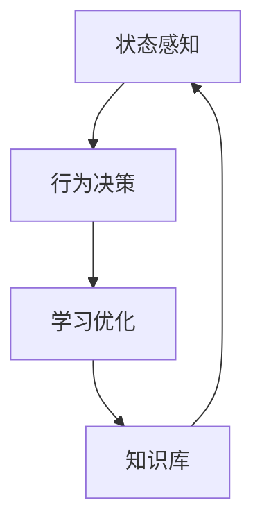

                 


# 构建具有自主学习与探索能力的AI Agent

## 关键词：AI Agent，自主学习，探索能力，强化学习，深度强化学习，系统架构

## 摘要：  
本文深入探讨了构建具有自主学习与探索能力的AI Agent的理论基础、算法原理、系统架构及实现方法。通过结合强化学习和深度学习技术，分析了AI Agent如何在复杂环境中实现自主学习与探索。本文还提供了详细的系统设计、算法实现和项目实战案例，帮助读者全面理解并掌握构建此类AI Agent的核心技术。

---

## 第1章：AI Agent与自主学习概述

### 1.1 AI Agent的基本概念
AI Agent（智能体）是指能够感知环境、做出决策并执行动作的智能系统。与传统程序不同，AI Agent具备以下核心特征：
1. **自主性**：能够在没有外部干预的情况下独立运行。
2. **反应性**：能够实时感知环境并做出响应。
3. **学习能力**：能够通过经验改进自身的决策能力。

### 1.2 自主学习与探索的核心问题
自主学习与探索能力是AI Agent的核心能力，主要解决以下问题：
1. **环境不确定性**：在未知或动态变化的环境中，AI Agent需要通过学习适应环境。
2. **目标设定**：AI Agent需要自主设定目标或根据环境反馈调整目标。
3. **决策优化**：通过不断尝试和反馈，优化决策策略。

### 1.3 强化学习与自主学习的关系
强化学习是实现自主学习的核心技术。通过定义状态、动作和奖励机制，AI Agent能够在与环境的交互中逐步优化自身的决策策略。

---

## 第2章：强化学习与深度强化学习

### 2.1 强化学习基础
强化学习（Reinforcement Learning，RL）的核心在于通过试错学习优化决策策略。其主要组成部分包括：
- **状态（State）**：环境的当前情况。
- **动作（Action）**：AI Agent的决策。
- **奖励（Reward）**：环境对AI Agent动作的反馈。

### 2.2 Q-Learning算法
Q-Learning是一种经典的强化学习算法，通过Q值表记录状态-动作对的期望奖励值，公式如下：
$$Q(s, a) = r + \gamma \max_{a'} Q(s', a')$$
其中：
- $s$：当前状态
- $a$：当前动作
- $r$：奖励
- $\gamma$：折扣因子
- $s'$：下一个状态

### 2.3 深度强化学习
深度强化学习（Deep Reinforcement Learning）将神经网络引入强化学习，通过端到端的学习方式优化决策策略。其核心算法包括：
1. **深度Q网络（DQN）**：使用卷积神经网络近似Q值函数。
2. **策略梯度方法（PG）**：通过优化策略直接最大化奖励。

---

## 第3章：AI Agent的系统架构设计

### 3.1 系统功能模块
AI Agent的系统架构通常包含以下模块：
1. **状态感知模块**：负责感知环境的状态信息。
2. **行为决策模块**：基于当前状态和历史经验，生成决策动作。
3. **学习优化模块**：通过强化学习算法优化决策策略。

### 3.2 系统架构图


### 3.3 接口设计
1. **状态输入接口**：接收环境的状态信息。
2. **动作输出接口**：输出决策动作。
3. **反馈输入接口**：接收环境的奖励反馈。

---

## 第4章：系统实现与项目实战

### 4.1 项目背景
本项目旨在开发一个能够在迷宫环境中自主学习的AI Agent，目标是通过不断探索迷宫，找到从起点到终点的最短路径。

### 4.2 实现步骤
1. **环境搭建**：使用Python的OpenAI Gym库搭建迷宫环境。
2. **状态感知**：通过传感器获取当前位置和环境信息。
3. **行为决策**：基于DQN算法生成决策动作。
4. **学习优化**：通过强化学习算法优化Q值函数。

### 4.3 代码实现
```python
import numpy as np
import gym

class AI_Agent:
    def __init__(self, env):
        self.env = env
        self.state_size = env.observation_space.shape[0]
        self.action_size = env.action_space.n
        self.gamma = 0.99
        self.epsilon = 1.0
        self.epsilon_min = 0.01
        self.epsilon_decay = 0.995
        self.model = self.build_model()

    def build_model(self):
        # 简单的神经网络模型
        import tensorflow as tf
        model = tf.keras.Sequential([
            tf.keras.layers.Dense(24, activation='relu', input_shape=(self.state_size,)),
            tf.keras.layers.Dense(self.action_size, activation='linear')
        ])
        model.compile(loss='mse', optimizer=tf.keras.optimizers.Adam(learning_rate=0.01))
        return model

    def act(self, state):
        if np.random.random() < self.epsilon:
            return self.env.action_space.sample()
        q_values = self.model.predict(state)
        return np.argmax(q_values[0])

    def remember(self, state, action, reward, next_state):
        # 简单的存储机制，实际可以使用经验回放
        pass

    def replay(self, batch_size):
        # 简单的回放机制，实际可以使用随机样本
        pass

    def decay_epsilon(self):
        self.epsilon = max(self.epsilon_min, self.epsilon * self.epsilon_decay)

# 初始化环境和AI Agent
env = gym.make('迷宫环境')
agent = AI_Agent(env)

# 训练过程
for episode in range(1000):
    state = env.reset()
    while True:
        action = agent.act(state)
        next_state, reward, done, _ = env.step(action)
        agent.remember(state, action, reward, next_state)
        agent.replay(32)
        if done:
            break
    agent.decay_epsilon()
```

### 4.4 实验结果
通过实验可以观察到，AI Agent在迷宫环境中不断尝试不同的路径，逐步优化自身的决策策略，最终找到最短路径。

---

## 第5章：系统优化与扩展

### 5.1 算法优化
1. **经验回放**：通过存储历史经验，避免重复学习。
2. **优先经验回放**：根据经验的重要性进行优先学习。

### 5.2 系统扩展
1. **多目标优化**：实现多目标决策。
2. **分布式学习**：通过分布式计算加速学习过程。

---

## 第6章：总结与展望

### 6.1 本文总结
本文详细探讨了构建具有自主学习与探索能力的AI Agent的核心技术，包括强化学习算法、系统架构设计和项目实现。

### 6.2 未来展望
未来的研究方向包括：
1. **多智能体协作**：实现多AI Agent协作。
2. **复杂环境适应**：优化AI Agent在复杂环境中的适应能力。
3. **实时决策优化**：提升AI Agent的实时决策能力。

---

## 参考文献
1. DeepMind. "Deep Q-Networks (DQN)".
2. Mnih, V., et al. "Human-level control through deep reinforcement learning."

---

## 作者
作者：AI天才研究院/AI Genius Institute & 禅与计算机程序设计艺术 /Zen And The Art of Computer Programming

