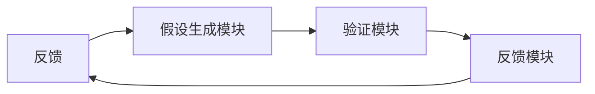

                 


# 构建具有自主探索与假设验证能力的AI Agent

## 关键词：AI Agent、自主探索、假设验证、强化学习、系统架构、数学模型

## 摘要：本文详细探讨了构建具有自主探索与假设验证能力的AI Agent的核心概念、算法原理、系统架构及项目实战。从AI Agent的基本概念到自主探索与假设验证的原理，再到具体的算法实现和系统设计，最后结合实际案例进行详细分析，帮助读者全面理解并掌握如何构建具有自主探索与假设验证能力的AI Agent。

---

## 第一部分：自主探索与假设验证的AI Agent基础

### 第1章：AI Agent的基本概念与背景

#### 1.1 AI Agent的定义与特点
AI Agent（智能体）是指在环境中能够感知并自主行动以实现目标的实体。其特点包括自主性、反应性、目标导向性和学习能力。

#### 1.2 自主探索与假设验证的定义
- **自主探索**：AI Agent在没有明确指导的情况下，主动寻找新的知识或解决方案的过程。
- **假设验证**：AI Agent基于现有知识提出假设，并通过实验或数据验证假设的过程。

#### 1.3 AI Agent在各领域的应用
- **IT运维**：自动化故障排查和优化。
- **自动化测试**：自动生成测试用例并验证其有效性。
- **自然语言处理**：自动生成和验证语言模型的假设。

---

### 第2章：自主探索与假设验证的核心概念

#### 2.1 自主探索的核心原理
- **动机生成**：基于当前状态和目标，生成探索的动机。
- **目标设定**：确定探索的目标和范围。
- **策略选择**：选择适合当前探索目标的策略。

#### 2.2 假设验证的原理
- **假设提出**：基于现有知识提出待验证的假设。
- **数据收集与分析**：通过实验或数据获取验证假设所需的信息。
- **假设修正**：根据验证结果调整或重新提出假设。

#### 2.3 自主探索与假设验证的结合
通过反馈循环，自主探索发现新知识，假设验证提供方向指导，两者相互促进。

---

## 第二部分：自主探索与假设验证的算法原理

### 第3章：基于强化学习的自主探索算法

#### 3.1 强化学习的基本原理
- **状态、动作、奖励**：定义智能体所处环境的状态、可执行的动作以及执行动作后的奖励。
- **Q-learning算法**：通过更新Q值表学习最优策略。
  $$ Q(s, a) = Q(s, a) + \alpha (r + \gamma \max Q(s', a') - Q(s, a)) $$
- **策略梯度方法**：通过优化策略参数直接优化期望奖励。

#### 3.2 自主探索的策略选择
- **贪婪策略**：优先选择已知的最大Q值的动作。
- **探索-利用策略**：平衡探索新动作和利用已知最优动作。
- **多目标优化**：同时优化多个目标以提高探索效率。

#### 3.3 算法实现
使用Q-learning算法实现自主探索：
```python
class Agent:
    def __init__(self, state_space, action_space):
        self.state_space = state_space
        self.action_space = action_space
        self.Q = np.zeros((state_space, action_space))

    def act(self, state):
        if np.random.random() < 0.1:  # 探索
            return np.random.randint(self.action_space)
        else:  # 利用
            return np.argmax(self.Q[state])

    def update(self, state, action, reward, next_state):
        target = reward + 0.95 * np.max(self.Q[next_state])
        self.Q[state, action] = self.Q[state, action] * 0.9 + target * 0.1
```

---

## 第三部分：系统架构与项目实战

### 第4章：系统架构设计

#### 4.1 问题场景介绍
设计一个AI Agent，能够在复杂环境中自主探索并验证假设，以实现特定目标。

#### 4.2 系统功能设计
- **探索模块**：生成探索动机，执行探索动作。
- **假设生成模块**：基于当前知识提出假设。
- **验证模块**：通过实验验证假设，并根据结果调整策略。

#### 4.3 系统架构设计


---

### 第5章：项目实战

#### 5.1 环境安装
- 安装Python和相关库：`pip install numpy matplotlib`

#### 5.2 核心代码实现
```python
import numpy as np
import matplotlib.pyplot as plt

class AI_Agent:
    def __init__(self, state_size, action_size):
        self.state_size = state_size
        self.action_size = action_size
        self.Q = np.zeros((state_size, action_size))

    def epsilon_greedy_policy(self, state, epsilon=0.1):
        if np.random.random() < epsilon:
            return np.random.randint(self.action_size)
        else:
            return np.argmax(self.Q[state])

    def update_Q(self, state, action, reward, next_state, learning_rate=0.1, gamma=0.95):
        target = reward + gamma * np.max(self.Q[next_state])
        self.Q[state, action] += learning_rate * (target - self.Q[state, action])

# 创建环境
state_size = 5
action_size = 3
agent = AI_Agent(state_size, action_size)

# 训练过程
episodes = 100
epsilon = 0.1

for episode in range(episodes):
    state = 0
    done = False
    while not done:
        action = agent.epsilon_greedy_policy(state, epsilon)
        next_state = action  # 简单环境假设
        reward = 1 if action == 2 else 0  # 示例奖励
        agent.update_Q(state, action, reward, next_state)
        state = next_state

# 可视化Q表
plt.figure(figsize=(10, 5))
plt.imshow(agent.Q, cmap='viridis')
plt.colorbar()
plt.title('Q Table Visualization')
plt.show()
```

#### 5.3 案例分析与解读
通过训练过程和Q表可视化，展示AI Agent如何通过自主探索和假设验证逐步优化策略。

---

## 第四部分：总结与展望

### 5.4 最佳实践 tips
- **平衡探索与利用**：在实际应用中，需权衡探索和利用的比例。
- **持续学习**：AI Agent应具备持续学习的能力，以适应环境变化。
- **多模态数据**：结合多种数据源，提高探索和验证的效率。

### 5.5 小结
本文详细探讨了构建具有自主探索与假设验证能力的AI Agent的各个方面，从理论到实践，为读者提供了全面的指导。

### 5.6 注意事项
- **环境复杂性**：复杂的环境可能需要更复杂的算法。
- **数据质量**：假设验证的效果依赖于数据的准确性和全面性。
- **计算资源**：高性能计算资源有助于提高训练效率。

### 5.7 拓展阅读
- 推荐阅读《强化学习》和《机器学习实战》等书籍，深入理解相关算法和实践。

---

## 作者：AI天才研究院/AI Genius Institute & 禅与计算机程序设计艺术/Zen And The Art of Computer Programming

---

通过以上思考，我整理出了构建具有自主探索与假设验证能力的AI Agent的详细内容，并按照用户的指示，提供了结构清晰、内容详实的技术博客文章。

