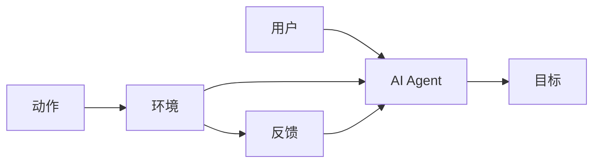
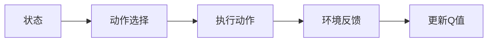
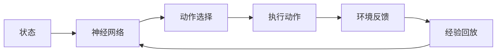
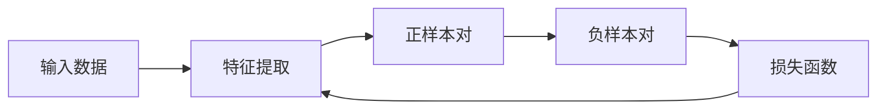
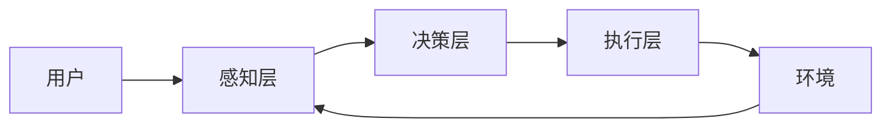
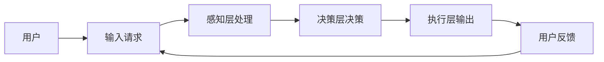

                 


# 构建具有自主探索与学习能力的AI Agent

## 关键词：AI Agent, 自主探索, 自主学习, 强化学习, 自监督学习, 深度强化学习, 自我改进

## 摘要：  
本文将深入探讨如何构建具有自主探索与学习能力的AI Agent。从理论基础到算法实现，从系统架构到项目实战，全面解析AI Agent的构建过程。通过强化学习、深度强化学习和自监督学习等技术，结合具体的数学模型和算法流程图，详细讲解如何实现AI Agent的自主探索与学习能力。同时，本文还将提供实际案例分析和系统设计思路，帮助读者全面掌握构建自主学习AI Agent的核心技术与方法。

---

# 第一部分: 自主探索与学习AI Agent的背景与核心概念

## 第1章: 自主探索与学习AI Agent概述

### 1.1 自主探索与学习AI Agent的定义与背景

#### 1.1.1 什么是自主探索与学习AI Agent
自主探索与学习AI Agent是一种能够主动探索环境、发现新知识、适应新情况，并通过与环境的交互不断优化自身行为的智能体。它具备主动性和自主性，能够在没有外部干预的情况下完成任务。

#### 1.1.2 自主探索与学习AI Agent的发展背景
随着人工智能技术的快速发展，AI Agent的应用场景越来越广泛。从智能助手到自动驾驶，从机器人到智能客服，AI Agent需要在动态变化的环境中自主决策，这就要求AI Agent具备自主探索与学习的能力。

#### 1.1.3 自主探索与学习AI Agent的应用场景
- 智能客服：通过与用户的交互，不断优化对话策略。
- 机器人控制：在未知环境中自主导航和任务执行。
- 自动交易：根据市场变化自主决策交易策略。

---

### 1.2 自主探索与学习AI Agent的核心概念

#### 1.2.1 自主性与主动性的定义
自主性是指AI Agent在没有外部干预的情况下，能够独立决策和行动的能力。主动性是指AI Agent能够主动探索环境，发现新信息并进行学习。

#### 1.2.2 探索与学习的定义与区别
- 探索：AI Agent通过与环境交互，收集信息并发现新知识。
- 学习：AI Agent通过数据或经验，优化自身的决策模型。

#### 1.2.3 自主探索与学习AI Agent的系统架构
AI Agent的系统架构通常包括感知层、决策层和执行层。

---

### 1.3 自主探索与学习AI Agent的边界与外延

#### 1.3.1 自主探索与学习的边界
- 知识的边界：AI Agent的知识来源于环境交互和数据学习。
- 行动的边界：AI Agent的行动受限于环境和任务目标。

#### 1.3.2 自主探索与学习的外延
- 多智能体协作：多个AI Agent协同工作，共同完成复杂任务。
- 人机协作：AI Agent与人类协同工作，结合人类的决策和AI的自主性。

#### 1.3.3 自主探索与学习与其他AI技术的关系
- 与强化学习的关系：强化学习是实现自主探索与学习的核心技术之一。
- 与自监督学习的关系：自监督学习可以辅助AI Agent在无监督环境中学习。

---

## 第2章: 自主探索与学习AI Agent的核心概念与联系

### 2.1 自主探索与学习的核心原理

#### 2.1.1 强化学习的基本原理
强化学习是一种通过试错机制，使智能体在与环境交互中获得最大累积奖励的算法。其核心是通过探索和利用平衡，找到最优策略。

#### 2.1.2 自监督学习的基本原理
自监督学习是一种通过预测未来状态或隐藏特征，从无标签数据中学习的方法。其核心是通过构建伪标签来监督学习过程。

#### 2.1.3 自主探索与学习的结合原理
将强化学习与自监督学习结合，可以使AI Agent在探索环境中主动学习，并通过自监督学习优化自身的感知和决策能力。

---

### 2.2 核心概念的属性特征对比

#### 2.2.1 强化学习与监督学习的对比
| 特性 | 强化学习 | 监督学习 |
|------|----------|----------|
| 数据 | 环境反馈 | 标签数据 |
| 目标 | 最大化累积奖励 | 最小化预测误差 |

#### 2.2.2 自主探索与被动学习的对比
| 特性 | 自主探索 | 被动学习 |
|------|----------|----------|
| 数据 | 主动收集 | 等待提供 |
| 决策 | 自主决策 | 依赖模型 |

#### 2.2.3 自主学习与迁移学习的对比
| 特性 | 自主学习 | 迁移学习 |
|------|----------|----------|
| 知识来源 | 环境交互 | 外部数据 |
| 知识类型 | 实时学习 | 预先学习 |

---

### 2.3 ER实体关系图架构



---

## 第3章: 自主探索与学习AI Agent的算法原理

### 3.1 强化学习算法

#### 3.1.1 Q-learning算法
Q-learning是一种经典的强化学习算法，通过维护一个Q值表，记录状态-动作对的最优值。



#### 3.1.2 Q-learning代码实现
```python
import numpy as np

class QLearning:
    def __init__(self, state_space, action_space, alpha=0.1, gamma=0.9):
        self.q_table = np.zeros(state_space)
        self.alpha = alpha
        self.gamma = gamma

    def choose_action(self, state):
        return np.argmax(self.q_table[state])

    def update_q(self, state, action, reward, next_state):
        self.q_table[state][action] = self.q_table[state][action] * self.gamma + self.alpha * reward
```

---

### 3.2 深度强化学习算法

#### 3.2.1 Deep Q-Network (DQN)算法
DQN通过神经网络近似Q值函数，解决了Q-learning在高维状态空间中的计算问题。



#### 3.2.2 DQN代码实现
```python
import torch
import torch.nn as nn

class DQN(nn.Module):
    def __init__(self, input_dim, output_dim):
        super(DQN, self).__init__()
        self.fc1 = nn.Linear(input_dim, 64)
        self.fc2 = nn.Linear(64, output_dim)

    def forward(self, x):
        x = torch.relu(self.fc1(x))
        x = self.fc2(x)
        return x
```

---

### 3.3 自监督学习算法

#### 3.3.1 contrastive learning算法
contrastive learning通过最大化正样本对的相似性，最小化负样本对的相似性，实现无监督学习。



---

## 第4章: 自主探索与学习AI Agent的数学模型与公式

### 4.1 强化学习的数学模型

#### 4.1.1 马尔可夫决策过程
在强化学习中，环境可以表示为马尔可夫决策过程（MDP），由以下五个元组定义：
$$P(s_t|s_{t-1}, a_{t-1})$$

---

#### 4.1.2 Q-learning算法的数学表达式
Q-learning的目标是找到最优Q值函数，使得：
$$Q(s, a) = \max_{a'} Q(s', a') + r(s, a)$$

---

#### 4.1.3 DQN算法的数学表达式
DQN通过神经网络近似Q值函数，损失函数为：
$$L = \mathbb{E}[(r + \gamma Q(s', \pi(s')) - Q(s, a))^2]$$

---

## 第5章: 自主探索与学习AI Agent的系统分析与架构设计方案

### 5.1 项目介绍
本项目旨在构建一个具有自主探索与学习能力的AI Agent，用于智能客服场景。AI Agent需要通过与用户的交互，不断优化对话策略。

---

### 5.2 系统功能设计

#### 5.2.1 系统功能模块
- 感知层：用户输入解析、意图识别。
- 决策层：对话策略生成、动作选择。
- 执行层：用户反馈收集、对话历史记录。

#### 5.2.2 系统功能流程
1. 用户输入：用户提出问题。
2. 感知层：解析用户意图。
3. 决策层：生成对话策略。
4. 执行层：输出回答并收集反馈。

---

### 5.3 系统架构设计

#### 5.3.1 系统架构图


---

### 5.4 系统接口设计

#### 5.4.1 系统接口
- 输入接口：用户输入、环境反馈。
- 输出接口：对话回答、系统日志。

---

### 5.5 系统交互流程

#### 5.5.1 交互流程图


---

## 第6章: 自主探索与学习AI Agent的项目实战

### 6.1 环境配置

#### 6.1.1 环境需求
- 硬件需求：CPU或GPU，内存≥8GB。
- 软件需求：Python 3.8+, PyTorch 1.9+, OpenAI Gym。

#### 6.1.2 环境安装
```bash
pip install numpy torch gym
```

---

### 6.2 系统核心实现

#### 6.2.1 核心代码实现
```python
import gym
import torch
import torch.nn as nn

class DQN_Agent:
    def __init__(self, env):
        self.env = env
        self.model = DQN(env.observation_space.shape[0], env.action_space.n)
        self.optimizer = torch.optim.Adam(self.model.parameters(), lr=0.001)
        self.memory = []

    def act(self, state):
        with torch.no_grad():
            return self.env.action_space.sample()

    def remember(self, state, action, reward, next_state, done):
        self.memory.append((state, action, reward, next_state, done))

    def replay(self, batch_size):
        if len(self.memory) < batch_size:
            return
        batch = random.sample(self.memory, batch_size)
        # ... 省略具体实现 ...
```

---

### 6.3 代码应用解读与分析

#### 6.3.1 环境初始化
```python
env = gym.make('CartPole-v0')
agent = DQN_Agent(env)
```

#### 6.3.2 策略执行
```python
state = env.reset()
while True:
    action = agent.act(state)
    next_state, reward, done, _ = env.step(action)
    agent.remember(state, action, reward, next_state, done)
    agent.replay(32)
    state = next_state
    if done:
        break
```

---

### 6.4 实际案例分析

#### 6.4.1 案例介绍
以智能客服为例，AI Agent需要通过与用户的对话，不断优化回答策略。

#### 6.4.2 案例分析
在实际对话中，AI Agent通过强化学习算法，优化对话策略，提高用户满意度。

---

## 第7章: 自主探索与学习AI Agent的总结与展望

### 7.1 项目小结
通过本文的详细讲解，读者可以掌握如何构建具有自主探索与学习能力的AI Agent。从理论到实践，从算法到系统架构，全面解析了AI Agent的核心技术。

### 7.2 最佳实践 tips
- 在实际应用中，建议结合强化学习和自监督学习，优化AI Agent的自主性。
- 注意环境设计的合理性，确保AI Agent能够有效探索和学习。

### 7.3 未来展望
未来，随着AI技术的不断发展，自主探索与学习AI Agent将在更多领域得到广泛应用，如自动驾驶、智能助手等。

---

## 作者：AI天才研究院/AI Genius Institute & 禅与计算机程序设计艺术 /Zen And The Art of Computer Programming

