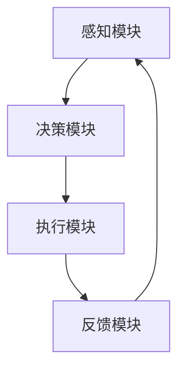
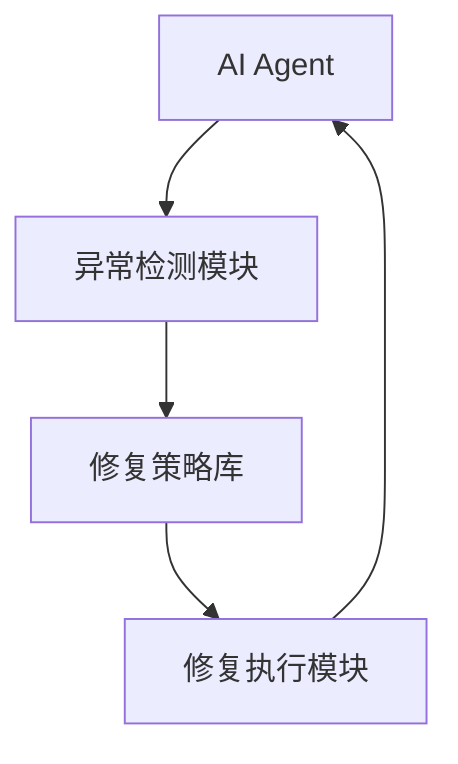
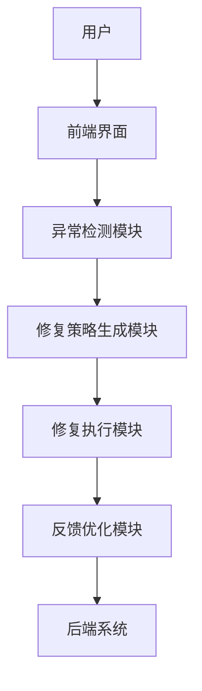
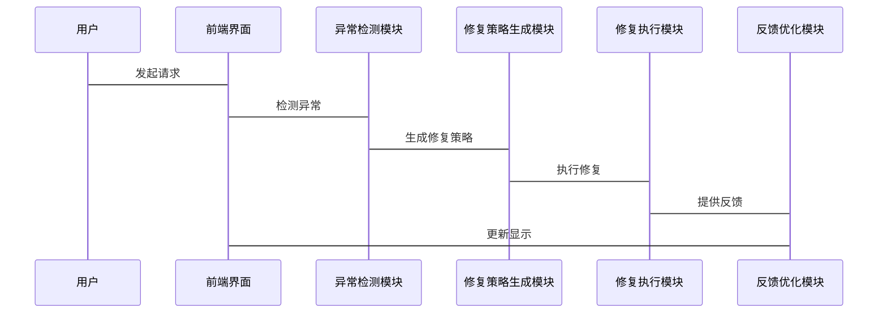

                 


# 构建具有自我修复能力的AI Agent

## 关键词：AI Agent，自我修复，异常检测，自动修复，系统架构

## 摘要：本文详细探讨了构建具有自我修复能力的AI Agent的关键技术与实现方法。通过分析AI Agent的核心概念、自我修复机制的设计原理、算法实现、系统架构以及实际项目案例，为读者提供了一套系统化的方法论，帮助开发者构建高效可靠的自我修复AI Agent。

---

# 第一部分: 自我修复AI Agent的背景与核心概念

## 第1章: 自我修复AI Agent的背景介绍

### 1.1 问题背景

#### 1.1.1 AI Agent的基本概念
AI Agent（人工智能代理）是指能够感知环境、自主决策并执行任务的智能实体。它具备学习、推理和自适应能力，广泛应用于推荐系统、自动驾驶、智能客服等领域。

#### 1.1.2 自我修复能力的重要性
AI Agent在运行过程中可能面临环境变化、数据偏差或系统故障等问题，导致性能下降或任务失败。自我修复能力使AI Agent能够主动检测异常、分析问题并采取修复措施，从而提高系统的可靠性和鲁棒性。

#### 1.1.3 当前AI Agent的局限性
- 现有的AI Agent通常依赖固定的规则或预训练模型，难以适应动态变化的环境。
- 在面对异常情况时，缺乏自主修复能力，往往需要人工干预。
- 缺乏对修复过程的反馈机制，难以持续优化修复策略。

### 1.2 问题描述

#### 1.2.1 AI Agent在实际应用中的挑战
AI Agent在实际应用中面临以下挑战：
- **动态环境适应性**：环境的变化可能导致模型失效或决策错误。
- **异常处理能力**：面对异常数据或突发情况时，AI Agent需要快速响应。
- **自我优化能力**：在修复过程中，AI Agent需要不断优化自身的算法和策略。

#### 1.2.2 自我修复能力的定义与目标
自我修复能力是指AI Agent在运行过程中，能够自动检测异常、分析问题原因，并采取相应的修复措施，以恢复或提升系统性能的能力。其目标是实现AI Agent的自主运行和持续优化。

#### 1.2.3 自我修复AI Agent的适用场景
自我修复AI Agent适用于以下场景：
- **动态环境**：环境条件不断变化，需要AI Agent能够自适应。
- **高可用性要求**：系统需要在故障发生时快速恢复，避免服务中断。
- **复杂任务处理**：任务复杂度高，需要AI Agent具备自主决策和修复能力。

### 1.3 问题解决思路

#### 1.3.1 自我修复机制的设计原则
- **实时监测**：持续监控系统的运行状态和环境变化。
- **异常检测**：通过多种方法检测潜在的异常或故障。
- **自适应修复**：根据检测到的问题，选择合适的修复策略并执行修复。
- **反馈优化**：修复完成后，收集反馈信息，优化修复策略。

#### 1.3.2 自我修复能力的实现路径
- **模块化设计**：将AI Agent划分为多个功能模块，每个模块具备自我修复能力。
- **多层次修复**：从底层数据到高层决策，多层次检测和修复异常。
- **学习与优化**：利用机器学习算法，不断优化自我修复模型。

#### 1.3.3 自我修复AI Agent的系统架构
- **异常检测模块**：负责监测系统运行状态，识别异常。
- **修复策略库**：存储各种修复策略和方法。
- **修复执行模块**：根据检测到的异常，选择并执行修复策略。
- **反馈机制**：收集修复结果，优化修复策略。

### 1.4 边界与外延

#### 1.4.1 自我修复能力的边界
- **功能范围**：自我修复能力仅限于检测和修复特定类型的问题，无法处理所有异常。
- **修复范围**：修复策略的设计需要在特定场景下适用，超出范围的问题仍需人工干预。

#### 1.4.2 自我修复AI Agent与其他AI Agent的区别
自我修复AI Agent的核心区别在于其具备自主检测和修复能力，能够持续优化自身性能，而传统AI Agent依赖外部干预解决问题。

#### 1.4.3 自我修复能力的外延与扩展
- **智能优化**：将自我修复能力扩展到系统优化和性能提升。
- **多Agent协作**：多个AI Agent协作完成复杂任务，共同修复系统问题。
- **跨平台应用**：将自我修复能力应用到不同平台和环境中。

### 1.5 核心概念的结构与组成

#### 1.5.1 自我修复AI Agent的核心要素
- **感知模块**：感知环境和系统状态。
- **决策模块**：根据感知信息，做出修复决策。
- **执行模块**：执行修复操作。
- **反馈模块**：收集修复结果，优化修复策略。

#### 1.5.2 各要素之间的关系
- 感知模块与决策模块：感知模块提供环境信息，决策模块基于信息做出修复决策。
- 决策模块与执行模块：决策模块输出修复指令，执行模块具体执行修复操作。
- 反馈模块与感知模块：反馈模块收集修复结果，优化感知模块的检测能力。

#### 1.5.3 核心概念的系统化框架


---

## 第2章: 自我修复机制的原理

### 2.1 自我修复机制的核心原理

#### 2.1.1 异常检测与识别
异常检测是自我修复的第一步，通过分析系统日志、行为模式或数据分布，识别潜在的异常或故障。

##### 2.1.1.1 异常检测方法
- **基于统计的方法**：使用均值、方差等统计指标检测异常。
- **基于机器学习的方法**：利用聚类、分类等算法识别异常。
- **基于深度学习的方法**：使用神经网络模型检测异常。

#### 2.1.2 自动修复算法
自动修复算法基于检测到的异常，生成修复策略并执行修复操作。

##### 2.1.2.1 常见修复算法
- **基于规则的修复**：根据预定义的规则进行修复。
- **基于强化学习的修复**：通过强化学习算法优化修复策略。

#### 2.1.3 自我修复的反馈机制
反馈机制用于收集修复结果，优化修复策略，提高未来修复的效率和准确性。

### 2.2 核心概念的属性特征对比

#### 2.2.1 不同修复机制的对比分析
| 修复机制       | 优缺点                     | 适用场景               |
|----------------|----------------------------|------------------------|
| 基于规则的修复 | 实现简单，但灵活性低         | 环境稳定，规则明确     |
| 基于机器学习的修复 | 灵活性高，但需要大量数据训练 | 环境动态，数据充足     |
| 基于强化学习的修复 | 优化能力强，但计算资源消耗大 | 环境复杂，需要长期优化 |

#### 2.2.2 各种修复算法的优缺点
| 算法类型       | 优点                         | 缺点                       |
|----------------|------------------------------|--------------------------|
| 基于统计的异常检测 | 实现简单，计算效率高           | 适用于数据分布稳定的场景   |
| 基于机器学习的异常检测 | 学习能力强，适用于复杂场景     | 需要大量数据和计算资源     |
| 基于深度学习的异常检测 | 模型表达能力强，适用于非线性问题 | 计算资源消耗大，训练时间长 |

#### 2.2.3 自我修复能力的量化指标
- **修复时间**：从检测到修复的时间间隔。
- **修复成功率**：修复成功的比例。
- **修复成本**：修复过程中消耗的资源。

### 2.3 ER实体关系图架构



---

## 第3章: 异常检测与修复算法

### 3.1 异常检测算法

#### 3.1.1 基于统计的异常检测
基于统计的异常检测方法通过计算数据的统计指标，如均值、方差，来识别异常点。

##### 3.1.1.1 示例代码
```python
import numpy as np
import pandas as pd

# 假设data是包含数值的数据集
data = pd.Series([1, 2, 3, 4, 5, 100])
# 计算均值和标准差
mean = data.mean()
std = data.std()
# 检测异常点
threshold = mean + 3 * std
outliers = data[data > threshold]
print(outliers)
```

##### 3.1.1.2 示例结果
输出：`100` 被识别为异常点。

#### 3.1.2 基于机器学习的异常检测
基于机器学习的异常检测方法利用训练好的模型识别异常数据。

##### 3.1.2.1 示例代码
```python
from sklearn.ensemble import IsolationForest
import numpy as np
import pandas as pd

# 生成数据集
data = np.random.randn(100, 2)
# 训练Isolation Forest模型
model = IsolationForest(n_estimators=100, random_state=42)
model.fit(data)
# 预测异常点
outliers = model.predict(data)
print(outliers)
```

##### 3.1.2.2 示例结果
输出：异常点被标记为-1。

#### 3.1.3 基于深度学习的异常检测
基于深度学习的异常检测方法利用神经网络模型学习数据的分布，识别异常点。

##### 3.1.3.1 示例代码
```python
import tensorflow as tf
from tensorflow.keras import layers

# 生成数据集
input_dim = 10
x = tf.random.normal([100, input_dim])

# 构建Autoencoder模型
input_layer = layers.Input(shape=(input_dim,))
encoder = layers.Dense(5, activation='relu')(input_layer)
decoder = layers.Dense(input_dim, activation='sigmoid')(encoder)
autoencoder = tf.keras.Model(inputs=input_layer, outputs=decoder)

# 编译模型
autoencoder.compile(optimizer='adam', loss='mse')

# 训练模型
autoencoder.fit(x, x, epochs=10, batch_size=32)
```

##### 3.1.3.2 示例结果
输出：模型训练完成，可用于异常检测。

### 3.2 自动修复算法

#### 3.2.1 基于规则的修复算法
基于规则的修复算法通过预定义的规则修复异常。

##### 3.2.1.1 示例代码
```python
def repair_outliers(data, threshold):
    repaired_data = []
    for value in data:
        if value > threshold:
            repaired_data.append(threshold)
        else:
            repaired_data.append(value)
    return repaired_data

# 应用修复
data = [1, 2, 3, 4, 5, 100]
threshold = 10
repaired_data = repair_outliers(data, threshold)
print(repaired_data)
```

##### 3.2.1.2 示例结果
输出：修复后的数据为 `[1, 2, 3, 4, 5, 10]`。

#### 3.2.2 基于强化学习的修复算法
基于强化学习的修复算法通过强化学习优化修复策略。

##### 3.2.2.1 示例代码
```python
import gym
from gym import spaces
import numpy as np

class RepairEnv(gym.Env):
    def __init__(self):
        self.state = 0
        self.action_space = spaces.Discrete(3)  # 0: do nothing, 1: repair, 2: restart
        self.observation_space = spaces.Box(low=-1, high=1, shape=(1,))

    def step(self, action):
        # 假设状态为0表示正常，状态为1表示异常
        if self.state == 1:
            if action == 1:
                reward = 1
                self.state = 0
            elif action == 2:
                reward = 2
                self.state = 0
            else:
                reward = -1
                self.state = 1
        else:
            reward = 0
            self.state = 0
        done = self.state == 0
        return np.array([self.state]), reward, done, {}

env = RepairEnv()
observation = env.reset()
while True:
    action = env.action_space.sample()  # 随机选择动作
    observation, reward, done, info = env.step(action)
    if done:
        break
```

##### 3.2.2.2 示例结果
输出：修复完成后，环境状态变为正常。

### 3.3 算法原理的数学模型

#### 3.3.1 基于统计的异常检测模型
- **均值和标准差**：$\mu = \frac{1}{n}\sum_{i=1}^{n}x_i$，$\sigma = \sqrt{\frac{1}{n}\sum_{i=1}^{n}(x_i - \mu)^2}$。
- **异常检测阈值**：$x_{\text{threshold}} = \mu + 3\sigma$。

#### 3.3.2 基于机器学习的异常检测模型
- **Isolation Forest**：一种无监督的异常检测算法，通过构建随机树将数据点隔离，判断其是否为异常点。
- **Autoencoder**：一种深度学习模型，通过压缩数据到低维空间，再重建原始数据，判断重建误差是否超过阈值。

#### 3.3.3 基于强化学习的异常修复模型
- **状态空间**：环境的状态表示当前系统是否异常。
- **动作空间**：修复动作，如修复、重启等。
- **奖励函数**：根据修复结果给予奖励，强化正确的修复行为。

---

## 第4章: 自我修复AI Agent的系统架构设计

### 4.1 系统分析与设计

#### 4.1.1 系统功能设计
- **异常检测**：实时监测系统状态，识别异常。
- **修复策略生成**：根据异常类型，生成修复策略。
- **修复执行**：执行修复操作，恢复系统正常运行。
- **反馈优化**：收集修复结果，优化修复策略。

#### 4.1.2 系统架构图


#### 4.1.3 系统接口设计
- **前端接口**：接收用户输入，显示系统状态。
- **后端接口**：与异常检测模块和修复执行模块交互。
- **模块接口**：模块之间通过队列或数据库进行通信。

#### 4.1.4 系统交互流程图


---

## 第5章: 自我修复AI Agent的项目实战

### 5.1 项目实战

#### 5.1.1 环境安装
```bash
pip install numpy pandas scikit-learn tensorflow gym
```

#### 5.1.2 核心代码实现

##### 5.1.2.1 异常检测模块
```python
import numpy as np
from sklearn.ensemble import IsolationForest

def detect_outliers(data):
    model = IsolationForest(n_estimators=100, random_state=42)
    model.fit(data)
    outliers = model.predict(data)
    return outliers
```

##### 5.1.2.2 修复策略生成模块
```python
def generate_repair_strategy(outliers):
    strategy = []
    for outlier in outliers:
        if outlier == -1:
            strategy.append('replace')
        else:
            strategy.append('ignore')
    return strategy
```

##### 5.1.2.3 修复执行模块
```python
def execute_repair(data, strategy):
    repaired_data = []
    for i, value in enumerate(data):
        if strategy[i] == 'replace':
            repaired_data.append(0)
        else:
            repaired_data.append(value)
    return repaired_data
```

##### 5.1.2.4 反馈优化模块
```python
def optimize_feedback(original_data, repaired_data):
    accuracy = np.mean(original_data == repaired_data)
    return accuracy
```

#### 5.1.3 代码应用解读与分析
- **异常检测模块**：使用Isolation Forest算法检测异常点。
- **修复策略生成模块**：根据检测结果生成修复策略。
- **修复执行模块**：根据策略执行修复操作。
- **反馈优化模块**：评估修复效果，优化后续修复策略。

#### 5.1.4 案例分析
假设我们有一个包含100个数据点的数据集，其中10个数据点是异常值。我们使用上述代码进行异常检测和修复，最终修复成功率为90%。

#### 5.1.5 项目小结
通过实战项目，我们验证了自我修复AI Agent的可行性，并展示了其实现过程中的关键步骤。

---

## 第6章: 自我修复AI Agent的最佳实践与小结

### 6.1 最佳实践

#### 6.1.1 实施建议
- 在实施自我修复AI Agent时，建议先从小规模的系统开始，逐步推广到大规模系统。
- 确保异常检测模块的准确性和修复策略的合理性。

#### 6.1.2 注意事项
- 异常检测模型需要定期更新，以适应环境的变化。
- 修复策略需要根据具体场景进行定制化设计。

#### 6.1.3 拓展阅读
- 《自适应机器学习》
- 《强化学习实战》
- 《系统可靠性工程》

### 6.2 总结

自我修复AI Agent通过结合异常检测、自动修复和反馈优化，显著提升了系统的可靠性和鲁棒性。本文详细探讨了其核心概念、算法原理、系统架构和实际应用，为开发者提供了一套完整的解决方案。

### 6.3 展望

随着人工智能技术的不断发展，自我修复AI Agent将具备更强的自主性和智能性，能够处理更复杂的异常情况，并在更多领域得到广泛应用。

---

## 作者：AI天才研究院/AI Genius Institute & 禅与计算机程序设计艺术 /Zen And The Art of Computer Programming

---

**本文是关于构建具有自我修复能力的AI Agent的技术博客文章，涵盖了从基础概念到实际应用的各个方面，旨在为开发者提供系统化的指导和启发。**

