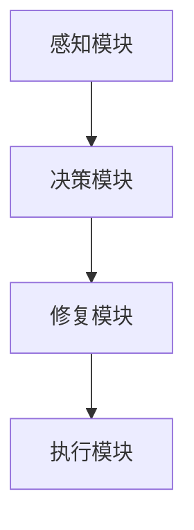
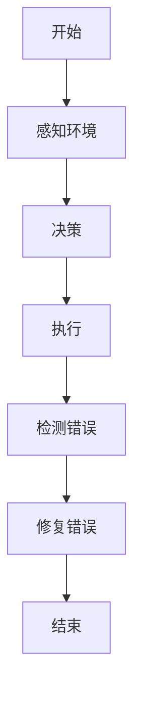

                 


# 构建具有自我修正能力的AI Agent

## 关键词：AI Agent, 自我修正, 机器学习, 自然语言处理, 自适应系统, 系统架构设计, 自我监控

## 摘要：构建具有自我修正能力的AI Agent是当前人工智能领域的重要研究方向。本文通过详细分析AI Agent的核心概念、自我修正机制的理论基础、基于大模型的自我修正方法、系统设计与架构、项目实战以及系统优化与部署，系统地阐述了构建具备自我修正能力的AI Agent的全过程。通过本文，读者将能够理解并掌握如何设计和实现一个能够自我检测、自我修复的智能系统。

---

# 第1章: AI Agent基础

## 1.1 AI Agent的基本概念

### 1.1.1 AI Agent的定义
AI Agent（人工智能代理）是指在计算机系统中，能够感知环境并采取行动以实现目标的智能实体。它能够通过传感器获取信息，利用计算模型进行决策，并通过执行器与环境交互。

### 1.1.2 AI Agent的核心特征
AI Agent的核心特征包括：
- **自主性**：能够自主决策和行动。
- **反应性**：能够实时感知环境并做出反应。
- **目标导向性**：具有明确的目标，并采取行动以实现目标。
- **学习能力**：能够通过经验改进性能。

### 1.1.3 AI Agent的分类与应用场景
AI Agent可以根据智能水平分为：
1. **反应式AI Agent**：基于当前感知做出反应，适用于实时任务。
2. **基于模型的AI Agent**：利用内部模型进行决策，适用于复杂任务。
3. **学习型AI Agent**：能够通过学习改进性能，适用于需要长期任务的场景。

应用场景包括智能助手、自动驾驶、智能客服等。

---

## 1.2 自我修正能力的定义与实现

### 1.2.1 自我修正能力的定义
自我修正能力是指AI Agent在运行过程中能够检测错误、分析错误原因，并采取措施进行修复的能力。

### 1.2.2 自我修正机制的核心要素
自我修正机制的核心要素包括：
- **错误检测**：通过监控系统状态或用户反馈发现错误。
- **错误分析**：利用算法或模型分析错误的根本原因。
- **修复策略**：根据错误原因制定修复方案并执行修复。

### 1.2.3 自我修正能力的实现方式
- **基于规则的修复**：根据预定义的规则进行修复。
- **基于学习的修复**：利用机器学习模型进行预测和修复。
- **混合修复**：结合规则和学习的修复方式。

---

## 1.3 本章小结
本章介绍了AI Agent的基本概念、核心特征及其分类，重点阐述了自我修正能力的定义与实现方式，为后续章节的深入分析奠定了基础。

---

# 第2章: 自我修正机制的理论基础

## 2.1 元学习与自适应机制

### 2.1.1 元学习的基本原理
元学习是一种学习方法，旨在通过学习多个任务来提高对新任务的学习能力。其基本原理包括：
1. **任务层面**：学习如何从经验中快速适应新任务。
2. **模型层面**：通过共享参数优化多个任务的学习。

### 2.1.2 自适应机制在AI Agent中的应用
自适应机制通过动态调整模型参数或策略，使AI Agent能够适应变化的环境。其应用包括：
- **动态参数调整**：根据环境变化实时调整模型参数。
- **策略优化**：通过强化学习优化策略。

---

## 2.2 自我监控与反馈系统

### 2.2.1 自我监控的实现方法
自我监控可以通过以下方法实现：
1. **状态监控**：监控系统的内部状态。
2. **行为监控**：监控系统的外部行为。
3. **结果监控**：监控系统的输出结果。

### 2.2.2 反馈系统的构建与优化
反馈系统通过将错误信息反馈给AI Agent，指导其进行修复。优化方法包括：
- **反馈机制优化**：设计高效的反馈传递路径。
- **反馈信息优化**：提高反馈信息的准确性和及时性。

---

## 2.3 自我修复算法的数学模型

### 2.3.1 基于误差反馈的修复模型
误差反馈模型通过计算输出与期望值的误差，调整模型参数以减少误差。其数学表达式为：
$$ e = y - y_{\text{期望}} $$
其中，$e$ 是误差，$y$ 是模型输出，$y_{\text{期望}}$ 是期望输出。

### 2.3.2 自适应优化算法的数学表达
自适应优化算法通过调整学习率 $\eta$ 来优化参数更新：
$$ \theta_{\text{新}} = \theta_{\text{旧}} - \eta \cdot \nabla J $$
其中，$\theta$ 是模型参数，$\nabla J$ 是目标函数的梯度。

### 2.3.3 修复过程中的收敛性分析
修复过程中的收敛性分析表明，自适应优化算法能够快速收敛到最优解，适用于动态环境中的修复任务。

---

## 2.4 本章小结
本章重点分析了元学习与自适应机制、自我监控与反馈系统，以及自我修复算法的数学模型，为后续章节的实现提供了理论基础。

---

# 第3章: 基于大模型的自我修正方法

## 3.1 大模型在自我修正中的应用

### 3.1.1 大模型的语义理解能力
大模型（如GPT系列）具有强大的语义理解能力，能够准确识别错误信息。

### 3.1.2 大模型的自适应学习能力
大模型通过微调和迁移学习，能够快速适应新的任务。

### 3.1.3 大模型的错误检测与修复
大模型可以通过分析错误信息，生成修复建议或直接修复错误。

---

## 3.2 基于GPT系列模型的自我修正

### 3.2.1 GPT模型的错误检测机制
GPT模型通过对比输入和输出，识别潜在的错误。

### 3.2.2 GPT模型的修复策略
GPT模型生成修复建议，并通过迭代优化得到最终修复方案。

### 3.2.3 GPT模型的训练优化方法
GPT模型通过增加监督数据和强化学习，进一步优化错误检测和修复能力。

---

## 3.3 其他大模型的修正方法

### 3.3.1 BERT模型的修正应用
BERT模型通过分析上下文，识别语义错误并进行修复。

### 3.3.2 其他大模型的修正方法对比
对比分析表明，不同大模型在错误检测和修复中的表现各有优劣。

---

## 3.4 本章小结
本章重点分析了基于大模型的自我修正方法，特别是GPT和BERT模型的应用，为后续章节的系统设计提供了参考。

---

# 第4章: 自我修正AI Agent的系统设计与架构

## 4.1 系统功能设计

### 4.1.1 功能模块划分
系统功能模块包括：
1. **感知模块**：负责环境感知。
2. **决策模块**：负责决策制定。
3. **执行模块**：负责行动执行。
4. **修复模块**：负责错误检测与修复。

### 4.1.2 各模块之间的交互关系
模块之间的交互关系可以通过以下流程图表示：



### 4.1.3 系统的功能流程图
系统功能流程图如下：



---

## 4.2 系统架构设计

### 4.2.1 分层架构设计
系统采用分层架构，包括：
1. **感知层**：负责数据采集。
2. **决策层**：负责决策制定。
3. **执行层**：负责行动执行。
4. **修复层**：负责错误修复。

### 4.2.2 微服务架构设计
微服务架构设计包括：
1. **服务注册与发现**
2. **服务调用与通信**
3. **服务容错与恢复**

### 4.2.3 混合架构的优缺点分析
混合架构结合了分层架构和微服务架构的优点，但在实现复杂性上较高。

---

## 4.3 系统接口设计

### 4.3.1 内部接口设计
内部接口包括：
1. **感知模块接口**
2. **决策模块接口**
3. **修复模块接口**

### 4.3.2 外部接口设计
外部接口包括：
1. **用户接口**
2. **第三方服务接口**

### 4.3.3 接口的标准化与兼容性
通过API标准和协议转换实现接口的标准化与兼容性。

---

## 4.4 本章小结
本章详细分析了系统的功能设计、架构设计和接口设计，为后续章节的实现提供了理论支持。

---

# 第5章: 自我修正AI Agent的项目实战

## 5.1 环境安装

### 5.1.1 安装Python
```bash
python --version
```

### 5.1.2 安装必要的库
```bash
pip install numpy pandas matplotlib
```

## 5.2 系统核心实现源代码

### 5.2.1 错误检测模块
```python
def detect_error(input_data):
    # 实现错误检测逻辑
    return error_info
```

### 5.2.2 修复模块
```python
def fix_error(error_info):
    # 实现修复逻辑
    return repaired_data
```

### 5.2.3 决策模块
```python
def decision_module():
    # 实现决策逻辑
    pass
```

## 5.3 代码应用解读与分析
- 错误检测模块通过分析输入数据，识别潜在的错误。
- 修复模块根据错误信息，生成修复方案。
- 决策模块综合考虑修复方案的可行性，做出最终决策。

## 5.4 实际案例分析
通过实际案例分析，验证系统的错误检测与修复能力。

## 5.5 本章小结
本章通过实际项目实战，详细展示了系统的实现过程。

---

# 第6章: 系统优化与部署

## 6.1 系统优化

### 6.1.1 性能优化
通过优化算法和减少计算复杂度，提高系统性能。

### 6.1.2 模型压缩
通过剪枝和量化技术，减小模型体积，提高部署效率。

## 6.2 云原生部署

### 6.2.1 Docker容器化
使用Docker将系统打包成镜像。

### 6.2.2 Kubernetes集群部署
使用Kubernetes实现系统的弹性扩展和高可用性。

## 6.3 本章小结
本章重点分析了系统的优化与部署方法，为实际应用提供了指导。

---

# 第7章: 总结与展望

## 7.1 本章总结
本文系统地阐述了构建具有自我修正能力的AI Agent的全过程，包括核心概念、理论基础、实现方法和系统设计。

## 7.2 未来展望
未来的研究方向包括：
1. 更高效的自我修正算法。
2. 更强大的大模型应用。
3. 更复杂的系统架构设计。

---

# 作者：AI天才研究院/AI Genius Institute & 禅与计算机程序设计艺术 /Zen And The Art of Computer Programming

