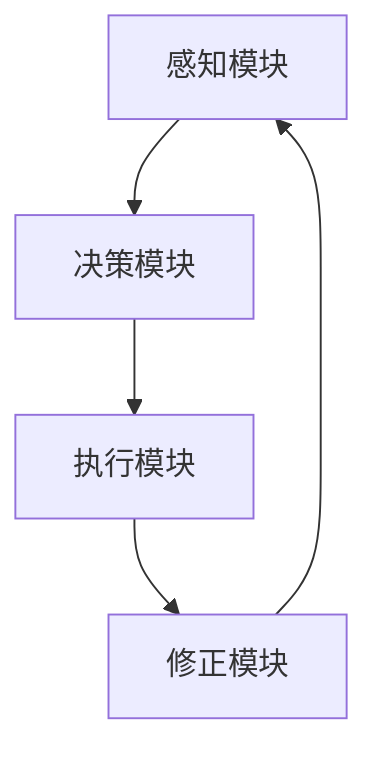

                 

# 构建具有自我修正能力的AI Agent系统

> 关键词：AI Agent，自我修正，强化学习，自适应系统，智能算法

> 摘要：本文详细探讨了构建具有自我修正能力的AI Agent系统的各个方面，包括基本概念、核心原理、算法实现、系统架构设计以及项目实战。通过理论与实践相结合的方式，深入分析了自我修正AI Agent的实现机制，为读者提供了从理论到实践的全面指导。

---

# 第一部分: AI Agent系统概述

## 第1章: AI Agent的基本概念与自我修正能力

### 1.1 AI Agent的定义与特点

AI Agent（人工智能代理）是指能够感知环境、自主决策并执行任务的智能实体。AI Agent的核心特点包括：

- **自主性**：能够在没有外部干预的情况下独立运作。
- **反应性**：能够根据环境变化实时调整行为。
- **目标导向性**：具备明确的目标，并通过行动实现目标。
- **学习能力**：能够通过经验改进自身的性能。

### 1.2 自我修正能力的定义与实现

自我修正能力是指AI Agent在运行过程中能够自动检测错误、修复问题并优化自身行为的能力。其实现依赖于以下关键机制：

- **自我检测**：通过监控自身状态和环境反馈，识别潜在问题。
- **错误修复**：利用算法或预定义规则，自动调整行为以消除问题。
- **自适应学习**：通过机器学习技术，持续优化自我修正策略。

---

## 第2章: 自我修正机制的核心原理

### 2.1 自我修正机制的原理分析

自我修正机制的核心原理包括以下几个步骤：

1. **错误检测**：AI Agent通过传感器或日志系统实时监控自身的状态和环境。
2. **问题诊断**：利用算法分析错误的根本原因。
3. **修复策略生成**：基于诊断结果，生成修复方案。
4. **执行修复**：执行修复操作并验证修复效果。
5. **学习优化**：通过反馈机制优化自我修正算法。

---

## 第3章: 自我修正机制的数学模型与公式

### 3.1 自我修正算法的基本模型

自我修正算法可以基于强化学习（Reinforcement Learning）框架进行设计。其基本模型如下：

$$
R = r_t + \gamma \max_{a'} Q(s', a')
$$

其中，$R$ 表示总奖励，$r_t$ 是当前步的奖励，$\gamma$ 是折扣因子，$Q(s', a')$ 是下一步状态 $s'$ 和动作 $a'$ 的Q值。

### 3.2 自我修正机制的数学表达式

自我修正机制可以通过以下公式表示：

$$
Q(s, a) = Q(s, a) + \alpha (r + \gamma \max Q(s', a') - Q(s, a))
$$

其中，$\alpha$ 是学习率，$r$ 是奖励值，$\gamma$ 是折扣因子。

---

## 第4章: 自我修正AI Agent的核心要素

### 4.1 核心要素组成

自我修正AI Agent的核心要素包括：

- **感知模块**：负责收集环境信息。
- **决策模块**：负责分析信息并做出决策。
- **执行模块**：负责执行决策并输出结果。
- **修正模块**：负责检测错误并进行修复。

### 4.2 核心要素之间的关系

通过Mermaid图可以清晰展示核心要素之间的关系：

---

## 第5章: 自我修正AI Agent的应用场景

### 5.1 自我修正AI Agent在智能控制系统中的应用

自我修正AI Agent可以用于智能控制系统中，实时调整系统参数以优化性能。

### 5.2 自我修正AI Agent在机器人技术中的应用

在机器人技术中，自我修正AI Agent可以帮助机器人在复杂环境中自主修复故障。

### 5.3 自我修正AI Agent在软件开发中的应用

在软件开发中，自我修正AI Agent可以用于自动修复代码错误和优化代码性能。

---

## 第6章: 自我修正AI Agent的挑战与未来发展方向

### 6.1 当前面临的主要挑战

自我修正AI Agent的实现面临以下挑战：

- **复杂环境的适应性**：如何在复杂多变的环境中实现高效的自我修正。
- **算法的效率问题**：如何设计高效的算法以实现快速的自我修正。
- **安全性和稳定性**：如何确保自我修正过程的安全性和稳定性。

### 6.2 未来发展方向

未来，自我修正AI Agent的发展方向包括：

- **强化学习的优化**：进一步优化强化学习算法以提高自我修正效率。
- **多智能体协作**：研究多智能体协作的自我修正机制。
- **边缘计算的应用**：将自我修正AI Agent应用于边缘计算场景。

---

## 作者信息

作者：AI天才研究院/AI Genius Institute & 禅与计算机程序设计艺术 /Zen And The Art of Computer Programming

---

以上是文章的完整目录和部分关键内容，您可以根据实际需求进行调整和补充。

