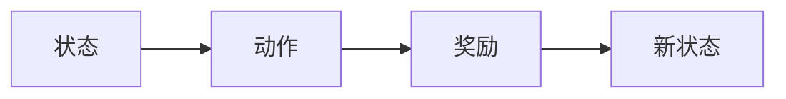
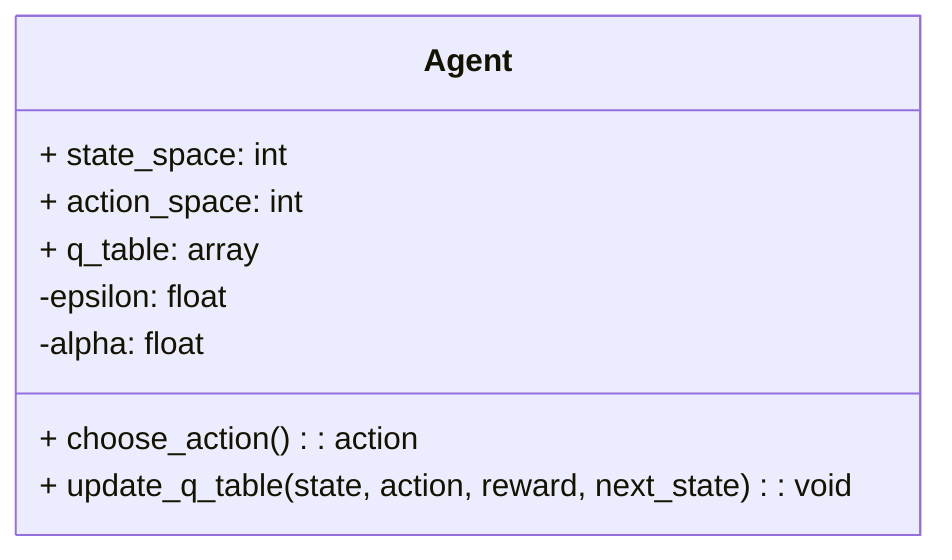
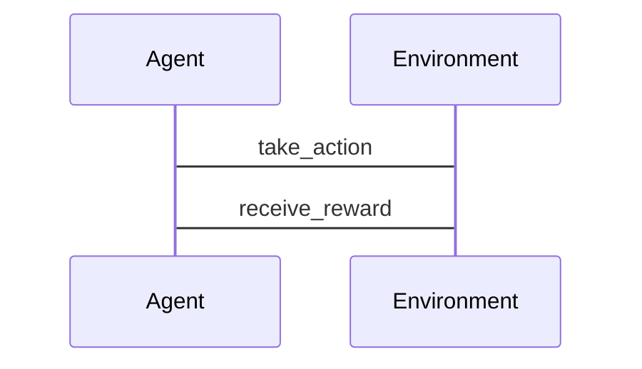

                 


# {{ 构建具有自我学习能力的AI Agent }}

> 关键词：{{ AI Agent, 自我学习, 强化学习, 人工智能, 自动化决策 }}

> 摘要：{{ 本文将详细探讨如何构建一个具有自我学习能力的AI Agent，从理论基础到实际应用，深入分析其核心算法、系统架构和实现细节，助您全面掌握AI Agent的构建方法。 }}

---

# 第一部分: 自我学习AI Agent的背景与核心概念

# 第1章: 自我学习AI Agent的背景与问题背景

## 1.1 自我学习AI Agent的定义与问题背景

### 1.1.1 传统AI Agent的局限性
传统的AI Agent依赖于预定义的规则和数据，无法在动态变化的环境中自动调整行为。例如，在智能推荐系统中，手动调整推荐策略效率低下，且难以应对用户行为的实时变化。

### 1.1.2 自我学习AI Agent的定义
自我学习AI Agent是一种能够通过与环境交互，自动调整行为策略以实现目标的智能体。它能够从经验中学习，并在没有人工干预的情况下优化自身的决策过程。

### 1.1.3 自我学习AI Agent的核心目标
- 实现动态环境中的自主决策。
- 提高系统的适应性和泛化能力。
- 降低人工干预成本，提升系统效率。

## 1.2 自我学习AI Agent的应用场景

### 1.2.1 自动化决策系统
在金融投资、物流调度等领域，自我学习AI Agent能够实时调整决策策略，提高决策效率。

### 1.2.2 智能推荐系统
通过自我学习，AI Agent能够根据用户行为动态调整推荐策略，提供更精准的推荐服务。

### 1.2.3 自动化问题解决
在故障诊断、问题修复等领域，自我学习AI Agent能够快速适应新问题，提供高效的解决方案。

## 1.3 自我学习AI Agent的挑战与机遇

### 1.3.1 技术挑战
- 算法的收敛性问题。
- 复杂环境下的决策优化。
- 数据依赖性和实时性要求。

### 1.3.2 应用挑战
- 高维状态空间的处理。
- 多目标优化问题。
- 系统安全性和可解释性。

### 1.3.3 未来机遇
- 与边缘计算结合，实现更高效的分布式决策。
- 在元学习领域的应用潜力。
- 在复杂人机协作场景中的创新应用。

## 1.4 本章小结

---

# 第2章: 自我学习AI Agent的核心概念与联系

## 2.1 自我学习机制的原理

### 2.1.1 强化学习
通过与环境交互，AI Agent通过试错学习，逐步优化行为策略。

### 2.1.2 监督学习
基于标注数据，AI Agent学习特定任务的映射关系。

### 2.1.3 无监督学习
在无标注数据的情况下，AI Agent发现数据中的隐含结构。

## 2.2 自我学习与传统学习方法的对比

### 2.2.1 学习目标对比
| 学习方法 | 目标 |
|----------|------|
| 监督学习  | 预测目标值 |
| 无监督学习 | 发现数据结构 |
| 强化学习  | 最大化累积奖励 |

### 2.2.2 数据依赖对比
| 学习方法 | 数据依赖 |
|----------|----------|
| 监督学习  | 需要标注数据 |
| 无监督学习 | 无需标注数据 |
| 强化学习  | 需要环境反馈 |

### 2.2.3 性能对比
| 学习方法 | 优点 | 缺点 |
|----------|------|------|
| 监督学习  | 高精度 | 数据依赖性高 |
| 无监督学习 | 适用性广 | 结果不确定性高 |
| 强化学习  | 自主性高 | 收敛时间长 |

## 2.3 自我学习AI Agent的ER实体关系图

```mermaid
er
actor(Agent, action, reward)
```

## 2.4 本章小结

---

# 第3章: 自我学习AI Agent的算法原理

## 3.1 强化学习算法

### 3.1.1 Q-learning算法

#### 3.1.1.1 算法流程


#### 3.1.1.2 算法实现
```python
class Agent:
    def __init__(self, state_space, action_space):
        self.q_table = np.zeros((state_space, action_space))
    
    def choose_action(self, state, epsilon=0.1):
        if np.random.random() < epsilon:
            return np.random.randint(action_space)
        else:
            return np.argmax(self.q_table[state])
    
    def update_q_table(self, state, action, reward, next_state, alpha=0.1):
        self.q_table[state][action] = (1 - alpha) * self.q_table[state][action] + alpha * (reward + np.max(self.q_table[next_state]))
```

#### 3.1.1.3 数学公式
$$ Q(s, a) = (1 - \alpha) Q(s, a) + \alpha (r + \max Q(s', a')) $$

## 3.2 监督学习与无监督学习的融合

### 3.2.1 监督学习应用于策略优化
通过标注数据，优化AI Agent的行为策略。

### 3.2.2 无监督学习发现数据结构
在无标注数据中，发现潜在的模式和结构，辅助AI Agent决策。

## 3.3 算法选择与优化

### 3.3.1 算法选择
根据具体场景选择合适的算法组合。

### 3.3.2 参数优化
通过超参数调优，提升算法性能。

## 3.4 本章小结

---

# 第4章: 自我学习AI Agent的系统分析与架构设计

## 4.1 系统功能设计

### 4.1.1 领域模型


### 4.1.2 系统架构图


### 4.1.3 系统接口设计
- Agent与环境交互接口。
- 状态、动作、奖励的编码接口。

## 4.2 交互流程

### 4.2.1 交互流程图


## 4.3 系统实现细节

### 4.3.1 状态表示
- 状态空间的维度设计。
- 状态压缩与编码方法。

### 4.3.2 动作选择
- 动作空间的划分。
- 动作选择策略。

## 4.4 本章小结

---

# 第5章: 自我学习AI Agent的项目实战

## 5.1 项目背景

### 5.1.1 项目介绍
构建一个简单的自我学习AI Agent，用于优化物流路径。

## 5.2 项目实现

### 5.2.1 环境安装
```bash
pip install numpy
```

### 5.2.2 核心代码实现
```python
import numpy as np

class Agent:
    def __init__(self, state_space, action_space):
        self.q_table = np.zeros((state_space, action_space))
    
    def choose_action(self, state, epsilon=0.1):
        if np.random.random() < epsilon:
            return np.random.randint(action_space)
        else:
            return np.argmax(self.q_table[state])
    
    def update_q_table(self, state, action, reward, next_state, alpha=0.1):
        self.q_table[state][action] = (1 - alpha) * self.q_table[state][action] + alpha * (reward + np.max(self.q_table[next_state]))
```

### 5.2.3 代码实现解读
- 初始化Q表。
- 动作选择策略。
- Q表更新规则。

## 5.3 项目案例分析

### 5.3.1 案例分析
分析物流路径优化的具体案例，展示AI Agent的学习过程。

## 5.4 项目小结

---

# 第6章: 自我学习AI Agent的最佳实践与注意事项

## 6.1 实践 tips

### 6.1.1 数据质量的重要性
高质量的数据是算法优化的基础。

### 6.1.2 算法可解释性
确保算法的可解释性，便于调试和优化。

## 6.2 小结

## 6.3 注意事项

### 6.3.1 系统安全
确保AI Agent的安全性，防止恶意攻击。

### 6.3.2 算法收敛性
选择合适的算法参数，确保算法的收敛性。

### 6.3.3 可扩展性
设计可扩展的系统架构，便于后续优化。

## 6.4 未来研究方向

### 6.4.1 多智能体协作
研究多智能体协作的自我学习机制。

### 6.4.2 边缘计算结合
探索自我学习AI Agent与边缘计算的结合应用。

---

# 作者：{{AI天才研究院/AI Genius Institute & 禅与计算机程序设计艺术 /Zen And The Art of Computer Programming}}

