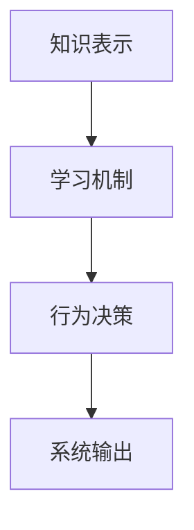
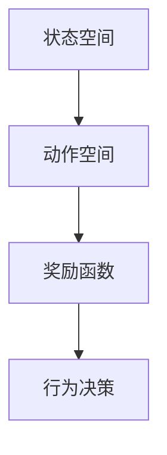
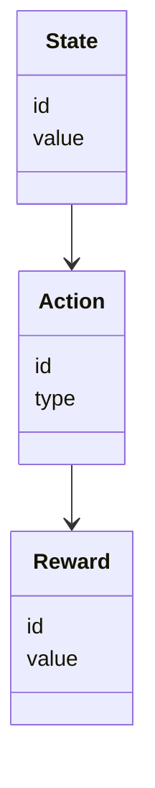
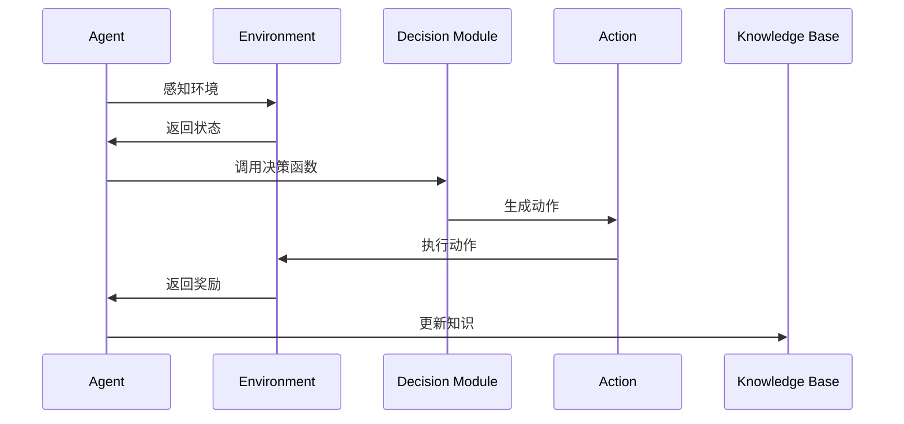

                 


# 构建具有自我演化能力的AI Agent

> 关键词：AI Agent, 自我演化, 机器学习, 强化学习, 系统架构

> 摘要：本文深入探讨了构建具有自我演化能力的AI Agent的核心概念、算法原理、系统架构及实现方法。通过分析自我演化机制的背景、原理和应用，结合具体案例和代码实现，展示了如何设计和实现一个能够自主学习和适应复杂环境的AI Agent。

---

# 第一部分: 自我演化AI Agent的背景与概念

## 第1章: 自我演化AI Agent的背景与意义

### 1.1 问题背景

#### 1.1.1 当前AI Agent的发展现状
AI Agent（智能体）是一种能够感知环境、自主决策并采取行动的智能系统。近年来，随着机器学习和深度学习技术的快速发展，AI Agent在自动驾驶、机器人控制、智能助手等领域得到了广泛应用。然而，现有AI Agent的主要局限性在于其决策能力依赖于预先设定的规则或静态模型，难以在动态变化的环境中自适应调整。

#### 1.1.2 自我演化能力的必要性
在实际应用中，环境往往是动态的、不确定的，AI Agent需要具备在复杂环境中持续学习和优化的能力。自我演化能力使得AI Agent能够根据反馈不断改进其行为策略，适应新的任务需求和环境变化。

#### 1.1.3 自我演化AI Agent的应用场景与潜力
自我演化AI Agent在许多领域展现出巨大潜力，例如：
- 自动驾驶：在复杂的交通环境中自主学习和优化驾驶策略。
- 智能机器人：在动态环境中自主调整动作策略。
- 智能助手：根据用户的反馈不断优化服务流程。

### 1.2 问题描述

#### 1.2.1 AI Agent的核心功能与局限性
AI Agent的核心功能包括感知、决策、行动和反馈。然而，传统的AI Agent在面对复杂环境时，往往缺乏灵活性和自适应能力，难以应对未知的挑战。

#### 1.2.2 自我演化能力的定义与目标
自我演化能力是指AI Agent在运行过程中，能够根据反馈信息不断优化其知识表示、行为策略和系统架构的能力。其目标是使AI Agent能够在动态环境中实现自适应、自优化和自修复。

#### 1.2.3 与传统AI Agent的主要区别
- 传统AI Agent依赖于预设规则和静态模型，而自我演化AI Agent能够动态调整其行为策略。
- 传统AI Agent在面对未知问题时表现不佳，而自我演化AI Agent能够通过学习不断改进。

### 1.3 问题解决

#### 1.3.1 自我演化机制的实现路径
- 建立动态的知识表示和更新机制。
- 设计自适应的学习算法和优化方法。
- 实现高效的反馈机制和状态评估。

#### 1.3.2 相关技术的整合与创新
- 整合强化学习、迁移学习等技术。
- 创新的知识表示方法和学习框架。

#### 1.3.3 系统架构的优化与升级
- 优化系统架构的灵活性和扩展性。
- 提升系统的实时性和响应速度。

### 1.4 边界与外延

#### 1.4.1 自我演化能力的边界条件
- 自我演化能力的范围和限制。
- 系统内外的依赖关系。

#### 1.4.2 与其他AI能力的协同关系
- 与自然语言处理、计算机视觉等技术的协同。
- 与分布式系统、边缘计算的结合。

#### 1.4.3 系统内外的交互与依赖
- 系统内部的自适应机制。
- 系统与外部环境的交互。

### 1.5 概念结构与核心要素

#### 1.5.1 核心概念的层次分解
- 知识表示层：状态、动作、反馈。
- 学习层：策略优化、模型更新。
- 行为层：决策、行动。

#### 1.5.2 核心要素的特征与作用
- 知识表示：状态、动作、奖励。
- 学习机制：强化学习、监督学习。
- 行为决策：策略选择、动作执行。

#### 1.5.3 概念结构的图示化展示


---

# 第二部分: 自我演化AI Agent的核心概念与联系

## 第2章: 自我演化机制的原理与实现

### 2.1 自我演化机制的核心原理

#### 2.1.1 自适应学习的算法基础
- 强化学习：通过奖励机制优化行为策略。
- 迁移学习：利用已有知识快速适应新任务。

#### 2.1.2 知识表示与更新规则
- 知识表示方法：状态空间、动作空间、奖励函数。
- 知识更新规则：基于反馈的策略优化。

#### 2.1.3 状态评估与行为调整的逻辑
- 状态评估：评估当前状态的优劣。
- 行为调整：根据评估结果优化行为策略。

### 2.2 自我演化机制的实现步骤

#### 2.2.1 系统输入的处理与解析
- 接收环境反馈：状态、奖励、终止信号。
- 解析输入数据：提取有用信息。

#### 2.2.2 知识库的构建与维护
- 知识表示：状态、动作、奖励。
- 知识更新：基于反馈优化知识表示。

#### 2.2.3 行为决策的生成与优化
- 行为决策：基于当前知识生成动作。
- 策略优化：通过强化学习优化行为策略。

### 2.3 自我演化机制的属性对比

#### 2.3.1 不同演化机制的对比分析
| 机制类型 | 描述 | 优缺点 |
|----------|------|--------|
| 强化学习 | 基于奖励优化行为 | 需要大量数据，收敛较慢 |
| 迁移学习 | 利用已有知识快速适应新任务 | 依赖已有知识的质量 |

#### 2.3.2 核心属性的特征表格展示
| 属性 | 描述 | 示例 |
|------|------|------|
| 状态空间 | 系统可能处于的所有状态 | 状态A、状态B |
| 动作空间 | 系统可以执行的所有动作 | 动作1、动作2 |

#### 2.3.3 实体关系的Mermaid流程图


---

# 第三部分: 自我演化AI Agent的算法原理

## 第3章: 自我演化机制的算法实现

### 3.1 算法原理概述

#### 3.1.1 强化学习在自我演化中的应用
- Q-learning算法：通过状态-动作-奖励的三元组更新Q值表。
- DQN算法：使用深度神经网络近似Q值函数。

#### 3.1.2 知识表示的学习方法
- 状态表示：将环境状态映射为向量。
- 动作选择：基于当前状态选择最优动作。

#### 3.1.3 状态评估的数学模型
- 状态评估函数：评估当前状态的优劣。
- 行为优化函数：优化行为策略以最大化奖励。

### 3.2 算法流程图

```mermaid
graph TD
    Start --> Initialize
    Initialize --> Collect Experience
    Collect Experience --> Update Model
    Update Model --> Check Termination
    Check Termination --> Loop or End
```

### 3.3 算法实现代码

#### 3.3.1 强化学习代码示例
```python
import numpy as np

class AI-Agent:
    def __init__(self, state_space, action_space):
        self.state_space = state_space
        self.action_space = action_space
        self.Q = np.zeros((state_space, action_space))

    def get_action(self, state):
        return np.argmax(self.Q[state])

    def update_Q(self, state, action, reward):
        self.Q[state, action] += reward

# 示例用法
agent = AI-Agent(5, 3)
action = agent.get_action(2)
agent.update_Q(2, action, 1)
```

#### 3.3.2 知识表示更新示例
```python
def update_knowledge(state, action, reward):
    # 更新知识表示中的状态-动作对
    state_action = f"{state}_{action}"
    # 增加奖励值
    knowledge[state_action] += reward
```

### 3.4 算法数学模型

#### 3.4.1 Q-learning算法的数学模型
$$ Q(s,a) = Q(s,a) + \alpha (r + \gamma \max Q(s',a') - Q(s,a)) $$
其中：
- \( s \)：当前状态
- \( a \)：当前动作
- \( r \)：奖励
- \( s' \)：下一个状态
- \( \alpha \)：学习率
- \( \gamma \)：折扣因子

#### 3.4.2 DQN算法的数学模型
$$ Q(s,a) = \arg\max_{a} Q_\theta(s,a) $$
其中：
- \( Q_\theta \)：深度神经网络函数
- \( \theta \)：网络参数

---

# 第四部分: 自我演化AI Agent的系统分析与架构设计

## 第4章: 系统分析与架构设计

### 4.1 系统分析

#### 4.1.1 问题场景介绍
- 系统需要在动态环境中自主学习和优化。

#### 4.1.2 系统功能设计
- 知识表示与更新。
- 行为决策与优化。
- 系统反馈与调整。

#### 4.1.3 领域模型设计


### 4.2 系统架构设计

#### 4.2.1 系统架构图
```mermaid
graph TD
    Agent --> Knowledge Base
    Knowledge Base --> Decision Module
    Decision Module --> Action
    Action --> Environment
    Environment --> Reward
    Reward --> Agent
```

#### 4.2.2 接口设计
- 输入接口：接收环境反馈。
- 输出接口：发送动作指令。

#### 4.2.3 交互流程图


---

# 第五部分: 自我演化AI Agent的项目实战

## 第5章: 项目实战

### 5.1 环境安装

#### 5.1.1 系统依赖
- Python 3.8+
- TensorFlow 2.0+
- NumPy 1.20+

#### 5.1.2 安装步骤
```bash
pip install numpy tensorflow
```

### 5.2 核心代码实现

#### 5.2.1 强化学习实现
```python
import numpy as np
import tensorflow as tf

class Agent:
    def __init__(self, state_dim, action_dim):
        self.state_dim = state_dim
        self.action_dim = action_dim
        self.model = self.build_model()

    def build_model(self):
        model = tf.keras.Sequential([
            tf.keras.layers.Dense(64, activation='relu'),
            tf.keras.layers.Dense(self.action_dim, activation='linear')
        ])
        return model

    def get_action(self, state):
        prediction = self.model.predict(state)
        return np.argmax(prediction[0])

    def update_model(self, state, action, reward):
        target = reward
        self.model.fit(state, target, epochs=1, verbose=0)
```

#### 5.2.2 知识表示更新
```python
def update_knowledge(state, action, reward):
    state_action = f"{state}_{action}"
    knowledge[state_action] += reward
```

### 5.3 案例分析

#### 5.3.1 案例场景
- 状态空间：5种状态
- 动作空间：3种动作
- 奖励范围：-1到1

#### 5.3.2 实施步骤
1. 初始化知识库。
2. 执行动作并收集反馈。
3. 更新知识库和模型。

### 5.4 项目总结

#### 5.4.1 实施效果
- 系统能够自适应优化行为策略。
- 知识库得到有效的更新和维护。

#### 5.4.2 实施经验
- 系统设计的灵活性和扩展性至关重要。
- 算法的选择和优化直接影响系统性能。

---

# 第六部分: 自我演化AI Agent的最佳实践

## 第6章: 最佳实践

### 6.1 小结

#### 6.1.1 核心要点回顾
- 自我演化AI Agent的核心机制。
- 系统架构设计的关键点。

#### 6.1.2 经验总结
- 知识表示的灵活性。
- 算法的高效性。

### 6.2 注意事项

#### 6.2.1 系统设计中的注意事项
- 确保系统的实时性和响应速度。
- 保护系统的安全性。

#### 6.2.2 算法实现中的注意事项
- 避免过拟合和欠拟合。
- 确保算法的收敛性。

### 6.3 拓展阅读

#### 6.3.1 推荐书籍
- 《强化学习入门》
- 《深度学习实战》

#### 6.3.2 推荐论文
- DeepMind的DQN论文
- 强化学习在机器人控制中的应用论文

---

# 作者信息

作者：AI天才研究院/AI Genius Institute & 禅与计算机程序设计艺术 /Zen And The Art of Computer Programming

---

这篇文章全面介绍了构建具有自我演化能力的AI Agent的核心概念、算法原理、系统架构及实现方法。通过理论与实践相结合，深入剖析了自我演化AI Agent的实现细节和应用潜力。

