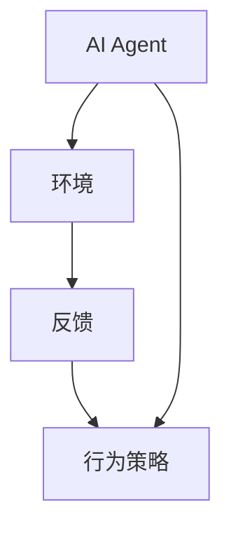
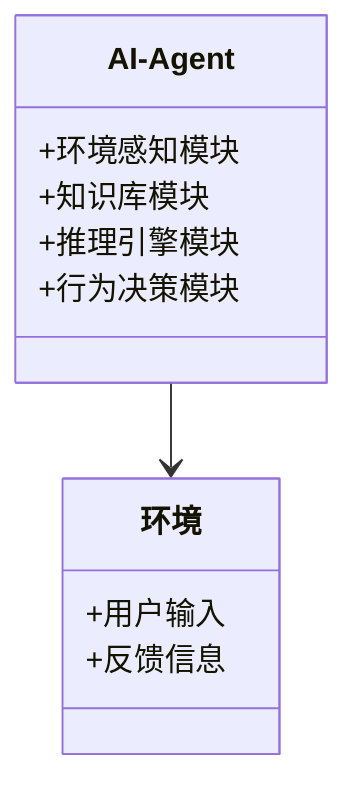
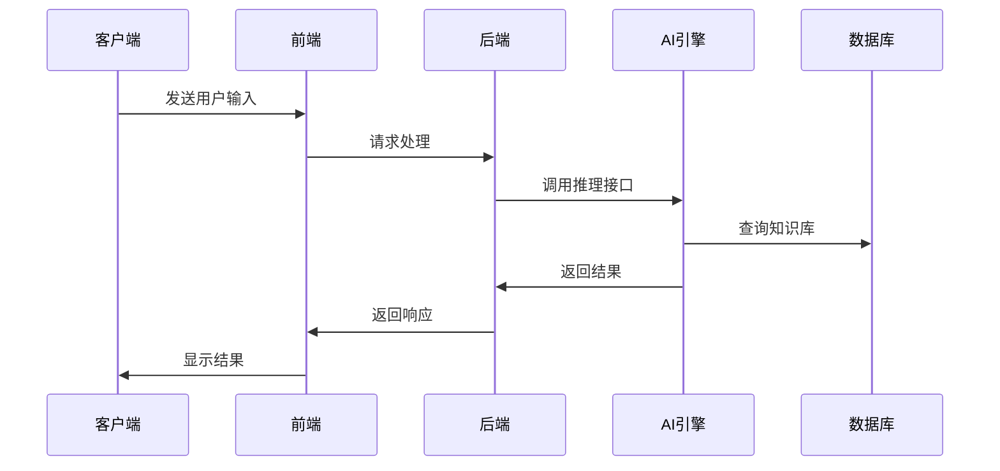

                 


# 构建具有自我演化能力的AI Agent系统

## 关键词：人工智能, AI Agent, 自我演化, 强化学习, 知识表示, 自适应算法, 系统架构

## 摘要：本文详细探讨了构建具有自我演化能力的AI Agent系统的各个方面，包括核心概念、算法原理、系统架构设计以及项目实战。通过逐步分析，我们介绍了如何通过自我学习与自适应算法实现AI Agent的自我演化能力，并通过具体的系统设计和代码实现，展示了这一技术的实际应用。

---

## 第一部分: 背景与核心概念

### 第1章: 自我演化AI Agent的背景与问题描述

#### 1.1 人工智能与AI Agent的基本概念

##### 1.1.1 人工智能的定义与分类

人工智能（Artificial Intelligence, AI）是指由人创造的能够执行人类智能任务的系统或机器。根据功能和应用场景的不同，人工智能可以分为多种类型，例如：

- **弱人工智能（Narrow AI）**：专注于特定任务，如语音识别、图像识别等。
- **强人工智能（General AI）**：具备与人类相当或超越的通用智能。

##### 1.1.2 AI Agent的基本概念与特征

AI Agent（智能体）是指能够感知环境并采取行动以实现目标的实体。AI Agent的核心特征包括：

| 特征 | 描述 |
|------|------|
| 反应性 | 能够实时感知环境并做出反应 |
| 初步智能性 | 具备简单的推理和决策能力 |
| 自主性 | 在没有外部干预的情况下独立运行 |

##### 1.1.3 自我演化能力的定义与内涵

自我演化能力是指AI Agent能够在运行过程中不断学习和适应，以提高自身性能和应对复杂环境变化的能力。这种能力使得AI Agent能够从经验中自我改进，类似于生物进化的过程。

#### 1.2 自我演化AI Agent的必要性与应用场景

##### 1.2.1 当前AI Agent技术的局限性

传统的AI Agent通常依赖于预定义的规则和数据，缺乏灵活性和自适应性。在面对动态变化的环境时，传统AI Agent往往表现不佳，难以应对复杂的任务需求。

##### 1.2.2 自我演化能力的解决思路

通过引入自我学习和自适应算法，AI Agent能够动态调整自身的行为策略和知识库，从而更好地适应环境变化。

##### 1.2.3 自我演化AI Agent的典型应用场景

- **智能推荐系统**：根据用户行为动态调整推荐策略。
- **自动驾驶**：在复杂交通环境中实时学习和调整驾驶策略。
- **智能客服**：根据用户反馈不断优化服务流程。

#### 1.3 问题背景与目标设定

##### 1.3.1 问题背景分析

随着人工智能技术的快速发展，对AI Agent的智能化要求越来越高。传统AI Agent的静态特性已经无法满足复杂场景的需求，因此需要引入自我演化能力。

##### 1.3.2 问题目标的明确

本文旨在探讨如何构建具有自我演化能力的AI Agent系统，重点研究自我学习算法和自适应机制的设计与实现。

##### 1.3.3 边界与外延

本文的研究范围限定在基于强化学习的自我演化机制，不涉及其他类型的人工智能技术。

#### 1.4 核心概念与联系

##### 1.4.1 核心概念原理

自我演化能力的核心在于AI Agent能够通过环境反馈不断优化自身的行为策略。这一过程涉及到知识表示、推理和学习算法等多个方面。

##### 1.4.2 核心概念属性特征对比表

| 概念       | 属性               | 特征描述                                   |
|------------|--------------------|------------------------------------------|
| 自我学习   | 数据驱动           | 基于输入数据进行学习                     |
| 推理能力   | 知识表示与推理      | 通过知识库进行推理和决策                 |
| 反馈机制   | 状态监测与反馈     | 根据反馈调整行为策略                     |

##### 1.4.3 ER实体关系图（使用 Mermaid 流程图）



---

## 第二部分: 自我演化AI Agent的核心机制

### 第2章: 自我演化机制的原理与实现

#### 2.1 自我演化机制的原理

##### 2.1.1 自我学习与自适应算法

自我学习算法是实现AI Agent自我演化的核心。通过强化学习和迁移学习等技术，AI Agent能够从经验中学习并优化自身的策略。

##### 2.1.2 知识表示与推理方法

知识表示是AI Agent进行推理和决策的基础。常用的表示方法包括语义网络和知识图谱等。

##### 2.1.3 状态监测与反馈机制

状态监测与反馈机制用于实时评估AI Agent的行为效果，并根据反馈调整策略。

#### 2.2 自我演化机制的实现步骤

##### 2.2.1 环境感知与数据采集

AI Agent需要实时感知环境并采集数据，例如通过传感器或API接口获取信息。

##### 2.2.2 知识表示与推理

将采集到的数据转化为知识表示，并通过推理算法生成决策。

##### 2.2.3 行为策略优化

根据反馈调整行为策略，例如通过强化学习算法更新策略参数。

---

## 第三部分: 算法原理

### 第3章: 强化学习算法

#### 3.1 强化学习的基本原理

强化学习是一种通过试错机制来优化策略的算法。智能体通过与环境交互，不断优化自身的动作选择，以最大化累计奖励。

##### 3.1.1 强化学习的数学模型

强化学习的核心在于价值函数的估计，常用Q-learning算法：

$$ Q(s, a) = Q(s, a) + \alpha [r + \max Q(s', a') - Q(s, a)] $$

其中：
- \( Q(s, a) \)：状态-动作对的价值
- \( \alpha \)：学习率
- \( r \)：奖励
- \( s' \)：下一个状态

##### 3.1.2 强化学习的实现步骤

1. 初始化Q表
2. 环境感知
3. 动作选择
4. 与环境交互
5. 更新Q值
6. 重复直到收敛

##### 3.1.3 强化学习的代码实现

```python
import numpy as np

class QLearning:
    def __init__(self, state_space, action_space, alpha=0.1, gamma=0.99):
        self.state_space = state_space
        self.action_space = action_space
        self.Q = np.zeros((state_space, action_space))
        self.alpha = alpha
        self.gamma = gamma

    def choose_action(self, state, epsilon=0.1):
        if np.random.random() < epsilon:
            return np.random.randint(self.action_space)
        return np.argmax(self.Q[state, :])

    def update(self, state, action, reward, next_state):
        self.Q[state, action] += self.alpha * (reward + self.gamma * np.max(self.Q[next_state, :]) - self.Q[state, action])
```

---

## 第四部分: 系统架构设计

### 第4章: 系统分析与架构设计方案

#### 4.1 问题场景介绍

##### 4.1.1 问题背景

在智能客服系统中，AI Agent需要根据用户反馈动态调整服务流程。

##### 4.1.2 项目介绍

本项目旨在构建一个能够自我优化的智能客服系统。

#### 4.2 系统功能设计

##### 4.2.1 领域模型设计

通过Mermaid类图展示领域模型：



##### 4.2.2 系统架构设计

通过Mermaid架构图展示系统架构：


##### 4.2.3 接口设计与交互流程图

通过Mermaid序列图展示交互流程：



---

## 第五部分: 项目实战

### 第5章: 项目实战与经验分享

#### 5.1 环境安装与配置

##### 5.1.1 Python环境安装

安装Python和必要的库：

```bash
pip install numpy scikit-learn tensorflow
```

##### 5.1.2 开发环境配置

配置Jupyter Notebook或IDE。

#### 5.2 核心代码实现

##### 5.2.1 强化学习实现

```python
def强化学习实现：
    初始化Q表
    while 循环：
        感知环境状态
        选择动作
        执行动作，获得反馈
        更新Q表
```

##### 5.2.2 知识库构建

使用知识图谱构建技术，例如使用RDF格式存储知识。

#### 5.3 实际案例分析

##### 5.3.1 智能客服案例

通过强化学习优化智能客服的响应策略。

##### 5.3.2 案例分析与总结

总结案例中的经验教训，优化系统设计。

---

## 第六部分: 总结与展望

### 第6章: 总结与展望

#### 6.1 总结

本文详细探讨了构建具有自我演化能力的AI Agent系统的各个方面，包括核心概念、算法原理、系统架构设计以及项目实战。

#### 6.2 问题与挑战

当前技术仍存在一些局限性，例如学习效率和计算资源消耗问题。

#### 6.3 展望

未来的研究方向包括更高效的算法设计和更强大的计算能力支持。

#### 6.4 最佳实践 Tips

- 定期更新知识库
- 优化反馈机制
- 监控系统性能

---

## 作者信息

作者：AI天才研究院/AI Genius Institute & 禅与计算机程序设计艺术/Zen And The Art of Computer Programming

---

以上是《构建具有自我演化能力的AI Agent系统》的详细目录大纲，涵盖了从背景介绍到系统设计再到项目实战的各个方面，确保内容全面且逻辑清晰。

