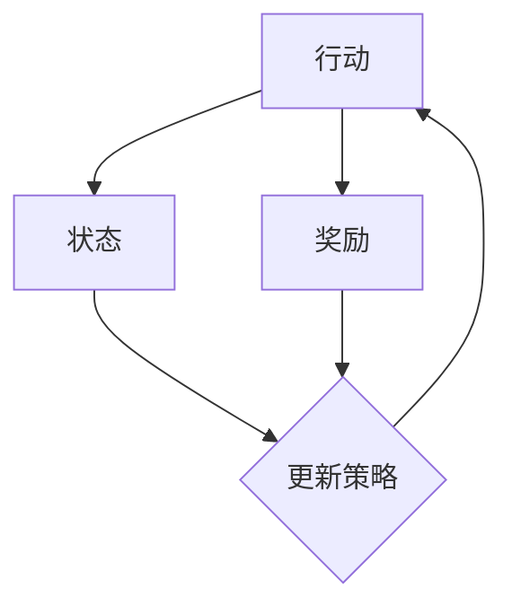
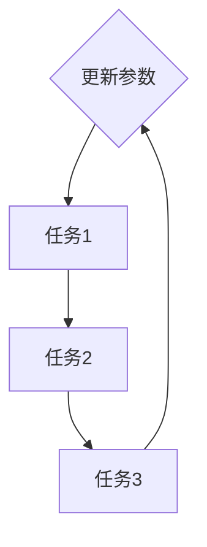
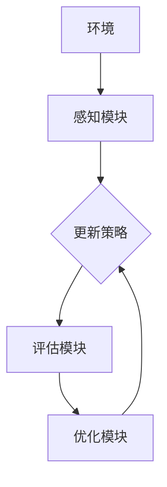
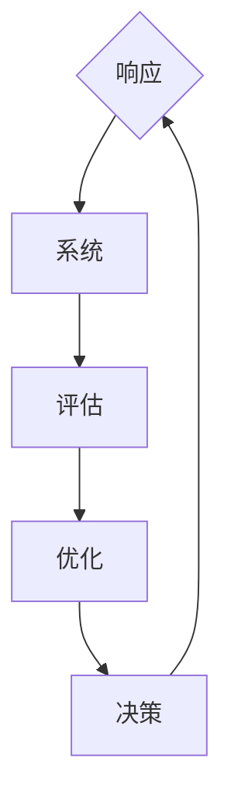

                 


# 《构建具有自我评估与优化能力的AI Agent系统》

---

## 关键词  
AI Agent, 自我评估, 优化能力, 强化学习, 元学习, 自适应系统, 系统架构

---

## 摘要  
AI Agent作为一种智能系统，正在广泛应用于各个领域。然而，现有的AI Agent系统在动态变化的环境中往往难以持续优化自身性能。为了应对这一挑战，构建一个具有自我评估与优化能力的AI Agent系统显得尤为重要。本文将从核心概念、算法原理、系统架构到项目实战，全面解析如何设计和实现这样一个系统。通过结合强化学习、元学习等技术，本文将详细阐述如何使AI Agent具备自我评估能力，并通过优化算法实现性能的持续提升。文章最后还将提供一些实践中的注意事项和未来研究方向。

---

## 第一部分：背景介绍

### 第1章：AI Agent系统概述  
#### 1.1 AI Agent的基本概念  
AI Agent（人工智能代理）是一种能够感知环境、自主决策并采取行动的智能系统。它具备以下核心功能：  
- **感知环境**：通过传感器或接口获取外部信息。  
- **决策与行动**：基于感知信息，通过算法做出决策并执行行动。  
- **学习与优化**：通过与环境的交互，不断优化自身的决策策略。  

AI Agent可以分为多种类型，包括基于规则的代理、基于模型的代理、基于学习的代理等。在实际应用中，AI Agent广泛应用于自动驾驶、智能助手、机器人控制等领域。  

#### 1.2 自我评估与优化的必要性  
在动态变化的环境中，AI Agent需要具备以下能力：  
1. **自适应性**：能够根据环境变化调整自身的行为策略。  
2. **自评估能力**：能够对自己当前的行为效果进行评估，并识别改进空间。  
3. **自优化能力**：基于评估结果，优化自身的算法参数或行为策略。  

然而，现有的AI Agent系统在实际应用中往往面临以下问题：  
- 无法根据环境变化动态调整策略。  
- 在复杂环境中容易出现性能下降或决策失误。  
- 缺乏自我评估能力，无法持续优化自身性能。  

#### 1.3 问题背景与目标  
本文的研究目标是设计一种能够自我评估与优化的AI Agent系统。通过引入自我评估机制，系统能够实时监控自身性能，并通过优化算法动态调整策略。  

---

## 第二部分：核心概念与原理

### 第2章：自我评估与优化机制  
#### 2.1 自我评估的原理  
自我评估是AI Agent优化自身性能的基础。评估机制需要考虑以下方面：  
- **评估指标**：定义衡量系统性能的指标，例如准确率、响应时间、资源消耗等。  
- **数据采集**：通过日志记录、传感器数据等方式获取系统运行状态。  
- **评估模型**：基于采集的数据，构建评估模型以量化系统性能。  

例如，假设我们开发了一个智能客服系统，评估指标可以包括客户满意度、问题解决率和响应时间。通过分析这些指标，系统可以识别出哪些场景下表现不佳，并触发优化机制。  

#### 2.2 自我优化的策略  
自我优化是基于评估结果对系统进行改进的过程。常见的优化策略包括：  
- **强化学习优化**：通过与环境交互，学习最优策略。  
- **元学习优化**：利用元学习算法（如Meta-LSTM）快速适应新任务。  
- **自适应策略优化**：动态调整系统参数以适应环境变化。  

#### 2.3 评估与优化的关联  
评估结果为优化策略提供方向，而优化策略则通过改进系统性能来验证评估的有效性。例如，在智能客服系统中，评估发现客户满意度较低后，系统可以通过强化学习优化对话策略，或者通过元学习快速适应不同客户群体的需求。  

---

## 第三部分：算法原理与数学模型

### 第3章：自我评估算法  
#### 3.1 基于强化学习的评估算法  
强化学习是一种通过试错方法优化策略的算法。以下是强化学习的数学模型：  

- **状态空间**：$S$，表示环境的状态。  
- **行动空间**：$A$，表示系统可以采取的行动。  
- **奖励函数**：$R(s, a)$，表示在状态$s$下采取行动$a$后获得的奖励。  
- **策略函数**：$\pi(a|s)$，表示在状态$s$下采取行动$a$的概率。  

通过与环境的交互，系统不断更新策略函数，以最大化累积奖励。  



#### 3.2 元学习在评估中的应用  
元学习是一种通过学习如何学习来加速适应新任务的算法。以下是元学习的数学模型：  

- **元任务**：$T_i = (S_i, A_i, R_i)$，表示不同的任务。  
- **元学习器**：$f_\theta$，表示元学习模型。  
- **任务适应**：$f_\theta^T$，表示针对具体任务的适应模型。  

元学习通过在多个任务上训练，使得模型能够快速适应新任务。  



---

## 第四部分：系统架构与设计

### 第4章：系统架构设计  
#### 4.1 系统功能设计  
AI Agent系统的功能模块包括：  
1. **感知模块**：负责获取环境信息。  
2. **决策模块**：基于感知信息做出决策。  
3. **评估模块**：对系统性能进行评估。  
4. **优化模块**：根据评估结果优化系统策略。  

#### 4.2 系统架构图  
以下是系统的整体架构图：  



#### 4.3 接口设计  
系统接口包括：  
- **输入接口**：接收环境数据和用户输入。  
- **输出接口**：输出系统行动和优化结果。  

#### 4.4 交互流程图  
以下是系统交互流程图：  



---

## 第五部分：项目实战

### 第5章：项目实现  
#### 5.1 环境安装  
以下是项目所需的环境和工具：  
- Python 3.8+  
- TensorFlow或PyTorch  
- Mermaid图生成工具  

#### 5.2 核心实现  
以下是自我评估与优化的核心代码示例：  

```python
import numpy as np
import tensorflow as tf

# 定义评估指标
def evaluate_policy(policy, env):
    total_reward = 0
    for _ in range(100):
        state = env.reset()
        done = False
        while not done:
            action = policy.act(state)
            next_state, reward, done, _ = env.step(action)
            total_reward += reward
            state = next_state
    return total_reward / 100

# 定义优化算法
def optimize_policy(policy, env):
    best_reward = -np.inf
    best_weights = policy.get_weights()
    for _ in range(100):
        reward = evaluate_policy(policy, env)
        if reward > best_reward:
            best_reward = reward
            best_weights = policy.get_weights()
    policy.set_weights(best_weights)
```

#### 5.3 案例分析  
假设我们开发了一个智能交易系统，以下是实际案例分析：  

- **环境**：股票市场数据。  
- **评估指标**：收益、风险、交易频率。  
- **优化策略**：通过强化学习优化交易策略，通过元学习快速适应市场变化。  

---

## 第六部分：总结与展望

### 第6章：总结与展望  
#### 6.1 最佳实践  
- **持续学习**：系统应具备持续学习能力，以适应环境变化。  
- **实时监控**：实时监控系统性能，及时发现和解决问题。  
- **多任务学习**：通过多任务学习提升系统泛化能力。  

#### 6.2 小结  
本文详细阐述了如何设计和实现一个具有自我评估与优化能力的AI Agent系统。通过结合强化学习、元学习等技术，系统能够动态调整策略，提升性能。  

#### 6.3 注意事项  
- 系统设计时需注意算法的收敛性问题。  
- 数据质量和多样性对评估与优化效果至关重要。  
- 系统安全性需优先考虑，避免恶意攻击。  

#### 6.4 拓展阅读  
- 《Reinforcement Learning: Theory and Algorithms》  
- 《Meta-Learning: A Survey》  

---

## 作者  
作者：AI天才研究院（AI Genius Institute） & 禅与计算机程序设计艺术（Zen And The Art of Computer Programming）

