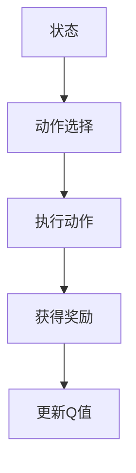
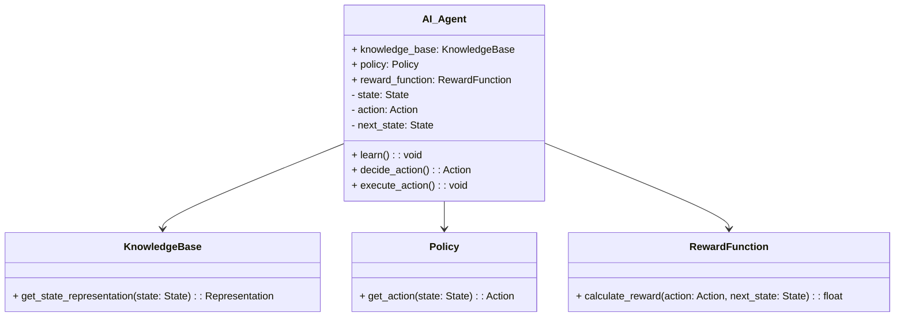
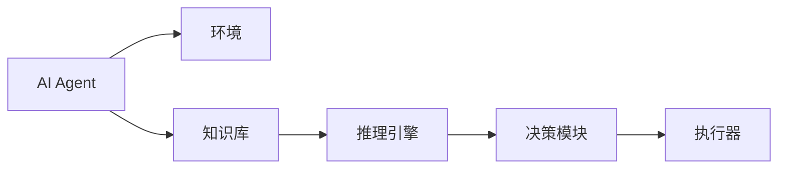
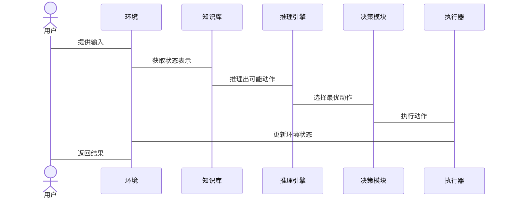

                 


# 构建具有自我进化能力的AI Agent

## 关键词：自我进化、AI Agent、强化学习、进化算法、机器学习

## 摘要：  
AI Agent的自我进化能力是指其能够在动态环境中自主学习、适应和优化自身行为的能力。本文从理论基础、算法原理、系统设计到实际应用，详细探讨了构建具有自我进化能力的AI Agent的各个方面。我们首先介绍了AI Agent的基本概念与背景，分析了自我进化能力的必要性，并深入讲解了其核心概念与联系。接着，我们详细阐述了强化学习和进化算法的原理，并通过代码示例和流程图展示其具体实现。在系统设计部分，我们提出了基于知识表示、学习与优化算法、行为决策与执行机制的系统架构，并通过类图和交互流程图展示了其实现细节。最后，我们通过一个实际案例展示了如何构建一个简单的自我进化AI Agent，并总结了构建此类系统的最佳实践。

---

## 正文

### 第一部分: 构建具有自我进化能力的AI Agent概述

#### 第1章: AI Agent的基本概念与背景

##### 1.1 AI Agent的定义与特点  
AI Agent（人工智能代理）是指能够感知环境、做出决策并执行动作的智能体。它具有以下特点：  
- **自主性**：能够在没有外部干预的情况下独立运作。  
- **反应性**：能够实时感知环境并做出反应。  
- **目标导向性**：具有明确的目标，并通过行为实现目标。  
- **学习能力**：能够通过经验改进自身的性能。  

##### 1.2 自我进化能力的内涵  
自我进化能力是指AI Agent能够通过与环境的交互，自主学习和优化自身行为的能力。这种能力使得AI Agent能够在复杂和动态的环境中自适应地进化，以更好地完成任务。  

##### 1.3 AI Agent的应用场景与优势  
- **应用场景**：AI Agent广泛应用于自动驾驶、智能推荐、机器人控制、游戏AI等领域。  
- **优势**：能够实现实时决策、自适应优化和高效问题求解。  

#### 第2章: 自我进化能力的必要性

##### 2.1 动态环境中的适应性需求  
在实际应用中，环境往往是动态变化的，AI Agent需要能够快速适应这些变化。例如，在自动驾驶中，道路状况和交通规则可能会突然改变。  

##### 2.2 自我优化与学习的重要性  
通过自我优化和学习，AI Agent能够不断改进自身的决策策略，从而提高任务完成的效率和质量。  

##### 2.3 自我进化能力的边界与外延  
自我进化能力的边界在于AI Agent的学习能力、推理能力和执行能力。其外延则包括与其他系统的协作和知识共享。  

#### 第3章: 自我进化AI Agent的核心要素

##### 3.1 知识表示与推理机制  
知识表示是AI Agent理解环境的基础，常见的表示方法包括符号表示和神经网络表示。推理机制则是基于知识表示进行逻辑推理的过程。  

##### 3.2 学习与优化算法  
学习与优化算法是AI Agent实现自我进化的核心。常见的算法包括强化学习、进化算法等。  

##### 3.3 行为决策与执行机制  
行为决策是AI Agent根据当前状态和目标选择最优动作的过程，执行机制则是将决策转化为具体动作的过程。  

---

### 第二部分: 自我进化AI Agent的算法原理

#### 第4章: 强化学习算法

##### 4.1 Q-learning算法  
Q-learning是一种经典的强化学习算法，通过Q表记录状态-动作对的期望奖励值。其核心公式为：  
$$ Q(s, a) = Q(s, a) + \alpha (r + \gamma \max Q(s', a') - Q(s, a)) $$  
其中，$\alpha$是学习率，$\gamma$是折扣因子。  

##### 4.2 Deep Q-Network (DQN)算法  
DQN算法通过深度神经网络近似Q函数，能够处理高维状态空间。其核心思想是通过经验回放和目标网络来稳定训练过程。  

##### 4.3 算法流程图  


#### 第5章: 进化算法

##### 5.1 遗传算法(GA)原理  
遗传算法通过模拟生物进化过程，包括选择、交叉和变异等操作，生成新的个体。其核心步骤为：  
1. 初始化种群。  
2. 计算适应度。  
3. 选择适应度高的个体进行交叉和变异。  
4. 重复上述步骤，直到满足终止条件。  

##### 5.2 进化策略(ES)原理  
进化策略是一种基于正态分布的优化算法，通过调整参数的方差来优化目标函数。其核心公式为：  
$$ \theta_{t+1} = \theta_t + \sigma \cdot \Delta \theta $$  

##### 5.3 算法对比分析  
| 算法 | 优点 | 缺点 |
|------|------|------|
| Q-learning | 简单易实现 | �易陷入局部最优 |
| DQN | 能处理高维状态 | 训练不稳定 |
| GA | 具备全局搜索能力 | 计算复杂度高 |
| ES | 参数调整能力强 | 易陷入局部最优 |

---

### 第三部分: 系统分析与架构设计

#### 第6章: 问题场景介绍

##### 6.1 问题描述  
本文以一个简单的AI Agent为例，设计一个能够在游戏中自我进化的小机器人。  

##### 6.2 系统功能设计  
- **知识表示**：使用神经网络表示状态和动作。  
- **学习与优化**：基于强化学习算法进行策略优化。  
- **行为决策**：根据当前状态选择最优动作。  

#### 第7章: 系统架构设计

##### 7.1 领域模型类图  


##### 7.2 系统架构图  


##### 7.3 系统交互流程图  


---

### 第四部分: 项目实战

#### 第8章: 环境安装与核心实现

##### 8.1 环境安装  
- 安装Python和必要的库（如TensorFlow、Keras）。  
- 安装Mermaid图生成工具。  

##### 8.2 核心实现代码  
```python
import numpy as np
import gym

def q_learning(env, learning_rate=0.1, discount_factor=0.9):
    q_table = np.zeros(env.observation_space.shape)
    for episode in range(1000):
        state = env.reset()
        while True:
            action = np.argmax(q_table[state])
            next_state, reward, done, _ = env.step(action)
            q_table[state][action] += learning_rate * (reward + discount_factor * np.max(q_table[next_state]) - q_table[state][action])
            state = next_state
            if done:
                break
    return q_table

# 测试Q-learning算法
env = gym.make('CartPole-v0')
q_table = q_learning(env)
print("Q-learning算法完成！")
```

---

### 第五部分: 最佳实践

#### 第9章: 小结与注意事项

##### 9.1 小结  
本文详细探讨了构建具有自我进化能力的AI Agent的各个方面，包括理论基础、算法原理、系统设计和项目实战。  

##### 9.2 注意事项  
- 在实际应用中，需要根据具体场景选择合适的算法。  
- 系统设计时，要注意模块之间的耦合性，便于维护和优化。  

#### 第10章: 拓展阅读

##### 10.1 推荐书籍  
- 《强化学习：算法与应用》  
- 《进化计算：算法与应用》  

##### 10.2 推荐论文  
- DeepMind的DQN论文。  

---

## 作者：AI天才研究院/AI Genius Institute & 禅与计算机程序设计艺术 /Zen And The Art of Computer Programming

