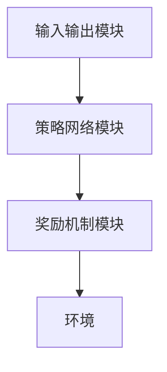
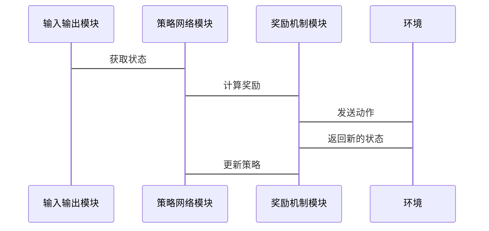
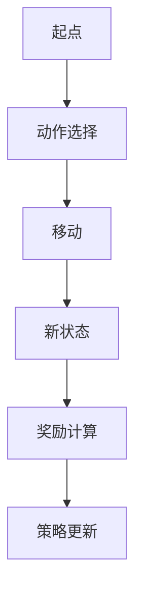

                 


```markdown
# 构建具有自适应学习策略的AI Agent

> 关键词：AI Agent，自适应学习策略，强化学习，算法实现，系统架构

> 摘要：本文详细探讨了构建具有自适应学习策略的AI Agent的理论基础、算法实现和系统架构。通过分析自适应学习策略的核心概念、算法原理、系统设计，结合实际项目案例，展示了如何实现一个能够根据环境反馈动态调整策略的智能体。文章最后总结了自适应学习策略的优势与挑战，并展望了未来的研究方向。

---

## 第1章: 自适应学习策略AI Agent的背景与概念

### 1.1 AI Agent的基本概念
AI Agent（人工智能代理）是指能够感知环境并采取行动以实现目标的智能实体。它可以是一个软件程序，也可以是物理机器人。AI Agent的核心在于其能够根据环境信息做出决策，并通过行动与环境交互。

自适应学习策略AI Agent是一种特殊的AI Agent，它能够根据环境的变化和用户反馈动态调整其学习策略。与传统的基于规则的AI Agent不同，自适应学习策略AI Agent能够通过与环境的交互不断优化其行为，以达到更好的目标实现效果。

### 1.2 自适应学习策略的含义
自适应学习策略是指AI Agent能够根据环境反馈动态调整其学习策略的能力。这种能力使得AI Agent能够在复杂和动态变化的环境中保持高效和稳定的表现。

### 1.3 自适应学习策略AI Agent的应用场景
自适应学习策略AI Agent在多个领域都有广泛的应用，包括游戏AI、机器人控制、自动驾驶、智能推荐系统等。在这些场景中，AI Agent需要能够根据环境的变化动态调整其行为策略，以应对复杂的挑战。

---

## 第2章: 自适应学习策略的核心概念与原理

### 2.1 自适应学习策略的数学模型
自适应学习策略的核心在于其能够根据环境反馈动态调整策略。为了实现这一点，我们需要定义状态、动作和奖励函数。

- **状态空间**：表示环境中的各种可能状态。例如，在一个迷宫问题中，状态可以表示为当前位置的坐标。
- **动作空间**：表示AI Agent在给定状态下可以采取的所有可能动作。例如，在迷宫中，AI Agent可以向左、向右、向上或向下移动。
- **奖励函数**：定义了AI Agent在采取某个动作后所获得的奖励。奖励函数用于指导AI Agent学习最优策略。

### 2.2 自适应学习策略的算法原理
自适应学习策略的核心算法是强化学习（Reinforcement Learning，RL）。在强化学习中，AI Agent通过与环境的交互不断学习最优策略。

- **Q-learning算法**：Q-learning是一种经典的强化学习算法，适用于离散状态和动作空间的情况。其核心思想是通过维护一个Q表，记录每个状态-动作对的期望奖励值，并通过经验不断更新Q表。
- **Deep Q-Network (DQN)算法**：DQN是一种基于深度学习的强化学习算法，适用于高维状态空间的情况。它通过神经网络来近似Q值函数，从而避免了Q表的维度爆炸问题。

### 2.3 自适应学习策略的核心算法
自适应学习策略的核心算法包括Q-learning、DQN和策略梯度法（Actor-Critic）等。

- **Q-learning算法**：通过不断更新Q表来学习最优策略。其更新公式为：
$$ Q(s, a) = Q(s, a) + \alpha [r + \gamma \max Q(s', a') - Q(s, a)] $$
其中，$\alpha$是学习率，$\gamma$是折扣因子。

- **DQN算法**：通过神经网络近似Q值函数，其核心思想是将Q值函数表示为深度神经网络，并通过经验回放和目标网络来优化网络参数。

- **策略梯度法（Actor-Critic）**：通过同时学习策略和价值函数来优化策略。其数学公式为：
$$ \nabla \theta J(\theta) = \mathbb{E}[\nabla \log \pi(a|s) Q(s,a)] $$

### 2.4 自适应学习策略的数学公式
- **Q-learning的数学公式**：
$$ Q(s, a) = Q(s, a) + \alpha [r + \gamma \max Q(s', a') - Q(s, a)] $$
- **策略梯度法的数学公式**：
$$ \nabla \theta J(\theta) = \mathbb{E}[\nabla \log \pi(a|s) Q(s,a)] $$

### 2.5 本章小结
本章详细介绍了自适应学习策略的核心概念和算法原理，包括Q-learning、DQN和策略梯度法等算法。通过数学公式的推导和对比，帮助读者理解自适应学习策略的实现原理。

---

## 第3章: 自适应学习策略的算法实现

### 3.1 算法实现的步骤与流程
自适应学习策略的算法实现通常包括以下几个步骤：
1. **环境建模**：定义状态空间、动作空间和奖励函数。
2. **策略网络构建**：选择合适的神经网络架构来表示策略函数。
3. **策略优化**：通过强化学习算法（如Q-learning、DQN等）优化策略网络参数。

### 3.2 算法实现的代码框架
以下是一个简单的Q-learning算法的代码框架：

```python
class QLearning:
    def __init__(self, state_space, action_space, learning_rate=0.1, gamma=0.9):
        self.state_space = state_space
        self.action_space = action_space
        self.learning_rate = learning_rate
        self.gamma = gamma
        self.q_table = np.zeros((state_space, action_space))
    
    def choose_action(self, state, epsilon=0.1):
        if np.random.random() < epsilon:
            return np.random.randint(self.action_space)
        else:
            return np.argmax(self.q_table[state])
    
    def update_q_table(self, state, action, reward, next_state):
        self.q_table[state][action] += self.learning_rate * (reward + self.gamma * np.max(self.q_table[next_state]) - self.q_table[state][action])
```

### 3.3 算法实现的数学模型
Q-learning算法的数学模型可以表示为：
$$ Q(s, a) = Q(s, a) + \alpha [r + \gamma \max Q(s', a') - Q(s, a)] $$

其中，$\alpha$是学习率，$\gamma$是折扣因子。

### 3.4 本章小结
本章通过代码和数学公式的结合，详细介绍了自适应学习策略的算法实现过程，包括Q-learning算法的实现步骤和代码框架。

---

## 第4章: 自适应学习策略的系统分析与架构设计

### 4.1 系统分析
自适应学习策略AI Agent的系统分析包括以下几个方面：
- **问题场景分析**：明确AI Agent的目标和任务。
- **系统需求分析**：确定系统的功能需求和性能需求。
- **系统边界与接口设计**：定义系统与外部环境的交互接口。

### 4.2 系统架构设计
系统架构设计通常包括以下几个部分：
- **输入输出模块**：负责与环境的交互。
- **策略网络模块**：负责策略的生成和优化。
- **奖励机制模块**：负责计算奖励值并反馈给策略网络。

### 4.3 系统架构图
以下是一个自适应学习策略AI Agent的系统架构图：



### 4.4 系统交互流程
以下是系统交互的流程图：



### 4.5 本章小结
本章通过系统分析和架构设计，展示了如何构建一个具有自适应学习策略的AI Agent系统，并通过mermaid图详细描述了系统的架构和交互流程。

---

## 第5章: 自适应学习策略的项目实战

### 5.1 项目背景
本项目旨在实现一个能够在迷宫中自主导航的AI Agent，通过强化学习算法（Q-learning）实现自适应学习策略。

### 5.2 项目环境安装
以下是实现Q-learning算法所需的环境安装步骤：
1. 安装Python和必要的Python库（如numpy、tensorflow等）。
2. 安装Jupyter Notebook用于代码开发和调试。

### 5.3 系统核心实现
以下是Q-learning算法的核心实现代码：

```python
import numpy as np

class QLearningAgent:
    def __init__(self, state_space, action_space, learning_rate=0.1, gamma=0.9):
        self.state_space = state_space
        self.action_space = action_space
        self.learning_rate = learning_rate
        self.gamma = gamma
        self.q_table = np.zeros((state_space, action_space))
    
    def choose_action(self, state, epsilon=0.1):
        if np.random.random() < epsilon:
            return np.random.randint(self.action_space)
        else:
            return np.argmax(self.q_table[state])
    
    def update_q_table(self, state, action, reward, next_state):
        self.q_table[state][action] += self.learning_rate * (reward + self.gamma * np.max(self.q_table[next_state]) - self.q_table[state][action])
```

### 5.4 项目案例分析
以下是Q-learning算法在迷宫问题中的应用示例：



### 5.5 项目小结
本章通过迷宫问题的案例分析，详细展示了自适应学习策略AI Agent的实现过程，并通过代码和图表帮助读者理解实际应用中的细节。

---

## 第6章: 自适应学习策略的最佳实践与未来展望

### 6.1 最佳实践
1. **选择合适的算法**：根据具体问题选择适合的强化学习算法（如Q-learning、DQN等）。
2. **优化超参数**：合理设置学习率、折扣因子等超参数，以提高算法的收敛速度和性能。
3. **处理高维状态空间**：对于高维状态空间的问题，优先选择基于深度学习的算法（如DQN）。

### 6.2 未来展望
1. **多智能体协作**：研究如何实现多个AI Agent之间的协作与竞争。
2. **实时自适应策略**：探索如何实现更高效的实时自适应策略。
3. **强化学习与其他技术的结合**：将强化学习与其他技术（如深度学习、自然语言处理）结合，推动AI Agent的发展。

### 6.3 本章小结
本章总结了自适应学习策略AI Agent的最佳实践，并展望了未来的研究方向，为读者提供了进一步学习和研究的指导。

---

## 附录

### 附录A: 工具安装指南
以下是实现自适应学习策略AI Agent所需工具的安装指南：
1. **Python安装**：下载并安装Python 3.x版本。
2. **库安装**：使用pip安装所需的Python库（如numpy、tensorflow等）。

### 附录B: 术语表
- **AI Agent**：人工智能代理。
- **自适应学习策略**：动态调整策略的能力。
- **强化学习**：一种通过与环境交互学习最优策略的算法。

### 附录C: 参考文献
1. DeepMind. "Deep Q-Networks (DQN)". [链接](https://www.deepmind.com/research/deep-q-learning)
2. Sutton, R. S., & Barto, A. G. (1998). Introduction to reinforcement learning. MIT press.

---

## 作者：AI天才研究院/AI Genius Institute & 禅与计算机程序设计艺术 /Zen And The Art of Computer Programming
```

