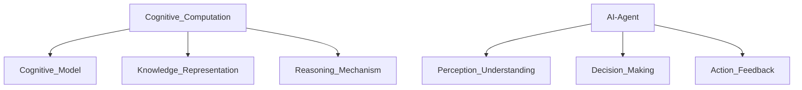
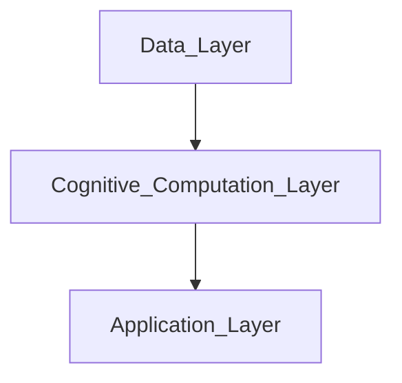
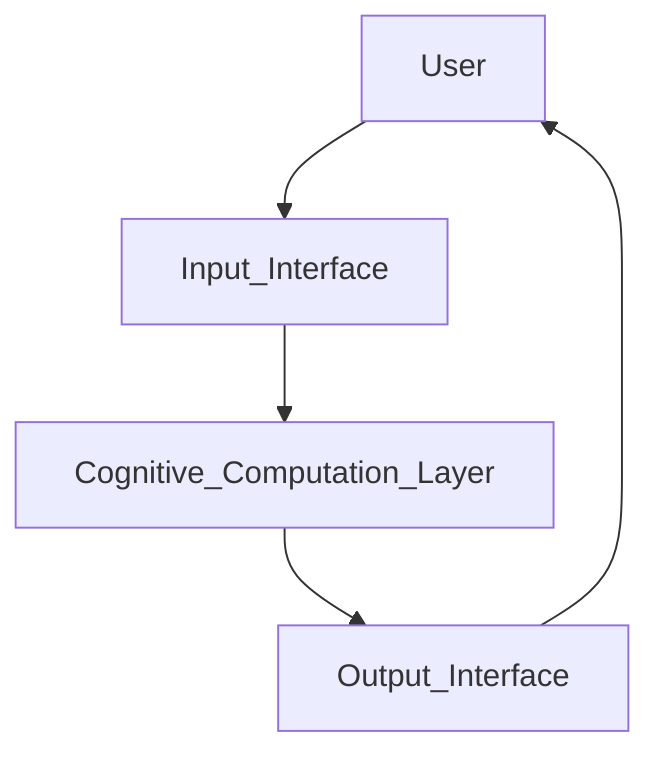

                 


# 构建具有认知计算能力的AI Agent

> 关键词：认知计算，AI Agent，知识图谱，自然语言处理，深度学习，符号推理，强化学习

> 摘要：认知计算是一种结合了符号推理和机器学习的计算范式，旨在通过模拟人类认知过程来增强AI Agent的能力。本文将详细探讨认知计算的核心概念、算法原理、系统架构设计以及实际项目实现，帮助读者全面理解并掌握如何构建具有认知计算能力的AI Agent。

---

## 第一章：认知计算与AI Agent概述

### 1.1 认知计算的基本概念

#### 1.1.1 认知计算的定义
认知计算是一种模拟人类认知过程的计算范式，旨在通过结合符号推理、知识表示和机器学习技术，使计算机能够像人类一样理解和解决问题。

#### 1.1.2 认知计算的核心特点
- **知识驱动**：依赖于知识表示和推理。
- **符号与学习结合**：结合符号推理和机器学习。
- **动态适应**：能够根据环境变化动态调整。

#### 1.1.3 认知计算与传统计算的区别
| 特性       | 传统计算         | 认知计算         |
|------------|------------------|------------------|
| 核心方法   | 基于规则和逻辑   | 基于知识和学习   |
| 处理方式   | 确定性、刚性     | 概率性、动态性   |
| 应用场景   | 简单规则任务     | 复杂认知任务     |

### 1.2 AI Agent的基本概念

#### 1.2.1 AI Agent的定义
AI Agent是一种智能实体，能够感知环境、自主决策并执行任务，以实现特定目标。

#### 1.2.2 AI Agent的核心特点
- **自主性**：无需外部干预。
- **反应性**：能够实时感知并响应环境。
- **目标导向**：以目标为导向进行决策和行动。

#### 1.2.3 认知计算与AI Agent的关系
认知计算为AI Agent提供了更强大的认知能力，使其能够处理复杂的问题。

### 1.3 认知计算与AI Agent的核心要素对比

#### 对比表格
| 核心要素         | 认知计算         | AI Agent         |
|------------------|------------------|------------------|
| 核心技术         | 知识表示、推理   | 感知、决策、行动 |
| 目标             | 提供认知能力     | 完成特定任务     |
| 应用场景         | 复杂认知任务     | 多领域应用       |

#### 实体关系图


---

## 第二章：认知计算与AI Agent的核心概念

### 2.1 认知计算的核心概念

#### 2.1.1 知识表示
知识表示是认知计算的基础，常用的知识表示方法包括：
- **符号表示**：使用符号和规则表示知识。
- **语义网络**：通过节点和边表示概念及其关系。
- **知识图谱**：大规模结构化知识的表示。

#### 2.1.2 推理机制
推理是认知计算的核心，常见的推理方法包括：
- **符号推理**：基于逻辑规则进行推理。
- **概率推理**：基于概率论进行推理。
- **类比推理**：通过类比进行推理。

#### 2.1.3 状态空间搜索
状态空间搜索是一种常用的推理方法，常用算法包括：
- **广度优先搜索（BFS）**：适用于规则明确的问题。
- **深度优先搜索（DFS）**：适用于规则复杂的问题。

### 2.2 AI Agent的核心概念

#### 2.2.1 感知与理解
AI Agent通过感知环境获取信息，常见的感知方式包括：
- **自然语言处理（NLP）**：通过文本理解环境。
- **计算机视觉（CV）**：通过图像理解环境。

#### 2.2.2 决策与推理
AI Agent基于感知信息进行决策，常见的决策方法包括：
- **基于规则的决策**：使用预定义规则进行决策。
- **基于模型的决策**：使用机器学习模型进行决策。

#### 2.2.3 行动与反馈
AI Agent根据决策结果执行行动，并根据反馈调整行为。

### 2.3 认知计算与AI Agent的核心要素对比

#### 对比表格
| 核心要素         | 认知计算         | AI Agent         |
|------------------|------------------|------------------|
| 核心技术         | 知识表示、推理   | 感知、决策、行动 |
| 目标             | 提供认知能力     | 完成特定任务     |
| 应用场景         | 复杂认知任务     | 多领域应用       |

#### 实体关系图


---

## 第三章：认知计算与AI Agent的算法原理

### 3.1 认知计算的核心算法

#### 3.1.1 知识表示与推理算法
知识表示与推理算法包括：
- **符号逻辑推理**：基于逻辑规则进行推理。
- **语义网络推理**：基于语义网络进行推理。

#### 3.1.2 状态空间搜索算法
状态空间搜索算法包括：
- **广度优先搜索（BFS）**：适用于规则明确的问题。
- **深度优先搜索（DFS）**：适用于规则复杂的问题。

#### 3.1.3 知识图谱构建与推理
知识图谱构建与推理包括：
- **知识抽取**：从文本中抽取知识。
- **知识融合**：将多个知识源融合。
- **知识推理**：基于知识图谱进行推理。

### 3.2 AI Agent的核心算法

#### 3.2.1 感知与理解算法
感知与理解算法包括：
- **自然语言处理（NLP）**：通过文本理解环境。
- **计算机视觉（CV）**：通过图像理解环境。

#### 3.2.2 决策与推理算法
决策与推理算法包括：
- **基于规则的决策**：使用预定义规则进行决策。
- **基于模型的决策**：使用机器学习模型进行决策。

#### 3.2.3 行动与反馈算法
行动与反馈算法包括：
- **基于反馈的调整**：根据反馈调整行为。

### 3.3 算法实现与优化

#### 3.3.1 算法实现
算法实现包括：
- **符号逻辑推理的实现**：基于逻辑规则进行推理。
- **语义网络推理的实现**：基于语义网络进行推理。

#### 3.3.2 算法优化
算法优化包括：
- **规则优化**：优化预定义规则。
- **模型优化**：优化机器学习模型。

---

## 第四章：系统分析与架构设计

### 4.1 问题场景介绍

#### 4.1.1 问题背景
认知计算和AI Agent的应用场景包括：
- **智能助手**：帮助用户完成日常任务。
- **智能客服**：提供智能客服服务。
- **自动驾驶**：实现自动驾驶功能。

#### 4.1.2 问题描述
在实际应用中，AI Agent需要具备认知能力，能够处理复杂问题。

### 4.2 系统功能设计

#### 4.2.1 领域模型类图
领域模型类图展示了系统的各个组件及其关系。

#### 4.2.2 系统架构设计
系统架构设计包括：
- **数据层**：存储数据。
- **计算层**：进行认知计算。
- **应用层**：提供应用服务。

### 4.3 系统架构图

#### 4.3.1 系统架构图


### 4.4 系统接口设计

#### 4.4.1 系统接口
系统接口包括：
- **输入接口**：接收输入数据。
- **输出接口**：输出处理结果。

#### 4.4.2 系统交互流程
系统交互流程包括：
1. 接收输入数据。
2. 进行认知计算。
3. 输出处理结果。

### 4.5 系统交互流程图

#### 4.5.1 系统交互流程图


---

## 第五章：项目实战

### 5.1 环境配置

#### 5.1.1 环境需求
- **Python**：3.6以上版本。
- **transformers库**：用于自然语言处理。
- **numpy**：用于数值计算。

#### 5.1.2 安装依赖
```bash
pip install transformers numpy
```

### 5.2 核心代码实现

#### 5.2.1 知识表示与推理代码
```python
from transformers import pipeline

# 初始化NLP管道
nlp = pipeline("text-classification", model="bert-base-uncased")

# 处理输入文本
result = nlp("This is a test sentence.")

print(result)
```

#### 5.2.2 状态空间搜索代码
```python
def bfs(initial_state, goal_state):
    from collections import deque
    visited = set()
    queue = deque([initial_state])
    while queue:
        current_state = queue.popleft()
        if current_state == goal_state:
            return True
        if current_state in visited:
            continue
        visited.add(current_state)
        # 生成所有可能的状态
        for next_state in generate_next_states(current_state):
            queue.append(next_state)
    return False
```

### 5.3 项目小结

#### 5.3.1 项目总结
通过本项目，我们实现了认知计算和AI Agent的核心功能，包括知识表示、推理和决策。

#### 5.3.2 经验总结
- **知识表示的重要性**：知识表示是认知计算的核心。
- **算法选择的影响**：算法选择对系统性能有重要影响。

---

## 第六章：认知计算与AI Agent的应用案例

### 6.1 智能助手应用

#### 6.1.1 应用背景
智能助手需要具备认知能力，能够处理用户的复杂查询。

#### 6.1.2 应用案例分析
通过智能助手处理用户的复杂查询，展示了认知计算和AI Agent的应用价值。

### 6.2 自动驾驶应用

#### 6.2.1 应用背景
自动驾驶需要具备认知能力，能够处理复杂的交通环境。

#### 6.2.2 应用案例分析
通过自动驾驶系统的实现，展示了认知计算和AI Agent的应用价值。

---

## 第七章：认知计算与AI Agent的最佳实践

### 7.1 小结

#### 7.1.1 核心内容回顾
认知计算和AI Agent的核心概念、算法和系统架构设计。

### 7.2 注意事项

#### 7.2.1 知识表示的选择
选择合适的知识表示方法对系统的性能至关重要。

#### 7.2.2 算法选择的影响
算法选择对系统的性能有重要影响。

### 7.3 拓展阅读

#### 7.3.1 推荐书籍
- 《认知计算与AI Agent》
- 《深度学习与认知科学》

#### 7.3.2 推荐论文
- "A Survey on Cognitive Computing"
- "AI Agent: Theory and Application"

---

## 作者

作者：AI天才研究院/AI Genius Institute & 禅与计算机程序设计艺术 /Zen And The Art of Computer Programming

