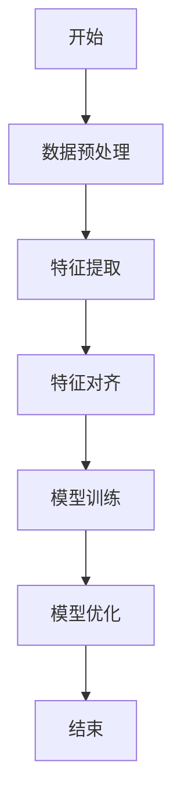
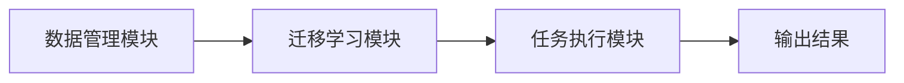

                 


# 构建具有迁移学习能力的AI Agent

> 关键词：迁移学习，AI Agent，机器学习，深度学习，自然语言处理，图像识别

> 摘要：本文详细探讨了如何构建具有迁移学习能力的AI Agent，从迁移学习的基本概念、算法原理、系统架构到实际项目实现，全面分析了迁移学习在AI Agent中的应用。通过理论与实践相结合，本文为读者提供了一套系统的方法论，帮助他们理解并掌握迁移学习的核心技术，从而在实际应用中构建出高效、智能的AI Agent。

---

# 第一部分：迁移学习与AI Agent概述

## 第1章：迁移学习与AI Agent的背景介绍

### 1.1 迁移学习的核心概念

#### 1.1.1 从传统机器学习到迁移学习的演进
传统机器学习依赖于大量标注数据，且模型在不同任务或数据集之间泛化能力有限。迁移学习通过共享不同任务或数据集之间的特征表示，解决了数据不足和任务多样性的挑战。

#### 1.1.2 迁移学习的定义与特点
迁移学习是指将一个任务上已学到的知识迁移到另一个相关任务上，其核心是通过共享特征或参数来提高模型的泛化能力。特点包括：
- **数据高效性**：利用已有数据减少新任务的数据需求。
- **任务相关性**：任务之间需具有一定的相似性或相关性。
- **领域适应性**：支持跨领域或跨任务的应用。

#### 1.1.3 迁移学习的背景与问题背景
在实际应用中，数据获取成本高且标注数据有限，而任务需求多样化。迁移学习通过知识共享，解决了数据不足和任务多样性的矛盾。

### 1.2 AI Agent的基本概念

#### 1.2.1 AI Agent的定义与特点
AI Agent是一种智能体，能够感知环境、自主决策并执行任务。特点包括：
- **自主性**：无需外部干预。
- **反应性**：实时感知并响应环境。
- **目标导向性**：基于目标执行任务。

#### 1.2.2 AI Agent的核心要素与功能
- **感知能力**：通过传感器或数据接口获取环境信息。
- **推理能力**：基于知识和推理规则进行决策。
- **执行能力**：通过执行机构完成任务。

#### 1.2.3 迁移学习在AI Agent中的作用
迁移学习使AI Agent能够快速适应新任务，提升其在复杂环境中的泛化能力和适应性。

### 1.3 迁移学习在AI Agent中的重要性

#### 1.3.1 迁移学习的必要性
AI Agent需要在多样化和动态变化的环境中执行任务，迁移学习是其实现通用性和高效性的关键。

#### 1.3.2 迁移学习的优势与挑战
优势：
- **减少数据需求**：通过迁移学习，AI Agent可以在新任务中利用已有知识，减少对新数据的依赖。
- **提升泛化能力**：通过跨任务共享特征，提升模型的泛化能力。

挑战：
- **任务相关性**：迁移学习的效果依赖于任务之间的相似性，任务不相关时效果有限。
- **领域适应性**：需要处理不同领域之间的差异性。

#### 1.3.3 迁移学习在AI Agent中的应用前景
迁移学习使AI Agent能够更高效地适应新任务，推动其在智能客服、自动驾驶、智能助手等领域的广泛应用。

---

## 第2章：迁移学习的核心概念与联系

### 2.1 迁移学习的核心原理

#### 2.1.1 迁移学习的基本原理
迁移学习通过共享特征或参数，将源任务的知识迁移到目标任务，提升目标任务的性能。

#### 2.1.2 迁移学习的关键要素
- **源任务和目标任务**：迁移学习的核心是将源任务的知识迁移到目标任务。
- **特征表示**：迁移学习通过共享特征表示，实现知识共享。
- **适应方法**：包括特征对齐、参数调整等方法。

#### 2.1.3 迁移学习的数学模型概述
迁移学习的数学模型通常涉及特征空间的共享和对齐，常用的方法包括线性变换和非线性变换。

### 2.2 迁移学习与AI Agent的关系

#### 2.2.1 迁移学习在AI Agent中的核心作用
迁移学习使AI Agent能够快速适应新任务，提升其在复杂环境中的表现。

#### 2.2.2 AI Agent的迁移学习架构
AI Agent的迁移学习架构通常包括特征提取、任务适配和模型优化三个部分。

#### 2.2.3 迁移学习与AI Agent的协同关系
迁移学习为AI Agent提供知识共享的能力，AI Agent为迁移学习提供应用平台。

### 2.3 迁移学习的核心概念对比表

| 对比维度 | 传统机器学习 | 迁移学习 |
|----------|---------------|----------|
| 数据需求 | 高            | 较低     |
| 任务多样性 | 低            | 高       |
| 模型泛化能力 | 有限         | 较高     |

### 2.4 AI Agent的迁移学习ER实体关系图

```mermaid
erDiagram
    class SourceTask {
        id
        features
    }
    class TargetTask {
        id
        features
    }
    class FeatureSpace {
        id
        features
    }
    SourceTask --> FeatureSpace : 共享
    TargetTask --> FeatureSpace : 共享
```

### 2.5 本章小结

---

## 第3章：迁移学习算法的原理与实现

### 3.1 迁移学习算法的核心原理

#### 3.1.1 迁移学习的基本流程
1. 数据预处理：对源任务和目标任务的数据进行预处理。
2. 特征提取：提取源任务和目标任务的特征。
3. 特征对齐：对齐源任务和目标任务的特征空间。
4. 模型训练：在对齐的特征空间上训练模型。
5. 模型优化：优化模型参数，提升目标任务的性能。

#### 3.1.2 迁移学习的关键步骤
- **特征对齐**：通过线性变换或非线性变换对齐源任务和目标任务的特征空间。
- **参数调整**：调整模型参数，使模型在目标任务上表现更好。

#### 3.1.3 迁移学习的数学模型与公式
迁移学习的目标是通过优化目标任务的损失函数，同时保持源任务的性能。常用的损失函数包括：

$$ L = \lambda_1 L_{source} + \lambda_2 L_{target} $$

其中，$L_{source}$ 是源任务的损失，$L_{target}$ 是目标任务的损失，$\lambda_1$ 和 $\lambda_2$ 是调节参数。

### 3.2 迁移学习算法的实现步骤

#### 3.2.1 数据预处理与特征提取
1. 数据预处理：对数据进行清洗、归一化等处理。
2. 特征提取：使用深度学习模型（如CNN、RNN）提取特征。

#### 3.2.2 迁移学习模型的构建
1. 特征对齐：通过线性变换对齐源任务和目标任务的特征空间。
2. 模型训练：在对齐的特征空间上训练模型。

#### 3.2.3 模型的训练与优化
1. 参数调整：使用迁移学习方法（如参数微调）优化模型。
2. 模型评估：在目标任务上评估模型性能。

### 3.3 迁移学习算法的Mermaid流程图



### 3.4 本章小结

---

## 第4章：迁移学习算法的实现

### 4.1 迁移学习算法的Python实现

#### 4.1.1 迁移学习算法的实现代码
```python
import torch
import torch.nn as nn
import torch.optim as optim

class迁移学习模型(nn.Module):
    def __init__(self):
        super(迁移学习模型, self).__init__()
        self.feature_extractor = nn.Sequential(
            nn.Conv2d(1, 32, kernel_size=3, stride=1, padding=1),
            nn.ReLU(),
            nn.MaxPool2d(2, 2)
        )
        self.classifier = nn.Sequential(
            nn.Linear(32 * 16 * 16, 100),
            nn.ReLU(),
            nn.Linear(100, 10)
        )

    def forward(self, x):
        features = self.feature_extractor(x)
        output = self.classifier(features.view(features.size(0), -1))
        return output, features

model = 迁移学习模型()
optimizer = optim.Adam(model.parameters(), lr=0.001)
criterion = nn.CrossEntropyLoss()

for epoch in range(10):
    for batch_idx, (inputs, labels) in enumerate(train_loader):
        outputs, features = model(inputs)
        loss = criterion(outputs, labels)
        loss.backward()
        optimizer.step()
        optimizer.zero_grad()
```

#### 4.1.2 代码实现的详细解读
1. **模型定义**：定义了一个包含特征提取模块和分类器模块的迁移学习模型。
2. **训练过程**：在每个 epoch 中，模型对输入数据进行前向传播，计算损失，反向传播并优化参数。

### 4.2 迁移学习算法的数学模型

#### 4.2.1 迁移学习的数学模型
$$ L = \lambda_1 L_{source} + \lambda_2 L_{target} $$

其中，$L_{source}$ 和 $L_{target}$ 分别是源任务和目标任务的损失函数，$\lambda_1$ 和 $\lambda_2$ 是调节参数。

### 4.3 迁移学习算法的案例分析

#### 4.3.1 案例分析：自然语言处理中的迁移学习
在自然语言处理任务中，可以使用预训练语言模型（如BERT）进行迁移学习。通过在特定任务上微调模型，可以显著提升任务性能。

#### 4.3.2 案例分析：图像识别中的迁移学习
在图像识别任务中，可以使用预训练的卷积神经网络（如ResNet）进行迁移学习。通过在目标数据集上微调模型，可以提升识别准确率。

### 4.4 本章小结

---

## 第5章：AI Agent的迁移学习系统架构设计

### 5.1 系统分析与设计

#### 5.1.1 系统功能设计
- **数据管理模块**：负责数据的存储、预处理和特征提取。
- **迁移学习模块**：负责特征对齐和模型训练。
- **任务执行模块**：负责目标任务的执行和结果输出。

#### 5.1.2 系统架构设计


### 5.2 项目实战

#### 5.2.1 环境安装
```bash
pip install torch torchvision
```

#### 5.2.2 核心实现代码
```python
import torch
import torch.nn as nn
import torch.optim as optim

class AI-Agent(nn.Module):
    def __init__(self):
        super(AI-Agent, self).__init__()
        self.feature_extractor = nn.Sequential(
            nn.Conv2d(1, 32, kernel_size=3, stride=1, padding=1),
            nn.ReLU(),
            nn.MaxPool2d(2, 2)
        )
        self.classifier = nn.Sequential(
            nn.Linear(32 * 16 * 16, 100),
            nn.ReLU(),
            nn.Linear(100, 10)
        )

    def forward(self, x):
        features = self.feature_extractor(x)
        output = self.classifier(features.view(features.size(0), -1))
        return output, features

model = AI-Agent()
optimizer = optim.Adam(model.parameters(), lr=0.001)
criterion = nn.CrossEntropyLoss()

for epoch in range(10):
    for batch_idx, (inputs, labels) in enumerate(train_loader):
        outputs, features = model(inputs)
        loss = criterion(outputs, labels)
        loss.backward()
        optimizer.step()
        optimizer.zero_grad()
```

#### 5.2.3 代码实现的详细解读
1. **模型定义**：定义了一个包含特征提取模块和分类器模块的AI Agent模型。
2. **训练过程**：在每个 epoch 中，模型对输入数据进行前向传播，计算损失，反向传播并优化参数。

### 5.3 系统优化与扩展

#### 5.3.1 系统优化
- **模型优化**：通过调整学习率、批量大小等超参数，优化模型性能。
- **特征对齐**：采用更复杂的特征对齐方法，提升迁移效果。

#### 5.3.2 系统扩展
- **多任务学习**：扩展系统，支持多任务迁移学习。
- **在线学习**：实现在线迁移学习，支持动态任务迁移。

### 5.4 本章小结

---

## 第6章：迁移学习的项目实战与最佳实践

### 6.1 项目实战

#### 6.1.1 案例分析：自然语言处理任务
- **任务描述**：在文本分类任务中，使用预训练语言模型进行迁移学习。
- **具体实现**：在特定领域数据集上微调预训练模型，提升分类准确率。

#### 6.1.2 案例分析：图像识别任务
- **任务描述**：在图像分类任务中，使用预训练卷积神经网络进行迁移学习。
- **具体实现**：在目标数据集上微调模型，提升识别准确率。

### 6.2 最佳实践

#### 6.2.1 迁移学习的实用技巧
1. **选择合适的迁移策略**：根据任务需求选择特征对齐、参数微调等策略。
2. **数据预处理**：确保数据预处理的一致性，减少数据分布差异。
3. **模型优化**：合理调整学习率、批量大小等超参数，优化模型性能。

#### 6.2.2 迁移学习的注意事项
1. **任务相关性**：确保源任务和目标任务具有一定的相似性。
2. **数据质量**：确保目标任务的数据质量，避免因数据不足影响迁移效果。
3. **模型选择**：选择适合迁移学习的模型架构，如预训练的深度学习模型。

#### 6.2.3 拓展阅读
- **推荐书籍**：《迁移学习：理论与应用》
- **推荐论文**：《A Survey on Deep Learning-based Transfer Learning》

### 6.3 本章小结

---

## 作者：AI天才研究院/AI Genius Institute & 禅与计算机程序设计艺术 /Zen And The Art of Computer Programming

---

以上是构建具有迁移学习能力的AI Agent的技术博客文章的详细内容，涵盖了从理论到实践的各个方面，通过逐步分析和详细讲解，帮助读者全面理解并掌握迁移学习的核心技术。

