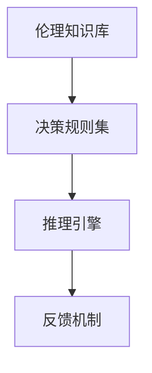
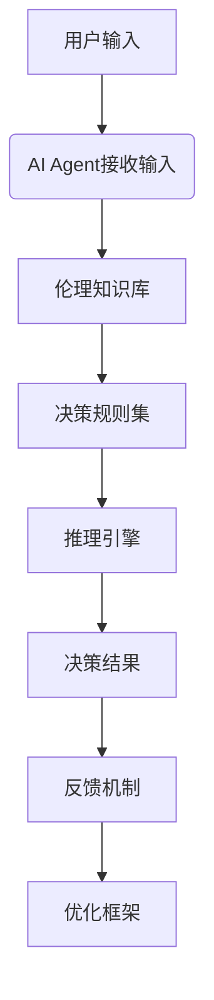
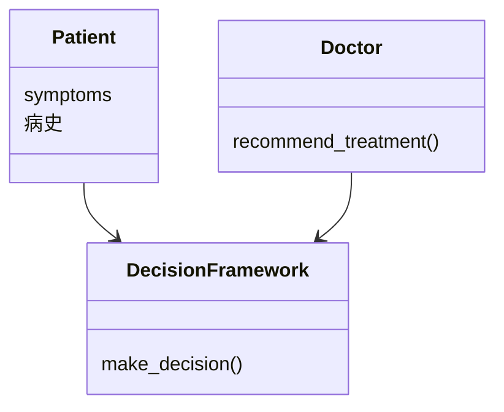
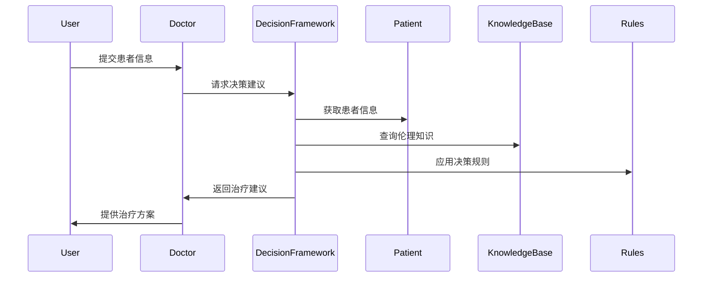

                 


# 构建具有道德决策框架的AI Agent系统

> 关键词：AI Agent，道德决策，伦理框架，系统架构，算法原理

> 摘要：本文详细探讨了构建具有道德决策框架的AI Agent系统的各个方面，从背景介绍、核心概念、算法原理到系统架构设计和项目实战，全面解析了如何在AI Agent中实现道德决策，确保系统在复杂场景中能够做出符合伦理的决策。

---

## 第1章: 背景介绍与核心概念

### 1.1 问题背景

#### 1.1.1 AI Agent的定义与特点
AI Agent（人工智能代理）是指能够感知环境、自主决策并执行任务的智能实体。其特点包括自主性、反应性、目标导向性和社会性。AI Agent广泛应用于自动驾驶、智能助手、医疗诊断等领域。

#### 1.1.2 道德决策在AI Agent中的必要性
在AI Agent执行任务时，可能面临需要做出道德判断的场景，例如自动驾驶中紧急情况下的决策，医疗诊断中的治疗建议等。这些场景中，AI Agent需要在可能对人类生命或利益产生重大影响的情况下做出决策，因此道德决策框架至关重要。

#### 1.1.3 当前AI Agent在道德决策中的挑战
- **伦理多样性**：不同文化、地区和个体的伦理标准不同，如何在多元背景下统一道德决策框架？
- **复杂性**：道德决策涉及多个利益相关者，如何在复杂场景中权衡各方利益？
- **动态性**：环境和情境不断变化，如何保证道德决策框架的灵活性和适应性？

### 1.2 问题描述

#### 1.2.1 AI Agent决策的不确定性
AI Agent的决策过程可能受到数据不完整、环境动态变化等因素的影响，导致决策结果存在不确定性。

#### 1.2.2 道德决策的复杂性
道德决策涉及复杂的伦理推理，需要考虑行为的后果、意图、义务等多个维度，使得决策过程更加复杂。

#### 1.2.3 伦理冲突的场景分析
在某些场景中，AI Agent可能面临多个伦理目标的冲突，例如自动驾驶中优先保护乘客还是路人，如何在有限资源下分配医疗资源等。

### 1.3 问题解决

#### 1.3.1 道德决策框架的构建目标
- 提供一套可编程的伦理规则和决策机制，帮助AI Agent在复杂场景中做出符合伦理的决策。
- 确保决策过程透明可解释，便于用户理解和信任。
- 具备灵活性和适应性，能够应对不同场景和文化背景下的伦理问题。

#### 1.3.2 道德决策框架的核心要素
- **伦理知识库**：包含基本的伦理原则、规范和案例。
- **决策规则集**：用于指导AI Agent在特定情境下的决策。
- **推理引擎**：负责根据当前情境和伦理知识，生成符合伦理的决策。
- **反馈机制**：用于优化和调整伦理决策框架。

#### 1.3.3 道德决策框架的实现路径
1. **伦理知识建模**：将伦理原则转化为可计算的形式，例如规则、约束条件等。
2. **决策规则设计**：基于伦理知识，设计适用于不同场景的决策规则。
3. **推理引擎开发**：实现推理逻辑，确保决策过程符合伦理要求。
4. **系统集成与测试**：将道德决策框架集成到AI Agent系统中，并进行实际场景测试。

### 1.4 道德决策框架的边界与外延

#### 1.4.1 道德决策的适用范围
- **医疗领域**：诊断、治疗方案选择。
- **法律领域**：合同审核、法律咨询。
- **自动驾驶**：紧急情况下的驾驶决策。

#### 1.4.2 道德决策的局限性
- **伦理多样性**：不同文化背景下的伦理标准不同，如何统一？
- **动态变化**：伦理标准可能随时间变化，如何更新框架？
- **复杂场景**：在极端复杂的场景中，如何确保决策的正确性？

#### 1.4.3 道德决策与法律、伦理的关系
- 道德决策框架需要遵守相关法律和伦理规范。
- 道德决策框架可以辅助法律和伦理的实施，但不能完全替代人类的道德判断。

### 1.5 核心概念结构与组成

#### 1.5.1 道德决策框架的组成模块
- **伦理知识库**：存储伦理原则、案例和规范。
- **决策规则集**：定义决策逻辑和优先级。
- **推理引擎**：负责推理和生成决策。
- **反馈机制**：用于优化和调整框架。

#### 1.5.2 各模块之间的关系
- 伦理知识库为决策规则集提供基础，决策规则集指导推理引擎进行推理，反馈机制根据实际结果优化各模块。

#### 1.5.3 系统整体架构图


---

## 第2章: 道德决策框架的核心原理

### 2.1 道德决策框架的原理

#### 2.1.1 伦理原则的编码与表示
将伦理原则转化为可计算的形式，例如：
- **功利主义**：最大化整体利益。
- **义务论**：基于道德义务做出决策。
- **美德伦理**：基于美德和情境做出决策。

#### 2.1.2 决策过程的规范与优化
通过制定明确的决策规则和优先级，确保决策过程的规范性和可优化性。

#### 2.1.3 道德推理的逻辑与方法
- **逻辑推理**：基于伦理规则进行逻辑推理。
- **案例推理**：通过相似案例的分析进行推理。
- **混合推理**：结合逻辑推理和案例推理。

### 2.2 核心概念属性对比

#### 表2-1: 道德决策框架核心概念属性对比表

| 属性             | 确定性 | 概念化 | 可解释性 | 可调整性 |
|------------------|--------|--------|----------|----------|
| 伦理知识库       | 高     | 高     | 中        | 低       |
| 决策规则集       | 中     | 高     | 中        | 中       |
| 推理引擎         | 低     | 中     | 高        | 高       |
| 反馈机制         | 低     | 低     | 中        | 高       |

### 2.3 ER实体关系图

```mermaid
er
    actor: 用户
    agent: AI Agent
    decision_framework: 道德决策框架
    ethics: 伦理原则
    knowledge_base: 知识库
    interaction: 交互记录
    goal: 目标
    constraint: 约束条件
```

### 2.4 道德决策流程图



---

## 第3章: 算法原理

### 3.1 算法原理概述

#### 3.1.1 算法选择
选择基于规则的算法，因为规则明确，易于解释。

#### 3.1.2 算法实现
```python
class DecisionFramework:
    def __init__(self, knowledge_base, rules):
        self.knowledge_base = knowledge_base
        self.rules = rules
        self.feedback = None

    def make_decision(self, input_data):
        # 基于知识库和规则进行推理
        for rule in self.rules:
            if rule.applies_to(input_data):
                return rule.apply(input_data)
        # 如果没有匹配规则，返回默认决策
        return self.default_decision

    def update(self, feedback):
        # 根据反馈优化规则
        self.feedback = feedback
        # 反馈机制用于优化规则
        self(rulesOptimizer.optimize(self.rules, self.feedback))
```

#### 3.1.3 数学模型
道德决策框架的优化可以表示为一个优化问题，目标是最小化伦理冲突，最大化伦理符合度：
$$ \min_{\theta} \sum_{i=1}^{n} (1 - f_i(\theta)) $$
其中，$f_i(\theta)$ 是第 $i$ 个伦理原则的符合度函数，$\theta$ 是决策参数。

### 3.2 算法实现细节

#### 3.2.1 知识库构建
```python
class KnowledgeBase:
    def __init__(self):
        self.ethics = {
            'utilitarianism': {'weight': 0.5},
            'deontological': {'weight': 0.3},
            'virtue': {'weight': 0.2}
        }
```

#### 3.2.2 决策规则集
```python
class Rule:
    def __init__(self, name, condition, action):
        self.name = name
        self.condition = condition
        self.action = action

    def applies_to(self, input_data):
        return self.condition(input_data)

    def apply(self, input_data):
        return self.action(input_data)
```

#### 3.2.3 推理引擎
```python
class InferenceEngine:
    def __init__(self, knowledge_base, rules):
        self.knowledge_base = knowledge_base
        self.rules = rules

    def infer(self, input_data):
        for rule in self.rules:
            if rule.applies_to(input_data):
                return rule.apply(input_data)
        return self.default_decision
```

### 3.3 算法优化与测试

#### 3.3.1 反馈机制
通过用户反馈不断优化决策规则和知识库，确保道德决策框架的适应性和准确性。

#### 3.3.2 性能测试
在不同场景下测试算法的决策能力，确保其符合伦理要求。

---

## 第4章: 系统分析与架构设计

### 4.1 问题场景介绍

#### 4.1.1 医疗诊断中的AI Agent
AI Agent需要根据患者症状和病史，推荐治疗方案，确保决策符合伦理和患者利益。

### 4.2 系统功能设计

#### 4.2.1 领域模型类图


#### 4.2.2 系统架构设计
采用分层架构，包括数据层、业务逻辑层和应用层。

#### 4.2.3 系统接口设计
定义清晰的接口，确保各模块之间的通信和协作。

#### 4.2.4 系统交互流程图


---

## 第5章: 项目实战

### 5.1 环境安装

#### 5.1.1 安装Python和相关库
```bash
pip install mermaid
pip install matplotlib
pip install numpy
```

### 5.2 核心代码实现

#### 5.2.1 决策框架实现
```python
class DecisionFramework:
    def __init__(self, knowledge_base, rules):
        self.knowledge_base = knowledge_base
        self.rules = rules

    def make_decision(self, input_data):
        for rule in self.rules:
            if rule.applies_to(input_data):
                return rule.apply(input_data)
        return self.default_decision
```

#### 5.2.2 知识库实现
```python
class KnowledgeBase:
    def __init__(self):
        self.ethics = {
            'utilitarianism': {'weight': 0.5},
            'deontological': {'weight': 0.3},
            'virtue': {'weight': 0.2}
        }
```

### 5.3 案例分析

#### 5.3.1 医疗诊断案例
```python
patient = {
    'symptoms': ['高烧', '咳嗽'],
    '病史': ['糖尿病']
}
decision_framework = DecisionFramework(KnowledgeBase(), [Rule('优先考虑患者利益', lambda x: True, lambda x: '建议使用抗生素')])
decision = decision_framework.make_decision(patient)
print(decision)
```

---

## 第6章: 总结与展望

### 6.1 总结
本文详细探讨了构建具有道德决策框架的AI Agent系统的各个方面，从背景介绍、核心概念、算法原理到系统架构设计和项目实战，全面解析了如何在AI Agent中实现道德决策。

### 6.2 未来展望
未来的研究方向包括：
- **动态伦理调整**：如何实时更新伦理框架以适应变化的环境。
- **多文化兼容性**：如何设计适用于不同文化背景的伦理决策框架。
- **可解释性增强**：如何进一步提高决策过程的透明度和可解释性。

### 6.3 注意事项与最佳实践
- **数据隐私**：确保患者数据的隐私和安全。
- **模型可解释性**：保证决策过程的透明性和可解释性。
- **持续优化**：定期更新和优化伦理决策框架。

---

## 作者

作者：AI天才研究院/AI Genius Institute & 禅与计算机程序设计艺术 /Zen And The Art of Computer Programming

