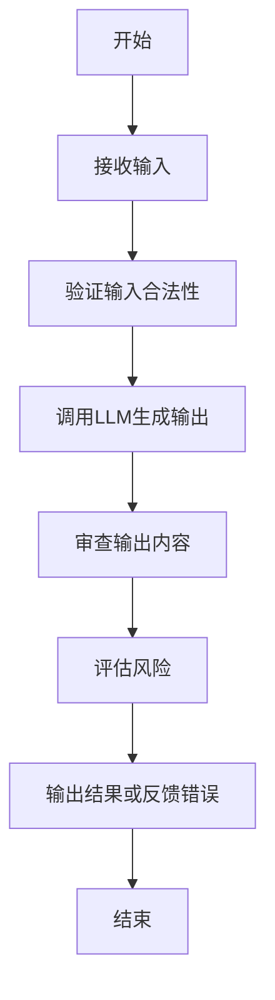
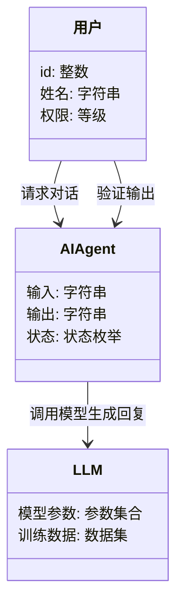
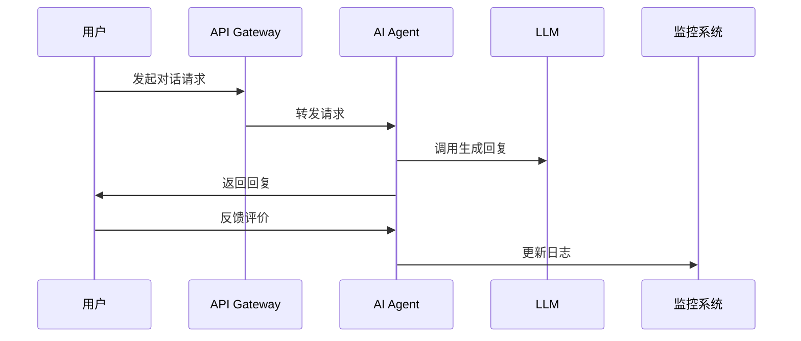

                 


# 构建可信AI Agent：LLM的安全性与可控性设计

## 关键词：可信AI Agent，LLM，安全性，可控性，人工智能，安全设计

## 摘要

随着大语言模型（LLM）的广泛应用，构建可信的AI Agent变得至关重要。本文深入探讨了如何在LLM驱动的AI Agent中确保安全性和可控性，从核心概念到算法原理，再到系统设计和项目实战，全面解析了构建可信AI Agent的关键步骤和最佳实践。

---

## 第一部分：构建可信AI Agent的背景与核心概念

### 第1章：可信AI Agent的背景与问题背景

#### 1.1 问题背景

- **AI Agent的定义与作用**：AI Agent是一种智能实体，能够感知环境并执行任务以实现目标。它通过LLM生成文本、进行推理和决策。
- **LLM在AI Agent中的应用**：LLM为AI Agent提供了强大的自然语言处理能力，使其能够理解和生成人类语言，广泛应用于对话系统、信息检索等领域。
- **可信AI Agent的重要性**：可信性确保AI Agent的行为符合预期，避免错误或恶意输出，保障用户信任和数据安全。

#### 1.2 问题描述

- **LLM的安全性挑战**：LLM可能生成有害或不适当的内容，存在被滥用的风险。
- **LLM的可控性问题**：AI Agent的输出需在特定范围内可控，避免偏离设定目标。
- **可信AI Agent的定义与目标**：可信AI Agent是指在设计和运行中确保输出符合伦理规范、安全要求和用户期望的AI代理。

#### 1.3 问题解决

- **可信性设计原则**：包括输入验证、输出审查、行为监控和反馈机制。
- **安全性与可控性的实现路径**：通过模型微调、输入过滤和输出控制等技术手段实现。
- **可信AI Agent的实现框架**：包括输入处理、模型调用、结果验证和反馈调整四个模块。

### 第2章：可信AI Agent的核心概念与联系

#### 2.1 核心概念原理

- **可信性定义**：AI Agent在运行过程中保持行为符合预期，避免产生有害输出。
- **安全性与可控性关系**：安全性确保AI Agent不会被攻击或滥用，可控性确保其行为在预设范围内。
- **LLM在可信AI Agent中的角色**：LLM是AI Agent的核心驱动力，其输出直接影响可信性。

#### 2.2 核心概念属性对比

| 属性       | 可信性      | 安全性      | 可控性      | 可解释性      |
|------------|-------------|-------------|-------------|-------------|
| 定义       | 输出符合预期 | 防御攻击     | 行为可控     | 输出可理解     |
| 依赖因素   | 模型输出     | 输入过滤     | 系统设计     | 模型结构       |
| 实现方法   | 输出审查     | 对抗训练     | 行为规则     | 解释生成       |

#### 2.3 实体关系图

```mermaid
er
    actor: 用户
    agent: AI Agent
    llm: 大语言模型
    rule: 安全规则
    metric: 可信度指标
    actor --> agent: 请求
    agent --> llm: 调用
    agent --> rule: 验证
    agent --> metric: 计算
```

---

## 第二部分：LLM的安全性与可控性算法原理

### 第3章：LLM的安全性算法原理

#### 3.1 算法原理

- **输入验证与过滤机制**：通过预处理检查输入内容，过滤敏感词和非法请求。
- **输出审查与风险评估**：对生成的输出进行内容检查，评估潜在风险并采取措施。
- **对抗训练的安全性提升**：通过对抗训练使模型更具鲁棒性，减少被攻击的风险。

#### 3.2 算法流程图



#### 3.3 数学模型

- **风险评估模型**：$$ R = \sum_{i=1}^{n} p_i \times r_i $$
  其中，\( p_i \) 是风险 \( i \) 的概率，\( r_i \) 是风险 \( i \) 的影响程度。

---

## 第三部分：系统分析与架构设计

### 第4章：系统分析与架构设计

#### 4.1 问题场景

- **项目介绍**：设计一个企业级对话系统，确保其在客服、咨询等场景中的安全性和可控性。

#### 4.2 系统功能设计

- **领域模型类图**



- **系统架构设计**

```mermaid
graph TD
    用户 --> API Gateway
    API Gateway --> AI Agent
    AI Agent --> LLM
    LLM --> AI Agent
    AI Agent --> 监控系统
    监控系统 --> 日志存储
```

- **系统接口设计**：定义RESTful API接口，包括输入/输出格式、错误处理机制和鉴权方法。
- **系统交互流程图**



---

## 第四部分：项目实战

### 第5章：项目实战

#### 5.1 环境搭建

- **工具与库**：安装Python 3.8+，TensorFlow或PyTorch框架，Hugging Face Transformers库。

#### 5.2 核心代码实现

- **输入验证模块**

```python
def validate_input(input_text):
    # 检查输入长度
    if len(input_text) > 500:
        return False
    # 检查敏感词
    for word in sensitive_words:
        if word in input_text:
            return False
    return True
```

- **输出审查模块**

```python
def review_output(output_text):
    # 使用语言模型检查内容
    score = model.generate_score(output_text)
    if score > threshold:
        return output_text
    else:
        return "抱歉，我无法提供该信息。"
```

#### 5.3 功能模块设计

- **输入处理模块**：接收用户输入，进行合法性验证。
- **模型调用模块**：调用LLM生成输出。
- **结果验证模块**：审查输出内容，评估风险。

#### 5.4 案例分析

- **实际案例分析**：在企业对话系统中，AI Agent通过输入验证阻止了恶意请求，并通过输出审查确保了回复的安全性，有效降低了风险。

---

## 第五部分：总结与展望

### 第6章：总结与展望

#### 6.1 总结

- **文章总结**：构建可信AI Agent需要从算法、系统设计和项目实现多个层面进行综合考虑，确保安全性和可控性。

#### 6.2 注意事项

- **数据隐私**：确保用户数据的安全，避免泄露。
- **模型持续监控**：定期检查模型行为，及时调整安全策略。

#### 6.3 拓展阅读

- **推荐书籍**：《安全人工智能》、《可信AI系统设计》。
- **推荐论文**：相关领域的最新研究成果。

---

## 作者

作者：AI天才研究院/AI Genius Institute  
& 禅与计算机程序设计艺术/Zen And The Art of Computer Programming  

---

通过以上结构和内容，我们详细探讨了如何构建一个可信的AI Agent，确保其在LLM驱动下的安全性和可控性。希望本文能为相关领域的研究和实践提供有价值的参考和指导。

