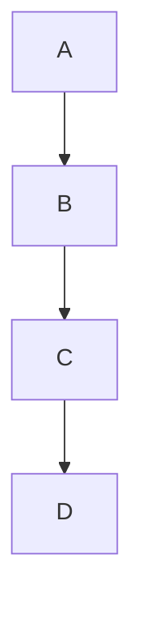
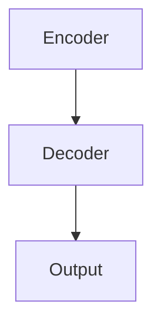
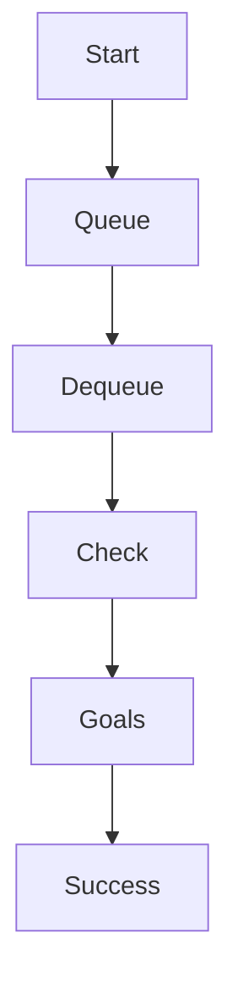
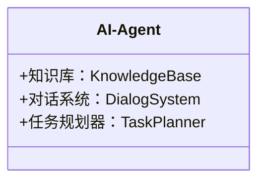
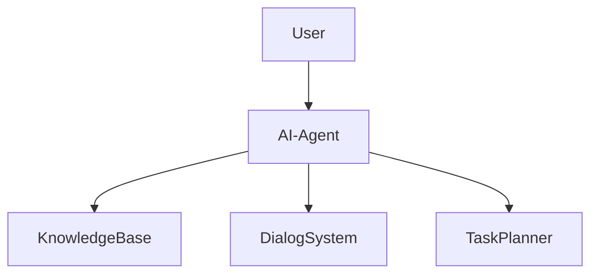
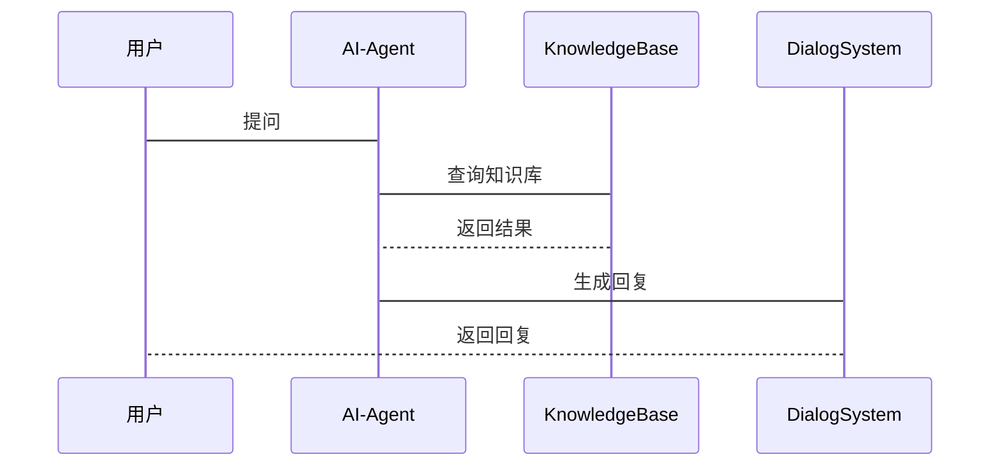

                 


# 《构建可持续发展的AI Agent生态系统》

---

## 关键词：
- AI Agent
- 可持续发展
- 知识图谱
- 对话系统
- 任务规划
- 系统架构
- 人工智能

---

## 摘要：
本文深入探讨了构建可持续发展的AI Agent生态系统的核心概念、算法原理、系统架构和实际应用。通过分析AI Agent的基本概念、知识图谱、对话系统和任务规划，结合数学模型与算法实现，提出了构建可持续AI Agent生态系统的系统设计和项目实战方案。本文适合AI开发者、架构师和对AI生态系统感兴趣的读者阅读，旨在为构建高效、稳定和可持续的AI Agent生态系统提供理论支持和实践指导。

---

# 第一部分: AI Agent生态系统背景与基础

---

## 第1章: AI Agent生态系统概述

### 1.1 AI Agent的基本概念

#### 1.1.1 什么是AI Agent
AI Agent（人工智能代理）是指能够感知环境、自主决策并执行任务的智能实体。它可以是一个软件程序、机器人或其他智能设备，其核心目标是通过与环境交互，完成特定目标或解决问题。

#### 1.1.2 AI Agent的类型与特点
AI Agent可以分为以下几类：
1. **简单反射型Agent**：基于当前输入做出简单反应，适用于规则明确的任务。
2. **基于模型的反射型Agent**：维护环境模型，能够根据模型做出决策。
3. **目标驱动型Agent**：根据目标选择最优行动。
4. **效用驱动型Agent**：通过最大化效用函数来优化决策。
5. **学习型Agent**：通过与环境交互学习，改进自身性能。

**特点对比表**：
| 类型                | 输入处理 | 决策方式 | 知识表示 |
|---------------------|----------|----------|----------|
| 简单反射型Agent     | 单步输入 | 简单规则 | 无复杂模型 |
| 基于模型的反射型Agent | 维护模型  | 基于模型 | 使用知识库 |
| 目标驱动型Agent     | 多步输入 | 最优化    | 基于目标树 |
| 效用驱动型Agent     | 多步输入 | 基于效用  | 基于状态空间 |
| 学习型Agent         | 动态输入 | 增量学习  | 知识图谱 |

#### 1.1.3 AI Agent的核心功能与应用场景
AI Agent的核心功能包括：
1. **感知环境**：通过传感器或数据输入感知外部环境。
2. **知识表示**：将环境信息表示为结构化的知识。
3. **决策推理**：基于知识和目标做出决策。
4. **执行动作**：根据决策执行实际操作。

应用场景：
1. **智能助手**：如Siri、Alexa等。
2. **自动驾驶**：如特斯拉、Waymo的自动驾驶系统。
3. **智能客服**：基于自然语言处理的客服机器人。
4. **智能推荐**：如Netflix、Amazon的个性化推荐系统。

---

### 1.2 可持续发展与AI Agent的关系

#### 1.2.1 可持续发展的定义与目标
可持续发展是指在满足当前需求的同时，不损害后代满足其需求的能力。其核心目标是实现经济、社会和环境的协调发展。

#### 1.2.2 AI Agent在可持续发展中的作用
AI Agent可以通过优化资源分配、提高效率、减少浪费等方式支持可持续发展。例如：
1. **能源管理**：智能调节设备能耗，降低能源浪费。
2. **环境保护**：监控环境数据，预测污染趋势。
3. **资源优化**：优化供应链管理，减少资源浪费。

#### 1.2.3 构建可持续AI Agent生态系统的必要性
随着AI Agent的应用越来越广泛，构建可持续的生态系统至关重要。这不仅能够提高系统的稳定性和可靠性，还能降低环境和资源消耗，推动社会的可持续发展。

---

### 1.3 本章小结
本章介绍了AI Agent的基本概念、类型和应用场景，并探讨了AI Agent在可持续发展中的作用和构建可持续生态系统的必要性。

---

## 第2章: AI Agent生态系统的核心概念

### 2.1 知识图谱与AI Agent

#### 2.1.1 知识图谱的定义与构建
知识图谱是一种结构化的知识表示方式，由实体（概念）和关系组成。构建知识图谱的过程包括数据采集、实体识别、关系抽取和知识融合。

#### 2.1.2 知识图谱在AI Agent中的应用
知识图谱为AI Agent提供了丰富的背景知识，支持其进行语义理解、推理和决策。

**示例**：在智能客服中，知识图谱可以用于理解客户问题并提供准确的答案。

#### 2.1.3 知识图谱的更新与维护
知识图谱需要定期更新，以保持其准确性和完整性。更新过程包括数据清洗、知识推理和冲突解决。

---

### 2.2 对话系统与AI Agent

#### 2.2.1 对话系统的定义与分类
对话系统是指能够与人类进行自然语言交互的系统。根据实现方式，可以分为基于规则的对话系统和基于深度学习的对话系统。

#### 2.2.2 基于深度学习的对话模型
基于Transformer的对话模型（如GPT）通过自注意力机制捕捉上下文信息，生成连贯的对话响应。

**公式示例**：
$$
\text{输出概率} = \text{softmax}(QK^T/V)
$$

#### 2.2.3 对话系统的优化与提升
对话系统的优化包括改进模型结构、引入领域知识和增强反馈机制。

---

### 2.3 任务规划与AI Agent

#### 2.3.1 任务规划的定义与方法
任务规划是指根据目标生成一系列动作以实现目标的过程。常用方法包括宽度优先搜索（BFS）和A*算法。

#### 2.3.2 基于AI的自动化任务规划
基于强化学习的任务规划方法通过试错学习优化决策路径。

#### 2.3.3 任务规划的挑战与解决方案
任务规划的挑战包括环境不确定性、动态变化和计算复杂度。解决方案包括增量式规划和在线优化。

---

### 2.4 本章小结
本章探讨了知识图谱、对话系统和任务规划在AI Agent中的核心作用，并分析了它们的实现方法和优化策略。

---

## 第3章: AI Agent生态系统的核心算法原理

### 3.1 知识表示与推理算法

#### 3.1.1 知识表示的数学模型
知识表示可以采用图论中的节点和边表示实体及其关系。

**公式示例**：
$$
\text{节点} = \{n_1, n_2, ..., n_k\}
$$
$$
\text{边} = \{e_1, e_2, ..., e_m\}
$$

#### 3.1.2 基于图的推理算法
基于图的推理算法通过遍历知识图谱进行路径搜索，实现知识推理。

**流程图示例**：


#### 3.1.3 知识推理的优化方法
知识推理的优化包括剪枝、缓存和分布式计算。

---

### 3.2 对话生成算法

#### 3.2.1 基于生成模型的对话生成
基于生成模型的对话生成通过编码器-解码器结构生成回复。

**流程图示例**：


#### 3.2.2 基于检索模型的对话生成
基于检索模型的对话生成通过匹配数据库中的相似对话生成回复。

**公式示例**：
$$
\text{相似度} = \text{cos}(\text{向量}_1, \text{向量}_2)
$$

#### 3.2.3 对话生成的评估与优化
对话生成的评估指标包括BLEU、ROUGE和人类评价。优化方法包括增强训练数据和改进模型结构。

---

### 3.3 任务规划算法

#### 3.3.1 基于状态空间搜索的任务规划
基于状态空间搜索的任务规划方法包括广度优先搜索（BFS）和深度优先搜索（DFS）。

**流程图示例**：


#### 3.3.2 基于强化学习的任务规划
基于强化学习的任务规划通过试错学习优化决策路径。

**公式示例**：
$$
\text{奖励} = r(s, a)
$$

#### 3.3.3 任务规划的复杂度分析
任务规划的复杂度与状态空间和动作空间的大小有关，通常采用启发式搜索（如A*算法）降低复杂度。

---

### 3.4 本章小结
本章详细介绍了知识表示与推理、对话生成和任务规划的核心算法原理，并通过流程图和公式展示了其实现方法。

---

## 第4章: AI Agent生态系统中的数学模型与公式

### 4.1 知识图谱的表示模型

#### 4.1.1 图论基础与知识图谱的表示
知识图谱可以用图论中的图表示，节点表示实体，边表示关系。

**公式示例**：
$$
G = (V, E)
$$
其中，$V$ 是节点集合，$E$ 是边集合。

#### 4.1.2 知识图谱的表示学习
知识图谱的表示学习通过嵌入方法将实体和关系映射到低维空间。

**公式示例**：
$$
\text{嵌入} = \text{lookup}(e)
$$

#### 4.1.3 知识图谱的嵌入表示公式
知识图谱的嵌入表示可以通过TransE、TransH等模型实现。

**公式示例**：
$$
\text{TransE}：\ r(u, v) \rightarrow u + r = v
$$

---

### 4.2 对话系统的数学模型

#### 4.2.1 基于Transformer的对话模型公式
基于Transformer的对话模型通过自注意力机制生成回复。

**公式示例**：
$$
\text{输出} = \text{multi-head}(Q, K, V)
$$

#### 4.2.2 对话生成的概率分布模型
对话生成的概率分布模型通过交叉熵损失函数优化生成概率。

**公式示例**：
$$
\text{损失} = -\sum_{i=1}^{n} \log P(y_i)
$$

#### 4.2.3 对话系统的损失函数与优化公式
对话系统的损失函数通常采用交叉熵损失，并使用Adam优化器进行优化。

**公式示例**：
$$
\text{Adam} = \alpha \frac{\partial L}{\partial \theta}
$$

---

### 4.3 任务规划的数学模型

#### 4.3.1 状态空间与动作空间的定义
状态空间和动作空间的定义是任务规划的基础。

**公式示例**：
$$
S = \{s_1, s_2, ..., s_n\}
$$
$$
A = \{a_1, a_2, ..., a_m\}
$$

#### 4.3.2 基于马尔可夫决策过程的任务规划模型
基于马尔可夫决策过程的任务规划模型通过状态转移概率进行决策。

**公式示例**：
$$
\pi(a|s) = P(a|s)
$$

#### 4.3.3 增量式任务规划的数学表达
增量式任务规划通过逐步优化当前状态下的决策。

**公式示例**：
$$
\text{新状态} = f(\text{当前状态}, \text{动作})
$$

---

### 4.4 本章小结
本章通过数学公式详细讲解了知识图谱、对话系统和任务规划的核心模型，为后续章节的系统设计和项目实现奠定了理论基础。

---

## 第5章: AI Agent生态系统中的系统分析与架构设计

### 5.1 系统分析

#### 5.1.1 问题场景介绍
在构建AI Agent生态系统时，需要考虑系统的可扩展性、可靠性和安全性。

#### 5.1.2 系统功能设计
AI Agent生态系统的核心功能包括知识管理、对话交互和任务执行。

**领域模型类图示例**：


---

### 5.2 系统架构设计

#### 5.2.1 系统架构设计
AI Agent生态系统的架构设计包括数据层、业务逻辑层和应用层。

**架构图示例**：


#### 5.2.2 系统接口设计
系统接口设计需要考虑API的调用方式和数据格式。

#### 5.2.3 系统交互设计
系统交互设计通过序列图展示用户与AI Agent的交互流程。

**序列图示例**：


---

## 第6章: AI Agent生态系统中的项目实战

### 6.1 环境安装与配置

#### 6.1.1 环境需求
需要安装Python、TensorFlow、Keras和相关库。

#### 6.1.2 环境配置
配置虚拟环境并安装依赖包。

---

### 6.2 核心代码实现

#### 6.2.1 知识图谱的构建与存储
使用图数据库（如Neo4j）存储知识图谱。

**代码示例**：
```python
# 知识图谱构建代码
from neo4j import GraphDatabase

def add_node(tx, label, properties):
    tx.run("CREATE (:{} {{}})".format(label), properties)

# 连接数据库
driver = GraphDatabase.driver("bolt://localhost:7687", auth=("user", "password"))
with driver.session() as session:
    session.write_transaction(add_node, "Person", {"name": "Alice"})
```

#### 6.2.2 对话系统的实现
基于Keras构建对话模型。

**代码示例**：
```python
# 对话模型实现代码
import tensorflow as tf
from tensorflow.keras import layers

model = tf.keras.Sequential([
    layers.Embedding(input_dim= vocabulary_size, output_dim= embedding_dim),
    layers.LSTM(64),
    layers.Dense( vocabulary_size, activation='softmax')
])
```

#### 6.2.3 任务规划的实现
基于A*算法实现任务规划。

**代码示例**：
```python
# A*算法实现代码
import heapq

def a_star(start, goal, heuristic):
    open_set = set([start])
    came_from = {}
    g_score = {start: 0}
    f_score = {start: heuristic(start, goal)}
    
    while open_set:
        current = heapq.heappop(open_set, key=lambda x: f_score[x])
        if current == goal:
            break
        for neighbor in current.neighbors:
            tentative_g_score = g_score[current] + current.cost_to(neighbor)
            if neighbor not in g_score or tentative_g_score < g_score[neighbor]:
                came_from[neighbor] = current
                g_score[neighbor] = tentative_g_score
                f_score[neighbor] = g_score[neighbor] + heuristic(neighbor, goal)
                heapq.heappush(open_set, neighbor)
    return came_from, g_score
```

---

### 6.3 实际案例分析

#### 6.3.1 案例背景
以智能客服系统为例，展示AI Agent的应用场景。

#### 6.3.2 案例实现
实现一个简单的智能客服对话系统。

---

## 第7章: 总结与展望

### 7.1 总结
本文详细探讨了构建可持续发展的AI Agent生态系统的核心概念、算法原理、系统架构和实际应用。通过理论与实践的结合，为读者提供了全面的指导。

### 7.2 展望
未来的研究方向包括更高效的对话生成算法、更智能的任务规划方法以及更可持续的系统架构设计。

---

## 作者：AI天才研究院/AI Genius Institute & 禅与计算机程序设计艺术 /Zen And The Art of Computer Programming

---

**本文是对《构建可持续发展的AI Agent生态系统》的详细目录和内容规划，具体内容将根据上述大纲逐步展开，确保每一部分都详细讲解并提供实际案例和代码示例，帮助读者全面理解和掌握构建可持续发展的AI Agent生态系统的方法。**

