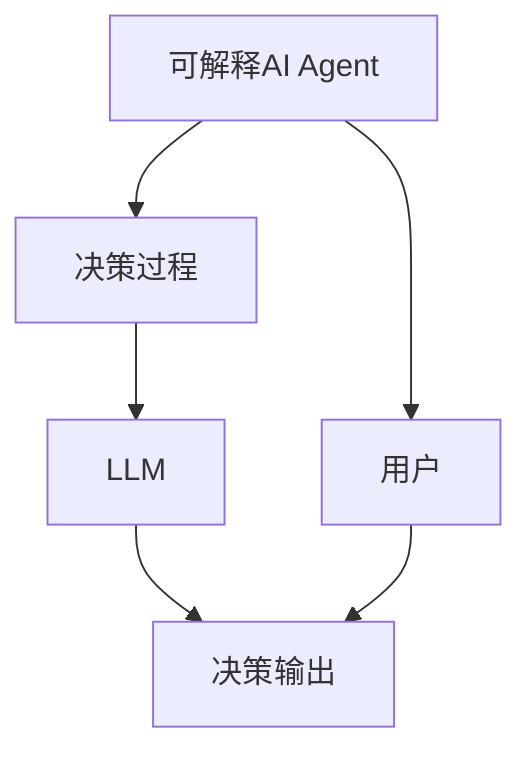

                 


# 《构建可解释AI Agent：LLM决策过程的透明化设计》

> 关键词：可解释AI Agent，LLM，决策过程，透明化设计，人工智能，可解释性

> 摘要：  
随着人工智能技术的快速发展，构建可解释的AI Agent已成为学术界和工业界的重要研究方向。本文深入探讨了如何设计和实现可解释的AI Agent，特别是针对大型语言模型（LLM）的决策过程进行透明化设计。文章从背景介绍、核心概念、算法原理、系统架构到项目实战，全面分析了构建可解释AI Agent的关键技术，并提供了详细的实现方案和案例分析。

---

## 第一章：可解释AI Agent的背景与问题背景

### 1.1 问题背景

#### 1.1.1 当前AI Agent的发展现状
AI Agent（人工智能代理）作为一种能够感知环境、自主决策并执行任务的智能体，近年来得到了广泛的应用。然而，随着模型复杂度的增加，尤其是基于LLM的AI Agent，其决策过程往往变得不透明，导致用户和开发者难以理解和信任这些系统。

#### 1.1.2 可解释性在AI Agent中的重要性
可解释性是用户信任AI系统的关键因素。特别是在医疗、金融等领域，决策过程的透明性直接关系到系统的可靠性和合规性。不可解释的AI Agent可能引发责任归属不清、用户不信任等问题。

#### 1.1.3 LLM决策过程的透明化需求
LLM（Large Language Model）虽然在自然语言处理任务中表现出色，但其决策过程往往被视为“黑箱”。为了提高系统的可解释性，需要对LLM的内部决策机制进行透明化设计，使其能够清晰地解释每一步决策的依据。

### 1.2 问题描述

#### 1.2.1 AI Agent决策过程的不透明性
传统的AI Agent通常依赖预定义的规则或复杂的机器学习模型，其决策逻辑难以被非专家理解。这种不透明性限制了其在需要高度信任和责任的领域中的应用。

#### 1.2.2 LLM在决策过程中的黑箱问题
LLM通过大量的参数调整和非线性变换生成输出，其决策过程难以被分解和解释。这种黑箱特性使得开发者和用户难以理解模型的决策逻辑。

#### 1.2.3 可解释性对用户信任和责任归属的影响
缺乏可解释性的AI系统可能导致用户不信任，甚至在出现问题时无法确定责任归属。因此，构建可解释的AI Agent对于系统的实际应用至关重要。

### 1.3 问题解决与边界

#### 1.3.1 可解释AI Agent的目标与范围
可解释AI Agent的目标是通过设计使得其决策过程能够被用户和开发者理解和信任。透明化设计是实现这一目标的核心手段。

#### 1.3.2 透明化设计的核心要素
透明化设计需要关注模型的输入、处理过程、输出结果以及决策依据的可解释性。这些要素共同构成了可解释AI Agent的核心框架。

#### 1.3.3 可解释性与不可解释性的边界与权衡
在实际应用中，完全的可解释性可能与模型的复杂性和性能存在冲突。因此，需要在可解释性和性能之间找到平衡点。

### 1.4 概念结构与核心要素

#### 1.4.1 可解释AI Agent的定义与组成
可解释AI Agent是一种能够清晰解释其决策过程的智能体，通常由感知模块、推理模块、决策模块和解释模块组成。

#### 1.4.2 LLM决策过程的透明化设计框架
透明化设计框架包括输入处理、模型推理、输出解释和用户反馈四个阶段，确保每一步的决策过程都可被追踪和解释。

#### 1.4.3 核心要素的对比分析
通过对比分析不同AI模型的可解释性，可以找到适合特定应用场景的最佳解决方案。

---

## 第二章：可解释AI Agent的核心概念与联系

### 2.1 可解释AI Agent的核心概念

#### 2.1.1 可解释性与透明化设计的定义
可解释性是指系统能够清晰地说明其决策过程和结果的能力。透明化设计则是通过公开模型的内部机制来实现可解释性。

#### 2.1.2 LLM决策过程的可解释性特征
LLM的可解释性主要体现在输入与输出的关系、模型的注意力机制以及决策的逻辑推理过程。

#### 2.1.3 可解释性与模型复杂性的关系
模型的复杂性越高，通常可解释性越低。因此，需要在模型复杂性和可解释性之间找到平衡点。

### 2.2 核心概念的对比分析

#### 2.2.1 不同AI模型的可解释性对比
通过对比分析传统规则引擎、基于树模型的AI Agent和基于LLM的AI Agent的可解释性，可以找到适合特定场景的最佳方案。

#### 2.2.2 LLM与传统规则引擎的对比
LLM的优势在于其强大的泛化能力和灵活性，但其可解释性较差。传统规则引擎则具有较高的可解释性，但灵活性较低。

#### 2.2.3 可解释性与实时性的权衡
在某些应用场景中，实时性要求较高，可能需要在可解释性和实时性之间进行权衡。

### 2.3 实体关系图



---

## 第三章：可解释AI Agent的算法原理

### 3.1 LLM的决策机制分析

#### 3.1.1 注意力机制的解释
注意力机制通过权重分配来决定输入中哪些部分对当前决策更重要。这种机制可以通过可视化和分解来解释。

#### 3.1.2 解码过程的透明化
解码过程可以通过记录每一步的生成结果和概率分布来实现透明化。

### 3.2 透明化设计的算法流程

#### 3.2.1 输入处理与特征提取
通过记录输入数据的特征和处理流程，确保每一步的输入都能够被追踪和解释。

#### 3.2.2 模型推理与决策过程
通过记录模型的推理过程和中间结果，实现决策过程的透明化。

#### 3.2.3 输出解释与结果反馈
通过生成解释性的描述和可视化结果，帮助用户理解模型的决策过程。

---

## 第四章：可解释AI Agent的数学模型与公式

### 4.1 LLM的数学模型

#### 4.1.1 Transformer模型的结构
$$ \text{Transformer} = \text{编码器} + \text{解码器} $$

#### 4.1.2 注意力机制的公式
$$ \text{注意力权重} = \text{查询} \cdot \text{键}^T $$

### 4.2 可解释性模型的设计

#### 4.2.1 解释性模型的数学公式
$$ \text{解释性模型} = f(\text{输入}, \text{权重}) $$

#### 4.2.2 解释性模型的实现
通过线性回归或树模型等简单模型来解释复杂的LLM决策过程。

---

## 第五章：可解释AI Agent的系统架构设计

### 5.1 系统功能设计

#### 5.1.1 输入处理模块
负责接收输入数据并进行预处理。

#### 5.1.2 模型推理模块
负责调用LLM进行决策，并记录推理过程。

#### 5.1.3 输出解释模块
负责生成解释性的描述和可视化结果。

### 5.2 系统架构设计

#### 5.2.1 分层架构
将系统划分为输入处理层、模型推理层和输出解释层。

#### 5.2.2 组件之间的交互流程
通过定义明确的接口和交互流程，确保系统各部分协同工作。

---

## 第六章：可解释AI Agent的项目实战

### 6.1 项目环境与工具安装

#### 6.1.1 安装Python和相关库
需要安装`transformers`、`numpy`等库。

#### 6.1.2 安装IDE和开发工具
推荐使用PyCharm或VS Code进行开发。

### 6.2 项目核心实现

#### 6.2.1 输入处理代码
```python
def process_input(input_text):
    # 输入预处理
    return preprocessed_input
```

#### 6.2.2 模型推理代码
```python
def model_inference(model, input_text):
    # 调用LLM进行推理
    return output, attention_weights
```

#### 6.2.3 输出解释代码
```python
def generate_explanation(output, attention_weights):
    # 生成解释性描述
    return explanation
```

### 6.3 项目实战案例

#### 6.3.1 案例分析
通过具体案例分析，展示可解释AI Agent的实际应用。

#### 6.3.2 项目总结
总结项目实现过程中的经验教训和优化方向。

---

## 第七章：可解释AI Agent的最佳实践与总结

### 7.1 设计原则

#### 7.1.1 简洁性与可解释性的结合
在保证系统性能的同时，尽量简化模型结构，提高可解释性。

#### 7.1.2 用户友好的可视化设计
通过直观的可视化工具，帮助用户更好地理解模型的决策过程。

### 7.2 小结

#### 7.2.1 可解释AI Agent的重要性
可解释性是AI系统信任和应用的关键因素。

#### 7.2.2 透明化设计的核心作用
透明化设计能够帮助用户和开发者理解模型的决策过程。

### 7.3 注意事项

#### 7.3.1 避免过度简化
虽然简化模型可以提高可解释性，但可能会影响系统的性能和泛化能力。

#### 7.3.2 关注实际应用场景
在设计可解释AI Agent时，需要结合具体的应用场景和需求。

### 7.4 拓展阅读

#### 7.4.1 可解释AI的最新研究
推荐阅读相关领域的最新论文和研究报告。

#### 7.4.2 开源项目与工具
推荐关注一些优秀的开源项目和工具，例如`Hugging Face`的可解释性工具。

---

## 作者：AI天才研究院/AI Genius Institute & 禅与计算机程序设计艺术 /Zen And The Art of Computer Programming

