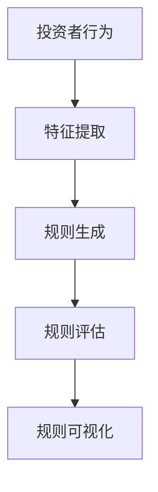
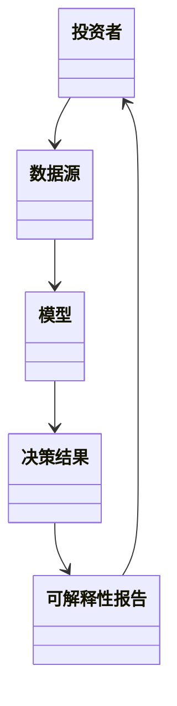
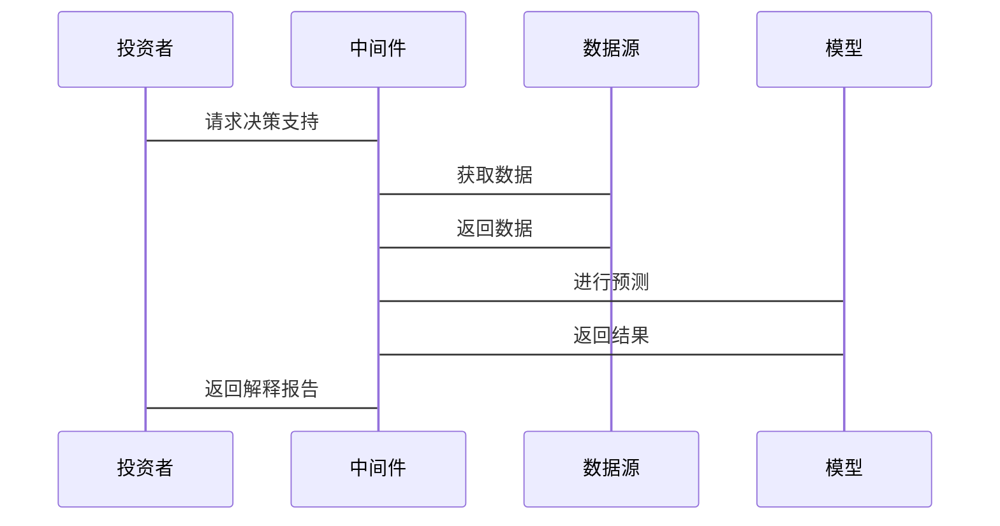
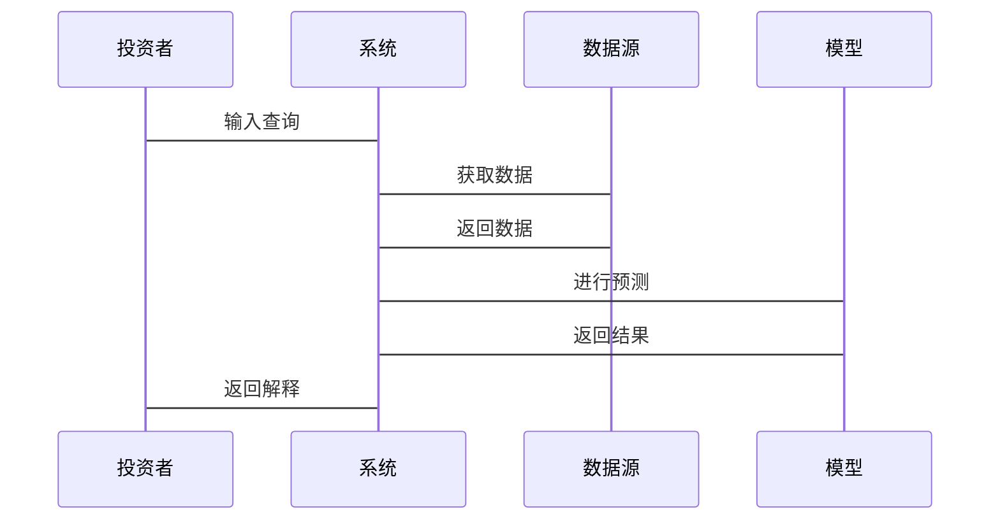

                 


# 构建可解释的AI投资决策支持系统

## 关键词：可解释性AI, 投资决策, 机器学习, SHAP值, LIME解释, 系统架构设计

## 摘要：本文详细探讨了如何构建一个可解释的AI投资决策支持系统，从背景、核心概念、算法原理、系统架构设计到项目实战，全面解析了系统的构建过程。通过SHAP值和LIME解释等方法，展示了如何实现投资决策的可解释性，并提供了实际案例和代码实现。

---

## 第一部分：可解释性AI与投资决策支持系统背景

## 第1章：可解释性AI与投资决策支持系统概述

### 1.1 问题背景与挑战

#### 1.1.1 投资决策的复杂性与不确定性

投资决策涉及复杂的市场因素和个体行为，传统方法难以捕捉所有变量。AI通过数据挖掘和模式识别，提供更精准的预测和决策支持。

#### 1.1.2 AI在投资决策中的优势与局限性

AI的优势在于快速处理大量数据和模式识别，但其“黑箱”特性使决策缺乏透明性，难以获得监管机构和用户的信任。

#### 1.1.3 可解释性AI的需求与重要性

可解释性AI是投资决策系统的关键，确保决策过程透明，符合监管要求，并增强用户信任。

### 1.2 可解释性AI的核心概念

#### 1.2.1 可解释性AI的定义与特征

可解释性AI是指AI系统能够以人类可理解的方式解释其决策过程。特征包括透明性、可追溯性、可验证性和用户友好性。

#### 1.2.2 投资决策支持系统的功能与目标

功能包括数据处理、模型构建、决策生成和解释展示。目标是提供透明、可靠的决策支持，帮助投资者做出明智决策。

#### 1.2.3 系统的边界与外延

系统边界包括数据来源、模型范围和用户界面。外延涉及数据源扩展、模型优化和用户交互设计。

## 第2章：可解释性AI的核心概念与联系

### 2.1 核心概念原理

可解释性AI通过规则和模型解释方法，将复杂的决策过程转化为可理解的形式。投资决策支持系统通过功能模块实现数据处理、模型构建和结果展示。

### 2.2 核心概念属性特征对比

| 特征       | 可解释性AI                 | 投资决策支持系统          |
|------------|---------------------------|--------------------------|
| 数据来源   | 结构化和非结构化数据       | 金融市场数据、历史数据     |
| 模型类型   | 解释性模型（如线性回归）   | 预测模型（如随机森林）    |
| 解释方式   | 局部和全局解释             | 针对性解释和整体报告       |

### 2.3 ER实体关系图

```mermaid
erDiagram
    actor 投资者
    actor 系统管理员
    actor 数据源提供者
    class 投资者行为
    class 市场数据
    class 模型
    class 决策结果
    class 可解释性报告
    投资者 --> 投资者行为
    系统管理员 --> 模型
    数据源提供者 --> 市场数据
    模型 --> 决策结果
    决策结果 --> 可解释性报告
    可解释性报告 --> 投资者
```

## 第3章：投资决策支持系统的算法原理

### 3.1 基于规则的解释方法

#### 3.1.1 规则生成与应用

通过决策树生成规则，解释投资决策。例如，若某股票的市盈率低于行业平均值，则建议买入。

#### 3.1.2 规则评估与优化

评估规则的准确性和覆盖范围，优化规则以提高解释性和预测精度。

#### 3.1.3 规则解释的可视化

使用树状图或表格展示规则，帮助用户理解决策过程。

### 3.2 基于模型的解释方法

#### 3.2.1 SHAP值计算

SHAP值衡量每个特征对预测结果的影响。例如，计算某股票预测结果中各特征的SHAP值。

#### 3.2.2 LIME解释方法

LIME通过局部近似生成可解释的规则。例如，解释某次股票预测时，生成局部规则说明。

#### 3.2.3 整体模型的可解释性评估

评估模型整体的可解释性，确保决策过程透明。

### 3.3 算法流程图

#### 3.3.1 基于规则的解释流程



### 3.4 数学模型与公式

#### 3.4.1 SHAP值公式

$$ SHAP_{i,j} = f_{i}(x) - f_{i}(x_{base}) $$

#### 3.4.2 LIME解释公式

$$ \theta = \arg \min_{\theta} \sum_{i} w_{i}(x) (y_{i} - \text{predict}(x_{i}, \theta))^{2} $$

---

## 第4章：投资决策支持系统的系统架构设计

### 4.1 问题场景介绍

设计一个投资决策支持系统，帮助投资者做出基于AI的决策，同时保证决策过程可解释。

### 4.2 项目介绍

开发一个可解释的AI投资决策支持系统，支持用户理解AI决策过程。

### 4.3 系统功能设计

#### 4.3.1 领域模型



### 4.4 系统架构设计

#### 4.4.1 系统架构图

```mermaid
archiecture
    client --> 中间件
    中间件 --> 数据源
    中间件 --> 模型
    模型 --> 决策结果
    决策结果 --> 可解释性报告
    可解释性报告 --> 中间件
    中间件 --> 客户端
```

### 4.5 系统接口设计

#### 4.5.1 API接口

提供RESTful API，供投资者调用决策支持服务。

#### 4.5.2 接口交互流程



### 4.6 系统交互设计

#### 4.6.1 交互流程图



---

## 第5章：项目实战

### 5.1 环境安装

#### 5.1.1 安装Python和依赖库

安装Python 3.x，使用pip安装numpy、pandas、scikit-learn、shap和lime。

### 5.2 系统核心实现源代码

#### 5.2.1 数据预处理

```python
import pandas as pd

data = pd.read_csv('stock_data.csv')
data = data.dropna()
```

#### 5.2.2 模型训练

```python
from sklearn.ensemble import RandomForestRegressor
model = RandomForestRegressor()
model.fit(X_train, y_train)
```

#### 5.2.3 SHAP值计算

```python
import shap

explainer = shap.TreeExplainer(model)
shap_values = explainer.shap_values(X_test)
```

#### 5.2.4 LIME解释

```python
from lime.lime_regression import LimeRegressor

lime = LimeRegressor(model.predict)
explanation = lime.explain_instance(X_test[0], model.predict)
```

### 5.3 代码应用解读与分析

通过SHAP和LIME，解释模型对某次股票预测的决策过程。

### 5.4 实际案例分析和详细讲解剖析

分析一个实际案例，展示如何通过SHAP和LIME解释模型决策。

### 5.5 项目小结

总结项目实现过程中的关键点和经验。

---

## 第6章：最佳实践与注意事项

### 6.1 小结

可解释性AI是投资决策支持系统的重要组成部分，确保决策透明和用户信任。

### 6.2 注意事项

- 数据质量和模型选择直接影响解释性。
- 确保系统可扩展性和可维护性。
- 定期更新模型和解释方法，以适应市场变化。

### 6.3 扩展阅读

建议阅读相关书籍和论文，深入理解可解释性AI和投资决策支持系统的最新进展。

---

## 作者：AI天才研究院 & 禅与计算机程序设计艺术

