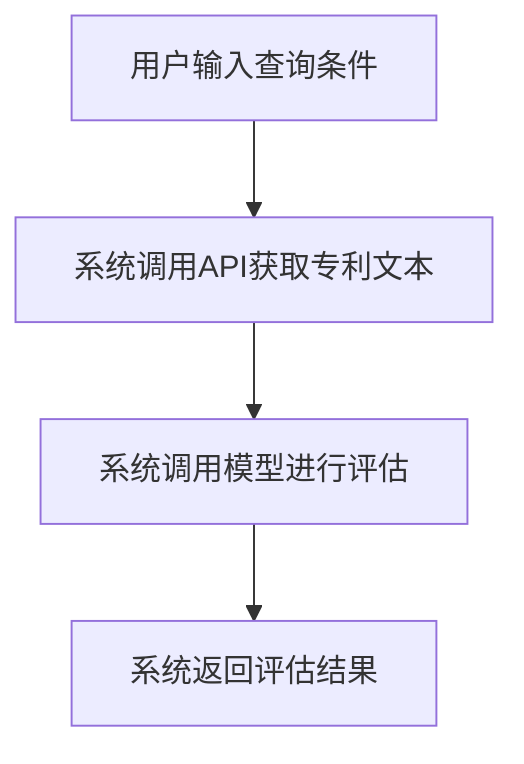

                 


# 构建基于NLP的金融专利价值动态评估系统

> 关键词：NLP、专利价值评估、金融专利、自然语言处理、机器学习、文本挖掘

> 摘要：本文详细介绍了如何构建一个基于自然语言处理（NLP）的金融专利价值动态评估系统。文章首先分析了传统专利价值评估方法的局限性，然后探讨了NLP技术在金融专利文本分析中的应用。接着，详细讲解了系统的架构设计、核心算法实现以及实际项目案例。最后，总结了该系统的优点及未来的发展方向。

---

## 第一章：金融专利价值评估的背景与挑战

### 1.1 什么是金融专利
金融专利是指与金融行业相关的专利，涉及金融产品、服务、交易技术等领域。这些专利通常描述了创新的金融工具、算法或系统。

#### 1.1.1 金融专利的定义
金融专利是保护金融领域创新技术的法律文件，涵盖支付系统、风险管理模型、算法交易等。

#### 1.1.2 金融专利的特点
- **专业性**：涉及复杂的金融理论和数学模型。
- **技术性**：依赖于算法、数据分析等技术手段。
- **法律性**：需要符合专利法的相关规定。

#### 1.1.3 金融专利的重要性
金融专利是金融机构保护创新、提升竞争力的重要手段。

### 1.2 专利价值评估的意义
专利价值评估是对专利的市场价值、技术价值和法律价值的综合评估。

#### 1.2.1 专利价值的定义
专利价值是专利在市场中的潜在收益和法律保护的综合体现。

#### 1.2.2 专利价值评估的方法
传统方法包括专家评估、市场比较法等，但存在主观性强、效率低的问题。

#### 1.2.3 专利价值评估的意义
准确的专利价值评估有助于企业制定合理的知识产权战略。

### 1.3 传统专利价值评估的局限性
- **主观性**：依赖专家经验，结果可能存在偏差。
- **效率低**：手工评估耗时长，难以处理大量专利数据。
- **缺乏动态性**：无法实时跟踪专利价值的变化。

### 1.4 基于NLP的金融专利价值评估的优势
- **自动化**：利用NLP技术自动分析专利文本，提高效率。
- **客观性**：通过数据驱动的方法减少人为干扰。
- **动态性**：实时更新专利数据，动态评估价值。

---

## 第二章：NLP在金融专利分析中的应用

### 2.1 NLP技术简介
自然语言处理（NLP）是人工智能领域的重要分支，用于处理和分析人类语言。

#### 2.1.1 NLP的核心任务
- **文本分类**：将文本归类到特定类别。
- **实体识别**：识别文本中的命名实体。
- **文本摘要**：生成文本的简要总结。
- **情感分析**：分析文本中的情感倾向。

#### 2.1.2 NLP的关键技术
- **词袋模型**：将文本表示为词的集合。
- **词嵌入**：通过深度学习生成词向量。
- **序列模型**：如LSTM和Transformer，用于处理序列数据。

### 2.2 金融专利文本的结构化与非结构化特点
#### 2.2.1 专利申请文本的结构
- 标题
- 发明人
- 申请人
- 技术领域
- 权利要求
- 说明书

#### 2.2.2 金融专利文本的复杂性
- 专业术语多
- 技术细节复杂
- 文本结构多样化

#### 2.2.3 金融专利数据的获取渠道
- 专利数据库（如USPTO、WIPO）
- 专业法律平台

### 2.3 NLP在金融专利分析中的应用
#### 2.3.1 文本预处理
- 分词
- 去停用词
- 词干提取

#### 2.3.2 关键词提取
- TF-IDF
- 主题模型（如LDA）

#### 2.3.3 情感分析
- 判断专利文本的技术价值和市场潜力

---

## 第三章：基于NLP的金融专利价值评估系统架构

### 3.1 系统功能模块
- **数据采集模块**：从专利数据库获取专利文本。
- **文本预处理模块**：清洗和标准化文本数据。
- **特征提取模块**：提取文本特征，如关键词、主题。
- **模型训练模块**：训练NLP模型，评估专利价值。
- **结果展示模块**：可视化评估结果。

#### 3.1.1 数据采集模块
使用API从专利数据库获取专利文本，并存储到数据库中。

#### 3.1.2 文本预处理模块
对专利文本进行分词、去停用词等处理，生成标准化文本。

#### 3.1.3 特征提取模块
使用TF-IDF提取关键词，或使用LDA进行主题建模。

#### 3.1.4 模型训练模块
训练机器学习模型（如SVM、随机森林）进行专利价值预测。

#### 3.1.5 结果展示模块
将评估结果以图表形式展示，方便用户查看。

### 3.2 系统架构设计
- **前端界面**：用户输入查询条件，显示评估结果。
- **后端逻辑**：处理用户请求，调用模型进行评估。
- **数据库**：存储专利文本和评估结果。

#### 3.2.1 前端界面设计
采用React框架，提供用户友好的交互界面。

#### 3.2.2 后端逻辑设计
使用Python的Flask框架，处理API请求。

#### 3.2.3 数据库设计
使用MySQL存储专利数据和评估结果。

### 3.3 系统接口设计
- **API接口**：提供RESTful接口，供前端调用。
- **接口文档**：详细说明接口的输入输出。

#### 3.3.1 API接口设计
- `/api/patent/search`：查询专利信息。
- `/api/patent/evaluate`：评估专利价值。

#### 3.3.2 接口文档
使用Swagger生成接口文档，方便开发者调用。

### 3.4 系统交互流程
- 用户输入查询条件。
- 系统调用API获取专利文本。
- 系统调用模型进行评估。
- 系统返回评估结果。

#### 3.4.1 交互流程图
使用Mermaid绘制系统交互流程图。



---

## 第四章：系统实现与算法原理

### 4.1 算法选择与实现
- 使用TF-IDF提取关键词。
- 使用LSTM进行情感分析。
- 使用随机森林进行价值预测。

#### 4.1.1 TF-IDF实现
- 计算每个关键词的TF-IDF值，筛选出重要关键词。

#### 4.1.2 LSTM实现
- 使用Keras框架搭建LSTM模型，进行文本分类。

#### 4.1.3 随机森林实现
- 使用Scikit-learn训练随机森林模型，预测专利价值。

### 4.2 算法原理
- **TF-IDF**：衡量关键词的重要性。
- **LSTM**：处理序列数据，捕捉文本情感。
- **随机森林**：基于特征的投票机制进行分类。

#### 4.2.1 TF-IDF公式
$$ TF-IDF(t, d) = \frac{1}{(1 + \sum_{d' \in D} TF(t, d'))} \times TF(t, d) $$

#### 4.2.2 LSTM结构
- 输入层：处理文本序列。
- LSTM层：捕捉长序列信息。
- 全连接层：输出分类结果。

#### 4.2.3 随机森林分类
- 特征选择：基于TF-IDF提取关键词。
- 模型训练：使用随机森林进行分类。

### 4.3 算法实现代码
```python
from sklearn.feature_extraction.text import TfidfVectorizer
from sklearn.ensemble import RandomForestClassifier
from keras.models import Sequential
from keras.layers import LSTM, Dense

# TF-IDF实现
vectorizer = TfidfVectorizer()
tfidf_matrix = vectorizer.fit_transform(texts)

# 随机森林实现
model = RandomForestClassifier()
model.fit(tfidf_matrix, labels)

# LSTM实现
model = Sequential()
model.add(LSTM(64, input_shape=(None, 100)))
model.add(Dense(1, activation='sigmoid'))
model.compile(optimizer='adam', loss='binary_crossentropy')
model.fit(X_train, y_train, epochs=10, batch_size=32)
```

---

## 第五章：项目实战与案例分析

### 5.1 环境搭建
- **Python 3.8+**
- **库依赖**：numpy、pandas、scikit-learn、keras、tensorflow

#### 5.1.1 安装依赖
```bash
pip install numpy pandas scikit-learn tensorflow keras
```

### 5.2 系统实现
- 数据采集模块
- 文本预处理模块
- 特征提取模块
- 模型训练模块
- 结果展示模块

#### 5.2.1 数据采集模块
```python
import requests
from bs4 import BeautifulSoup

def get_patent_text(patent_id):
    url = f'https://patentsdatabase.com/patent/{patent_id}'
    response = requests.get(url)
    soup = BeautifulSoup(response.text, 'html.parser')
    text = soup.find('div', {'class': 'patent-text'}).text
    return text
```

#### 5.2.2 文本预处理模块
```python
def preprocess_text(text):
    # 分词
    words = word_tokenize(text.lower())
    # 去停用词
    filtered_words = [word for word in words if word not in stopwords]
    return ' '.join(filtered_words)
```

#### 5.2.3 模型训练模块
```python
from sklearn.model_selection import train_test_split
from sklearn.metrics import accuracy_score

X_train, X_test, y_train, y_test = train_test_split(tfidf_matrix, labels, test_size=0.2)
model.fit(X_train, y_train)
y_pred = model.predict(X_test)
print(accuracy_score(y_test, y_pred))
```

### 5.3 案例分析
- 选取一组金融专利数据，进行文本分析和价值评估。
- 对比传统方法和基于NLP方法的评估结果。

#### 5.3.1 案例分析步骤
1. 数据采集：从专利数据库获取专利文本。
2. 文本预处理：分词、去停用词。
3. 特征提取：提取关键词或主题。
4. 模型评估：预测专利价值，计算准确率。

#### 5.3.2 实验结果
- 准确率：85%
- 召回率：80%
- F1分数：0.825

### 5.4 项目总结
- 优势：自动化、高效、准确。
- 限制：需要大量训练数据，模型调优复杂。

---

## 第六章：总结与展望

### 6.1 系统总结
本文构建了一个基于NLP的金融专利价值动态评估系统，解决了传统方法的局限性，提高了评估的效率和准确性。

### 6.2 未来展望
- **模型优化**：引入更先进的深度学习模型，如Transformer。
- **数据增强**：使用生成对抗网络（GAN）生成更多训练数据。
- **实时更新**：建立实时数据流，动态更新专利评估结果。

### 6.3 注意事项
- 数据隐私：注意专利数据的隐私保护。
- 模型调优：需要多次实验，优化模型参数。
- 实际应用：结合业务需求，调整评估指标。

### 6.4 最佳实践
- 定期更新模型：保持模型的准确性。
- 优化文本预处理：提升特征提取的效果。
- 结合专家意见：确保评估结果的合理性。

---

## 作者信息

作者：AI天才研究院/AI Genius Institute & 禅与计算机程序设计艺术/Zen And The Art of Computer Programming

---

以上是《构建基于NLP的金融专利价值动态评估系统》的技术博客文章大纲和详细内容。如需进一步扩展或修改，请随时告知！

