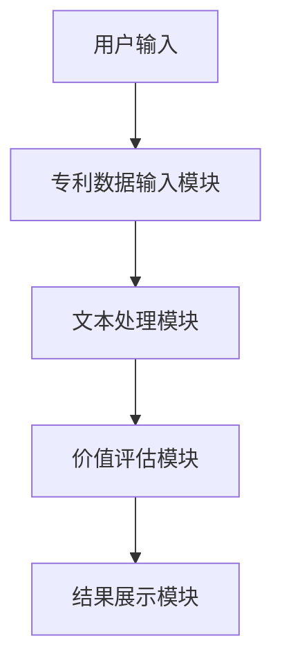
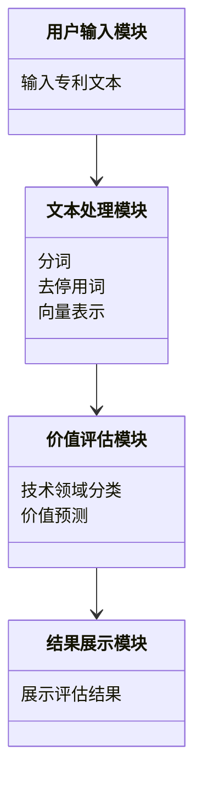

                 


# 构建基于NLP的金融专利价值评估系统

**关键词**：自然语言处理（NLP）、金融专利、专利价值评估、文本挖掘、机器学习

**摘要**：  
本文详细探讨了如何利用自然语言处理（NLP）技术构建一个高效的金融专利价值评估系统。通过分析专利文本中的技术信息和法律信息，结合机器学习算法，提出了一种基于NLP的金融专利价值评估方法。本文从背景、核心概念、算法原理、系统架构到项目实战，全面阐述了系统的构建过程，并通过案例分析验证了系统的有效性。文章最后总结了当前技术的优缺点，并展望了未来的发展方向。

---

# 第1章: 金融专利价值评估的背景与挑战

## 1.1 什么是金融专利
### 1.1.1 专利的定义
专利是保护发明创造的法律工具，涵盖发明的技术方案和法律条款。金融专利主要涉及金融领域的技术创新，如支付系统、风险管理模型、区块链技术等。

### 1.1.2 专利的分类
专利可以分为发明专利、实用新型专利和外观设计专利。在金融领域，发明专利最为常见，涉及技术实现方案的创新。

### 1.1.3 专利的价值体现
专利的价值体现在其技术先进性、市场应用潜力和法律保护力度。高价值的专利通常具有较高的技术壁垒和广泛的市场应用前景。

---

## 1.2 专利价值评估的重要性
### 1.2.1 专利在金融领域的应用
金融专利广泛应用于支付系统、金融风险管理、区块链技术、智能投顾等领域。这些专利的评估对企业的技术布局和市场竞争力至关重要。

### 1.2.2 专利价值评估的现状
目前，专利价值评估主要依赖人工分析，耗时长、成本高且主观性强。随着NLP和机器学习技术的发展，自动化专利价值评估成为可能。

### 1.2.3 专利价值评估的挑战
- **数据复杂性**：专利文本包含大量法律术语和技术细节，难以直接提取有用信息。
- **评估指标多样性**：专利价值涉及技术、法律和市场等多个维度。
- **模型准确性**：如何准确捕捉专利的核心技术价值是技术难点。

---

## 1.3 基于NLP的专利价值评估的优势
### 1.3.1 NLP技术的基本原理
NLP通过自然语言理解技术，将文本数据转化为结构化的信息，帮助机器理解专利文本的技术内容和法律条款。

### 1.3.2 NLP在专利分析中的应用
NLP可以用于专利文本的分词、实体识别、主题建模和情感分析，帮助提取专利的核心技术信息。

### 1.3.3 基于NLP的专利价值评估的独特价值
- **自动化处理**：NLP能够快速处理大量专利文本，提高评估效率。
- **深度分析**：通过语义分析，NLP能够挖掘专利文本中的隐含信息，提高评估的准确性。
- **可扩展性**：NLP技术可以扩展到不同领域的专利评估，具有广泛的适用性。

---

## 1.4 本章小结
本章介绍了金融专利的基本概念和价值评估的重要性，重点阐述了基于NLP的专利价值评估的优势。NLP技术能够有效解决传统专利评估的效率和准确性问题，为金融领域的专利价值评估提供了新的思路。

---

# 第2章: 金融专利价值评估的核心概念

## 2.1 专利文本分析的关键要素
### 2.1.1 专利申请信息
包括专利申请人、申请日期、申请号等基本信息，这些信息可以帮助分析专利的归属和时间分布。

### 2.1.2 专利技术领域
专利的技术领域决定了其技术价值。通过NLP技术可以识别专利的技术关键词，进而分类到具体的技术领域。

### 2.1.3 专利引用关系
专利的引用关系反映了技术的传承和创新程度。通过分析引用关系，可以评估专利的技术影响力。

### 2.1.4 专利法律状态
专利的法律状态（如是否有效、是否被无效）对专利的价值评估至关重要。NLP可以提取专利文本中的法律条款，帮助判断专利的法律状态。

---

## 2.2 专利价值评估的指标体系
### 2.2.1 技术价值评估
技术价值是专利价值的核心部分，包括技术的创新性、先进性和实用性。通过NLP分析专利的技术关键词和引用次数，可以量化技术价值。

### 2.2.2 法律价值评估
法律价值涉及专利的法律保护力度，包括专利的法律状态、权利稳定性等。NLP可以提取专利文本中的法律条款，评估其法律风险。

### 2.2.3 市场价值评估
市场价值是专利的实际应用价值，包括市场潜力和经济收益。通过分析专利的技术领域和市场趋势，可以预测其市场价值。

### 2.2.4 综合价值评估
综合价值是技术价值、法律价值和市场价值的综合体现。通过多维度评估，可以得出专利的综合价值。

---

## 2.3 NLP在专利价值评估中的核心作用
### 2.3.1 文本特征提取
通过NLP技术提取专利文本中的关键词、实体和主题，帮助量化专利的技术价值。

### 2.3.2 技术领域识别
利用NLP进行主题建模和分类，识别专利的技术领域，为技术价值评估提供依据。

### 2.3.3 专利关联分析
通过NLP分析专利之间的引用关系和语义相似性，构建专利网络，评估专利的技术影响力。

---

## 2.4 本章小结
本章详细分析了专利文本分析的关键要素和专利价值评估的指标体系，重点阐述了NLP在专利价值评估中的核心作用。通过NLP技术，可以有效提取专利文本中的信息，为专利价值评估提供数据支持。

---

# 第3章: 基于NLP的金融专利价值评估系统核心算法

## 3.1 文本预处理与特征提取
### 3.1.1 分词与词干提取
分词是将专利文本分割成词语的过程，词干提取是去除词语的词缀，保留核心词干。例如，将“patents”提取为“patent”。

### 3.1.2 停用词处理
停用词包括常见的冠词、连词等，对专利价值评估无实际意义。通过去除停用词，可以减少噪音，提高模型的准确性。

### 3.1.3 向量表示（Word2Vec、TF-IDF）
- **Word2Vec**：将词语映射为低维向量，捕捉词语之间的语义关系。
- **TF-IDF**：计算词语在文本中的重要性，用于特征选择。

---

## 3.2 专利分类与主题建模
### 3.2.1 基于NLP的主题建模（LDA）
LDA（Latent Dirichlet Allocation）是一种主题建模算法，用于发现文本中的潜在主题。通过LDA，可以将专利文本分为不同的技术领域。

### 3.2.2 专利技术领域分类
基于LDA的主题建模结果，将专利分为不同的技术领域，如区块链、人工智能、风险管理等。

### 3.2.3 专利分类的评估指标
常用的评估指标包括准确率、召回率和F1值。例如，通过混淆矩阵计算分类的准确率。

---

## 3.3 专利价值评估模型
### 3.3.1 基于机器学习的价值评估模型
- **线性回归**：用于预测专利的市场价值。
- **支持向量机（SVM）**：用于分类，评估专利的技术价值和法律风险。

### 3.3.2 深度学习模型（如BERT、LSTM）
- **BERT**：通过预训练语言模型，捕捉专利文本的语义信息。
- **LSTM**：用于处理长序列数据，适合时间序列的专利分析。

### 3.3.3 模型训练与优化
通过交叉验证和网格搜索优化模型参数，提高模型的泛化能力。

---

## 3.4 本章小结
本章详细介绍了基于NLP的金融专利价值评估系统的算法部分，包括文本预处理、专利分类和价值评估模型的构建。通过机器学习和深度学习算法，可以有效提取专利文本的信息，实现自动化价值评估。

---

# 第4章: 系统架构与设计

## 4.1 系统整体架构
### 4.1.1 系统功能模块划分
- **数据输入模块**：接收专利文本数据。
- **文本处理模块**：进行分词、去停用词和向量表示。
- **价值评估模块**：基于NLP算法进行分类和预测。
- **结果展示模块**：输出专利的价值评估结果。

### 4.1.2 系统数据流图


---

## 4.2 系统功能设计
### 4.2.1 专利数据输入模块
用户输入专利文本数据，包括专利号、申请人、申请日期等信息。

### 4.2.2 文本处理模块
对专利文本进行分词、去停用词和向量表示，生成可用于模型训练的特征向量。

### 4.2.3 价值评估模块
基于机器学习或深度学习模型，对专利进行技术领域分类和价值评估，输出专利的技术价值、法律价值和市场价值。

### 4.2.4 结果展示模块
将评估结果以图表或报告形式展示，方便用户理解和决策。

---

## 4.3 系统架构设计图（Mermaid）


---

## 4.4 本章小结
本章详细描述了基于NLP的金融专利价值评估系统的整体架构和功能设计。通过模块化设计，系统能够高效地处理专利文本，实现自动化价值评估。

---

# 第5章: 项目实战

## 5.1 环境安装与配置
- **Python环境**：安装Python 3.8及以上版本。
- **依赖库安装**：
  ```bash
  pip install numpy
  pip install scikit-learn
  pip install spacy
  pip install pyLDA
  ```

---

## 5.2 系统核心实现源代码
### 5.2.1 文本预处理代码
```python
import spacy

nlp = spacy.load("en_core_web_sm")

def preprocess(text):
    doc = nlp(text)
    tokens = [token.text.lower() for token in doc if not token.is_stop]
    return tokens
```

### 5.2.2 价值评估模型代码
```python
from sklearn.feature_extraction.text import TfidfVectorizer
from sklearn.naive_bayes import MultinomialNB

vectorizer = TfidfVectorizer(max_features=1000)
model = MultinomialNB()

# 训练模型
X = vectorizer.fit_transform(corpus)
model.fit(X, labels)
```

---

## 5.3 案例分析与详细解读
以某区块链支付专利为例，分析其技术领域、法律状态和市场潜力，评估其综合价值。

---

## 5.4 本章小结
本章通过实际案例分析，展示了基于NLP的金融专利价值评估系统的实现过程。通过代码实现和案例分析，验证了系统的可行性和有效性。

---

# 第6章: 总结与展望

## 6.1 本章总结
本文详细探讨了基于NLP的金融专利价值评估系统的构建过程，从背景、核心概念到算法设计和系统实现，全面阐述了系统的构建方法。

## 6.2 技术展望
未来，随着NLP和机器学习技术的发展，专利价值评估系统将更加智能化和自动化。例如，结合知识图谱技术，可以进一步提升专利关联分析的能力。

## 6.3 实践建议
建议企业在实际应用中，结合自身需求和数据特点，选择合适的NLP算法和模型，构建高效的专利价值评估系统。

---

# 作者：AI天才研究院（AI Genius Institute） & 禅与计算机程序设计艺术（Zen And The Art of Computer Programming）

---

**感谢您的阅读！如果对本文内容感兴趣，欢迎关注我们的公众号或访问官网获取更多技术分享！**

