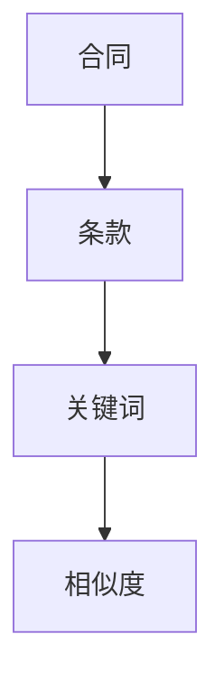
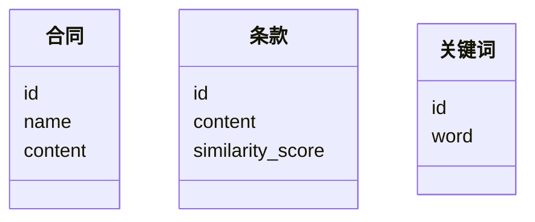
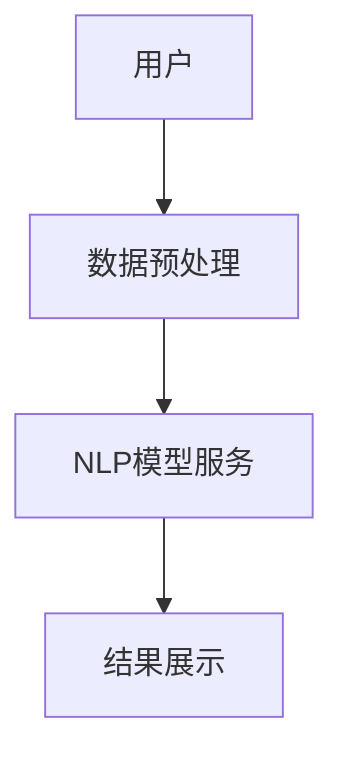
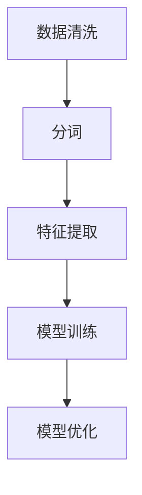

                 


# 构建基于NLP的金融合同条款自动化比对系统

## 关键词：
- 金融合同
- 自然语言处理（NLP）
- 合同条款比对
- 自动化系统
- 机器学习
- 文本相似度

## 摘要：
本文详细探讨了如何利用自然语言处理技术构建一个高效的金融合同条款自动化比对系统。从问题背景出发，分析了传统合同比对方法的痛点与挑战，提出了基于NLP的解决方案。文章详细介绍了系统的核心概念、算法原理、系统架构设计以及项目实战，涵盖了从数据预处理到模型训练、系统实现的全过程。通过实际案例分析，展示了该系统的应用价值与优势，并总结了系统设计与实现中的关键点与未来优化方向。

---

## 第一部分: 背景介绍与核心概念

### 第1章: 金融合同条款比对的背景与问题描述

#### 1.1 问题背景
##### 1.1.1 金融合同条款的重要性
金融合同是金融交易的核心法律文件，其条款内容直接关系到交易的合法性、合规性和风险控制。然而，金融合同条款通常冗长复杂，涉及的专业术语和法律条文繁多，人工比对效率低下且容易出错。

##### 1.1.2 手动比对合同的痛点与挑战
- **低效性**：手动比对需要逐条核对，耗时长且效率低。
- **错误率高**：人工比对容易遗漏关键条款或误判相似度。
- **成本高昂**：需要专业人员进行比对，企业面临高昂的人力成本。
- **一致性差**：不同人员的比对结果可能存在主观差异。

##### 1.1.3 自动化比对的需求与价值
- **提高效率**：自动化比对可以在短时间内完成大量合同条款的比对。
- **降低错误率**：通过NLP技术实现客观、精确的相似度计算。
- **节省成本**：减少人工干预，降低企业运营成本。
- **确保一致性**：统一的算法模型保证比对结果的稳定性。

#### 1.2 问题描述
##### 1.2.1 合同条款比对的目标
通过NLP技术实现金融合同条款的自动比对，识别条款的相似性或差异性，为用户提供高效的比对结果。

##### 1.2.2 比对的范围与边界
- **比对范围**：包括合同中的所有条款内容。
- **比对边界**：不涉及合同的格式、排版问题，仅关注条款内容。

##### 1.2.3 核心需求与非功能性需求
- **核心需求**：
  - 实现合同条款的自动分词与关键词提取。
  - 计算条款间的相似度并输出比对结果。
  - 提供友好的用户界面，便于用户查看比对结果。
- **非功能性需求**：
  - 系统稳定性：确保长时间运行的稳定性。
  - 可扩展性：支持不同类型的金融合同。
  - �易用性：用户操作简单直观。

---

### 第2章: 基于NLP的金融合同比对系统的核心概念

#### 2.1 NLP与金融合同比对的结合
##### 2.1.1 NLP技术在金融领域的应用
NLP技术在金融领域的应用包括文本分类、信息抽取、情感分析等，其中信息抽取技术可以帮助提取合同中的关键信息。

##### 2.1.2 金融合同条款比对的NLP模型选择
- **分词模型**：如jieba，用于将合同条款文本进行分词。
- **关键词提取模型**：如TF-IDF，用于提取合同条款中的关键词。
- **相似度计算模型**：如余弦相似度，用于计算条款间的相似度。

#### 2.2 核心概念与联系
##### 2.2.1 实体关系图（ER图）架构


##### 2.2.2 概念属性特征对比表格
| 实体 | 属性 | 特征 |
|------|------|------|
| 合同 | 文本内容 | 文本长度、关键词分布 |
| 条款 | 内容 | 关键词、相似度 |
| 关键词 | 单元词 | TF-IDF值 |

---

## 第3章: 系统架构与功能设计

### 3.1 问题场景介绍
#### 3.1.1 金融合同比对的典型场景
- **合同审查**：企业在签订合同时需要审查合同条款的差异。
- **合规性检查**：确保合同内容符合相关法律法规。
- **风险控制**：通过比对条款识别潜在的法律风险。

#### 3.1.2 系统的目标用户与使用场景
- **目标用户**：企业法务人员、金融交易员、合同审查人员。
- **使用场景**：合同签订前的条款比对、合同存档后的归档管理。

### 3.2 系统功能设计
#### 3.2.1 领域模型类图


#### 3.2.2 系统架构设计


---

## 第4章: 基于NLP的合同条款比对算法原理

### 4.1 算法原理讲解
#### 4.1.1 NLP模型训练流程


#### 4.1.2 分词与相似度计算
##### 分词代码示例
```python
def jieba_tokenize(text):
    import jieba
    return jieba.lcut(text)
```

##### 相似度计算
- **余弦相似度**：
$$ \text{余弦相似度} = \frac{\vec{A} \cdot \vec{B}}{|\vec{A}| |\vec{B}|} $$
- **编辑距离**：
$$ \text{编辑距离} = \text{min}(d_{\text{删除}}, d_{\text{插入}}, d_{\text{替换}}) $$

---

## 第5章: 项目实战与系统实现

### 5.1 环境安装与配置
#### 5.1.1 安装Python与相关库
```bash
pip install jieba
pip install numpy
pip install sklearn
```

### 5.2 系统核心实现
#### 5.2.1 核心代码实现
```python
def compute_similarity(text1, text2):
    from sklearn.feature_extraction.text import TfidfVectorizer
    from sklearn.metrics.pairwise import cosine_similarity
    vectorizer = TfidfVectorizer()
    tfidf_matrix = vectorizer.fit_transform([text1, text2])
    return cosine_similarity(tfidf_matrix[0], tfidf_matrix[1])[0][0]
```

#### 5.2.2 代码应用解读
- **分词处理**：将合同条款文本进行分词处理，提取关键词。
- **特征提取**：使用TF-IDF提取关键词的特征向量。
- **相似度计算**：通过余弦相似度计算条款间的相似度。

---

## 第6章: 总结与展望

### 6.1 总结
- **核心价值**：通过NLP技术实现金融合同条款的自动比对，提高效率和准确性。
- **系统优势**：节省成本、降低错误率、确保一致性。

### 6.2 展望
- **优化方向**：引入更先进的NLP模型（如BERT）提高相似度计算的精度。
- **扩展应用**：支持多语言合同的比对，进一步提升系统的通用性。

---

## 作者：AI天才研究院/AI Genius Institute & 禅与计算机程序设计艺术 /Zen And The Art of Computer Programming

---

通过以上思考，我们可以系统地构建一个基于NLP的金融合同条款自动化比对系统，解决传统合同比对中的痛点，提高效率和准确性。

