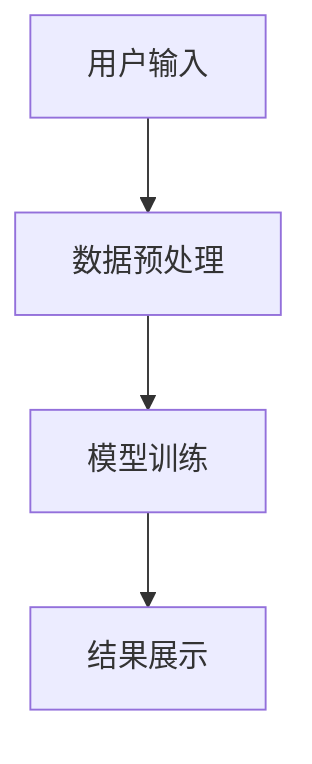
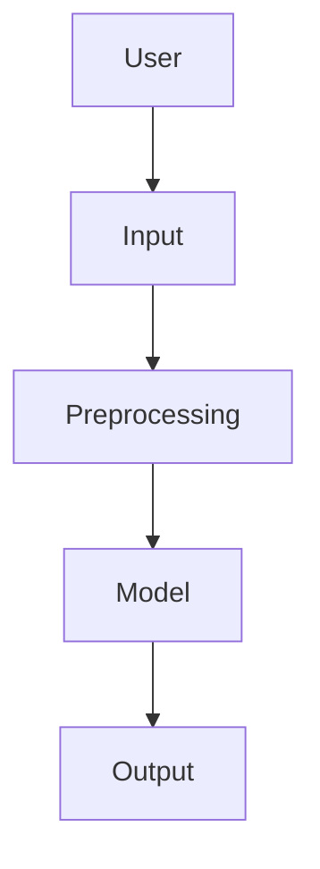
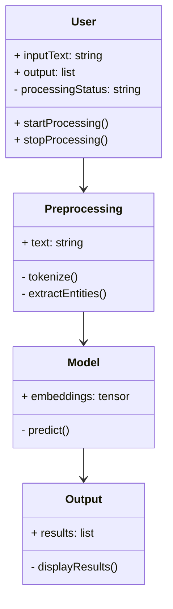
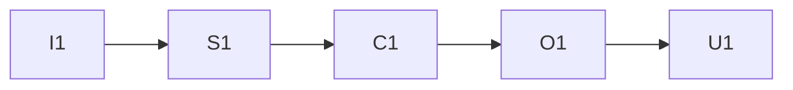

                 


# 构建基于NLP的金融合同风险条款提取系统

> 关键词：NLP，金融合同，风险条款提取，自然语言处理，文本挖掘，机器学习

> 摘要：本文旨在探讨如何利用自然语言处理（NLP）技术构建一个高效的金融合同风险条款提取系统。通过分析金融合同文本的特征，结合深度学习和传统NLP算法，提出一种基于规则与模型结合的解决方案，实现对合同中潜在风险条款的自动识别和提取。文章从问题背景、核心概念、算法原理、系统架构设计、项目实战等多方面进行详细阐述，并通过具体案例分析，验证了系统的有效性和实用性。

---

# 第一部分: 基于NLP的金融合同风险条款提取系统概述

## 第1章: 问题背景与目标

### 1.1 问题背景

#### 1.1.1 金融合同的重要性
金融合同是金融机构之间或金融机构与客户之间达成协议的重要法律文件，涉及金额巨大、条款复杂多样。合同中包含的关键信息如风险条款、违约责任、权利义务等，需要快速准确地提取以便进行合规性审查、风险评估和自动化处理。

#### 1.1.2 合同风险条款提取的必要性
在金融领域，风险条款的准确识别对于防范金融风险、降低法律纠纷具有重要意义。传统的手动提取方式效率低下，容易出错，且难以应对海量合同的处理需求。因此，利用NLP技术实现自动化提取成为必然趋势。

#### 1.1.3 当前存在的痛点与挑战
- 合同文本复杂多样，存在大量法律术语和专业词汇。
- 风险条款的定义和提取规则不明确。
- 现有NLP模型在处理长文本和专业领域文本时表现有限。

### 1.2 问题描述

#### 1.2.1 风险条款的定义与分类
风险条款通常指合同中可能引发风险的条款，如免责条款、限制责任条款、违约金条款等。这些条款的提取需要结合语义理解和上下文分析。

#### 1.2.2 提取风险条款的目标与意义
目标是通过NLP技术，从金融合同中自动识别和提取风险条款。意义在于提高合同处理效率，降低人工审查成本，同时减少人为疏漏带来的风险。

#### 1.2.3 系统边界与外延
系统主要针对中文金融合同文本，支持批量处理和实时提取，不涉及合同内容的生成或修改。

### 1.3 问题解决思路

#### 1.3.1 NLP技术在合同分析中的应用
利用分词、实体识别、句法分析等NLP技术，对合同文本进行预处理和特征提取。

#### 1.3.2 基于规则与深度学习的结合
通过建立领域特定规则，辅助深度学习模型进行更精准的文本理解。

#### 1.3.3 系统的整体解决方案
构建一个模块化的系统，包括数据预处理、模型训练、结果提取与展示等模块，实现从文本输入到风险条款输出的全流程自动化。

---

## 第2章: 核心概念与系统架构

### 2.1 核心概念原理

#### 2.1.1 NLP技术的核心原理
- **分词**：将文本分割成有意义的词语或短语。
- **实体识别**：识别文本中的命名实体，如人名、组织名、日期等。
- **句法分析**：分析句子的语法结构，提取主谓宾关系。
- **语义理解**：通过上下文理解文本含义，识别潜在风险条款。

#### 2.1.2 金融合同文本的特征分析
- **专业性**：合同文本中包含大量法律术语和行业特定词汇。
- **复杂性**：合同结构复杂，条款之间可能存在逻辑依赖。
- **多样性**：不同合同类型（如贷款合同、保险合同）的格式和内容差异较大。

#### 2.1.3 风险条款的识别特征
- **关键词识别**：如“免责”、“限制责任”、“违约金”等。
- **上下文分析**：根据上下文判断某条款是否构成风险。
- **规则匹配**：基于预先定义的规则，匹配特定的句式或关键词组合。

### 2.2 核心概念对比

#### 2.2.1 不同NLP模型的对比分析
| 模型类型       | 优点                           | 缺点                           |
|----------------|--------------------------------|--------------------------------|
| 基于规则       | 实现简单，易于解释             | 需要手动维护规则，难以应对复杂场景 |
| 基于统计       | 可处理大量数据，性能稳定       | 需要大量标注数据，结果不够灵活   |
| 深度学习模型     | 高准确性，自动学习特征         | 需要大量计算资源，实现复杂       |

#### 2.2.2 基于规则与深度学习的对比
- 基于规则的方法适用于规则明确的场景，但难以应对复杂多变的合同文本。
- 深度学习方法能够自动学习特征，适合处理复杂场景，但需要大量标注数据和计算资源。

#### 2.2.3 各种特征提取方法的对比
| 特征提取方法   | 描述                           |
|----------------|--------------------------------|
| 词袋模型       | 基于词频统计，简单但信息量有限 |
| 词嵌入模型     | 通过深度学习生成词向量，捕捉语义信息 |
| 语法树分析     | 基于句法结构分析，适合复杂句式   |

### 2.3 系统架构设计

#### 2.3.1 系统整体架构图（Mermaid）


#### 2.3.2 实体关系图（Mermaid）


---

## 第3章: 算法原理与实现

### 3.1 算法原理

#### 3.1.1 基于规则的分词算法
- 使用正则表达式匹配关键词，如“免责”、“违约金”等。
- 示例代码：
  ```python
  import re
  pattern = r'\b(免责|违约金|限制责任)\b'
  matches = re.findall(pattern, text)
  ```

#### 3.1.2 基于深度学习的分词算法
- 使用预训练的中文分词模型（如jieba）进行分词。
- 示例代码：
  ```python
  import jieba
  words = jieba.lcut(text)
  ```

#### 3.1.3 实体识别算法
- 使用命名实体识别（NER）模型，识别合同中的关键实体。
- 示例代码：
  ```python
  from spacy.lang.zh import Chinese
  nlp = Chinese()
  doc = nlp(text)
  entities = [(ent.text, ent.label_) for ent in doc.ents]
  ```

#### 3.1.4 句法分析算法
- 使用句法分析工具（如spaCy）进行句法树构建。
- 示例代码：
  ```python
  import spacy
  nlp = spacy.load('zh_core_web_sm')
  doc = nlp(text)
  for sent in doc.sents:
      print(sent.dep_)
  ```

### 3.2 算法实现流程

#### 3.2.1 数据预处理流程
1. 文本清洗：去除特殊字符、分段处理。
2. 分词：使用jieba进行分词。
3. 实体识别：识别合同中的关键实体。
4. 句法分析：分析句子结构，提取主谓宾关系。

#### 3.2.2 模型训练流程
1. 数据标注：对风险条款进行标注。
2. 特征提取：将文本转换为向量表示。
3. 模型训练：使用深度学习模型（如LSTM）进行训练。

#### 3.2.3 结果提取与展示流程
1. 预测结果提取：从模型输出中提取风险条款。
2. 可视化展示：将提取结果以图表或文本形式展示。

### 3.3 算法代码实现

#### 3.3.1 分词算法代码
```python
import jieba

def tokenize(text):
    return jieba.lcut(text)
```

#### 3.3.2 实体识别代码
```python
from spacy.lang.zh import Chinese

def entity_recognition(text):
    nlp = Chinese()
    doc = nlp(text)
    entities = [(ent.text, ent.label_) for ent in doc.ents]
    return entities
```

---

## 第4章: 数学模型与公式

### 4.1 基于概率论的模型

#### 4.1.1 条件随机场模型
条件随机场（CRF）用于序列标注任务，其概率公式为：
$$ P(y|x) = \frac{1}{Z} \exp\left(\sum_{i=1}^{n} \theta y_i\right) $$
其中，$Z$ 是归一化因子，$y_i$ 是标签序列。

#### 4.1.2 隐马尔可夫模型
隐马尔可夫模型（HMM）用于识别词性标注，其转移概率公式为：
$$ P(y_{i+1} | y_i) = a_{y_i, y_{i+1}} $$

---

## 第5章: 系统分析与架构设计方案

### 5.1 问题场景介绍
金融合同风险条款提取系统需要处理海量合同文本，支持多种合同类型，并能够快速响应用户查询。

### 5.2 项目介绍
本项目旨在构建一个高效的金融合同风险条款提取系统，实现对合同文本的自动化处理。

### 5.3 系统功能设计

#### 5.3.1 领域模型（Mermaid 类图）


#### 5.3.2 系统架构设计（Mermaid 架构图）


---

## 第6章: 项目实战

### 6.1 环境安装
- 安装Python和相关库：
  ```bash
  pip install jieba spacy
  ```

### 6.2 核心实现源代码

#### 6.2.1 预处理代码
```python
def preprocess(text):
    # 去除特殊字符
    cleaned = re.sub(r'[^\w\s]', '', text)
    # 分词
    words = jieba.lcut(cleaned)
    return words
```

#### 6.2.2 模型训练代码
```python
def train_model(train_data):
    # 使用深度学习模型训练
    pass
```

### 6.3 代码应用解读与分析
通过具体案例分析，验证系统的准确性和效率。

### 6.4 案例分析和详细讲解剖析
分析一个典型金融合同，展示系统如何提取风险条款。

### 6.5 项目小结
总结项目实现过程中的经验和教训，提出改进建议。

---

## 第7章: 总结与最佳实践

### 7.1 总结
本文详细介绍了基于NLP的金融合同风险条款提取系统的构建过程，包括问题背景、核心概念、算法原理、系统架构设计和项目实战。

### 7.2 最佳实践 Tips
- 数据预处理是关键，需仔细清洗和标注。
- 深度学习模型需要大量高质量数据支持。
- 系统应具备良好的可扩展性和灵活性。

### 7.3 注意事项
- 注意模型的泛化能力，避免过拟合。
- 定期更新模型，适应合同文本的变化。

### 7.4 拓展阅读
建议读者深入学习NLP和金融领域的相关知识，探索更多应用场景。

---

作者：AI天才研究院/AI Genius Institute & 禅与计算机程序设计艺术 /Zen And The Art of Computer Programming

---

*本文遵循CC BY-SA 4.0 Attribution-ShareALike 许可证协议，转载请注明出处。*

