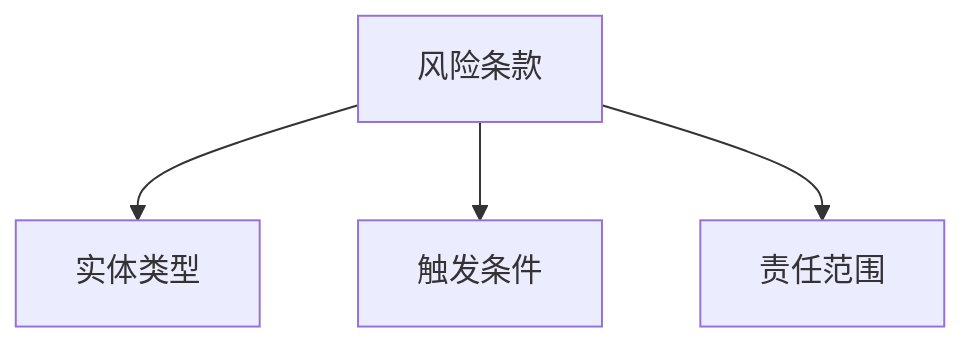
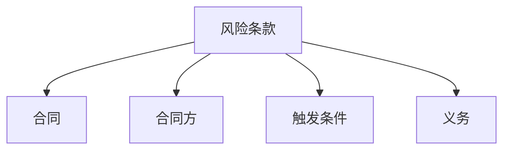
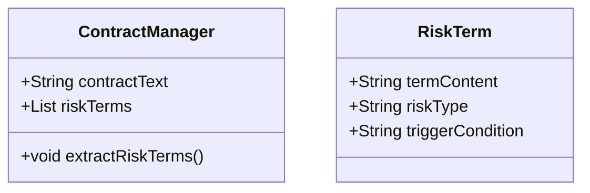

                 


# 《构建基于NLP的金融合同风险条款自动化提取与评估系统》

**关键词：自然语言处理(NLP)、金融合同、风险条款提取、深度学习、系统架构、文本挖掘**

**摘要：**  
本文详细探讨了基于自然语言处理技术构建金融合同风险条款自动化提取与评估系统的方法。通过分析金融合同的特点，结合深度学习模型的优势，提出了系统的需求分析、功能设计、架构实现及实际应用案例。文章从背景介绍、核心概念、算法原理、系统架构到项目实战，全面解析了如何利用NLP技术提高金融合同处理的效率与准确性，为金融行业数字化转型提供了实践参考。

---

# 第一部分：背景与概述

## 第1章：金融合同风险条款提取的背景与意义

### 1.1 金融合同的基本概念与特点

#### 1.1.1 金融合同的基本概念  
金融合同是金融机构之间、金融机构与客户之间为实现特定金融目的而签订的协议，具有法律效力和专业性。合同内容通常包括贷款协议、担保协议、投资协议等。

#### 1.1.2 金融合同的主要特点  
- **复杂性**：金融合同涉及法律、财务、业务等多个领域，文本结构复杂，专业术语众多。  
- **风险性**：合同中的风险条款直接关系到合同双方的权利义务，需严格提取与评估。  
- **规范性**：金融合同的格式和内容需符合相关法律法规，具有较高的规范性。  

#### 1.1.3 风险条款在金融合同中的重要性  
风险条款是合同中用于界定潜在风险、明确责任范围的关键部分，包括违约责任、免责条款、担保条款等。准确提取和评估这些条款对金融业务的合规性、风险控制和决策支持具有重要意义。

### 1.2 自动化提取与评估的必要性

#### 1.2.1 传统合同处理方式的局限性  
传统合同处理依赖人工审查，效率低、成本高，且容易出现遗漏或误判。特别是在处理大量复杂合同文本时，人工审查的效率和准确性难以满足需求。

#### 1.2.2 数字化转型与自动化处理的需求  
随着金融业务的数字化转型，金融机构对自动化处理的需求日益迫切。通过NLP技术实现合同文本的自动化处理，可以显著提高效率，降低人工成本。

#### 1.2.3 提高效率与准确性的目标  
自动化提取与评估系统的建设目标是通过技术手段提高合同处理的效率和准确性，减少人为错误，增强风险控制能力。

### 1.3 基于NLP的技术优势

#### 1.3.1 NLP技术的基本原理  
自然语言处理（NLP）通过计算机技术对人类语言进行分析、理解和生成。核心任务包括文本分割、词法分析、句法分析、语义理解等。

#### 1.3.2 NLP在合同处理中的应用潜力  
NLP技术可以用于合同文本的自动分类、信息抽取、相似度计算等，为风险条款的提取与评估提供技术支持。

#### 1.3.3 系统构建的目标与意义  
通过结合NLP技术，构建金融合同风险条款提取与评估系统，可以实现合同处理的自动化、智能化，为金融机构提供高效的风险管理工具。

---

## 第2章：基于NLP的文本处理技术基础

### 2.1 NLP的核心概念与技术

#### 2.1.1 词法分析  
词法分析是NLP的基础，包括分词、词性标注、命名实体识别等任务。例如，将“违约责任”识别为一个实体。

#### 2.1.2 句法分析  
句法分析研究句子的语法结构，帮助理解文本的逻辑关系。例如，识别“如果A，则B”的条件句结构。

#### 2.1.3 实体识别与关系抽取  
实体识别（NER）用于提取文本中的关键实体（如公司名称、金额、时间等），关系抽取用于识别实体之间的关联。

### 2.2 金融合同文本的特殊性

#### 2.2.1 专业术语与行业特定表达  
金融合同中充斥着大量专业术语，如“年利率”、“违约金”等，这些术语的识别和理解是NLP处理的关键。

#### 2.2.2 文本结构的复杂性  
金融合同的文本结构复杂，常包含嵌套式条款、多级标题等，增加了文本处理的难度。

#### 2.2.3 风险条款的多样性  
风险条款在不同合同中可能存在形式和内容的差异，例如有些条款隐藏在长段落中，有些则以表格形式呈现。

### 2.3 基于深度学习的NLP模型

#### 2.3.1 Transformer模型的原理  
Transformer模型通过自注意力机制（Self-Attention）捕捉文本中的长距离依赖关系，广泛应用于文本生成和理解任务。

#### 2.3.2 BERT等预训练模型的应用  
BERT模型通过大规模预训练，能够理解上下文语义，适合用于金融合同的深度语义分析。

#### 2.3.3 模型调优与微任务适配  
针对金融合同处理的特定需求，需要对通用模型进行微调（Fine-tuning），使其更好地适应任务。

---

# 第二部分：核心概念与技术联系

## 第3章：风险条款提取的核心概念与联系

### 3.1 核心概念的定义与属性

#### 3.1.1 风险条款的定义  
风险条款是金融合同中用于界定潜在风险、明确责任范围的特定条款。

#### 3.1.2 风险条款的关键属性  
- **风险类型**：如信用风险、市场风险等。  
- **责任范围**：明确合同双方在风险发生时的义务和责任。  
- **触发条件**：风险条款生效的条件，如“若某事件发生，则……”。  

#### 3.1.3 核心概念的实体关系图  
以下是一个简单的实体关系图，展示了风险条款与其他核心概念的关系：



### 3.2 核心概念的ER实体关系图



### 3.3 核心概念的数学模型与公式

#### 3.3.1 风险概率计算公式  
$$ P(risk) = \sum_{i=1}^{n} w_i \cdot x_i $$  
其中，$w_i$ 是第$i$个特征的权重，$x_i$ 是第$i$个特征的值。

---

## 第4章：基于NLP的风险条款提取算法

### 4.1 算法原理

#### 4.1.1 文本预处理  
文本预处理是NLP任务的基础，包括分词、去除停用词、文本向量化等步骤。例如，将“违约责任”分解为“违约”和“责任”。

#### 4.1.2 模型训练  
使用预训练的BERT模型进行微调，训练模型识别风险条款的能力。

#### 4.1.3 结果评估  
通过准确率、召回率、F1分数等指标评估模型的性能。

### 4.2 算法实现

#### 4.2.1 文本预处理代码  
```python
import jieba

text = "违约责任：若借款人未能按期偿还贷款，贷款人有权追偿全部贷款本息。"
words = jieba.lcut(text)
print(words)
```

#### 4.2.2 模型训练代码  
```python
from transformers import BertTokenizer, BertForTokenClassification
from torch.utils.data import Dataset, DataLoader

class RiskTermDataset(Dataset):
    def __init__(self, texts, labels):
        self.texts = texts
        self.labels = labels
    def __len__(self):
        return len(self.texts)
    def __getitem__(self, idx):
        return self.texts[idx], self.labels[idx]

tokenizer = BertTokenizer.from_pretrained('bert-base-chinese')
model = BertForTokenClassification.from_pretrained('bert-base-chinese')
```

---

## 第5章：系统架构与实现

### 5.1 系统需求分析

#### 5.1.1 功能需求  
- 文本上传与解析  
- 风险条款提取  
- 风险评估与报告生成  

#### 5.1.2 性能需求  
- 高效处理大规模合同文本  
- 实时响应  

### 5.2 系统功能设计

#### 5.2.1 领域模型设计  


#### 5.2.2 系统架构设计  
```mermaid
graph LR
    Client --> API Gateway
    API Gateway --> ContractManager
    ContractManager --> NLPService
    NLPService --> Database
```

---

## 第6章：项目实战与案例分析

### 6.1 环境安装

#### 6.1.1 安装Python与依赖库  
```bash
pip install python transformers jieba torch
```

### 6.2 核心代码实现

#### 6.2.1 文本处理代码  
```python
import torch
from transformers import BertTokenizer, BertModel

tokenizer = BertTokenizer.from_pretrained('bert-base-chinese')
model = BertModel.from_pretrained('bert-base-chinese')

text = "违约责任：若借款人未能按期偿还贷款，贷款人有权追偿全部贷款本息。"
inputs = tokenizer.encode_plus(text, return_tensors='pt')
with torch.no_grad():
    outputs = model(inputs['input_ids'])
```

---

## 第7章：总结与展望

### 7.1 总结

通过本文的详细讲解，我们了解了基于NLP的金融合同风险条款自动化提取与评估系统的构建方法。从背景介绍、技术基础到系统实现，全面解析了NLP技术在金融领域的应用潜力。

### 7.2 展望

未来，随着NLP技术的不断发展，金融合同处理的自动化和智能化水平将不断提高。结合区块链、大数据等技术，可以进一步提升系统的安全性和效率。

---

**作者：AI天才研究院/AI Genius Institute & 禅与计算机程序设计艺术 /Zen And The Art of Computer Programming**

