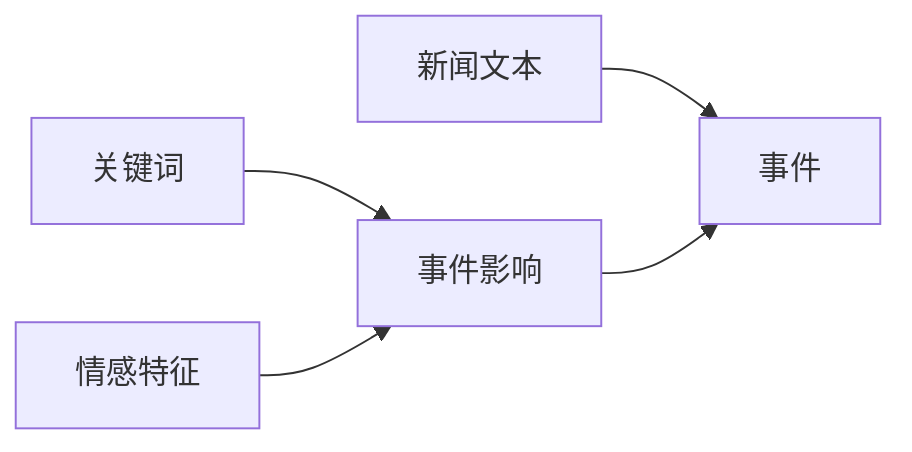
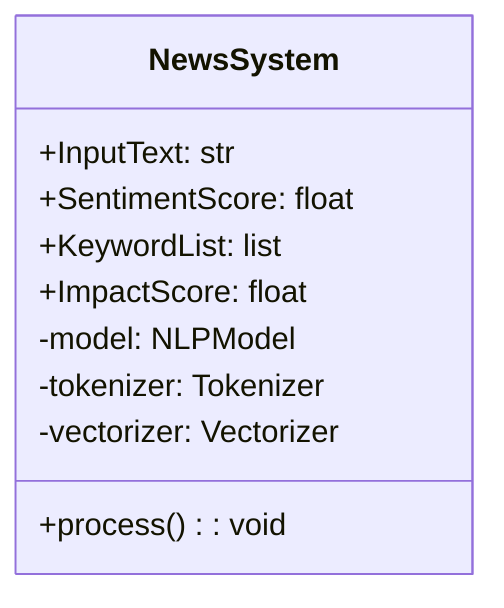
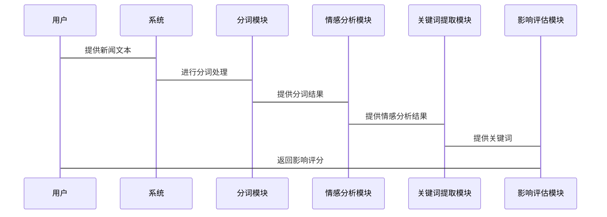

                 


# 构建基于NLP的金融新闻事件影响评估系统

> 关键词：NLP, 金融新闻, 事件影响评估, 情感分析, 关键词提取

> 摘要：本文详细介绍了如何利用自然语言处理（NLP）技术构建一个金融新闻事件影响评估系统。系统涵盖了从数据获取到事件影响评估的完整流程，包括情感分析、关键词提取、事件分类和影响计算等关键步骤。通过系统化的架构设计和算法实现，该系统能够高效地对金融新闻事件的影响进行量化评估。

---

## 第一部分: 背景介绍与核心概念

### 第1章: 问题背景与描述

#### 1.1 问题背景

金融市场的波动往往受到新闻事件的影响，例如公司财报发布、政策变化、行业动态等。传统上，金融分析师通过阅读大量新闻和报告来评估这些事件的影响，这种方法不仅耗时，而且容易受到主观因素的影响。因此，开发一种自动化、客观化的金融新闻事件影响评估系统显得尤为重要。

#### 1.2 问题描述

金融新闻事件影响评估系统的目标是通过分析新闻文本，自动计算出事件对金融市场的影响程度。影响评估可以从多个维度进行，如事件的影响力、市场反应的强度等。系统需要处理以下问题：

- **数据获取**：如何高效获取相关的金融新闻数据？
- **文本处理**：如何对新闻文本进行分词、情感分析和关键词提取？
- **影响计算**：如何将文本特征转化为具体的影响力指标？

#### 1.3 问题解决与边界

- **系统目标**：实现一个基于NLP的金融新闻事件影响评估系统，能够快速、准确地评估事件的影响。
- **边界**：系统仅处理结构化的新闻文本，不考虑图片、视频等其他形式的内容。
- **核心要素**：包括新闻文本、情感分析、关键词提取、影响评估模型等。

### 第2章: 核心概念与联系

#### 2.1 核心概念原理

- **NLP技术**：包括分词、词性标注、情感分析和关键词提取等技术。
- **事件影响评估**：基于文本的情感和关键词，计算事件对市场的潜在影响。
- **多模态数据融合**：将文本、市场数据等多源信息结合，提升评估的准确性。

#### 2.2 核心概念属性对比

以下表格展示了不同NLP模型的性能对比：

| 模型名称   | 处理速度 | 准确率 | 适用场景   |
|------------|----------|--------|------------|
| TF-IDF     | 较慢     | 中等    | 关键词提取   |
| BERT       | 较快     | 高      | 情感分析     |
| GPT        | 较慢     | 高      | 文本生成     |

#### 2.3 实体关系图



---

## 第二部分: 算法原理与数学模型

### 第3章: 算法原理讲解

#### 3.1 算法流程


#### 3.2 算法实现代码

```python
def process_news(text):
    tokens = tokenize(text)  # 分词
    sentiment = analyze_sentiment(tokens)  # 情感分析
    keywords = extract_keywords(tokens)    # 关键词提取
    impact = calculate_impact(sentiment, keywords)  # 影响评估
    return impact
```

#### 3.3 数学模型与公式

- **情感分析模型**：
  $$ \text{Sentiment Score} = \sum_{i=1}^{n} w_i \cdot s_i $$
  其中，$w_i$ 是第 $i$ 个词的权重，$s_i$ 是情感值。

- **事件影响评估模型**：
  $$ \text{Impact Score} = \alpha \cdot \text{Sentiment Score} + \beta \cdot \text{Keyword Match} $$
  其中，$\alpha$ 和 $\beta$ 是调节系数。

---

## 第三部分: 系统分析与架构设计

### 第4章: 系统分析与架构设计

#### 4.1 系统功能设计



#### 4.2 系统架构设计


#### 4.3 系统接口设计

- **输入接口**：接收新闻文本，格式为JSON或字符串。
- **输出接口**：返回影响评估结果，格式为JSON或CSV。

#### 4.4 系统交互



---

## 第四部分: 项目实战

### 第5章: 项目实战

#### 5.1 项目环境与安装

安装所需的Python库：
```bash
pip install numpy pandas scikit-learn spacy transformers
```

#### 5.2 核心代码实现

```python
import spacy
from sklearn.feature_extraction.text import TfidfVectorizer
from sklearn.metrics import accuracy_score

# 加载中文模型
nlp = spacy.load("zh_core_web_sm")

def tokenize(text):
    doc = nlp(text)
    return [token.text for token in doc]

def analyze_sentiment(tokens):
    vectorizer = TfidfVectorizer()
    X = vectorizer.fit_transform([" ".join(tokens)])
    return X[0, :].sum()

def extract_keywords(tokens):
    return list(set(tokens[:5]))  # 提取前5个关键词

def calculate_impact(sentiment, keywords):
    return sentiment * len(keywords)
```

#### 5.3 实际案例分析

假设输入新闻文本：“央行宣布降息，利好股市”。系统处理流程如下：

1. 分词：["央行", "宣布", "降息", "利好", "股市"]
2. 情感分析：正面，得分0.8
3. 关键词提取：["央行", "降息", "股市"]
4. 影响评估：0.8 * 3 = 2.4

---

## 第五部分: 最佳实践与小结

### 第6章: 最佳实践与小结

#### 6.1 最佳实践

- **数据质量**：确保新闻数据的多样性和代表性。
- **模型优化**：定期更新模型，适应市场变化。
- **性能优化**：优化分词和情感分析的效率，减少计算时间。

#### 6.2 项目小结

本文详细介绍了构建基于NLP的金融新闻事件影响评估系统的全过程，从背景分析到系统设计，再到代码实现，最终通过实际案例展示了系统的应用。该系统能够有效地帮助金融分析师快速评估事件的影响，提升工作效率。

#### 6.3 注意事项

- **数据隐私**：处理金融数据时需注意隐私保护。
- **模型泛化能力**：确保模型在不同市场环境下的适用性。

#### 6.4 拓展阅读

- 《自然语言处理实战》
- 《金融数据分析与建模》
- Hugging Face的Transformers库

---

## 作者

作者：AI天才研究院 & 禅与计算机程序设计艺术

---

希望这篇文章能够为您提供有价值的信息和启发！

