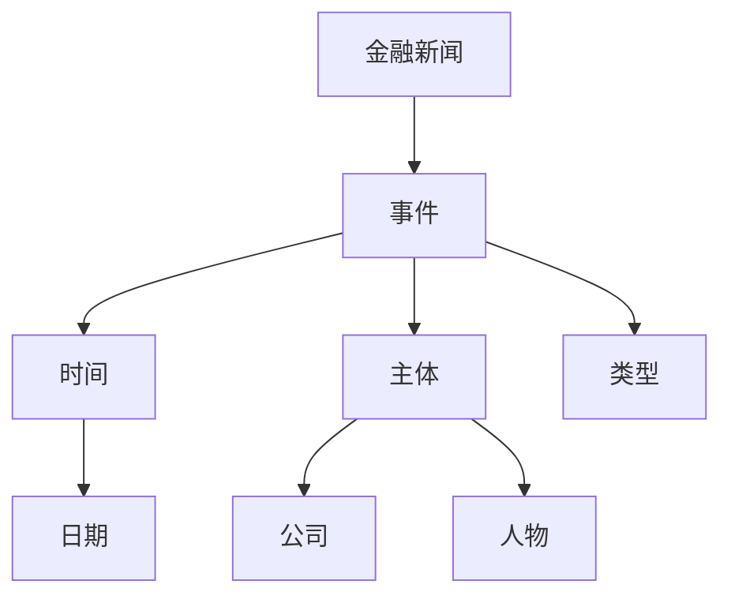
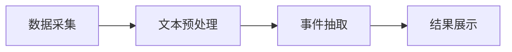

                 


# 构建基于NLP的金融新闻事件抽取系统

> **关键词**：金融新闻、NLP、事件抽取、自然语言处理、文本挖掘、深度学习

> **摘要**：本文详细探讨了如何利用自然语言处理技术构建一个高效的金融新闻事件抽取系统。从问题背景到系统架构设计，从算法原理到项目实战，系统地阐述了该系统的构建过程。文章首先介绍了金融新闻事件抽取的背景和目标，然后分析了核心概念和相关技术，接着详细讲解了基于深度学习的NLP算法原理，提出了系统的整体架构，并通过实际案例展示了系统的设计与实现。

---

## 第一部分: 背景介绍

### 第1章: 问题背景与描述

#### 1.1 问题背景
金融市场每天都会产生海量的新闻信息，这些信息对于投资者、分析师和金融机构来说具有重要的参考价值。然而，由于信息量庞大且分散，如何高效地从这些新闻中提取关键事件成为一个亟待解决的问题。

#### 1.2 问题描述
金融新闻事件抽取的目标是从文本中识别出关键的事件信息，如公司并购、业绩预告、财务数据等。这些事件信息能够帮助用户快速掌握市场动态，做出更明智的决策。

#### 1.3 问题解决思路
基于NLP技术的事件抽取系统能够自动从金融新闻中提取关键信息，减少人工处理的负担。通过深度学习模型，系统可以识别出事件的主体、时间、类型等要素。

---

### 第2章: 核心概念与联系

#### 2.1 核心概念原理
金融新闻事件抽取涉及多个NLP技术，如分词、实体识别、句法分析等。这些技术共同作用，帮助系统从文本中提取出关键信息。

#### 2.2 实体关系图


---

## 第二部分: 算法原理讲解

### 第3章: 基础算法原理

#### 3.1 分词算法
分词是NLP的基础步骤，常用的算法包括基于规则的分词和基于统计的分词方法。在金融新闻中，常用jieba进行分词。

#### 3.2 实体识别算法
实体识别是通过模型识别文本中的命名实体，如公司名称、人物等。常用的模型包括CRF和深度学习模型。

#### 3.3 句法分析算法
句法分析帮助理解文本的结构关系，常用的依存句法分析能够识别出句子中各成分之间的关系。

---

### 第4章: 深度学习模型原理

#### 4.1 BERT模型
BERT是一种预训练的深度学习模型，能够通过上下文理解文本的意义。在金融新闻事件抽取中，BERT可以用于事件识别和实体识别。

#### 4.2 模型结构
BERT模型通过多层Transformer结构进行编码，能够捕捉到文本中的上下文信息。

#### 4.3 实现流程
1. 数据预处理：将金融新闻文本进行分词和标注。
2. 模型训练：使用BERT模型进行事件抽取的微调。
3. 模型预测：利用训练好的模型对新的金融新闻进行事件抽取。

---

## 第三部分: 系统分析与架构设计

### 第5章: 系统架构设计

#### 5.1 系统功能模块
系统主要包括数据采集、文本预处理、事件抽取和结果展示四个模块。

#### 5.2 系统架构图


---

## 第四部分: 项目实战

### 第6章: 项目实战

#### 6.1 环境安装
需要安装Python、TensorFlow、BERT等库。

#### 6.2 核心代码实现
```python
import tensorflow as tf
from bert import modeling

# 加载BERT模型
bert_config = modeling.BertConfig.from_json_file("bert_config.json")
bert_model = modeling.BertModel(config=bert_config)
```

#### 6.3 代码解读与分析
通过BERT模型对金融新闻进行编码，然后进行事件抽取的预测。

#### 6.4 实际案例分析
通过一个具体的金融新闻案例，展示系统的运行过程。

---

## 第五部分: 总结与展望

### 第7章: 总结与展望

#### 7.1 系统总结
本文详细介绍了金融新闻事件抽取系统的构建过程，涵盖了从数据采集到系统展示的各个环节。

#### 7.2 未来展望
未来可以进一步优化模型，提高事件抽取的准确率，同时拓展系统的应用场景。

---

**作者：AI天才研究院/AI Genius Institute & 禅与计算机程序设计艺术 /Zen And The Art of Computer Programming**

