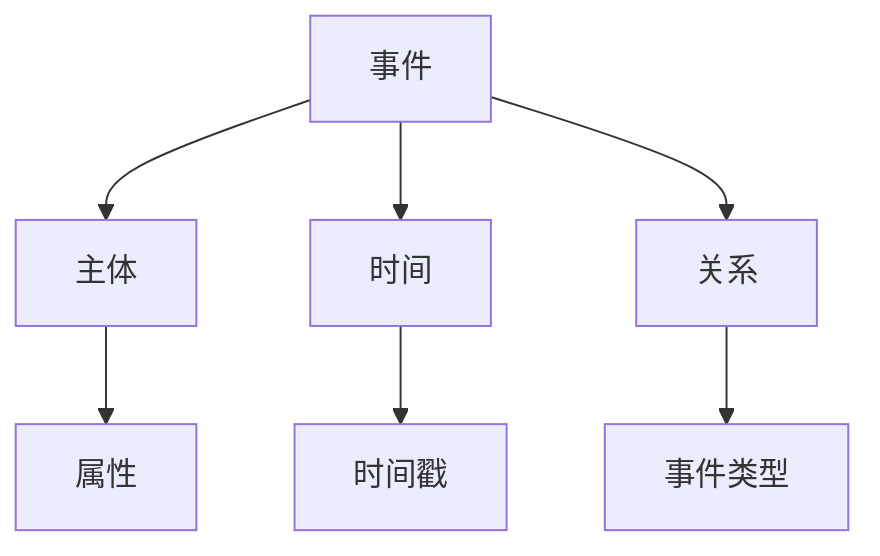
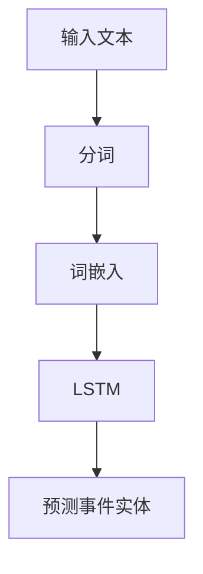
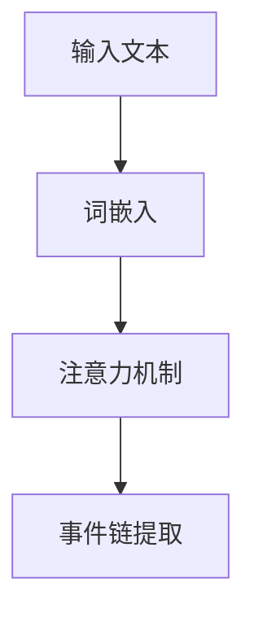
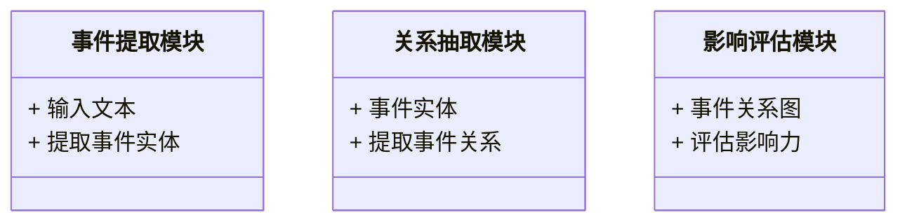
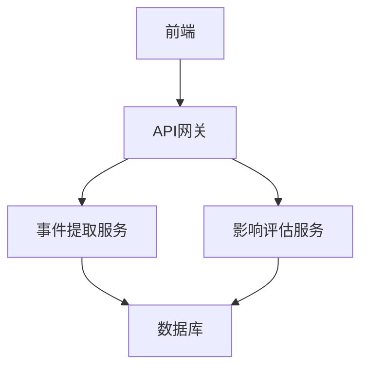
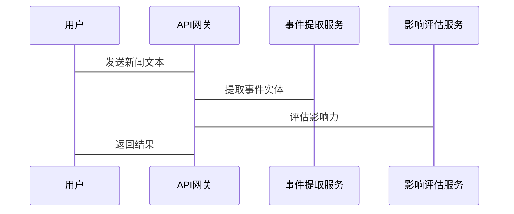

                 


# 构建基于NLP的金融新闻事件链提取与影响评估系统

> 关键词：NLP, 金融新闻, 事件链提取, 影响评估, 深度学习, 事件关系图, 金融信息处理

> 摘要：本文详细介绍了如何利用自然语言处理技术构建金融新闻事件链提取与影响评估系统。通过分析金融新闻文本，提取事件链，并评估其对市场的影响。文章从背景介绍、核心概念、算法原理、系统架构设计、项目实战到优化与部署，全面阐述了系统的构建过程，结合实际案例和代码实现，为读者提供了一套完整的解决方案。

---

## 第一部分: 背景介绍与核心概念

### 第1章: 问题背景与描述

#### 1.1 问题背景
金融市场的波动往往与新闻事件密切相关。金融新闻中的事件链（Event Chain）是指一系列相关联的新闻事件，这些事件可能影响市场走势、公司股价或行业趋势。然而，传统的方法难以高效提取这些事件链，并评估其对市场的影响。

#### 1.2 问题描述
- **事件链提取的挑战**：金融新闻文本复杂，事件之间存在多种关系，需要准确识别和连接。
- **影响评估的复杂性**：事件的影响受多种因素影响，如事件的类型、强度、时间等。
- **现有技术的局限性**：传统方法依赖人工分析，效率低且难以处理海量数据。

#### 1.3 问题解决思路
利用自然语言处理技术，通过文本挖掘和深度学习模型，自动提取事件链，并建立数学模型评估其影响。

#### 1.4 边界与外延
- **事件链提取的边界条件**：仅处理与金融市场相关的新闻。
- **影响评估的适用范围**：主要评估对股价、市场指数的影响。
- **系统的可扩展性与局限性**：系统适用于多种语言的新闻文本，但目前仅支持单文本分析。

#### 1.5 核心概念与组成
- **事件链提取的关键要素**：时间戳、事件主体、事件类型。
- **影响评估的核心指标**：事件影响力评分、市场波动性预测。
- **系统架构**：模块化设计，包括数据预处理、事件提取、影响评估等模块。

---

## 第二部分: 核心概念与联系

### 第2章: NLP与金融新闻事件链的核心原理

#### 2.1 NLP技术原理
- **自然语言处理的基本概念**：文本预处理、词嵌入、序列模型。
- **常见NLP任务与方法**：文本分类、命名实体识别、关系抽取。
- **深度学习在NLP中的应用**：RNN、LSTM、BERT模型。

#### 2.2 金融新闻事件链的特征分析
- **事件链的结构特征**：时间序列、事件间的因果关系。
- **事件链的语义特征**：事件的类型、强度、主体。
- **事件链的时间特征**：时间戳、事件发生频率。

#### 2.3 实体关系与事件抽取
- **实体识别与关系抽取**：识别公司名称、时间、地点等实体，并分析它们之间的关系。
- **事件抽取的流程**：文本分词、实体识别、关系抽取、事件链构建。
- **事件链的构建方法**：基于规则的事件链构建、基于深度学习的事件链构建。

### 第3章: 核心概念的对比与ER实体关系图

#### 3.1 核心概念属性特征对比表
| 概念 | 实体 | 关系 | 时间 |
|------|------|------|------|
| 事件链 | 公司A | 收购 | 2023-10-1 |
|       | 公司B | 被收购 | 2023-10-5 |

#### 3.2 ER实体关系图


---

## 第三部分: 算法原理讲解

### 第4章: 事件链提取算法

#### 4.1 序列标注模型
- **模型介绍**：使用LSTM进行序列标注，识别文本中的事件实体。
- **算法流程图**


- **数学模型**
$$
P(y|x) = \text{softmax}(f(x))
$$
其中，$f(x)$ 是LSTM的输出。

#### 4.2 基于注意力机制的事件链提取
- **模型原理**：通过注意力机制捕捉事件间的关联性。
- **算法流程图**


---

## 第四部分: 系统分析与架构设计方案

### 第5章: 系统分析与架构设计

#### 5.1 系统功能设计
- **领域模型**：事件提取模块、关系抽取模块、影响评估模块。


#### 5.2 系统架构设计
- **系统架构图**


#### 5.3 系统接口设计
- **API接口**
```
POST /api/extract_events
POST /api/assess_impact
```

#### 5.4 系统交互流程图


---

## 第五部分: 项目实战

### 第6章: 项目实战

#### 6.1 环境安装
```bash
pip install numpy
pip install tensorflow
pip install spacy
```

#### 6.2 系统核心实现
```python
import spacy
from tensorflow.keras import Model
import numpy as np

class EventExtractor:
    def __init__(self):
        self.nlp = spacy.load("en_core_web_sm")
    
    def extract_entities(self, text):
        doc = self.nlp(text)
        entities = [ent.text for ent in doc.ents]
        return entities

class ImpactAssessor:
    def assess(self, event_chain):
        # 简单示例：基于事件数量计算影响力
        return len(event_chain)
```

#### 6.3 代码应用解读与分析
- **文本预处理**：分词、去除停用词。
- **事件抽取**：使用spaCy提取实体和关系。
- **影响评估**：基于事件链的长度和类型计算影响力。

#### 6.4 实际案例分析
```python
text = "Apple announced a new product, which caused its stock to rise."
extractor = EventExtractor()
entities = extractor.extract_entities(text)
print(entities)  # 输出：['Apple', 'product']
```

#### 6.5 项目小结
- 项目实现了基本的事件链提取和影响评估功能。
- 未来可以优化模型，引入更复杂的影响力评估指标。

---

## 第六部分: 优化与部署

### 第7章: 优化与部署

#### 7.1 系统优化策略
- **性能优化**：使用更高效的模型（如BERT）。
- **数据优化**：增加训练数据量，提升模型精度。

#### 7.2 系统部署方案
- **云部署**：使用AWS或阿里云部署模型服务。
- **API接口**：提供RESTful API供其他系统调用。

#### 7.3 注意事项
- 数据隐私：确保处理的新闻数据符合隐私保护法规。
- 模型更新：定期更新模型，保持其准确性。

#### 7.4 拓展阅读
- 推荐阅读《深度学习入门》、《自然语言处理实战》。

---

## 作者：AI天才研究院/AI Genius Institute & 禅与计算机程序设计艺术 /Zen And The Art of Computer Programming

