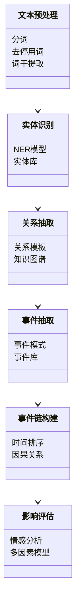
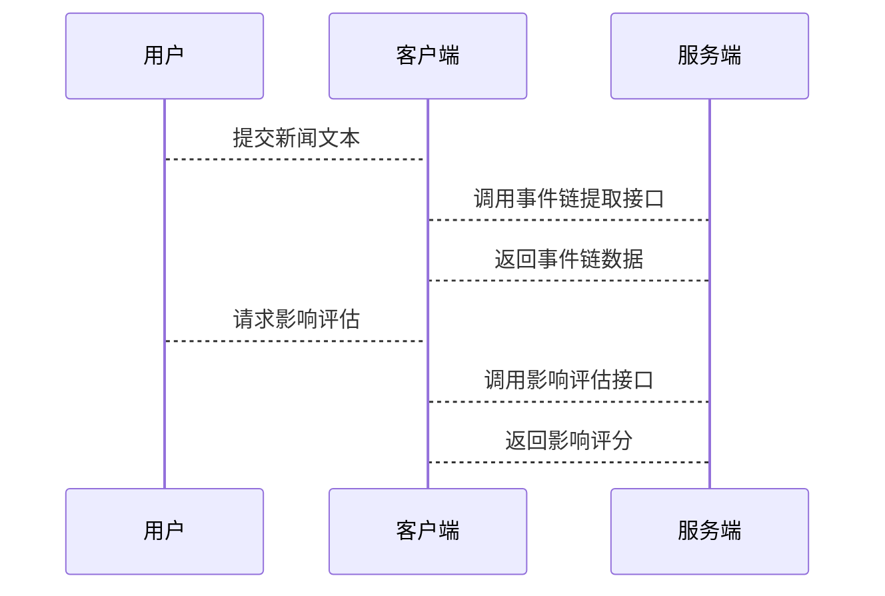

                 


# 《构建基于NLP的金融新闻事件链提取与影响量化评估系统》

---

## 关键词：金融新闻分析、NLP、事件链提取、影响量化评估、自然语言处理

---

## 摘要：  
本文详细探讨了如何利用自然语言处理（NLP）技术构建一个高效的金融新闻事件链提取与影响量化评估系统。通过对金融新闻文本的深度分析，我们提出了基于NLP的事件链提取方法，并结合多因素量化模型，实现了对事件影响的精准评估。文章从背景介绍、核心概念、算法原理到系统架构设计，再到项目实战，全面阐述了系统的构建过程，并通过实际案例展示了系统的应用价值。

---

## 第一部分: 背景介绍与核心概念

## 第2章: 核心概念与联系

### 2.1 NLP技术在金融新闻分析中的应用

#### 2.1.1 文本预处理与特征提取

在金融新闻分析中，文本预处理是实现事件链提取的基础。首先，我们需要对新闻文本进行分词、停用词去除和词干提取等处理。例如，对于新闻标题“美联储加息可能引发市场波动”，我们将其分解为“美联储”、“加息”、“可能”、“引发”、“市场”、“波动”等关键词。

接下来，我们提取文本的特征，如情感倾向、关键词权重和语义相似度。这些特征将用于后续的事件识别和链式关系构建。

#### 2.1.2 实体识别与关系抽取

实体识别是金融新闻分析的重要环节。我们使用命名实体识别（NER）技术，从新闻文本中提取出人名、机构名、地名等实体。例如，在新闻“美联储加息可能引发市场波动”中，实体识别的结果为“美联储”（机构名）、“市场”（领域）。

关系抽取则是识别实体之间的关系，例如“美联储加息可能引发市场波动”中，“加息”是“美联储”的动作，“引发”是动作与结果的关系。

#### 2.1.3 事件抽取与时间线构建

事件抽取是基于NLP技术的核心任务。我们通过模式匹配和上下文分析，识别出金融新闻中的具体事件。例如，从“美联储加息可能引发市场波动”中，提取出事件“加息”和“市场波动”。

时间线构建则是将事件按照发生的时间顺序排列，形成事件链。例如，事件链可能为：“美联储加息”→“市场预期变化”→“股价波动”→“行业影响”。

### 2.2 事件链提取的原理

#### 2.2.1 事件链的定义与分类

事件链是指一系列相互关联的事件，按照时间顺序排列，形成因果关系链。在金融新闻中，事件链通常表现为市场行为、政策变化、经济指标波动等。

例如，事件链可能包括：“政策宣布”→“市场反应”→“股价变化”→“行业影响”。

#### 2.2.2 基于NLP的事件链提取方法

我们采用以下步骤实现事件链提取：

1. **文本预处理**：对新闻文本进行分词、去停用词和词干提取。
2. **实体识别**：识别文本中的实体，如机构名、人名等。
3. **关系抽取**：提取实体之间的关系，如“政策宣布”与“市场反应”。
4. **事件抽取**：基于预设的事件模式，识别文本中的具体事件。
5. **事件链构建**：将事件按照时间顺序和因果关系排列，形成事件链。

#### 2.2.3 事件链的关联性分析

在事件链的关联性分析中，我们需要计算事件之间的相似度和相关性。例如，使用余弦相似度计算事件的语义相似度。

公式：
$$
\text{相似度} = \frac{\vec{a} \cdot \vec{b}}{|\vec{a}| |\vec{b}|}
$$

其中，$\vec{a}$和$\vec{b}$分别为两个事件的词向量。

### 2.3 影响量化评估的原理

#### 2.3.1 事件影响的量化指标

我们定义了以下量化指标：

1. **事件影响力**：衡量事件对市场的影响程度。
2. **事件相关性**：衡量事件之间的关联性。
3. **事件传播度**：衡量事件在媒体中的传播范围。

#### 2.3.2 基于NLP的情感分析与影响评估

我们采用情感分析技术对金融新闻进行情感倾向分析。例如，对于新闻“美联储加息可能引发市场波动”，情感分析模型可以识别出“负面”情绪。

公式：
$$
\text{情感倾向} = \text{sentiment}(text)
$$

其中，$text$为新闻文本。

#### 2.3.3 多因素综合评估模型

我们构建了一个多因素综合评估模型，结合事件影响力、相关性和传播度，对事件的影响进行量化评估。

公式：
$$
\text{影响评分} = \alpha \cdot \text{影响力} + \beta \cdot \text{相关性} + \gamma \cdot \text{传播度}
$$

其中，$\alpha$、$\beta$、$\gamma$为权重系数，根据具体场景进行调整。

---

## 第三部分: 系统分析与架构设计

## 第3章: 系统架构设计

### 3.1 项目介绍

我们构建了一个基于NLP的金融新闻事件链提取与影响量化评估系统，旨在帮助投资者快速识别市场动向，评估事件对市场的影响。

### 3.2 系统功能设计

我们使用领域模型图（Mermaid）来描述系统功能模块：



### 3.3 系统架构设计

我们使用架构图（Mermaid）展示系统的整体架构：

```mermaid
archi
    构件 客户端 {
        组件 文本输入
        组件 事件链查询
    }
    构件 服务端 {
        组件 文本预处理
        组件 实体识别
        组件 关系抽取
        组件 事件抽取
        组件 事件链构建
        组件 影响评估
    }
    客户端 --> 服务端
```

### 3.4 系统接口设计

我们定义了以下接口：

1. **文本输入接口**：接收金融新闻文本。
2. **事件链查询接口**：返回事件链数据。
3. **影响评估接口**：返回事件影响评分。

### 3.5 系统交互设计

我们使用交互序列图（Mermaid）展示系统交互流程：



---

## 第四部分: 项目实战

## 第4章: 项目实战

### 4.1 环境安装

我们需要安装以下工具和库：

1. **Python 3.x**
2. **NLTK**
3. **spaCy**
4. **Gensim**
5. **Scikit-learn**

### 4.2 核心代码实现

#### 4.2.1 文本预处理代码

```python
import nltk
from nltk.corpus import stopwords

def text_preprocessing(text):
    tokens = nltk.word_tokenize(text.lower())
    stop_words = set(stopwords.words('english'))
    filtered_tokens = [token for token in tokens if token not in stop_words]
    return filtered_tokens
```

#### 4.2.2 实体识别代码

```python
import spacy

nlp = spacy.load('en_core_web_sm')

def entity_recognition(text):
    doc = nlp(text)
    entities = [(ent.text, ent.label_) for ent in doc.ents]
    return entities
```

#### 4.2.3 事件链构建代码

```python
from gensim.models import Word2Vec

def event_extraction(text):
    tokens = text_preprocessing(text)
    model = Word2Vec([tokens], vector_size=100, window=5, min_count=1, workers=4)
    return model
```

---

## 第五部分: 总结与展望

## 第5章: 总结与展望

### 5.1 最佳实践 Tips

1. **数据质量**：确保训练数据的多样性和代表性。
2. **模型优化**：定期更新模型，适应市场变化。
3. **用户反馈**：收集用户反馈，优化系统性能。

### 5.2 小结

本文详细介绍了如何利用NLP技术构建金融新闻事件链提取与影响量化评估系统。通过文本预处理、实体识别、事件抽取和影响评估等步骤，我们成功实现了系统的构建和应用。

### 5.3 注意事项

1. **数据隐私**：注意保护用户数据隐私。
2. **系统性能**：优化系统性能，确保高效运行。
3. **模型解释性**：提高模型的可解释性，便于用户理解。

### 5.4 拓展阅读

1. 《自然语言处理实战：基于Python的机器学习与深度学习》
2. 《金融时间序列分析》
3. 《深度学习在金融中的应用》

---

**作者：AI天才研究院/AI Genius Institute & 禅与计算机程序设计艺术 /Zen And The Art of Computer Programming**

